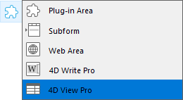

4D View Pro es un [componente 4D](Concepts/components.md) que incluye un [área de formulario 4D](FormObjects/viewProArea_overview.md) y [comandos](commands.md) específicos. Le permite integrar las funcionalidades avanzadas de hoja de cálculo en sus proyectos.


Una hoja de cálculo es una aplicación que contiene una cuadrícula de celdas en las que se puede introducir información, ejecutar cálculos o mostrar imágenes. 4D View Pro es alimentado por la [solución de hoja de cálculo SpreadJS](https://developer.mescius.com/spreadjs) integrada en 4D.

La integración de áreas de 4D View Pro en sus formularios le permite importar y exportar documentos de hojas de cálculo utilizando los comandos 4D View Pro.

## Instalación y activación

Las funcionalidades de 4D View Pro se incluyen directamente en 4D, lo que facilita su despliegue y gestión. No se requiere ninguna instalación adicional.

Sin embargo, 4D View Pro requiere una licencia. Es necesario activar esta licencia en su aplicación para poder utilizar sus funcionalidades. Cuando se utiliza este componente sin licencia, el contenido de un objeto que requiere una función de 4D View Pro no se muestra en tiempo de ejecución, sino que se muestra un mensaje de error:


## Inserción de un área 4D View Pro

Los documentos de 4D View Pro se muestran y editan manualmente en un [objeto de formulario 4D](FormObjects/viewProArea_overview.md) llamado 4D View Pro. Para seleccionar este objeto, haga clic en la última herramienta de la barra de objetos:



También puede seleccionar un área 4D View Pro preconfigurada en la [librería de objetos](FormEditor/objectLibrary.md).

> Las áreas 4D View Pro también pueden ser [creadas y utilizadas fuera de la pantalla](commands/vp-run-offscreen-area.md).

Puede [configurar el área](configuring.md) utilizando los comandos de la Lista de Propiedades y 4D View Pro.

## Fundamentos de la selección, la entrada y de la navegación

Las hojas de cálculo se componen de líneas y columnas. A cada línea se le asocia un número. A cada columna se le asocia una letra (o grupo de letras una vez que el número de columnas supera el número de letras del alfabeto). La intersección de una línea y de una columna constituye una celda. Las celdas pueden ser seleccionadas y sus contenidos editados.

### Selección de celdas, columnas y líneas

- Para seleccionar una celda, basta con hacer clic en ella o utilizar las flechas de dirección del teclado. Su contenido (o fórmula) se muestra dentro de la celda.

- Para seleccionar varias celdas continuas, arrastre el ratón de un extremo a otro de la selección. También puede hacer clic en los dos extremos de la selección mientras mantiene presionada la tecla Mayús.

- Para seleccionar todas las celdas de la hoja de cálculo, haga clic en la celda situada en la parte superior izquierda del área:
  

- Para seleccionar una columna, haga clic en la letra (o conjunto de letras) correspondiente.

- Para seleccionar una línea, haga clic en el número correspondiente.

- Para seleccionar un grupo de celdas que no sean continuas, mantenga presionada la tecla **Ctrl** (Windows) o la tecla **Comando** (Mac) y haga clic en cada celda que desee seleccionar.

- Para deseleccionar las celdas, basta con hacer clic en cualquier lugar de la hoja de cálculo.

### Entrada de datos

Hacer doble clic en una celda permite pasar al modo de entrada en la celda correspondiente. Si la celda no está vacía, el cursor de inserción se coloca después del contenido de la celda.


Los datos pueden introducirse directamente una vez seleccionada una celda, incluso si el cursor de inserción no está visible. La entrada entonces reemplaza el contenido de la celda.

La tecla **Tab** valida la entrada de la celda y selecciona la celda a su derecha. Combinando las teclas **Mayús + Tab** se valida la entrada de la celda y se selecciona la celda a su izquierda.

La tecla **Retorno de carro** valida la entrada de la celda y selecciona la celda de abajo. Combinando las teclas **Mayús + Retorno de carro** se valida la entrada de la celda y se selecciona la celda superior.

Las teclas de dirección (flechas) permiten mover una celda en la dirección indicada por la flecha.

### Utilización del menú contextual

Las áreas 4D View Pro se benefician de un menú contextual automático que ofrece funciones de edición estándar como copiar y pegar, pero también funciones básicas de hoja de cálculo:


> Las funciones Copiar/Cortar y Pegar del menú contextual sólo funcionan dentro del área de la hoja de cálculo, no tienen acceso al portapapeles del sistema. Sin embargo, los atajos del sistema como **Ctrl+c/Ctrl+v** funcionan y pueden utilizarse para intercambiar datos entre el área y otras aplicaciones.

Dependiendo del área seleccionada, también están disponibles las siguientes opciones:

- haga clic en el encabezado de una columna o línea: **Insertar**, **Borrar**, **Ocultar**, o **Mostrar** el contenido
- haga clic en una celda o en un rango de celdas:
  - **Filtrar**: permite ocultar la línea mediante filtros (ver "Filtrar las líneas" en la [documentación de SpreadJS](https://developer.mescius.com/spreadjs/docs/)).
  - **Ordenar**: ordena el contenido de la columna.
  - **Insertar comentario**: permite al usuario introducir un comentario para un área. Cuando se ha introducido un comentario para un área, la celda superior izquierda del área muestra un pequeño triángulo rojo:\
    

## Utilizando los comandos de 4D View Pro

Los comandos 4D View Pro se pueden utilizar en el editor de código 4D, al igual que los comandos de lenguaje 4D.

Como 4D View Pro es un componente 4D intregado, puede acceder a su lista de comandos desde el Explorador, en la sección **Métodos componentes**:


Para obtener una lista detallada, consulte [Comandos](commands.md).

### Abordando un área 4D View Pro

Un área 4D View Pro maneja varios objetos y elementos.


La mayoría de los comandos de 4D View Pro requieren un parámetro *vpAreaName*, que es el [**nombre del área de formulario 4D View Pro**](FormObjects/viewProArea_overview.md) (objeto de formulario 4D). Este nombre es la propiedad del [nombre del objeto](FormObjects/properties_Object.md#object-name).

Por ejemplo, si quiere definir el número total de columnas de un área llamada "myVpArea", escriba:

```4d
VP SET COLUMN COUNT("myVpArea";5)
```

> Cuando se carga un objeto 4D View Pro en un área de formulario, 4D genera el evento formulario [On VP Ready](../Events/onVpReady.md) una vez que se carga toda el área. Debe ejecutar todo código 4D View Pro que maneje el área en este evento, de lo contrario se devuelve un error.

### Utilización de objetos de rango

Algunos comandos 4D View Pro requieren un parámetro *rangeObj*. En 4D View Pro, un rango es un objeto que hace referencia a un área en una hoja de cálculo. Esta área puede estar compuesta de una o varias celdas. Utilizando los comandos 4D View Pro, puede crear rangos y pasarlos a otros comandos para leer o escribir en lugares específicos de su documento.

Por ejemplo, para crear un objeto rango para las siguientes celdas:


Puede utilizar el método [VP Cell](commands/vp-cells.md):

```4d
var $myRange : Object
$myRange:=VP Cells("ViewProArea";2;4;2;3) // C5 a D7
```

Luego, puede pasar `$myRange` a otro método 4D View Pro para modificar estas celdas (por ejemplo añadir un borde al conjunto de celdas con [VP SET BORDER](commands/vp-set-border.md)).

Los objetos rango 4D View Pro se componen de varias propiedades:

- area - El nombre del área 4D View Pro
- rangos - Una colección de objeto(s) rango. Las propiedades disponibles en cada objeto de rango dependen del tipo de objeto rango. Por ejemplo, un objeto rango de tipo columna sólo incluirá las propiedades *.column* y *.sheet*.

| Propiedad |                                                                                       | Tipo       | Descripción                                                                                                               | Disponible para                                                |
| --------- | ------------------------------------------------------------------------------------- | ---------- | ------------------------------------------------------------------------------------------------------------------------- | -------------------------------------------------------------- |
| area      |                                                                                       | text       | Nombre de objeto formulario área 4D View Pro                                                                              | siempre disponible                                             |
| ranges    |                                                                                       | collection | Colección de rangos                                                                                                       | siempre disponible                                             |
|           | \[ ].name        | text       | Nombre de rango                                                                                                           | name                                                           |
|           | \[ ].sheet       | number     | Índice de la hoja (por defecto, índice de la hoja actual) (el conteo comienza en 0) | celda, celdas, línea, líneas, columna, columnas, todos, nombre |
|           | \[ ].row         | number     | Índice de la línea (el conteo comienza en 0)                                                           | celda, celdas, línea, líneas                                   |
|           | \[ ].rowCount    | number     | Número de líneas                                                                                                          | celdas, líneas                                                 |
|           | \[ ].column      | number     | Índice de la columna (el conteo comienza en 0)                                                         | celda, celdas, columna, columnas                               |
|           | \[ ].columnCount | number     | Conteo de columnas                                                                                                        | celdas, columnas                                               |

## Importar y exportar documentos

4D View Pro soporta la importación y exportación de varios formatos de documentos:

- .4vp
- .xlsx
- .txt y .csv
- .sjs
- .pdf (sólo para exportación)

Para más detalles, consulte la descripción de [VP IMPORT DOCUMENT](commands/vp-import-document.md) y [VP EXPORT DOCUMENT](commands/vp-export-document.md).
