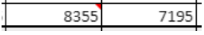

4D View Pro is a [4D component](Concepts/components.md) that includes a [4D form area](FormObjects/viewProArea_overview.md) and specific [methods](method-list.md). Le permite integrar las funcionalidades avanzadas de hoja de cálculo en sus proyectos.


Una hoja de cálculo es una aplicación que contiene una cuadrícula de celdas en las que se puede introducir información, ejecutar cálculos o mostrar imágenes. 4D View Pro is powered by the [SpreadJS spreadsheet solution](https://www.grapecity.com/spreadjs/docs/versions/v14/online/overview.html) integrated in 4D.

Embedding 4D View Pro areas in your forms allows you to import and export spreadsheets documents using the 4D View Pro commands.


## Instalación y activación

4D View Pro features are directly included in 4D, making it easy to deploy and manage. No se requiere ninguna instalación adicional.

Sin embargo, 4D View Pro requiere una licencia. You need to activate this license in your application in order to use its features. When using this component without a license, the contents of an object that requires a 4D View Pro feature are not displayed at runtime, an error message is displayed instead:


## Inserción de un área 4D View Pro

4D View Pro documents are displayed and edited manually in a [4D form object](FormObjects/viewProArea_overview.md) named 4D View Pro. Para seleccionar este objeto, haga clic en la última herramienta de la barra de objetos:


You can also select a preconfigured 4D View Pro area in the [Object library](FormEditor/objectLibrary.md).

> 4D View Pro areas can also be [created and used offscreen](method-list.md#vp-run-offscreen-area).

You can [configure the area](configuring.md) using the Property List and 4D View Pro methods.


## Fundamentos de la selección, la entrada y de la navegación

Las hojas de cálculo se componen de líneas y columnas. A cada línea se le asocia un número. A letter (or group of letters once the number of columns surpasses the number of letters in the alphabet) is associated with each column. La intersección de una línea y de una columna constituye una celda. Las celdas pueden ser seleccionadas y sus contenidos editados.

### Selección de celdas, columnas y líneas

*   To select a cell, simply click on it or use the direction arrows on the keyboard. Su contenido (o fórmula) se muestra dentro de la celda.

*   To select several continuous cells, drag the mouse from one end of the selection to the other. You can also click on the two ends of the selection while holding down the Shift key.

*   To select all cells in the spreadsheet, click on the cell at the top left of the area: 

*   To select a column, click on the corresponding letter (or set of letters).

*   Para seleccionar una línea, haga clic en el número correspondiente.

*   To select a group of cells that are not continuous, hold down the **Ctrl** key (Windows) or **Command** key (Mac) and click on each cell to be selected.

*   Para deseleccionar las celdas, basta con hacer clic en cualquier lugar de la hoja de cálculo.

### Entrada de datos

Double-clicking on a cell allows passing into input mode in the relevant cell. If the cell is not empty, the insertion cursor is placed after the content of the cell.


Data can be entered directly once a cell is already selected, even if the insertion cursor is not visible. The input then replaces the content of the cell.

The **Tab** key validates the cell input and selects the cell to its right. Combining the **Shift + Tab** keys validates the cell input and selects the cell to its left.


The **Carriage return** key validates the cell input and selects the cell below it. Combining the **Shift + Carriage return** keys validates the cell input and selects the cell above it.

The direction keys (arrows) allow you to move a cell in the direction indicated by the arrow.


### Utilización del menú contextual

4D View Pro areas benefit from an automatic context menu that offers standard editing features such as copy and paste, but also basic spreadsheet features:


> The Copy/Cut and Paste features of the context menu only work within the spreadsheet area, they do not have access to the system pasteboard. System shortcuts such as **Ctrl+c/Ctrl+v** works however and can be used to exchange data between the area and other applications.

 Depending on the clicked area, the following options are also available:

*   click on a column or row header: **Insert**, **Delete**, **Hide**, or **Unhide** the contents
*   haga clic en una celda o en un rango de celdas:
    *   **Filter**: allows hiding row through filters (see [Filtering rows](https://www.grapecity.com/spreadjs/docs/versions/v14/online/filter.html) in the SpreadJS documentation).
    *   **Ordenar**: ordena el contenido de la columna.
    *   **Insert Comment**: allows user to enter a comment for an area. When a comment has been entered for an area, the top left cell of the area displays a small red triangle:  
      


## Utilización de los métodos 4D View Pro

4D View Pro methods can be used in the 4D Code Editor, just like 4D language commands.

Since 4D View Pro is a built-in 4D component, you can access its list of methods from the Explorer, in the **Component Methods** section:


For a detailed list of component methods, see [Method list](method-list.md).

### Abordando un área 4D View Pro

Un área 4D View Pro maneja varios objetos y elementos.


Most of 4D View Pro methods require a *vpAreaName* parameter, which is the [**4D View Pro form area name**](FormObjects/viewProArea_overview.md) (4D form object). This name is the [object name](FormObjects/properties_Object.md#object-name) property.

For example, if you want to set the total number of columns of an area named "myVpArea", you write:

```4d
VP SET COLUMN COUNT("myVpArea";5)
```


> When loading a 4D View Pro object in a form area, 4D generates the [On VP Ready](../Events/onVpReady.md) form event once the whole area is loaded. You must execute any 4D View Pro code handling the area in this event, otherwise an error is returned.


### Utilización de objetos de rango

Some 4D View Pro methods require a *rangeObj* parameter. In 4D View Pro, a range is an object that references an area in a spreadsheet. Esta área puede estar compuesta de una o varias celdas. Using 4D View Pro methods, you can create ranges and pass them to other methods to read from or write to specific locations in your document.

Por ejemplo, para crear un objeto rango para las siguientes celdas:


Puede utilizar el método [VP Cells](method-list.md#vp-cells):

```4d 
var $myRange : Object
$myRange:=VP Cells("ViewProArea";2;4;2;3) // C5 a D7
```

You can then pass `$myRange` to another 4D View Pro method to modify these cells (for example add a border to the set of cells with [VP SET BORDER](method-list.md#vp-set-border)).

Los objetos rango 4D View Pro se componen de varias propiedades:

*   area - El nombre del área 4D View Pro
*   rangos - Una colección de objeto(s) rango. Available properties within each range object depend on the range object type. For example, a column range object will only include the *.column* and *.sheet* properties.

| Propiedad |                   | Type       | Descripción                                                                         | Disponible para                                                |
| --------- | ----------------- | ---------- | ----------------------------------------------------------------------------------- | -------------------------------------------------------------- |
| area      |                   | text       | Nombre de objeto formulario área 4D View Pro                                        | siempre disponible                                             |
| ranges    |                   | collection | Colección de rangos                                                                 | siempre disponible                                             |
|           | \[ ].name        | text       | Nombre de rango                                                                     | name                                                           |
|           | \[ ].sheet       | number     | Índice de la hoja (por defecto, índice de la hoja actual) (el conteo comienza en 0) | celda, celdas, línea, líneas, columna, columnas, todos, nombre |
|           | \[ ].row         | number     | Índice de la línea (el conteo comienza en 0)                                        | celda, celdas, línea, líneas                                   |
|           | \[ ].rowCount    | number     | Número de líneas                                                                    | celdas, líneas                                                 |
|           | \[ ].column      | number     | Índice de la columna (el conteo comienza en 0)                                      | celda, celdas, columna, columnas                               |
|           | \[ ].columnCount | number     | Conteo de columnas                                                                  | celdas, columnas                                               |


## Importar y exportar documentos

4D View Pro soporta la importación y exportación de varios formatos de documentos:

* .4vp
* .xlsx
* .txt y .csv
* .pdf (sólo para exportación)

Para más detalles, consulte la descripción de [VP IMPORT DOCUMENT](method-list.md#vp-import-document) y [VP EXPORT DOCUMENT](method-list.md#vp-export-document).
