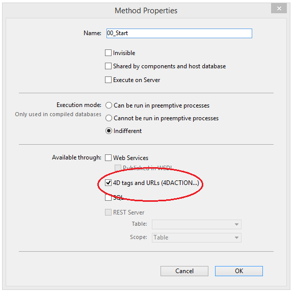

Las etiquetas 4D como `4DEVAL`, `4DTEXT`, `4DHTML`... así como la [`/4DACTION URL`](httpRequests.md#/4daction) permite desencadenar la ejecución de cualquier método proyecto 4D publicado en la Web. Por ejemplo, la petición _http://www.server.com/4DACTION/login_ provoca la ejecución del método proyecto _**login**_, si existe.

Por lo tanto, este mecanismo presenta un riesgo de seguridad para la aplicación, en particular si un usuario de Internet activa intencionalmente (o no) un método no previsto para su ejecución a través de la web. Puede evitar este riesgo de las siguientes maneras:

- Filtra los métodos llamados a través de las URLS utilizando el método base [`On Web Authentication`](authentication.md#on-web-authentication). Inconvenientes: si la base de datos incluye un gran número de métodos, este sistema puede ser difícil de gestionar.

- Utilice la opción **Disponible a través de etiquetas 4D y URLs (4DACTION...)** que se encuentra en la caja de diálogo de propiedades del método:

Esta opción se utiliza para designar individualmente cada método del proyecto que puede ser llamado utilizando la URL especial `4DACTION`, o las etiquetas `4DTEXT`, `4DHTML`, `4DEVAL`, `4DSCRIPT`, `4DIF`, `4DELSEIF` o `4DLOOP`. Cuando no está marcada, el método proyecto en cuestión no puede ser ejecutado directamente a través de una petición HTTP. Por el contrario, puede ejecutarse mediante otro tipo de llamadas (fórmulas, otros métodos, etc.).

Esta opción está deseleccionada por defecto. Los métodos que se pueden ejecutar a través de `4DACTION` o de etiquetas específicas deben indicarse específicamente.

En el Explorador, los métodos proyecto con esta propiedad reciben un icono específico:

