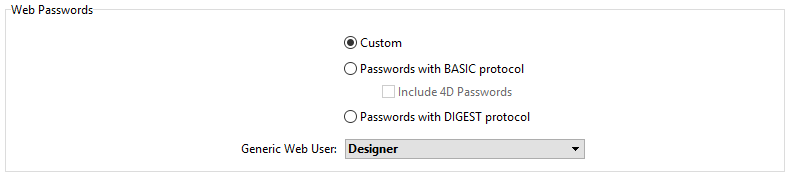

La autentificación de los usuarios es necesaria cuando se desea ofrecer derechos de acceso específicos a los usuarios Web. La autenticación designa el modo en que se recoge y procesa la información relativa a las credenciales del usuario (normalmente nombre y contraseña).

## Modos de autenticación

The 4D web server proposes three authentication modes, that you can select in the **Web**/**Options (I)** page of the Settings dialog box:



> Using a **custom** authentication is recommended.

### Generalidades

El funcionamiento del sistema de acceso del servidor web 4D se resume en el siguiente diagrama:


> Requests starting with `rest/` are directly handled by the [REST server](REST/configuration.md).

### Personalizado (por defecto)

Básicamente, en este modo, depende del desarrollador definir cómo autenticar a los usuarios. 4D only evaluates HTTP requests [that require an authentication](#method-calls).

Este modo de autenticación es el más flexible porque permite:

- o bien, delegar la autenticación del usuario a una aplicación de terceros (por ejemplo, una red social, SSO);
- or, provide an interface to the user (e.g. a web form) so that they can create their account in your customer database; then, you can authenticate users with any custom algorithm (see [this example](sessions.md#example) from the "User sessions" chapter). Lo importante es que nunca guarde la contraseña en claro, utilizando ese código:

```4d
//... creación de cuenta de usuario
ds.webUser.password:=Generate password hash($password)  
ds.webUser.save()
```

See also [this example](gettingStarted.md#authenticating-users) from the "Getting started" chapter.

If no custom authentication is provided, 4D calls the [`On Web Authentication`](#on-web-authentication) database method (if it exists). Además de $1 y $2, sólo se facilitan las direcciones IP del navegador y del servidor ($3 y $4), el nombre de usuario y la contraseña ($5 y $6) están vacíos. The method must return **True** in $0 if the user is successfully authenticated, then the resquested resource is served, or **False** in $0 if the authentication failed.

> **Warning:** If the `On Web Authentication` database method does not exist, connections are automatically accepted (test mode).

### Protocolo Basic

Cuando un usuario se conecta al servidor, aparece una caja de diálogo estándar en su navegador para que introduzca su nombre de usuario y contraseña.

> El nombre y la contraseña introducidos por el usuario se envían sin cifrar en el encabezado de la petición HTTP. Este modo suele requerir HTTPS para ofrecer confidencialidad.

A continuación, se evalúan los valores introducidos:

- If the **Include 4D passwords** option is checked, user credentials will be first evaluated against the [internal 4D users table](Users/overview.md).
  - Si el nombre de usuario enviado por el navegador existe en la tabla de usuarios 4D y la contraseña es correcta, se acepta la conexión. Si la contraseña es incorrecta, se rechaza la conexión.
  - If the user name does not exist in the table of 4D users, the [`On Web Authentication`](#on-web-authentication) database method is called. If the `On Web Authentication` database method does not exist, connections are rejected.
- If the **Include 4D passwords** option is not checked, user credentials are sent to the [`On Web Authentication`](#on-web-authentication) database method along with the other connection parameters (IP address and port, URL...) so that you can process them. If the `On Web Authentication` database method does not exist, connections are rejected.

> Con el servidor Web del cliente 4D, tenga en cuenta que todos los sitios publicados por las máquinas 4D Client compartirán la misma tabla de usuarios. La validación de los usuarios/contraseñas la realiza la aplicación 4D Server.

### Protocolo DIGEST

Este modo ofrece un mayor nivel de seguridad, ya que la información de autenticación se procesa mediante un proceso unidireccional llamado hashing que hace que su contenido sea imposible de descifrar.

Al igual que en el modo BASIC, los usuarios deben introducir su nombre y contraseña al conectarse. The [`On Web Authentication`](#on-web-authentication) database method is then called. Cuando se activa el modo DIGEST, el parámetro $6 (contraseña) se devuelve siempre vacío. De hecho, cuando se utiliza este modo, esta información no pasa por la red como texto claro (sin encriptar). It is therefore imperative in this case to evaluate connection requests using the `WEB Validate digest` command.

> Debe reiniciar el servidor web para que se tengan en cuenta los cambios realizados en estos parámetros.

## On Web Authentication

The `On Web Authentication` database method is in charge of managing web server engine access. Es llamado por 4D o 4D Server cuando se recibe una petición HTTP dinámica.

### Llamadas a métodos base

The `On Web Authentication` database method is automatically called when a request or processing requires the execution of some 4D code (except for REST calls). También se llama cuando el servidor web recibe una URL estática no válida (por ejemplo, si la página estática solicitada no existe).

The `On Web Authentication` database method is therefore called:

- cuando el servidor web recibe una URL que solicita un recurso que no existe
- when the web server receives a URL beginning with `4DACTION/`, `4DCGI/`...
- when the web server receives a root access URL and no home page has been set in the Settings or by means of the `WEB SET HOME PAGE` command
- when the web server processes a tag executing code (e.g `4DSCRIPT`) in a semi-dynamic page.

The `On Web Authentication` database method is NOT called:

- cuando el servidor web recibe una URL que solicita una página estática válida.
- when the web server reveives a URL beginning with `rest/` and the REST server is launched (in this case, the authentication is handled through the [`On REST Authentication` database method](REST/configuration.md#using-the-on-rest-authentication-database-method) or [Structure settings](REST/configuration.md#using-the-structure-settings)).

### Sintaxis

**On Web Authentication**( _$1_ : Text ; _$2_ : Text ; _$3_ : Text ; _$4_ : Text ; _$5_ : Text ; _$6_ : Text ) -> $0 : Boolean

| Parámetros | Tipo    |     | Descripción                                                                  |
| ---------- | ------- | :-: | ---------------------------------------------------------------------------- |
| $1         | Text    |  <- | URL                                                                          |
| $2         | Text    |  <- | Encabezados HTTP + cuerpo HTTP (hasta un límite de 32 kb) |
| $3         | Text    |  <- | Dirección IP del cliente web (navegador)                  |
| $4         | Text    |  <- | Dirección IP del servidor                                                    |
| $5         | Text    |  <- | Nombre de usuario                                                            |
| $6         | Text    |  <- | Contraseña                                                                   |
| $0         | Boolean |  -> | True = solicitud aceptada, False = solicitud rechazada                       |

Debe declarar estos parámetros de la siguiente manera:

```4d
//On Web Authentication database method
 
 C_TEXT($1;$2;$3;$4;$5;$6)
 C_BOOLEAN($0)
 
//Code for the method
```

Alternatively, you can use the [named parameters](Concepts/parameters.md#named-parameters) syntax:

```4d
// On Web Authentication database method
#DECLARE ($url : Text; $header : Text; \
  $BrowserIP : Text; $ServerIP : Text; \
  $user : Text; $password : Text) \
  -> $RequestAccepted : Boolean

```

> All the `On Web Authentication` database method's parameters are not necessarily filled in. The information received by the database method depends on the selected [authentication mode](#authentication-mode)).

#### $1 - URL

The first parameter (`$1`) is the URL received by the server, from which the host address has been removed.

Tomemos el ejemplo de una conexión a la Intranet. Supongamos que la dirección IP de su máquina 4D Web Server es 123.45.67.89. La siguiente tabla muestra los valores de $1 en función de la URL introducida en el navegador web:

| URL introducida en el navegador web                                                                                                               | Valor del parámetro $1                                                                |
| ------------------------------------------------------------------------------------------------------------------------------------------------- | ------------------------------------------------------------------------------------- |
| 123.45.67.89                                                                                      | /                                                                                     |
| http://123.45.67.89                                                               | /                                                                                     |
| 123.45.67.89/Customers                                                                            | /Customers                                                                            |
| http://123.45.67.89/Customers/Add                                                 | /Customers/Add                                                                        |
| 123.45.67.89/Do_This/If_OK/Do_That | /Do_This/If_OK/Do_That |

#### $2 - Encabezado y cuerpo de la petición HTTP

The second parameter (`$2`) is the header and the body of the HTTP request sent by the web browser. Note that this information is passed to your `On Web Authentication` database method as it is. Su contenido variará en función de la naturaleza del navegador web que intenta la conexión.

Si su aplicación utiliza esta información, deberá analizar el encabezado y el cuerpo. You can use the `WEB GET HTTP HEADER` and the `WEB GET HTTP BODY` commands.

> Por razones de rendimiento, el tamaño de los datos que pasan por el parámetro $2 no debe superar los 32 KB. Más allá de este tamaño, son truncados por el servidor HTTP de 4D.

#### $3 - Dirección IP del cliente web

The `$3` parameter receives the IP address of the browser’s machine. Esta información puede permitirle distinguir entre las conexiones a la intranet y a Internet.

> 4D devuelve las direcciones IPv4 en un formato híbrido IPv6/IPv4 escrito con un prefijo de 96 bits, por ejemplo ::ffff:192.168.2.34 para la dirección IPv4 192.168.2.34. For more information, refer to the [IPv6 Support](webServerConfig.md#about-ipv6-support) section.

#### $4 - Dirección IP del servidor

The `$4` parameter receives the IP address used to call the web server. 4D permite el multi-homing, que permite explotar máquinas con más de una dirección IP. For more information, please refer to the [Configuration page](webServerConfig.md#ip-address-to-listen).

#### $5 y $6 - Nombre de usuario y contraseña

The `$5` and `$6` parameters receive the user name and password entered by the user in the standard identification dialog box displayed by the browser. This dialog box appears for each connection, if [basic](#basic-protocol) or [digest](#digest-protocol) authentication is selected.

> Si el nombre de usuario enviado por el navegador existe en 4D, el parámetro $6 (la contraseña del usuario) no se devuelve por razones de seguridad.

#### Parámetro $0

The `On Web Authentication` database method returns a boolean in $0:

- Si $0 es True, la conexión es aceptada.

- Si $0 es False, la conexión es rechazada.

The `On Web Connection` database method is only executed if the connection has been accepted by `On Web Authentication`.

> **WARNING**<br/>If no value is set to $0 or if $0 is not defined in the `On Web Authentication` database method, the connection is considered as accepted and the `On Web Connection` database method is executed.

> - Do not call any interface elements in the `On Web Authentication` database method (`ALERT`, `DIALOG`, etc.) because otherwise its execution will be interrupted and the connection refused. Lo mismo ocurrirá si se produce un error durante su procesamiento.

### Ejemplo

Example of the `On Web Authentication` database method in [DIGEST mode](#digest-protocol):

```4d
 // On Web Authentication Database Method
 #DECLARE ($url : Text; $header : Text; $ipB : Text; $ipS : Text; \
 	$user : Text; $pw : Text) -> $valid : Boolean
  
 var $found : cs.WebUserSelection
 $valid:=False

 $found:=ds.WebUser.query("User === :1";$user)
 If($found.length=1) // User is found
 	$valid:=WEB Validate digest($user;[WebUser]password)
 Else
    $valid:=False // User does not exist
 End if
```
