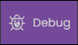
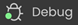
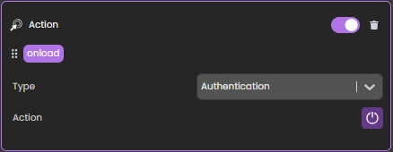

**Qodly Studio** es un creador de interfaces para aplicaciones web. Ofrece a los desarrolladores un editor gráfico de páginas para diseñar aplicaciones que se ejecutan en navegadores web o smartphones. Soporta de forma nativa los [objetos ORDA](../ORDA/overview.md).

Puede utilizar Qodly Studio directamente desde su **entorno 4D** para crear interfaces modernas y sofisticadas que puede integrar fácilmente a sus proyectos 4D existentes y desplegar **in situ**.

Qodly Studio también puede utilizarse en la [**plataforma Qodly Cloud**](https://qodly.com), dedicada al desarrollo de aplicaciones profesionales web.

Qodly Studio propone una interfaz web completa, que le permite:

- create Qodly pages by placing components on a canvas
- map components to Qodly Sources
- activar código 4D configurando eventos
- y mucho más.

## Configuración

### Requisitos

#### Navegador

Qodly Studio soporta los siguientes navegadores web:

- Chrome
- Edge
- FireFox

La resolución recomendada es 1920x1080.

#### Aplicación 4D

- Desarrollo: 4D v20 R2 o superior
- Despliegue: 4D Server v20 R2 o superior
- Qodly Studio solo funciona con proyectos 4D (no soporta bases de datos binarias).
- Las sesiones web (_igualmente llamadas sesiones escalables_) deben [estar activadas](sessions.md#enabling-web-sessions).
- El código 4D llamado por los formularios Qodly debe ser [hilo seguro](preemptiveWeb.md).

### Acceso a Qodly Studio

Por defecto, no se permite el acceso a Qodly Studio.

Qodly Studio es servido por el [servidor web WebAdmin](../Admin/webAdmin.md) y muestra datos de proyectos 4D manejados por el [servidor web 4D](webServer.md).

Para permitir el acceso a Qodly Studio, debe permitirlo explícitamente en dos niveles:

- a nivel de la aplicación 4D
- a nivel del proyecto

Si uno de los dos niveles (o ambos) no están habilitados, se niega el acceso a Qodly Studio (se devuelve una página 403).

#### En nivel 4D

Como primer nivel de seguridad, necesita [permitir el acceso a Qodly Studio en el servidor web WebAdmin](../Admin/webAdmin.md#enable-access-to-qodly-studio). Esta configuración se aplica a la aplicación 4D (4D o 4D Server) en la máquina local. Todos los proyectos abiertos con esa aplicación 4D tienen en cuenta esta configuración.

Mantenga esta opción desmarcada si desea asegurarse de que no se permite el acceso a Qodly Studio en la aplicación. Marque esta opción para poder acceder a Qodly Studio. Sin embargo, sigue siendo necesario activarla en cada nivel del proyecto.

Además, puede [configurar el puerto HTTP/HTTPS del servidor web WebAdmin utilizado](../Admin/webAdmin.md#accept-http-connections-on-localhost).

:::note

Después de cualquier cambio en esta configuración, debe [reiniciar el servidor web WebAdmin](../Admin/webAdmin.md#start-and-stop) para que la nueva configuración sea efectiva.

:::

#### A nivel del proyecto

Después de haber habilitado el acceso a Qodly Studio en el nivel 4D, es necesario designar explícitamente cada proyecto al que se puede acceder. La opción **Activar el acceso a Qodly Studio** debe estar habilitada en la [página de funcionalidades web de los parámetros de la aplicación 4D](../settings/web.md#enable-access-to-qodly-studio).

Tenga en cuenta que los [parámetros usuario](../settings/overview.md) pueden definirse en varios niveles, y que se aplican prioridades.

### Activando la autenticación

La autenticación en el servidor web WebAdmin se realiza utilizando una llave de acceso. Para más información, consulte [Llave de acceso](../Admin/webAdmin.md#access-key).

### Desarrollo y despliegue

De acuerdo con la gestión de proyectos 4D, sólo se admiten los siguientes usos:

- el desarrollo con Qodly Studio debe realizarse a través de **4D** (monousuario).
- deployment of 4D applications powered with Qodly pages must be done using **4D Server**.

:::warning

You can open Qodly Studio, [debug](#using-qodly-debugger-on-4d-server) and edit Qodly pages directly on a 4D Server machine when a project is running in interpreted mode. This feature is only provided for testing and debugging purposes, for example to evaluate the application flow with actual data, or in multi-user environment. It must NOT be considered as a regular way to develop applications since it does not provide any control over concurrent accesses.

:::

## Abrir Qodly Studio

La página Qodly Studio está disponible cuando el [servidor web WebAdmin está en ejecución](../Admin/webAdmin.md#start-and-stop) y la autenticación está activada (ver más arriba).

Hay dos formas de acceder a Qodly Studio:

- by selecting the **Qodly Studio...** menu command from the **Design** menu (4D single-user) or the **Window** menu (4D Server).
  Si el servidor web WebAdmin ya está en funcionamiento, dependiendo de su configuración, su navegador por defecto se abre en `IPaddress:HTTPPort/studio` o `IPaddress:HTTPSPort/studio`. De lo contrario, se le preguntará si desea iniciar primero el servidor web WebAdmin.

- on a browser, with the WebAdmin web server running (launched from 4D or 4D Server), enter the following address:<br/>
  `IPaddress:HTTPPort/studio`

  o:

  `IPaddress:HTTPSPort/studio`

  Por ejemplo, después de iniciar un servidor web local en el puerto 7080, escriba esta dirección en su navegador:

  `localhost:7080/studio`

  A continuación, se le pedirá que introduzca la [llave de acceso](../Admin/webAdmin.md#access-key) para acceder a Qodly Studio.

## Developing with Qodly Studio

### Documentation

The Qodly Studio documentation is available on the [Qodly documentation website](https://developer.qodly.com/docs/studio/overview).

You can rely on this documentation and its associated resources for developing web applications powered by Qodly pages. Sin embargo, dependiendo de la etapa de implementación, los desarrolladores 4D utilizarán Qodly Studio o 4D IDE (ver [Comparación de funcionalidades](#comparación-de-funcionalidades)).

Se ofrecen ejemplos de código en [QodlyScript](https://developer.qodly.com/docs/category/qodlyscript), pero como QodlyScript hereda del Lenguaje 4D, no se sentirá perdido. Se ofrecen ejemplos de código en [QodlyScript](https://developer.qodly.com/docs/category/qodlyscript), pero como QodlyScript hereda del Lenguaje 4D, no se sentirá perdido.

:::info

No existe compatibilidad directa entre las aplicaciones implementadas con 4D y las implementadas con Qodly.

:::

### Comparación de funcionalidades

|                                                                                  | Qodly Studio en 4D                                                                                                                                                                                           | Qodly Studio in Qodly Cloud platform                                          |
| -------------------------------------------------------------------------------- | ------------------------------------------------------------------------------------------------------------------------------------------------------------------------------------------------------------ | ----------------------------------------------------------------------------- |
| Ver y editar tablas (clases de datos), atributos y relaciones | Editor de estructura 4D(1)                                                                                                                                                                | Qodly Studio Model Editor                                                     |
| Páginas Qodly                                                                    | Editor de páginas Qodly Studio                                                                                                                                                                               | Editor de páginas Qodly Studio                                                |
| Formularios de escritorio                                                        | 4D IDE                                                                                                                                                                                                       | _not supported_                                                               |
| Lenguaje de programación                                                         | Lenguaje 4D con ORDA                                                                                                                                                                                         | [QodlyScript](https://developer.qodly.com/docs/category/qodlyscript) con ORDA |
| IDE de código                                                                    | 4D IDE code editor _or_ VS Code with [4D extension](https://github.com/4d/4D-Analyzer-VSCode)<br/>_4D Server only_: Qodly Studio code editor (see (2)) | Editor de código Qodly Studio                                                 |
| Debugger                                                                         | 4D IDE debugger<br/>_4D Server only_: Qodly Studio debugger (see [this paragraph](#using-qodly-debugger-on-4d-server))                                                    | Qodly Studio debugger                                                         |
| Roles y privilegios REST/Web                                                     | Edición directa de roles.json/Editor de roles y permisos Qodly Studio                                                                                                                        | Editor de roles y privilegios de Qodly Studio                                 |

Note that in 4D single-user, if you open some 4D code with the Qodly Studio code editor, syntax coloring is not available and a "Lsp not loaded" warning is displayed. (1) The **Model** item is disabled in Qodly Studio.<br/>
(2) In 4D Server, opening 4D code with the Qodly Studio code editor is supported **for testing and debugging purposes** (see [this paragraph](#development-and-deployment)).

### Lenguaje

Los siguientes comandos y clases están dedicados a la gestión del lado del servidor de las páginas Qodly:

- Comando [`Web Form`](../API/WebFormClass.md#web-form): devuelve la página Qodly como un objeto.
- Comando [`Web Event`](../API/WebFormClass.md#web-event): devuelve los eventos desencadenados dentro de los componentes de página ´gQodly.
- Clase [`WebForm`](../API/WebFormClass.md): funciones y propiedades para gestionar la página Qodly renderizada.
- clase [`WebFormItem`](../API/WebFormItemClass.md): funciones y propiedades para administrar componentes de página Qodly.

### Uso métodos proyecto

Recomendamos utilizar funciones clase en lugar de métodos proyecto. Sólo las funciones de clase pueden ser llamadas desde los componentes. Sin embargo, puede seguir utilizando sus métodos de proyecto en Qodly Studio de dos maneras:

- Puede llamar a sus métodos desde funciones clase.
- Puede [ejecutar sus métodos](https://developer.qodly.com/docs/studio/coding#methods-and-classes) directamente desde el Explorador Qodly.

### Uso sin conexión

Puede desarrollar con Qodly Studio mientras su ordenador no esté conectado a Internet. En este caso, sin embargo, las siguientes funciones no están disponibles:

- [Templates](https://developer.qodly.com/docs/studio/pageLoaders/templates): the Template library is empty
- Consejos de interfaz de usuario: no se muestran al hacer clic en los iconos .

## Despliegue

### Activación del renderizado

Qodly Studio encapsula las páginas Qodly, incluyendo el diseño, las conexiones de datos y la lógica basada en eventos, en un archivo JSON estructurado. Este archivo JSON es procesado sobre la marcha por el renderizador **Qodly** para servir una página web completamente funcional.

:::info

Mira [esta página](https://developer.qodly.com/docs/studio/rendering) para obtener información detallada sobre cómo renderizar págins Qodly en Qodly.

:::

Para habilitar el renderizado de las páginas Qodly, se deben configurar las siguientes opciones.

- La opción **Configuración** > **Web** > **Funcionalidades web** > [**Exponer como servidor REST**](../configuración/web.md#exposed-as-rest-server) del proyecto 4D debe estar activada.
- El [servidor web 4D](webServer.md) debe estar ejecutándose.

:::note

[Los botones de renderización](https://developer.qodly.com/docs/studio/rendering#how-to-render-a-webform) no están disponibles si las opciones de configuración no están activas.

:::

### Alcance de los formularios Qodly

Al renderizar formularios Qodly en el Qodly Studio, el renderizador se conectará al servidor web 4D a través de HTTP o HTTPS, dependiendo de la configuración, siguiendo el mismo patrón de conexión HTTP/HTTPS que para el [servidor web WebAdmin 4D] (../Admin/webAdmin.md#accept-http-connections-on-localhost). Ver también [este párrafo](#about-license_usage) sobre los esquemas de URL y el uso de licencias.

Tenga en cuenta que Qodly Studio se ejecuta a través del servidor web 4D WebAdmin. Cuando utiliza Qodly Studio como desarrollador, incluso cuando previsualiza una página Qodly en el estudio, está utilizando el servidor web 4D WebAdmin. Esto le permite ver, por ejemplo, clases de datos, funciones y atributos que no están expuestos como recursos REST (aparecen en gris).

Sin embargo, el renderizado de la página ocurre fuera de Qodly Studio, y es servido por el servidor web estándar de 4D. En esta situación, su aplicación web no puede acceder a activos que no estén expuestos como recursos REST. Ver [Funciones expuestas vs no expuestas](../ORDA/ordaClasses.md#exposed-vs-non-exposed-functions) y [Exponer tablas](../REST/configuration.md#exposing-tables) para más información sobre cómo exponer activos.

### Acceder a páginas Qodly

Para el despliegue, el servidor WebAdmin no es necesario. El acceso del usuario final a su aplicación web realizada con Qodly Studio se basa en el protocolo 4D REST, y como tal, funciona como a través de una aplicación remota 4D convencional.

Sus páginas Qodly están disponibles a través de la siguiente url:

```
IP:port/$lib/renderer/?w=QodlyPageName
```

...donde _IP:port_ representa la dirección del servidor web y _QodlyPageName_ es el nombre de la página Qodly.

Por ejemplo:

```
https://www.myWebSite.com/$lib/renderer/?w=welcome
```

### Vista previa de la aplicación Qodly

You can preview your Qodly application at any moment by selecting the **Preview Qodly Application...** command in the **Windows** menu (4D Server) or in the **Design** menu (4D single-user).

This command launches the Qodly renderer on a local address in your default browser and displays the **start page** [defined in the Application settings](https://developer.qodly.com/docs/studio/settings#start-page) of Qodly Studio.

### Using Qodly debugger on 4D Server

When using Qodly pages in a deployed 4D Server application (interpreted mode), you might encounter some cases where you need to debug your pages on the server, for example when a specific user configuration is required. In this case, you can attach the [Qodly Studio debugger](https://developer.qodly.com/docs/studio/debugging) to the 4D Server and then, benefit from its features when executing your Qodly pages.

Note that in this case, the Qodly Studio debugger will display all the code executed on the server, in accordance with the [attached debugger rule on 4D Server](../Debugging/debugging-remote.md#attached-debugger).

Para adjuntar el depurador Qodly Studio a su aplicación 4D Server en ejecución:

1. [Abrir Qodly Studio](#opening-qodly-studio) desde 4D Server.

:::note

El proyecto debe ejecutarse en modo interpretado para que el elemento de menú **Qodly Studio** esté disponible.

:::

2. In the Qodly Studio toolbar, click on the **Debug** button.<br/>
   

If the debug session starts successfully, a green bullet appears on the button label  and you can use the Qodly Studio debugger.

If the debugger is already attached to a another machine or another Qodly Studio page, an error is displayed. Hay que separarlo de antemano de la otra ubicación.

To detach the Qodly Studio debugger from your running 4D Server application:

1. Click the **Debug** button in the Qodly Studio toolbar while a debug session is active.
   Una caja de diálogo de advertencia le pedirá que confirme si desea desconectar el depurador.
2. Select **Keep in progress** to continue evaluating the code until the end of the current method or function before detaching the debugger, or **Stop** to detach the debugger immediately.

## Forzar inicio de sesión

Con Qodly Studio for 4D, el modo ["forzar login"](../REST/authUsers.md#force-login-mode) le permite controlar el número de sesiones web abiertas que requieren licencias 4D Client. También puede [cerrar la sesión](#logout) del usuario en cualquier momento para disminuir el número de licencias retenidas.

### Configuración

Asegúrese de que el [modo "force login"](../REST/authUsers.md#force-login-mode) esté habilitado para su aplicación 4D en la [página Roles y privilegios](https://developer.qodly.com/docs/studio/roles/rolesPrivilegesOverview), usando la opción **Force login**:


También puede definir esta opción directamente en el archivo [**roles.json**](../ORDA/privileges.md#rolesjson-file).

Entonces basta con implementar la función [`authentify()`](../REST/authUsers.md#function-authentify) en la clase datastore y llamarla desde la página Qodly. Una licencia se consumirá solo cuando el usuario esté realmente conectado.

:::note Compatibilidad

When the legacy login mode ([deprecated as of 4D 20 R6](https://blog.4d.com/force-login-becomes-default-for-all-rest-auth)) is enabled, any REST request, including the rendering of an authentication Qodly page, creates a web session on the server and gets a 4D Client license, whatever the actual result of the authentication. Para más información, consulte [esta entrada de blog](https://blog.4d.com/improved-4d-client-licenses-usage-with-qodly-studio-for-4d) que cuenta la historia completa.

:::

#### Ejemplo

En una página simple de Qodly con entradas para login/contraseña, un botón "Enviar" llama a la siguiente función `authentify()` que hemos implementado en la clase DataStore:

```4d

exposed Function authentify($credentials : Object) : Text

var $salesPersons : cs.SalesPersonsSelection
var $sp : cs.SalesPersonsEntity

$salesPersons:=ds.SalesPersons.query("identifier = :1"; $credentials.identifier)
$sp:=$salesPersons.first()

If ($sp#Null)
	If (Verify password hash($credentials.password; $sp.password))

		Session.clearPrivileges()
		Session.setPrivileges("") //sesión invitado

		return "Autenticación exitosa"
	Else
		return "Contraseña incorrecta"
	End if
Else
	return "Usuario incorrecto"
End if
```

Esta llamada es aceptada y mientras la autenticación no tenga éxito, `Session.setPrivileges()` no es llamada, por lo que no se consume ninguna licencia. Una vez que se llama a `Session.setPrivileges()`, se utiliza una licencia de cliente de 4D y luego se acepta cualquier solicitud REST.

### Cerrar sesión

Cuando el modo ["forzar inicio de sesión" está activado](#setting-the-force-login-mode), Qodly Studio for 4D le permite implementar una función de cierre de sesión en su aplicación.

Para cerrar la sesión del usuario, solo necesita ejecutar la acción estándar **Logout** desde la página Qodly. En Qodly Studio, puede asociar esta acción estándar a un botón por ejemplo:



Al desencadenar la acción de cierre de sesión de una sesión de usuario web, se producen los siguientes efectos:

- la sesión de usuario web actual pierde sus privilegios, sólo se permiten [peticiones REST descriptivas](../REST/authUsers.md#descriptive-rest-requests),
- se libera la licencia asociada de 4D,
- el tiempo de espera de 'Session.storage' se mantiene hasta que se alcanza el tiempo de inactividad de la sesión web (al menos una hora). Durante este periodo tras un cierre de sesión, si el usuario vuelve a iniciar sesión, se utiliza la misma sesión y el objeto compartido `Session.storage` está disponible con su contenido actual.

## Acerca del uso de licencias para renderización

En modo predeterminado, cuando se renderiza cualquier página, o en el modo "force login" cuando se renderiza una página que maneja datos o llama a una función, debe tener una licencia disponible, ya que la renderización de los formularios Qodly apunta al servidor web principal de la base de datos del proyecto.

### Esquemas URL

La configuración del esquema URL de Qodly Studio (HTTP y HTTPS) determina cuántas licencias se retienen al renderizar los formularios Qodly. Con la configuración adecuada, puede evitar retener licencias innecesarias.

Como se explica en la sección [configuración](#configuration), el servidor web WebAdmin ofrece un acceso web seguro a Qodly Studio. Por otro lado, el [renderizador](#rendering-webforms) se comunica con el servidor web 4D de la base de datos mediante peticiones REST. Como tal, se comporta como un Cliente 4D convencional.

Si ejecuta el renderizador desde Qodly Studio y no se accede a estos dos servidores web a través del mismo esquema de URL (HTTP o HTTPS), es posible que el conteo de licencias sea incorrecto.

:::info

El uso de diferentes esquemas también puede llevar a problemas de [sesión](sessions.md), como perder [privilegios](../ORDA/privileges.md) después de actualizar la página.

:::

#### Ejemplo

1. Ejecuta Qodly Studio en un esquema URL HTTPS (por ejemplo, `https://127.0.0.1:7443/studio/`)

2. El servidor web de su base de datos se inicia sólo en un puerto HTTP.


3. In Qodly Studio, you click on the **Preview** icon. Se le advierte que los dos servidores web se están iniciando en esquemas diferentes, pero a pesar de esto, usted hace clic en el botón **Confirm**.


Como resultado, se conservan dos licencias.

:::note

Puede activar/desactivar la visualización de la ventana emergente del renderizador utilizando los parámetros de usuario de Qodly Studio.

:::

### Atributo SameSite

El comportamiento descrito anteriormente se debe a la cookie de sesión del servidor web 4D. Esta cookie de sesión tiene un atributo `SameSite` que determina si la cookie de sesión se envía al servidor web.

Si el valor del atributo `SameSite` es `Strict` (por defecto), la cookie de sesión no se envía al servidor web, por lo que se abre una nueva sesión cada vez que se renderiza o actualiza una página.

Para más información sobre el atributo `SameSite`, consulte [esta entrada de blog](https://blog.4d.com/get-ready-for-the-new-SameSite-and-secure-attributes-for-cookies/).

### Recomendaciones

Para evitar utilizar más licencias de las necesarias, recomendamos hacer una de las siguientes cosas:

- Ejecute el renderizador en otra pestaña del navegador (introduciendo la URL renderizada de su página Qodly: `IP:port/$lib/renderer/?w=QodlyPageName`).
- Asegúrese de que Qodly Studio y su base de datos se alcanzan en el mismo esquema URL.
- Utilice el valor `Lax` para la [cookie de sesión](webServerConfig.md#session-cookie-samesite) del servidor web de la base de datos de su proyecto.
