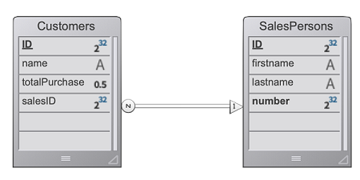

The 4D web server provides built-in features for managing **web sessions**. Creating and maintaining web sessions allows you to control and improve the user experience on your web application. When web sessions are enabled, web clients can reuse the same server context from one request to another.

Las sesiones web permiten:

- handle multiple requests simultaneously from the same web client through an unlimited number of preemptive processes (web sessions are **scalable**),
- manage session through a `Session` object and the [Session API](API/SessionClass.md),
- store and share data between processes of a web client using the [.storage](../API/SessionClass.md#storage) of the session,
- asociar privilegios al usuario que ejecuta la sesión.

## Usos

Las sesiones web se utilizan para:

- [Aplicaciones web](gettingStarted.md) que envían peticiones http,
- calls to the [REST API](../REST/authUsers.md), which are used by [remote datastores](../ORDA/remoteDatastores.md) and [Qodly forms](qodly-studio.md).

## Habilitando sesiones web

La funcionalidad de gestión de sesiones puede ser activada y desactivada en su servidor web 4D. Hay diferentes maneras de habilitar la gestión de la sesión:

- Using the **Scalable sessions** option on the "Web/Options (I)" page of the Settings (permanent setting):
  

Esta opción está seleccionada por defecto en los nuevos proyectos. Sin embargo, se puede desactivar seleccionando la opción **Sin sesiones**, en cuyo caso las funcionalidades de la sesión web se desactivan (no hay ningún objeto `Session` disponible).

- Using the [`.scalableSession`](API/WebServerClass.md#scalablesession) property of the Web Server object (to pass in the _settings_ parameter of the [`.start()`](API/WebServerClass.md#start) function). En este caso, esta configuración anula la opción definida en la caja de diálogo Configuración del objeto Servidor Web (no se almacena en el disco).

> El comando `WEB SET OPTION` también puede establecer el modo de sesión para el servidor web principal.

En cualquier caso, la configuración es local para la máquina; por lo que puede ser diferente en el servidor web de 4D Server y en los servidores web de las máquinas 4D remotas.

> **Compatibilidad**: una opción **Sesiones legacy** está disponible en proyectos creados con una versión de 4D anterior a 4D v18 R6 (para más información, consulte el sitio web [doc.4d.com](https://doc.4d.com)).

## Implementación de la sesión

Cuando [se habilitan las sesiones](#enabling-sessions), se implementan mecanismos automáticos, basados en una cookie privada establecida por el propio 4D: "4DSID__AppName_", donde _AppName_ es el nombre del proyecto de la aplicación. Esta cookie hace referencia a la sesión web actual de la aplicación.

:::info

The cookie name can be get using the [`.sessionCookieName`](API/WebServerClass.md#sessioncookiename) property.

:::

1. En cada petición del cliente web, el servidor web comprueba la presencia y el valor de la cookie privada "4DSID__AppName_".

2. Si la cookie tiene un valor, 4D busca la sesión que creó esta cookie entre las sesiones existentes; si se encuentra esta sesión, se reutiliza para la llamada.

3. Si la solicitud del cliente no corresponde a una sesión ya abierta:

- se crea una nueva sesión con una cookie privada "4DSID__AppName_" en el servidor web
- se crea un nuevo objeto Guest `Session` dedicado a la sesión web escalable.

:::note

La creación de una sesión web para una petición REST puede requerir que una licencia esté disponible, consulte [esta página](../REST/authUsers.md).

:::

The `Session` object of the current session can then be accessed through the [`Session`](API/SessionClass.md#session) command in the code of any web processes.


:::info

Los procesos web no suelen terminar, sino que se reciclan en un fondo común para ser más eficientes. Cuando un proceso termina de ejecutar una petición, se devuelve al pool y queda disponible para la siguiente petición. Since a web process can be reused by any session, [process variables](Concepts/variables.md#process-variables) must be cleared by your code at the end of its execution (using [`CLEAR VARIABLE`](https://doc.4d.com/4dv20/help/command/en/page89.html) for example). Esta limpieza es necesaria para cualquier información relacionada con el proceso, como una referencia a un archivo abierto. Esta es la razón por la que **se recomienda** utilizar el objeto [Sesión](API/SessionClass.md) cuando se quiera guardar información relacionada con la sesión.

:::

## Almacenar y compartir información de sesión

Each `Session` object provides a [`.storage`](API/SessionClass.md#storage) property which is a [shared object](Concepts/shared.md). Esta propiedad permite compartir información entre todos los procesos manejados por la sesión.

## Fecha de caducidad de la sesión

Una sesión web escalable se cierra cuando:

- el servidor web está detenido,
- se ha alcanzado el tiempo de espera de la cookie de sesión.

La vida útil de una cookie inactiva es de 60 minutos por defecto, lo que significa que el servidor web cerrará automáticamente las sesiones inactivas después de 60 minutos.

This timeout can be set using the [`.idleTimeout`](API/SessionClass.md#idletimeout) property of the `Session` object (the timeout cannot be less than 60 minutes) or the _connectionInfo_ parameter of the [`Open datastore`](../API/DataStoreClass.md#open-datastore) command.

When a web session is closed, if the [`Session`](API/SessionClass.md#session) command is called afterwards:

- el objeto `Session` no contiene privilegios (es una sesión de invitado)
- la propiedad [`.storage`](API/SessionClass.md#storage) está vacía
- se asocia una nueva cookie de sesión a la sesión

:::info

You can close a session from a Qodly form using the [**logout**](qodly-studio.md#logout) feature.

:::

## Privilegios

Los privilegios pueden asociarse a sesiones de usuario web. En el servidor web, puede proporcionar un acceso o unas funcionalidades específicas en función de los privilegios de la sesión.

You assign privileges using the [`.setPrivileges()`](API/SessionClass.md#setprivileges) function. In your code, you can check the session's privileges to allow or deny access using the [`.hasPrivilege()`](API/SessionClass.md#hasprivilege) function. By default, new sessions do not have any privilege: they are **Guest** sessions ([`.isGuest()`](API/SessionClass.md#isguest) function returns true).

Ejemplo:

```4d
If (Session.hasPrivilege("WebAdmin"))
	//Access is granted, do nothing
Else
	//Display an authentication page
End if
```

:::info

Privileges are implemented at the heart of the ORDA architecture to provide developers with a powerful technology for controlling access to the datastore and dataclas functions. For more information, please refer to the [**Privileges**](../ORDA/privileges.md) page of the ORDA chapter.

:::

## Ejemplo

En una aplicación CRM, cada vendedor gestiona su propia cartera de clientes. El almacén de datos contiene al menos dos clases de datos vinculadas: Customers y SalesPersons (un vendedor tiene varios clientes).



Queremos que un vendedor se autentique, abra una sesión en el servidor web y que se carguen los 3 primeros clientes en la sesión.

1. Ejecutamos esta URL para abrir una sesión:

```
http://localhost:8044/authenticate.shtml
```

> En un entorno de producción, es necesario utilizar una conexión [HTTPS](API/WebServerClass.md#httpsenabled) para evitar que cualquier información no cifrada circule por la red.

2. La página `authenticate.shtml` es un formulario que contiene los campos de entrada _userId_ y _password_ y envía una acción 4DACTION POST:

```html
<!DOCTYPE html>
<html>
<body bgcolor="#ffffff">
<FORM ACTION="/4DACTION/authenticate" METHOD=POST>
	UserId: <INPUT TYPE=TEXT NAME=userId VALUE=""><br/>
	Password: <INPUT TYPE=TEXT NAME=password VALUE=""><br/>
<INPUT TYPE=SUBMIT NAME=OK VALUE="Log In">
</FORM>
</body>
</html>
```


3. El método authenticate project busca la persona _userID_ y valida la contraseña contra el valor hash ya almacenado en la tabla _SalesPersons_:

```4d
var $indexUserId; $indexPassword; $userId : Integer
var $password : Text
var $userTop3; $sales; $info : Object


ARRAY TEXT($anames; 0)
ARRAY TEXT($avalues; 0)

WEB GET VARIABLES($anames; $avalues)

$indexUserId:=Find in array($anames; "userId")
$userId:=Num($avalues{$indexUserId})

$indexPassword:=Find in array($anames; "password")
$password:=$avalues{$indexPassword}

$sales:=ds.SalesPersons.query("userId = :1"; $userId).first()

If ($sales#Null)
    If (Verify password hash($password; $sales.password))
        $info:=New object()
        $info.userName:=$sales.firstname+" "+$sales.lastname
        Session.setPrivileges($info)
        Use (Session.storage)
            If (Session.storage.myTop3=Null)
                $userTop3:=$sales.customers.orderBy("totalPurchase desc").slice(0; 3)

                Session.storage.myTop3:=$userTop3
            End if
        End use
        WEB SEND HTTP REDIRECT("/authenticationOK.shtml")
    Else
        WEB SEND TEXT("This password is wrong")
    End if
Else
    WEB SEND TEXT("This userId is unknown")
End if
```

## Ver también (entrada de blog)

[Scalable sessions for advanced web applications](https://blog.4d.com/scalable-sessions-for-advanced-web-applications/)
