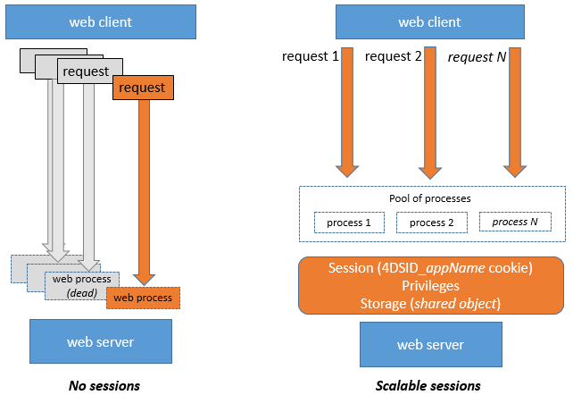

El servidor web de 4D ofrece funciones integradas para la gestión de **sesiones web**. La creación y el mantenimiento de sesiones web le permiten controlar y mejorar la experiencia del usuario en su aplicación web. Cuando se activan las sesiones web, los clientes web pueden reutilizar el mismo contexto de servidor de una solicitud a otra.

Las sesiones web permiten:

- manejar múltiples peticiones simultáneamente desde el mismo cliente web a través de un número ilimitado de procesos apropiativos (las sesiones web son **escalables**),
- gestionar la sesión a través de un objeto `Session` y la [Session API](API/SessionClass.md),
- almacenar y compartir datos entre procesos de un cliente web utilizando el [.storage](../API/SessionClass.md#storage) de la sesión,
- asociar privilegios al usuario que ejecuta la sesión.

## Usos

Las sesiones web se utilizan para:

- [Aplicaciones web](gettingStarted.md) que envían peticiones http,
- llamadas a la [REST API](../REST/authUsers.md), que utilizan [datastores remotos](../ORDA/remoteDatastores.md) y [formularios Qodly](qodly-studio.md).

## Habilitando sesiones web

La funcionalidad de gestión de sesiones puede ser activada y desactivada en su servidor web 4D. Hay diferentes maneras de habilitar la gestión de la sesión:

- Using the **Scalable sessions** OTPion on the "Web/OTPions (I)" page of the Settings (permanent setting):
 

This OTPion is selected by default in new projects. It can however be disabled by selecting the **No sessions** OTPion, in which case the web session features are disabled (no `Session` object is available).

- Usando la propiedad [`.scalableSession`](API/WebServerClass.md#scalablesession) del objeto Servidor Web (para pasar el parámetro *settings* de la función [`.start()`](API/WebServerClass.md#start)). In this case, this setting overrides the OTPion defined in the Settings dialog box for the Web Server object (it is not stored on disk).

> The [`WEB SET OTPION`](../commands-legacy/web-set-option.md) command can also set the session mode for the main Web server.

En cualquier caso, la configuración es local para la máquina; por lo que puede ser diferente en el servidor web de 4D Server y en los servidores web de las máquinas 4D remotas.

> **Compatibility**: A **Legacy sessions** OTPion is available in projects created with a 4D version prior to 4D v18 R6 (for more information, please refer to the [doc.4d.com](https://doc.4d.com) web site).

## Implementación de la sesión

When [sessions are enabled](#enabling-web-sessions), automatic mechanisms are implemented, based upon a private cookie set by 4D itself: "4DSID__AppName_", where *AppName* is the name of the application project. Esta cookie hace referencia a la sesión web actual de la aplicación.

:::info

El nombre de la cookie se puede obtener utilizando la propiedad [`.sessionCookieName`](API/WebServerClass.md#sessioncookiename).

:::

1. En cada petición del cliente web, el servidor web comprueba la presencia y el valor de la cookie privada "4DSID__AppName_".

2. Si la cookie tiene un valor, 4D busca la sesión que creó esta cookie entre las sesiones existentes; si se encuentra esta sesión, se reutiliza para la llamada.

3. Si la solicitud del cliente no corresponde a una sesión ya abierta:

- se crea una nueva sesión con una cookie privada "4DSID__AppName_" en el servidor web
- se crea un nuevo objeto Guest `Session` dedicado a la sesión web escalable.

:::note

La creación de una sesión web para una petición REST puede requerir que una licencia esté disponible, consulte [esta página](../REST/authUsers.md).

:::

The `Session` object of the current session can then be accessed through the [`Session`](commands/session.md) command in the code of any web processes.



:::info

Los procesos web no suelen terminar, sino que se reciclan en un fondo común para ser más eficientes. Cuando un proceso termina de ejecutar una petición, se devuelve al pool y queda disponible para la siguiente petición. Dado que un proceso web puede ser reutilizado por cualquier sesión, las [variables proceso](Concepts/variables.md#process-variables) deben ser borradas por su código al final de su ejecución (utilizando [`CLEAR VARIABLE`](https://doc.4d.com/4dv20/help/command/en/page89.html) por ejemplo). Esta limpieza es necesaria para cualquier información relacionada con el proceso, como una referencia a un archivo abierto. Esta es la razón por la que **se recomienda** utilizar el objeto [Sesión](API/SessionClass.md) cuando se quiera guardar información relacionada con la sesión.

:::

## Almacenar y compartir información de sesión

Cada objeto `Session` proporciona una propiedad [`.storage`](API/SessionClass.md#storage) que es un [objeto compartido](Concepts/shared.md). Esta propiedad permite compartir información entre todos los procesos manejados por la sesión.

## Fecha de caducidad de la sesión

Una sesión web escalable se cierra cuando:

- el servidor web está detenido,
- se ha alcanzado el tiempo de espera de la cookie de sesión.

La vida útil de una cookie inactiva es de 60 minutos por defecto, lo que significa que el servidor web cerrará automáticamente las sesiones inactivas después de 60 minutos.

Este tiempo de espera puede establecerse utilizando la propiedad [`.idleTimeout`](API/SessionClass.md#idletimeout) del objeto `Session` (el tiempo de espera no puede ser inferior a 60 minutos) o el parámetro *connectionInfo* del comando [`Open datastore`](../commands/open-datastore.md).

When a web session is closed, if the [`Session`](commands/session.md) command is called afterwards:

- el objeto `Session` no contiene privilegios (es una sesión de invitado)
- la propiedad [`.storage`](API/SessionClass.md#storage) está vacía
- se asocia una nueva cookie de sesión a la sesión

:::info

Puede cerrar una sesión desde un formulario Qodly utilizando la función [**logout**](qodly-studio.md#logout).

:::

## Privilegios

Fecha de caducidad de la sesión En el servidor web, puede proporcionar un acceso o unas funcionalidades específicas en función de los privilegios de la sesión.

Puedes asignar privilegios utilizando la función [`.setPrivileges()`](API/SessionClass.md#setprivileges). En su código, puede comprobar los privilegios de la sesión para permitir o denegar el acceso utilizando la función [`.hasPrivilege()`](API/SessionClass.md#hasprivilege). Por defecto, las sesiones nuevas no tienen ningún privilegio: son sesiones **Invitadas** (la función [`.isGuest()`](API/SessionClass.md#isguest) devuelve true).

Ejemplo:

```4d
If (Session.hasPrivilege("WebAdmin"))
	//Acceso concedido, no hacer nada
Else
	//Mostrar una página de autenticación
End if
```

:::info

Los privilegios se implementan en el corazón de la arquitectura ORDA para proporcionar a los desarrolladores una tecnología poderosa para controlar el acceso al almacén de datos y a las funciones de la clase de datos. Para más información, consulte la página [**Privilegios**](../ORDA/privileges.md) del capítulo ORDA.

:::

## Ejemplo

En una aplicación CRM, cada vendedor gestiona su propia cartera de clientes. El almacén de datos contiene al menos dos clases de datos vinculadas: Customers y SalesPersons (un vendedor tiene varios clientes).


Queremos que un vendedor se autentique, abra una sesión en el servidor web y que se carguen los 3 primeros clientes en la sesión.

1. Ejecutamos esta URL para abrir una sesión:

```
http://localhost:8044/authenticate.shtml
```

> En un entorno de producción, es necesario utilizar una conexión [HTTPS](API/WebServerClass.md#httpsenabled) para evitar que cualquier información no cifrada circule por la red.

2. La página `authenticate.shtml` es un formulario que contiene los campos de entrada *userId* y *password* y envía una acción 4DACTION POST:

```html
<!DOCTYPE html>
<html>
<body bgcolor="#ffffff">
<FORM ACTION="/4DACTION/authenticate" METHOD=POST>
	UserId: <INPUT TYPE=TEXT NAME=userId VALUE=""><br/>
	Password: <INPUT TYPE=TEXT NAME=password VALUE=""><br/>
<INPUT TYPE=SUBMIT NAME=OK VALUE="Log In">
</FORM>
</body>
</html>
```


3. El método authenticate project busca la persona *userID* y valida la contraseña contra el valor hash ya almacenado en la tabla *SalesPersons*:

```4d
var $indexUserId; $indexPassword; $userId : Integer
var $password : Text
var $userTop3; $sales; $info : Object


ARRAY TEXT($anames; 0)
ARRAY TEXT($avalues; 0)

WEB GET VARIABLES($anames; $avalues)

$indexUserId:=Find in array($anames; "userId")
$userId:=Num($avalues{$indexUserId})

$indexPassword:=Find in array($anames; "password")
$password:=$avalues{$indexPassword}

$sales:=ds.SalesPersons.query("userId = :1"; $userId).first()

If ($sales#Null)
    If (Verify password hash($password; $sales.password))
        $info:=New object()
        $info.userName:=$sales.firstname+" "+$sales.lastname
        Session.setPrivileges($info)
        Use (Session.storage)
            If (Session.storage.myTop3=Null)
                $userTop3:=$sales.customers.orderBy("totalPurchase desc").slice(0; 3)

                Session.storage.myTop3:=$userTop3
            End if
        End use
        WEB SEND HTTP REDIRECT("/authenticationOK.shtml")
    Else
        WEB SEND TEXT("This password is wrong")
    End if
Else
    WEB SEND TEXT("This userId is unknown")
End if
```

:::note

For more examples, please refer to the [Scalable sessions for advanced web applications](https://blog.4d.com/scalable-sessions-for-advanced-web-applications/) bog post.

:::

## Session Token (OTP)

The 4D web server allows you to generate, share, and use OTP (One-Time Passcode) session tokens. OTP session tokens are used to secure communications with third-party applications or websites. For information on OTP, please refer to the [One-time password page](https://en.wikipedia.org/wiki/One-time_password) on Wikipedia.

In 4D, OTP session tokens are useful when calling external URLs and being called back in another browser or device (mobile/computer). Typically, a third-party application sends a confirmation email containing a callback link on which the user has to click. The callback link includes the OTP token, so that the session which triggered the callback is loaded along with its data and privileges. This principle allows you to share the same session on multiple devices. Thanks to this architecture, the [session cookie](#session-implementation) is not exposed on the network, which eliminates the risk of man-in-the-middle attack.

### Generalidades

The basic sequence of an OTP session token use in a 4D web application is the following:

1. The web user initiates an action that requires a secured third-party connection, for example a validation, from within a specific session.
2. In your 4D code, you create a new OTP for the session using the [`Session.createOTP()`](../API/SessionClass.md#createotp) function.
3. You send a request to the third-party application with the session token included in the callback Uri. Note that the way to provide the callback Uri to a third-party application depends on its API (see below).
4. The third-party application sends back a request to 4D with the pattern you provided in the callback Uri.
5. The request callback is processed in your application.

By definition, an OTP token can only be used once. In this scenario, if a web request is received with a session token as parameter that has already been used, the initial session is not restored.

### Processing the OTP in the callback

Callbacks from third-party applications that include the OTP token can be processed in different ways in your 4D application, depending on your development and the third-party API. Basically, you have two possibilities to handle the token: through the **`$4DSID`** parameter for an automatic processing, or through a custom parameter that you need to process.

#### Using `$4DSID` in the URL

Using the `$4DSID` parameter is the most simple way to process a callback from the third-party application:

- The OTP token is provided as a parameter directly in the callback url using the standard `?$4DSID=XXXX123` syntax.
- In 4D, you implement a dedicated [HTTP Request handler](http-request-handler.md) in your 4D application using [`IncomingMessage`](../API/IncomingMessageClass.md) and [`OutgoingMessage`](../API/OutgoingMessageClass.md) classes.
- If the `$4DSID` token is valid, the related web user session is **automatically restored** in any web process with its storage and privileges.

:::note

Una url [`4DACCIÓN`](./httpRequests.md#4daction) también puede ser usada en el lado 4D.

:::

#### Using a custom parameter

The OTP token can also be provided as a custom parameter that you need to process specifically to restore the session. You must use this solution if:

- the third-party application does not allow to insert parameters such as a `$4DSID` directly in the redirect Uri, and provides a dedicated API (the implementation depends on the third-party application),
- or, you want to call an ORDA function through REST to process the callback, in which case you need to pass the OTP with the [REST parameter syntax](../REST/ClassFunctions.md#parameters) (e.g. `?$params='["XXX123"]'`).

In both cases, you need to extract the token from the custom parameter and to call the [`Session.restore()`](../API/SessionClass.md#restore) function with the token as parameter.

#### Processing a invalid OTP

The OTP token is considered invalid if:

- the session token has already been used,
- the session token has expired,
- the session token does not exist,
- the original session itself has expired.

In this case, no web user session is restored and the current session (if any) is left unchanged. Usually, you can decide to display a login page or to open a guest session.

Verifying if the received OTP token is valid depends on how it was handled:

- If you used a `$4DSID`, you can store a custom status property in the [session storage](../API/SessionClass.md#storage) at the moment of the token creation, and check this status once the OTP token was received to see if it is the same value (see example).
- If you used the [`Session.restore()`](../API/SessionClass.md#restore) function, it returns true if the session correctly restored.

### Scenario with $4DSID

The scenario using the `$4DSID` key is illustrated in the following diagram:


The 4D HTTP request handler definition:

```json
[
  {
    "class": "OperationsHandler",
    "method": "handleOperation",
    "regexPattern": "/my4DApp/completeOperation",
    "verbs": "get"
  }
]
```

The singleton class:

```4d
//Class OperationsHandler
shared singleton Class constructor()
    function handleOperation($request : 4D.IncomingMessage) 
    $session:=Session
```

### Scenario with `restore` function

The scenario using a custom parameter is illustrated in the following diagram:


The 4D HTTP request handler definition:

```json
[
  {
    "class": "OperationsHandler",
    "method": "handleOperation",
    "regexPattern": "/my4DApp/completeOperation",
    "verbs": "get"
  }
]
```

The singleton class:

```4d
//Class OperationsHandler
shared singleton Class constructor()
    Function handleOperation($req : 4D.IncomingMessage) : 4D.OutgoingMessage
    Session.restore($req.urlQuery.state)
```

### Example of email validation with $4DSID

1. A user account is created in a *Users* dataclass. A *$info* object is received with the email and password. An OTP corresponding to the current session is generated. An URL is then returned with this OTP given in the $4DSID parameter.

```4d
//cs.Users class

Function create($info : Object) : Text
	
var $user : cs.UsersEntity
var $status : Object
var $token : Text
	
$user:=This.new() //create a new user
$user.fromObject($info)
$status:=$user.save()
	
//Store information in the session
//including user creation status
Use (Session.storage)
	Session.storage.status:=New shared object("step"; "Waiting for validation email"; /
    "email"; $user.email; "ID"; $user.ID)
End use 
	
//Generate an OTP corresponding to the session
$token:=Session.createOTP()

// Return an URL with a $4DSID parameter
return "https://my.server.com/tools/validateEmail?$4DSID="+$token`

```

2. The user is sent this URL as a link in an email. The URL prefix `/validateEmail` is handled by a [custom HTTP request handler](./http-request-handler.md):

```json
[
  {
    "class": "RequestHandler",
    "method": "validateEmail",
    "regexPattern": "/validateEmail",
    "verbs": "get"
  }
]
```

The *validateEmail()* function of the RequestHandler singleton:

```4d
//validateEmail class

shared singleton Class constructor()

Function validateEmail() : 4D.OutgoingMessage
	
 var $result:=4D.OutgoingMessage.new()
    //The session which generated the OTP is retrieved 
    //thanks to the $4DSID parameter given in the URL
 If (Session.storage.status.step="Waiting for validation email")
	
  $user:=ds.Users.get(Session.storage.status.ID)
  $user.emailValidated() //set to true
		
  $result.setBody("Congratulations <br>"\
  +"Your email "+Session.storage.status.email+" has been validated")
		
  $result.setHeader("Content-Type"; "text/html"	
  Use (Session.storage.status)
	Session.storage.status.step:="Email validated"
  End use
 Else
  $result.setBody("Invalid token")

 End if 
	
 return $result

```

Since the `$4DSID` parameter contains a valid OTP corresponding to the original session, the `Session` object refers to the session that created the OTP.

A new user is created, and some information is stored in the session, especially the current step of the user account creation process (Waiting for validation email) and the user ID.

### Supported contexts

- Both HTTP and HTTPS schemas are supported.
- Sólo [sesiones escalables](#enabling-web-sessions) pueden ser reutilizados con tokens.
- Only sessions of the host database can be reused (sessions created in component web servers cannot be restored).
- Tokens are not supported with client/server sessions or single-user sessions.

### Lifespan

A session token has a lifespan, and the session itself has a lifespan. The session token lifespan can be set [at the token creation](../API/SessionClass.md#createotp). By default, the token lifespan is the same value as the [`.idleTimeout`](../API/SessionClass.md#idletimeout) value.

A session is only restored by a token if both the session token lifespan and the session lifespan have not expired. In other cases (the session token has expired and/or the session itself has expired), a guest session is created when a web request with a session token is received.

:::note

For more information, please refer to the [Connect Your Web Apps to Third-Party Systems](https://blog.4d.com/connect-your-web-apps-to-third-party-systems/) blog post.

:::