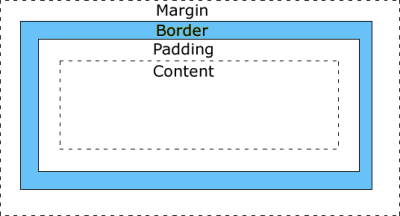

### 

Los atributos 4D Write Pro permiten controlar todos los aspectos gráficos de texto y las imágenes almacenadas en sus documentos. Estos atributos son manejados por los siguientes comandos:

* [WP SET ATTRIBUTES](../commands/wp-set-attributes.md)
* [WP GET ATTRIBUTES](../commands/wp-get-attributes.md)
* [WP RESET ATTRIBUTES](../commands/wp-reset-attributes.md)

:::note

también puede manejar los atributos de área 4D Write Pro a través de la notación de objetos o comandos genéricos 4D:

* notación de objeto: por ejemplo, las siguientes afirmaciones son similares:  
```4d  
 $bcol:=$range[wk background color]  
 $bcol:=$range.backgroundColor //mismos resultados  
```
* los comandos [OB SET](../../commands-legacy/ob-set.md) y [OB Get](../../commands-legacy/ob-get.md) por ejemplo:  
```4d  
 $bcol:=OB Get($range;wk background color)  
```  
:::

### Fondo 

Los atributos de fondo se utilizan para definir los efectos de fondo en sus documentos. Se pueden aplicar a los siguientes objetivos 4D Write Pro:

| Documentos | Secciones | Párrafos | Imágenes | Tablas | Líneas | Columnas/Celdas | Encabezados/Pies/Cuerpos | Cajas de texto |
| ---------- | --------- | -------- | -------- | ------ | ------ | --------------- | ------------------------ | -------------- |
| X          | X         | X        | X        | X      | X      | X               | X                        | X              |

| Constante                         | Comentario                                                                                                                                                                                                                                                                                                                                                                                                                                                                                                                                                                                                                                                                                                                                                                                                                                                                                                                                                                                                                                                                                                                                                                                                                                                                                                                                                                                                                                                                     |
| --------------------------------- | ------------------------------------------------------------------------------------------------------------------------------------------------------------------------------------------------------------------------------------------------------------------------------------------------------------------------------------------------------------------------------------------------------------------------------------------------------------------------------------------------------------------------------------------------------------------------------------------------------------------------------------------------------------------------------------------------------------------------------------------------------------------------------------------------------------------------------------------------------------------------------------------------------------------------------------------------------------------------------------------------------------------------------------------------------------------------------------------------------------------------------------------------------------------------------------------------------------------------------------------------------------------------------------------------------------------------------------------------------------------------------------------------------------------------------------------------------------------------------ |
| wk background clip                | Especifica el área de pintura de fondo. Valores posibles:<br/><ul><li>wk border box (por defecto): el fondo está pintado hacia la esquina exterior del borde</li><li>wk content box: el fondo está pintado dentro del cuadro de contenido</li><li>wk padding box: el fondo está pintado hacia el borde exterior del relleno (o hacia el borde interior del borde, si lo hay)</li><li>wk paper box: el fondo está pintado hacia el borde (documentos o secciones únicamente)</li></ul>                                                                                                                                                                                                                                                                                                                                                                                                                                                                                                                                                                                                                                                                                                                                                                                                                                                                                                                      |
| wk background color               | Especifica el color de fondo de un elemento. Valores posibles: <ul> <li>un color CSS ("#010101" o "#FFFFFF" o "rojo").</li> <li>un valor entero largo de color 4D (ver el comando [OBJECT SET RGB COLORS](../../commands-legacy/object-set-rgb-colors.md))</li> <li>un array entero largo que contiene un elemento para cada componente R, G, B (0-255)</li> </ul> Por defecto para los documentos es "#FFFFFF" y wk transparent, o "transparent" para los párrafos e imágenes.                                                                                                                                                                                                                                                                                                                                                                                                                                                                                                                                                                                                                                                                                                                                                                                                                                                                                                                                                             |
| wk background display mode        | Define el modo de visualización de las imágenes utilizadas como fondo, basándose en un preajuste de los siguientes valores de atributos "reales":wk background origin, wk background repeat, wk background position horizontal, wk background position vertical, wk background width, wk background height Valores posibles: <ul> <li>wk scaled to fit</li> <li>wk truncated</li> <li>wk truncated centered</li> <li>wk proportional</li> <li>wk proportional centered</li> <li>wk replicated (por defecto)</li> <li>wk replicated centered</li> </ul> **Nota**: el rectángulo de origen se fija en la caja de relleno (el rectángulo de la imagen incluyendo el área de relleno pero excluyendo el área del borde). Al obtener el valor de este atributo, el valor devuelto es: <ul> <li>uno de los posibles modos de visualización, por ejemplo wk replicated, si todos los atributos reales tienen los valores preestablecidos para este modo</li> <li>"personalizado" si el valor de al menos un atributo real difiere de los preestablecidos para cualquier modo. Por ejemplo, si el valor preestablecido de wk background width se cambia después de aplicar wk background display mode, [WP GET ATTRIBUTES](../commands/wp-get-attributes.md) devuelve "custom" al obtener el valor de wk background display mode.</li> </ul> |
| wk background height              | Especifica el tamaño vertical de la imagen de fondo. Valores posibles:<ul><li>wk auto (por defecto): la imagen de fondo contiene su altura</li><li>wk contain: escala la imagen a su mayo tamaño para que se ajuste en su totalidad al área de contenido, preservando al mismo tiempo su relación de aspecto. Esta opción también modifica el valor del otro atributo de tamaño. </li><li>wk cover: sescala la imagen de fondo para que sea tan grande como sea posible para que el área de fondo esté cubierta por completo por la imagen de fondo, preservando al mismo tiempo su relación de aspecto. Algunas partes de la imagen de fondo se pueden recortar. Esta opción también modifica el valor del otro atributo de tamaño.</li><li>Tamaño definido: el tamaño de la imagen vertical de fondo se expresa utilizando un valor real o cadena:<br/>Real: tamaño en wk layout unit.Cadena: cadena CSS con el valor y la unidad concatenados. Por ejemplo: 12pt por 12 puntos, o 1.5cm por 1.5 centímetros. Valor mínimo: 0pt, valor máximo: 10000pt. Se soporta un valor relativo (porcentaje%).</li></ul>                                                                                                                                                                                                                                                                                            |
| wk background image               | Especifica una referencia de imagen de fondo. Puede ser cualquier imagen válida, como una variable o expresión imagen 4D. <ul> <li>Valor devuelto ([WP GET ATTRIBUTES](../commands/wp-get-attributes.md)): si la imagen se definió a través de una URL de red, la imagen de destino se devuelve si ya estaba cargada, de lo contrario, se devuelve una imagen vacía.</li> </ul> Utilice wk background image url si desea manejar imágenes a través de URLs o URIs locales.                                                                                                                                                                                                                                                                                                                                                                                                                                                                                                                                                                                                                                                                                                                                                                                                                                                                                                                                                                       |
| wk background image url           | Imagen de fondo definida a través de una URL (cadena). Puede ser una URL de red o un URI de datos, absoluta o relativa al archivo de estructura. <ul> <li>Valor devuelto ([WP GET ATTRIBUTES](../commands/wp-get-attributes.md)): URL de red o URI de datos. Puede que no sea igual a la URL inicial de una imagen a la que no se hace referencia con la URL de red (solo se guardan las URL de red). Para las URL de archivos locales, la secuencia de imágenes en sí misma se guarda en el documento y por lo tanto, la URL devuelta es un URI de datos con la secuencia de imágenes codificada en base64.</li> </ul> Utilice wk background image si desea manejar imágenes de fondo como expresiones de imagen.                                                                                                                                                                                                                                                                                                                                                                                                                                                                                                                                                                                                                                                                                                                               |
| wk background origin              | Especifica donde se coloca la imagen de fondo. Valores posibles: <ul> <li>wk padding box (por defecto): la imagen de fondo se inicia en el rectángulo de relleno (o en la esquina interior del borde)</li> <li>wk border box: la imagen de fondo se inicia en el rectángulo del borde (esquina exterior)</li> <li>wk content box: la imagen de fondo comienza en rectángulo de contenido</li> </ul>                                                                                                                                                                                                                                                                                                                                                                                                                                                                                                                                                                                                                                                                                                                                                                                                                                                                                                                                                                                                                            |
| wk background position horizontal | Especifica la posición de inicio horizontal de una imagen de fondo. Valores posibles:<ul><li>wk left (por defecto): la imagen de fondo comienza en posición horizontal en el lado izquierdo del elemento</li><li>wk center: la imagen de fondo comienza horizontalmente en el centro del elemento</li><li>wk right: la imagen de fondo comienza en posición horizontal en el lado derecho del elemento</li></ul>                                                                                                                                                                                                                                                                                                                                                                                                                                                                                                                                                                                                                                                                                                                                                                                                                                                                                                                                                                                                               |
| wk background position vertical   | Especifica la posición de inicio vertical de una imagen de fondo. Valores posibles:<ul><li>wk top (por defecto): la imagen de fondo comienza verticalmente en la parte superior del elemento</li><li>wk middle: la imagen de fondo comienza verticalmente en la parte media del elemento</li><li>wk bottom: la imagen de fondo comienza verticalmente en la parte inferior del elemento</li></ul>                                                                                                                                                                                                                                                                                                                                                                                                                                                                                                                                                                                                                                                                                                                                                                                                                                                                                                                                                                                                                              |
| wk background repeat              | Especifica si y cómo una imagen de fondo se repite. Valores posibles:<ul><li>wk repeat (por defecto): la imagen de fondo se repite tanto vertical como horizontalmente</li><li>wk no repeat: la imagen de fondo no se repite</li><li>wk repeat x: la imagen de fondo se repite sólo horizontalmente</li><li>wk repeat y: la imagen de fondo sólo se repite verticalmente</li></ul>                                                                                                                                                                                                                                                                                                                                                                                                                                                                                                                                                                                                                                                                                                                                                                                                                                                                                                                                                                                                                                 |
| wk background width               | Especifica el tamaño horizontal de la imagen de fondo. Valores posibles:<ul><li>wk auto (por defecto): la imagen de fondo contiene su ancho</li><li>wk contain: escala la imagen a su mayor tamaño para que se ajuste en su totalidad en el área de contenido, preservando su relación de aspecto. Esta opción también modifica el valor del otro atributo de tamaño.</li><li>wk cover: escala la imagen de fondo para ser tan grande como sea posible para que el área de fondo esté cubierta por completo por la imagen de fondo, preservando al mismo tiempo su relación de aspecto. Algunas partes de la imagen de fondo se pueden recortar. Esta opción también modifica el valor del otro atributo de tamaño.</li><li>Tamaño definido: tamaño de la imagen de fondo horizontal expresado utilizando un valor real o cadena:Real: tamaño en wk layout unit.Cadena: cadena CSS con el valor y la unidad concatenados. Por ejemplo: 12pt por 12 puntos, o 1.5cm por 1.5 centímetros. Valor mínimo: 0pt, valor máximo: 10000pt. Se soporta un valor relativo (porcentaje%).</li></ul>                                                                                                                                                                                                                                                                                                                            |

### Bordes 

Los atributos borde se utilizan para especificar el estilo, ancho y color de un borde de elemento. Se pueden aplicar a:

| Documentos | Secciones | Párrafos | Imágenes | Tablas | Filas | Columnas/Celdas | Encabezados/Pies/Cuerpos | Cajas de texto |
| ---------- | --------- | -------- | -------- | ------ | ----- | --------------- | ------------------------ | -------------- |
| X          | X         | X        | X        | X      | X     | X               | X                        | X              |

| Constante              | Comentario                                                                                                                                                                                                                                                                                                                                                                                                                                                                                                                                                                                                                                                                                                                                                                                                        |
| ---------------------- | ----------------------------------------------------------------------------------------------------------------------------------------------------------------------------------------------------------------------------------------------------------------------------------------------------------------------------------------------------------------------------------------------------------------------------------------------------------------------------------------------------------------------------------------------------------------------------------------------------------------------------------------------------------------------------------------------------------------------------------------------------------------------------------------------------------------- |
| wk border color        | Define el color de los cuatro bordes. Valores posibles: <ul> <li>un color CSS ("#010101" o "#FFFFFF" o "red").</li> <li>un valor entero largo de color 4D (ver el comando [`OBJECT SET RGB COLOR`](../../commands-legacy/object-set-rgb-colors.md)</li> <li>un array entero largo que contiene un elemento para cada componente R, G, B (0-255)</li> </ul> El valor por defecto es "#000000" (si el valor es cadena). Si hay varios colores, [WP GET ATTRIBUTES](../commands/wp-get-attributes.md) devuelve una cadena vacía.                                                                                                                                                                                                                                                                               |
| wk border color bottom | Define el color del borde inferior. Valores posibles: <ul> <li>un color CSS ("#010101" o "#FFFFFF" o "red"). El valor predeterminado es "#000000"</li> <li>un valor entero largo de color 4D (ver el comando [`OBJECT SET RGB COLOR`](../../commands-legacy/object-set-rgb-colors.md)</li> <li>un array entero largo que contiene un elemento para cada componente R, G, B (0-255)</li> </ul>                                                                                                                                                                                                                                                                                                                                                                                                                     |
| wk border color left   | Define el color del borde izquierdo. Valores posibles: <ul> <li>un color CSS ("#010101" o "#FFFFFF" o "red"). El valor predeterminado es "#000000"</li> <li>un valor entero largo de color 4D (ver el comando [`OBJECT SET RGB COLOR`](../../commands-legacy/object-set-rgb-colors.md)</li> <li>un array entero largo que contiene un elemento para cada componente R, G, B (0-255)</li> </ul>                                                                                                                                                                                                                                                                                                                                                                                                                    |
| wk border color right  | Define el color del borde derecho. Valores posibles: <ul> <li>un color CSS ("#010101" o "#FFFFFF" o "red"). El valor predeterminado es "#000000"</li> <li>un valor entero largo de color 4D (ver el comando [`OBJECT SET RGB COLOR`](../../commands-legacy/object-set-rgb-colors.md)</li> <li>un array entero largo que contiene un elemento para cada componente R, G, B (0-255)</li> </ul>                                                                                                                                                                                                                                                                                                                                                                                                                      |
| wk border color top    | Define el color del borde superior. Valores posibles: <ul> <li>un color CSS ("#010101" o "#FFFFFF" o "rojo"). El valor predeterminado es "#000000"</li> <li>un valor entero largo de color 4D (ver el comando [`OBJECT SET RGB COLOR`](../../commands-legacy/object-set-rgb-colors.md)</li> <li>un array entero largo que contiene un elemento para cada componente R, G, B (0-255)</li> </ul>                                                                                                                                                                                                                                                                                                                                                                                                                    |
| wk border radius       | Especifica un borde redondeado. Valores posibles:<br/><ul><li>wk none (predeterminado): el borde no tiene ángulos redondeados</li><li> Valor de radio expresado utilizando un entero o un valor de cadena:Número: radio en wk layout unit.Cadena: cadena CSS con el valor y la unidad concatenados. Por ejemplo: 12pt por 12 puntos, o 1.5cm por 1.5 centímetros.</li></ul>                                                                                                                                                                                                                                                                                                                                                                                           |
| wk border style        | Especifica el estilo de los cuatro bordes. Valores posibles:<ul><li>wk none (por defecto): sin borde</li><li>wk hidden: lo mismo que wk none, excepto en la resolución de conflictos de borde</li><li>wk solid: borde sólido</li><li>wk dotted: borde punteado</li><li>wk dashed: borde de rayas</li><li>wk double: doble borde</li><li>wk groove: borde 3D groove (el efecto real depende del color del borde)</li><li>wk ridge: borde 3D ridged (el efecto real depende del color del borde)</li><li>wk inset: borde 3D inset (el efecto real depende del color del borde)</li></ul>                                                                                                    |
| wk border style bottom | Especifica el estilo de los cuatro bordes. Valores posibles:<ul><li>wk none (por defecto): sin borde</li><li>wk hidden: lo mismo que wk none, excepto en la resolución de conflictos de borde</li><li>wk solid: borde sólido</li><li>wk dotted: borde punteado</li><li>wk dashed: borde de rayas</li><li>wk double: doble borde</li><li>wk groove: borde 3D groove (el efecto real depende del color del borde)</li><li>wk ridge: borde 3D ridged (el efecto real depende del color del borde)</li><li>wk inset: borde 3D inset (el efecto real depende del color del borde)</li></ul>                                                                                                    |
| wk border style left   | Especifica el estilo del borde izquierdo. Valores posibles:<br/><ul><li>wk none (predeterminado): sin borde izquierdo</li><li>wk hidden: lo mismo que wk none, excepto en la resolución de conflictos de borde</li><li>wk solid: borde izquierdo sólido</li><li>wk dotted: borde izquierdo de puntos</li><li>wk dashed: borde izquierdo discontinuo</li><li>wk double: borde izquierdo doble</li><li>wk groove: borde izquierdo 3D groove (el efecto real depende del color del borde)</li><li>wk ridge: borde izquierdo 3D ridged (el efecto real depende del color del borde)</li><li>wk inset: borde izquierdo 3D inset (el efecto real depende del color del borde)</li></ul> |
| wk border style right  | Especifica el estilo del borde derecho. Valores posibles:<ul><li>wk none predeterminado): sin borde derecho</li><li>wk hidden: igual que wk none, excepto en la resolución de conflictos de borde</li><li>wk solid: borde derecho sólido</li><li>wk dotted: borde derecho de puntos</li><li>wk dashed: borde derecho discontinuo</li><li>wk double: borde derecho doble</li><li>wk groove: borde derecho 3D groove (el efecto real depende del color del borde)</li><li>wk ridge: borde derecho 3D ridged (el efecto real depende del color del borde)</li><li>wk inset: borde derecho 3D inset (el efecto real depende del color del borde)</li></ul>                                    |
| wk border style top    | Especifica el estilo del borde superior. Valores posibles:<ul><li>wk none: (predeterminado): sin borde superior</li><li>wk hidden: igual que wk none, excepto en la resolución de conflictos de borde</li><li>wk solid: borde superior sólido</li><li>wk dotted: borde superior de puntos</li><li>wk dashed: borde superior discontinuo</li><li>wk double: borde superior doble</li><li>wk groove: borde superior 3D groove (el efecto real depende del color del borde)</li><li>wk ridge: borde superior 3D ridged (el efecto real depende del color del borde)</li><li>wk inset: borde superior 3D inset (el efecto real depende del color del borde)</li></ul>                         |
| wk border width        | Especifica el ancho de los cuatro bordes. Es necesario especificar el estilo de borde antes de definir el ancho del borde. Valores posibles:<br/><ul><li>Ancho expresado utilizando un valor entero o cadena:<br/>Número: ancho en wk layout unit.Cadena: cadena CSS con el valor y la unidad concatenados. Por ejemplo: 12pt por 12 puntos, o 1.5cm por 1.5 centímetros</li><li>Valor por defecto: 2pt </li></ul>                                                                                                                                                                                                                                                                                                                                            |
| wk border width bottom | Especifica el ancho del borde inferior. Valores posibles:<br/><ul><li>Ancho expresado utilizando un entero o un valor de cadena:<br/>Número: ancho en wk layout unit.Cadena: cadena CSS con el valor y la unidad concatenados. Por ejemplo: 12pt por 12 puntos, o 1.5cm por 1.5 centímetros</li><li>Valor por defecto: 2pt</li></ul>                                                                                                                                                                                                                                                                                                                                                                                                                          |
| wk border width left   | Especifica el ancho del borde izquierdo. Valores posibles:<ul><li>Ancho expresado utilizando un entero o un valor de cadena:<br/>Número: ancho en wk layout unit.Cadena: cadena CSS con el valor y la unidad concatenados. Por ejemplo: 12pt por 12 puntos, o 1.5cm por 1.5 centímetros</li><li>Valor por defecto: 2pt </li></ul>                                                                                                                                                                                                                                                                                                                                                                                                                                     |
| wk border width right  | Especifica el ancho del borde derecho. Valores posibles:<br/><ul><li> Ancho expresado utilizando un entero o un valor cadena:<br/>Número: ancho en wk layout unit.Cadena: cadena CSS con el valor y la unidad concatenados. Por ejemplo: 12pt por 12 puntos, o 1.5cm por 1.5 centímetros</li><li> Valor por defecto: 2pt </li></ul>                                                                                                                                                                                                                                                                                                                                                                                                                           |
| wk border width top    | Especifica el ancho del borde superior. Valores posibles:<ul><li>Ancho expresado utilizando un entero o un valor cadena:<br/>Número: ancho en wk layout unit. Cadena: cadena CSS con el valor y la unidad concatenados. Por ejemplo: 12pt por 12 puntos, o 1.5cm por 1.5 centímetros</li><li>Valor por defecto: 2pt</li></ul>                                                                                                                                                                                                                                                                                                                                                                                                                                         |
| wk inside              | Cuando el área seleccionada contiene varios párrafos, define que el atributo debe afectar solo a la propiedad entre párrafos correspondiente (no fuera). Aplica sólo con los atributos de bordes, relleno o márgenes, y debe agregarse al atributo especificado. Ver el ejemplo 2 del comando [ WP SET ATTRIBUTES](../commands/wp-set-attributes.md).                                                                                                                                                                                                                                                                                                                                                                                                                                                       |
| wk outside             | Cuando el área seleccionada contiene varios párrafos, define que el atributo debe ser aplicado únicamente a la propiedad de párrafo externa correspondiente (no al interior). Se aplica sólo a los atributos de bordes, relleno y márgenes, y debe agregarse al atributo especificado. Ver el ejemplo 2 del comando [WP SET ATTRIBUTES](../commands/wp-set-attributes.md).                                                                                                                                                                                                                                                                                                                                                                                                                                  |

### Información del documento 

Los atributos de información Documento se utilizan para definir u obtener información estándar del documento o parámetros a nivel de documento. Estos atributos se pueden aplicar a los siguientes elementos:

| Documentos | Secciones | Párrafos | \]Imágenes | Tablas | Filas | Columnas/Celdas | Encabezados/Pies/Cuerpos | Cajas de texto |
| ---------- | --------- | -------- | ---------- | ------ | ----- | --------------- | ------------------------ | -------------- |
| X          |           |          |            |        |       |                 |                          |                |

**Información del d** **ocumento** 

| Constante        | Comentario                                                                                                                                                                                                                                                                                                                                                                                                                                                                                                                                                                                                                                                                                                                                                                                                                                                                                                                                                                                                                                                                                                                                                                                                                                                                                                                                                                                                                                                                                          |
| ---------------- | --------------------------------------------------------------------------------------------------------------------------------------------------------------------------------------------------------------------------------------------------------------------------------------------------------------------------------------------------------------------------------------------------------------------------------------------------------------------------------------------------------------------------------------------------------------------------------------------------------------------------------------------------------------------------------------------------------------------------------------------------------------------------------------------------------------------------------------------------------------------------------------------------------------------------------------------------------------------------------------------------------------------------------------------------------------------------------------------------------------------------------------------------------------------------------------------------------------------------------------------------------------------------------------------------------------------------------------------------------------------------------------------------------------------------------------------------------------------------------------------------- |
| wk author        | Especifica el nombre del autor del documento (cadena)                                                                                                                                                                                                                                                                                                                                                                                                                                                                                                                                                                                                                                                                                                                                                                                                                                                                                                                                                                                                                                                                                                                                                                                                                                                                                                                                                                                                                                               |
| wk company       | Especifica una empresa asociada con el documento (cadena)                                                                                                                                                                                                                                                                                                                                                                                                                                                                                                                                                                                                                                                                                                                                                                                                                                                                                                                                                                                                                                                                                                                                                                                                                                                                                                                                                                                                                                           |
| wk date creation | Devuelve la fecha de creación del documento (fecha). Este valor es de solo lectura y no se puede ajustar.                                                                                                                                                                                                                                                                                                                                                                                                                                                                                                                                                                                                                                                                                                                                                                                                                                                                                                                                                                                                                                                                                                                                                                                                                                                                                                                                                                                           |
| wk date modified | Devuelve la fecha de la última modificación del documento (fecha). Este valor es de solo lectura y no se puede ajustar.                                                                                                                                                                                                                                                                                                                                                                                                                                                                                                                                                                                                                                                                                                                                                                                                                                                                                                                                                                                                                                                                                                                                                                                                                                                                                                                                                                             |
| wk dpi           | DPI utilizado para píxeles internos <-> conversión de puntos (entero). Siempre 96 (sólo lectura) <br/>                                                                                                                                                                                                                                                                                                                                                                                                                                                                                                                                                                                                                                                                                                                                                                                                                                                                                                                                                                                                                                                                                                                                                                                                                                                                                                                                                                                      |
| wk modified      | Indica si el documento ha sido modificado desde que se creó su objeto asociado (ver abajo). Valores posibles: <ul> <li>**True** \- el documento ha sido modificado</li> <li>**False** \- el documento no ha sido modificado (por defecto cuando se crea el objeto)</li> </ul> Esta propiedad se pone siempre en **false** cuando se crea el objeto que contiene el documento. ((es decir, con [WP Import document](../commands/wp-import-document.md), [WP New](./wp-new.md), una copia del objeto o cuando el campo/atributo del objeto se carga desde la base). 4D Write Pro lo pone automáticamente en **true** en cuanto se realiza una modificación del contenido del documento, sea cual sea el origen de la modificación (acción del usuario o programación). **Notas:**  <ul> <li>Un nuevo valor evaluado a partir de una fórmula o una nueva imagen cargada desde una URL no se considera como una modificación del documento (la cadena fuente se mantiene intacta).</li> <li>Una vez se define como **true** por 4D Write Pro, esta propiedad nunca se devuelve automáticamente a **false**, incluso si se ejecuta una acción de "deshacer" o "exportar". Sin embargo, como es una propiedad de lectura-escritura, puede ser definida por su código.</li> <li>A diferencia de wk date modified, wk modified es *vólatil*, es decir, no se almacena en el documento.</li> </ul> |
| wk notes         | Especifica los comentarios sobre el documento (cadena).                                                                                                                                                                                                                                                                                                                                                                                                                                                                                                                                                                                                                                                                                                                                                                                                                                                                                                                                                                                                                                                                                                                                                                                                                                                                                                                                                                                                                                             |
| wk subject       | Especifica el asunto del documento (cadena)                                                                                                                                                                                                                                                                                                                                                                                                                                                                                                                                                                                                                                                                                                                                                                                                                                                                                                                                                                                                                                                                                                                                                                                                                                                                                                                                                                                                                                                         |
| wk title         | Define el título del documento (cadena). Por defecto es "New 4D Write Pro Document"                                                                                                                                                                                                                                                                                                                                                                                                                                                                                                                                                                                                                                                                                                                                                                                                                                                                                                                                                                                                                                                                                                                                                                                                                                                                                                                                                                                                                 |
| wk version       | Devuelve la versión 4DWP interna del documento (real). Este número sólo es leído utilizando [WP GET ATTRIBUTES](../commands/wp-get-attributes.md); No se puede ajustar.                                                                                                                                                                                                                                                                                                                                                                                                                                                                                                                                                                                                                                                                                                                                                                                                                                                                                                                                                                                                                                                                                                                                                                                                                                                                                                                       |

**Parámetros del documento**

| Constante                       | Comentario                                                                                                                                                                                                                                                                                                                                                                                                                                                                                                                                                                                        |
| ------------------------------- | ------------------------------------------------------------------------------------------------------------------------------------------------------------------------------------------------------------------------------------------------------------------------------------------------------------------------------------------------------------------------------------------------------------------------------------------------------------------------------------------------------------------------------------------------------------------------------------------------- |
| wk break paragraphs in formulas | Define si los retornos de carro (CR) devueltos por las fórmulas se tratan como saltos de párrafo. Valores posibles: <ul> <li>wk true\- Interpretado como saltos de párrafo</li> <li>wk false \- (valor predeterminado) Interpretado como saltos de línea</li> </ul> **Nota:** si una fórmula utiliza [This](../../commands/this.md)*.pageNumber* o [This](../../commands/this.md)*.pageCount*, el atributo se ignora. Los retornos de carro siempre se interpretan como saltos de línea.                                                                                |
| wk tab decimal separator        | Caracter utilizado como separador décimal para las tabulaciones decimales (ver wk tabs). Valores posibles: <ul> <li>wk point or comma: utilice el primer punto o la primera coma de la derecha (por defecto para los nuevos documentos en blanco)</li> <li>wk point: utilice el caracter punto</li> <li>wk comma: utilice el caracter de la coma</li> <li>wk system: separador decimal como devuelto por [GET SYSTEM FORMAT](../../commands-legacy/get-system-format.md) (por defecto para los antiguos documentos 4D Write importados)</li> </ul> |

### Fuentes y texto 

Estos atributos definen la fuente, tamaño y estilo del texto. Se pueden aplicar a:

| Documentos | Secciones | Párrafos | Imágenes | Tablas | Filas | Columnas/Celdas | Encabezados/Pies/Cuerpos | Cajas de texto |
| ---------- | --------- | -------- | -------- | ------ | ----- | --------------- | ------------------------ | -------------- |
| X\*        | X\*       | X\*      | X\*      | X\*    | X\*   | X\*             | X\*                      |                |

\*Se aplica a los caracteres de párrafo dentro de los elementos

| Constante                 | Comentario   |
| ------------------------- | --- |
| wk font                   | Especifica el nombre de la fuente completo con los estilos, como el devuelto por el comando [FONT STYLE LIST](../../commands-legacy/font-style-list.md). Si define un nombre de fuente no válido, el comando no hace nada. Valor por defecto: "Times New Roman".     |
| wk font bold              | Especifica el grosor del texto (depende de los estilos de fuente disponibles). Valores posibles: <ul> <li>wk true para pasar los caracteres seleccionados en negrita; con el comando [WP GET ATTRIBUTES](../commands/wp-get-attributes.md), wk true se devuelve si al menos un carácter seleccionado soporta el estilo de fuente negrita.</li> <li>wk false (por defecto) para eliminar el estilo de fuente negrita de los caracteres seleccionados si los hay; con el comando [WP GET ATTRIBUTES](../commands/wp-get-attributes.md), wk false se devuelve si ninguno de los caracteres seleccionados soporta el estilo de fuente negrita.</li> </ul>  |
| wk font default           | Objeto que define las fuentes de sustitución predeterminadas para el documento (es decir, las fuentes que se utilizarán en lugar de las fuentes de documentos que no están disponibles en el sistema operativo). Contiene: <table><tbody><tr><td>**Propiedad**</td><td>**Tipo**</td><td>**Descripción**</td></tr><tr><td>default</td><td>Cadena\| Colección</td><td>Fuentes que se usarán por defecto como reemplazo si el sistema operativo no admite una fuente, independientemente de la plataforma</td></tr><tr><td>windows</td><td>Cadena\| Colección</td><td>Fuentes que se usarán de forma predeterminada en la plataforma Windows (antes de "por defecto" si está definido)</td></tr><tr><td>mac</td><td>Cadena \| Colección</td><td>Fuentes que se usarán de forma predeterminada en la plataforma macOS (antes de "por defecto " si está definido)</td></tr></tbody></table> **Notas:** <ul> <li>Cada propiedad puede contener una cadena (por ejemplo, "Arial") o una colección de cadenas (por ejemplo, \["Arial", "sans-serif"\]). Los nombres de las fuentes deben ser nombres de fuentes familiares o "sans-serif", "serif", "monospace", "cursive" o "fantasy" para dirigirse a la familia de fuentes genérica como en html/css font-family. </li> <li>De forma predeterminada wk font default no está definido, o si ninguna de las fuentes definidas está disponible en una plataforma, la sustitución de fuentes se delega en el sistema operativo. </li> </ul> |
| wk font family            | Especifica el nombre de la familia de fuente según la definición de wk font. El valor por defecto es "Times New Roman".<br/>Una cadena vacía es devuelta por el comando [WP GET ATTRIBUTES](../commands/wp-get-attributes.md) si los caracteres seleccionados contienen propiedades de familia de fuente diferentes.     |
| wk font italic            | Define el estilo itálica del texto (depende de los estilos de fuente disponibles). Valores posibles: <ul> <li>wk true para pasar a estilo itálica u oblicua los caracteres seleccionados; con el comando [WP GET ATTRIBUTES](../commands/wp-get-attributes.md), wk true se devuelve si al menos un carácter seleccionado soporta el estilo de fuente itálica u oblicua.</li> <li>wk false (por defecto) para eliminar el estilo itálica u oblicua de los caracteres seleccionados si los hay; con el comando [WP GET ATTRIBUTES](../commands/wp-get-attributes.md), wk false se devuelve si ninguno de los caracteres seleccionados soporta el estilo de fuente itálica u oblicua.</li> </ul>  |
| wk font size              | Especifica el tamaño de fuente para el texto. Valores posibles (en puntos únicamente):<ul><li>Valor real (por defecto = 12)</li><li>Cadena CSS con el valor y la unidad concatenados. Por ejemplo: 12pt para 12 puntos.</li></ul> |
| wk text color             | Especifica el color del texto. Valores posibles: <ul> <li>un color CSS ("#010101" o "#FFFFFF" o "red"). El valor predeterminado es "#000000".</li> <li>un valor entero largo de color 4D (ver el comando [`OBJECT SET RGB COLOR`](../../commands-legacy/object-set-rgb-colors.md)</li> <li>un array entero largo que contiene un elemento para cada componente R, G, B (0-255)</li> </ul> |
| wk text linethrough color | Especifica el color de la línea del texto tachado. Valores posibles:  <ul> <li>un color CSS ("#010101" o "#FFFFFF" o "red").</li> <li>un valor de color 4D (entero largo, ver el comando [`OBJECT SET RGB COLOR`](../../commands-legacy/object-set-rgb-colors.md)</li> <li>un array de tipo entero largo que contiene un elemento para cada componente R, G, B (0-255)</li> </ul> El valor predeterminado es "currentcolor" si cadena, o wk default si entero largo. |
| wk text linethrough style | Especifica el estilo de tachado de texto (si la hay). Valores posibles:<ul><li>wk none (por defecto): no hay efecto de tachado</li><li>wk solid: dibuja una línea continua en el texto seleccionado</li><li>wk dotted: dibuja una línea de puntos en el texto seleccionado</li><li>wk dashed: dibuja una línea discontinua en el texto seleccionado</li><li>wk double: dibuja una línea doble en el texto seleccionado</li><li>wk semi transparent: línea atenuada en el texto seleccionado. Se puede combinar con otro estilo de línea. </li><li>wk word: dibuja una línea en palabras solamente (excluye los espacios en blanco). Se puede combinar con otro estilo de línea.</li></ul>    |
| wk text shadow color      | Especifica el color de sombra del texto seleccionado. Valores posibles: <ul> <li>un color CSS ("#010101" o "#FFFFFF" o "red").</li> <li>un valor entero largo de color 4D (ver el comando [`OBJECT SET RGB COLOR`](../../commands-legacy/object-set-rgb-colors.md)</li> <li>un array entero largo que contiene un elemento para cada componente R, G, B (0-255)</li> <li>wk transparent (por defecto)</li> </ul>   |
| wk text shadow offset     | Define el desplazamiento para el efecto sombra. Valores posibles:<ul><li>Tamaño expresado en puntos. Valor por defecto: 1pt <br/></li></ul>  |
| wk text transform         | Especifica las letras mayúsculas y minúsculas en el texto. Valores posibles:<ul><li>wk capitalize: las primeras letras se pasan en mayúsculas</li><li>wk lowercase: las letras se pasan en minúsculas</li><li>wk uppercase: las letras se pasan en mayúsculas</li><li>wk small uppercase: las letras se pasan en pequeñas mayúsculas</li><li>wk none (por defecto): ninguna transformación </li></ul>  |
| wk text underline color   | Especifica el color del texto subrayado. Valores posibles: <ul> <li>un color CSS ("#010101" o "#FFFFFF" o "red").</li> <li>un valor entero largo de color 4D (ver el comando [`OBJECT SET RGB COLOR`](../../commands-legacy/object-set-rgb-colors.md)</li> <li>un array entero largo que contiene un elemento para cada componente R, G, B (0-255)</li> </ul> Por defecto es "currentColor" si cadena, o wk default si entero largo. |
| wk text underline style   | Especifica el estilo de subrayado de texto (si lo hay). Valores posibles:<ul><li>wk none (predeterminado): no subrayado</li><li>wk solid: dibuja un subrayado continuo</li><li>wk dotted: dibuja un subrayado punteado</li><li>wk dashed: dibuja un subrayado discontinuo</li><li>wk double: dibuja un subrayado doble </li><li>wk semi transparent: subrayado atenuado. Se puede combinar con otro estilo de línea.</li><li>wk word: dibuja un subrayado para palabras solamente (no incluye espacios en blanco). Se puede combinar con otro estilo de línea.</li></ul>   |
| wk vertical align         | Define la alineación vertical de un elemento. Se puede utilizar con caracteres, párrafos e imágenes. Valores posibles:<ul><li>wk baseline (por defecto): alinea la línea de base del elemento con la línea de base del elemento padre</li><li>wk top: alinea la parte superior del elemento con la parte superior del elemento más alto en la línea</li><li>wk bottom: alinea la parte inferior del elemento con el elemento más bajo en la línea</li><li>wk middle: el elemento se ubica en el centro del elemento padre</li><li>wk superscript: alinea el elemento como si fuera superíndice</li><li>wk subscript: alinea el elemento como si fuera subíndice</li></ul>Para los caracteres, wk top y wk bottom tiene el mismo efecto que wk baseline. <br/>Para los párrafos, wk baseline, wk superscript y wk subscript tiene el mismo efecto que wk top. |        |

### Alto/Ancho 

Los atributos Alto/Ancho se utilizan para definir el alto y ancho de los elementos. Se pueden aplicar a los siguientes destinos de 4D Write Pro:

| Documentos | Secciones | Párrafos | Imágenes | Tablas | Filas | Columnas/Celdas | Encabezados/Pies/Cuerpo | Cajas de texto |
| ---------- | --------- | -------- | -------- | ------ | ----- | --------------- | ----------------------- | -------------- |
| X          | X         | X        | X\*      | X      | X     |                 |                         |                |

\*Aplicado a celdas

| Constante     | Comentario                                                                                                                                                                                                                                                                                                                                                                                                                                                                                                                                                                                                                                                                            |
| ------------- | ------------------------------------------------------------------------------------------------------------------------------------------------------------------------------------------------------------------------------------------------------------------------------------------------------------------------------------------------------------------------------------------------------------------------------------------------------------------------------------------------------------------------------------------------------------------------------------------------------------------------------------------------------------------------------------- |
| wk height     | Define la altura del elemento. La propiedad altura no incluye relleno, bordes o márgenes; Define la altura del área interior del relleno, borde y margen del elemento. Valores posibles: <ul> <li>wk auto (por defecto): la altura se basa en el contenido del elemento</li> <li>Tamaño definido: tamaño expresado utilizando un valor real o cadena: Real: tamaño en wk layout unit. Cadena: cadena CSS con el valor y la unidad concatenados. Por ejemplo: 12pt por 12 puntos, o 1.5cm por 1.5 centímetros. Valor mínimo: 0pt, valor máximo: 10000pt.  </li> </ul> El atributo wk height es anulado por wk min height (si está definido).       |
| wk min height | Define la altura mínima del elemento. Evita que el valor de la propiedad wk height sea menor que wk min height. Valores posibles: <ul> <li>wk auto (por defecto): la altura mínima se basa en el contenido del elemento</li> <li>Tamaño definido: tamaño expresado utilizando un valor real o cadena: Real: tamaño en wk layout unit. Cadena: cadena de CSS con el valor y la unidad concatenados. Por ejemplo: 12pt por 12 puntos, o 1.5cm por 1.5 centímetros. Valor mínimo: 0pt, valor máximo: 10000pt.  </li> </ul> El valor wk min height anula el atributo wk height. **Nota:** este atributo no es soportado por filas, columnas y celdas. |
| wk min width  | Define el ancho mínimo del elemento. Evita que el valor de la propiedad wk width sea menor que wk min width. Valores posibles: <ul> <li>wk auto (por defecto): el ancho mínimo se basa en el contenido del elemento</li> <li>Tamaño definido: tamaño expresado utilizando un valor real o cadena: Real: tamaño en wk layout unit. Cadena: cadena de CSS con el valor y la unidad concatenados. Por ejemplo: 12pt por 12 puntos, o 1.5cm por 1.5 centímetros. Valor mínimo: 0pt, valor máximo: 10000pt.  </li> </ul> El valor wk min width anula el atributo wk width.                                                                             |
| wk width      | Define el ancho del elemento. Valores posibles: <ul> <li>wk auto (por defecto): el ancho se basa en el contenido del elemento</li> <li>Tamaño definido: tamaño expresado utilizando un valor real o cadena:<br/> Real: tamaño en wk layout unit. Cadena: cadena CSS con el valor y la unidad concatenados. Por ejemplo: 12pt para 12 puntos, o 1.5 cm por 1.5 centímetros. Valor mínimo: 0pt, el máximo valor: 10000pt.  </li> </ul> El atributo wk width es anulado por wk min width si está definido.                                                                                                                                   |

### Imagen 

Los atributos Imagen se utilizan para manejar imágenes insertadas o añadidad en el área. Se pueden aplicar a a los siguientes objetivos 4D Write Pro:

| Documentos | Secciones | Párrafos | Imágenes | Tablas | Filas | Columnas/Celdas | Encabezados/Pies/Cuerpo | Cajas de texto |
| ---------- | --------- | -------- | -------- | ------ | ----- | --------------- | ----------------------- | -------------- |
| X          | X\*       | X\*      | X\*      |        |       |                 |                         |                |

\*Aplicado a imágenes en celdas (imágenes en línea únicamente)

**Recordatorio**: como se detalla en la sección *Gestión de imágenes*, 4D Write Pro soporta dos tipos de imágenes:

* Imagen insertada en línea usando el comando [WP INSERT PICTURE](../commands/wp-insert-picture.md) o el comando [ST INSERT EXPRESSION](../../commands-legacy/st-insert-expression.md)
* Imagen anclada en la página utilizando el comando [WP Add picture](../commands/commands/wp-add-picture.md)

Los siguientes atributos están disponibles tanto para imágenes en línea como ancladas:

| Constante               | Comentario                                                                                                                                                                                                                                                                                                                                                                                                                                                                                                                                                                                                                                                                                                             |
| ----------------------- | ---------------------------------------------------------------------------------------------------------------------------------------------------------------------------------------------------------------------------------------------------------------------------------------------------------------------------------------------------------------------------------------------------------------------------------------------------------------------------------------------------------------------------------------------------------------------------------------------------------------------------------------------------------------------------------------------------------------------- |
| wk image                | Especifica una referencia de imagen. Puede ser toda imagen válida, como una variable o expresión imagen 4D. <ul> <li>Valor devuelto ([WP GET ATTRIBUTES](../commands/wp-get-attributes.md)): si la imagen se definió a través de una URL de red, la imagen de destino se devuelve si ya se cargó; de lo contrario, se devuelve una imagen vacía.</li> </ul> Utilice wk image url si desea manejar imágenes a través de URLs o URI locales.                                                                                                                                                                                                                                               |
| wk image alternate text | Especifica un texto alternativo para una imagen, si la imagen no se puede visualizar.                                                                                                                                                                                                                                                                                                                                                                                                                                                                                                                                                                                                                                  |
| wk image display mode   | Define el modo de visualización de las imágenes ancladas y en línea. Valores posibles: <ul> <li>wk scaled to fit (por defecto)</li> <li>wk truncated</li> <li>wk truncated centered</li> <li>wk proportional</li> <li>wk proportional centered</li> <li>wk replicated</li> <li>wk replicated centered</li> </ul> **Nota:** el origen y los rectángulos de recorte siempre se fijan en la caja de contenido (el rectángulo de la imagen excluyendo el área de relleno y el borde). Utilice wk background display mode si desea definir el modo de visualización de las imágenes utilizadas como fondo.                  |
| wk image url            | Especifica una imagen definida a través de una URL (cadena). Puede ser una URL de red o un URI de datos, absoluto o relativo al archivo de estructura. <ul> <li>Valor devuelto ([WP GET ATTRIBUTES](../commands/wp-get-attributes.md)): URL de red o URI de datos. Puede que no sea igual a la URL inicial de una imagen no referenciada con la URL de red (solo se conservan las URL de red). Para las URLs de archivos locales, la secuencia de imágenes en sí misma se guarda en el documento y por lo tanto, la URL devuelta es un URI de datos con la secuencia de imágenes codificada en base64.</li> </ul> Utilice wk image si desea manejar imágenes como expresiones de imagen. |
| wk owner                | (Atributo de rango de sólo lectura)                                                                                                                                                                                                                                                                                                                                                                                                                                                                                                                                                                                                                                                                                    |
| wk type                 | (Atributo de rango de sólo lectura) Tipo de rango 4D Write Pro. Puede ser 0: rango por defecto (por defecto), 1: rango párrafo, 2: rango imagen                                                                                                                                                                                                                                                                                                                                                                                                                                                                                                                                                                        |

Los siguientes atributos están disponibles solo para imágenes en línea:

| Constante         | Comentario                                                                                                                                                                                                                                                                                                                                                                                                                                                                                                                                                                                                                                                                                                                                                                                                                                                                                                                                               |
| ----------------- | -------------------------------------------------------------------------------------------------------------------------------------------------------------------------------------------------------------------------------------------------------------------------------------------------------------------------------------------------------------------------------------------------------------------------------------------------------------------------------------------------------------------------------------------------------------------------------------------------------------------------------------------------------------------------------------------------------------------------------------------------------------------------------------------------------------------------------------------------------------------------------------------------------------------------------------------------------- |
| wk end            | (Atributo de rango de sólo lectura)                                                                                                                                                                                                                                                                                                                                                                                                                                                                                                                                                                                                                                                                                                                                                                                                                                                                                                                      |
| wk start          | (Atributo de rango de sólo lectura)                                                                                                                                                                                                                                                                                                                                                                                                                                                                                                                                                                                                                                                                                                                                                                                                                                                                                                                      |
| wk vertical align | Define la alineación vertical de un elemento. Se puede utilizar con caracteres, párrafos e imágenes. Valores posibles:<ul><li>wk baseline (por defecto): alinea la línea de base del elemento con la línea de base del elemento padre</li><li>wk top: alinea la parte superior del elemento con la parte superior del elemento más alto en la línea</li><li>wk bottom: alinea la parte inferior del elemento con el elemento más bajo en la línea</li><li>wk middle: el elemento se ubica en el centro del elemento padre</li><li>wk superscript: alinea el elemento como si fuera superíndice</li><li>wk subscript: alinea el elemento como si fuera subíndice</li></ul>Para los caracteres, wk top y wk bottom tiene el mismo efecto que wk baseline. <br/>Para los párrafos, wk baseline, wk superscript y wk subscript tiene el mismo efecto que wk top. |

Los siguientes atributos están disponibles solo para imágenes ancladas:

| Constante                   | Comentario                                                                                                                                                                                                                                                                                                                                                                                                                                                                                                                                                                                                                                                                                                                                                                                                                                                                                                                                                                                                                                                                                                                                                                                                                                                                                                                                                                                                                                                                                                                   |
| --------------------------- | ---------------------------------------------------------------------------------------------------------------------------------------------------------------------------------------------------------------------------------------------------------------------------------------------------------------------------------------------------------------------------------------------------------------------------------------------------------------------------------------------------------------------------------------------------------------------------------------------------------------------------------------------------------------------------------------------------------------------------------------------------------------------------------------------------------------------------------------------------------------------------------------------------------------------------------------------------------------------------------------------------------------------------------------------------------------------------------------------------------------------------------------------------------------------------------------------------------------------------------------------------------------------------------------------------------------------------------------------------------------------------------------------------------------------------------------------------------------------------------------------------------------------------- |
| wk anchor horizontal align  | Define la alineación horizontal de una imagen relativa al origen (ver wk anchor origin). Valores posibles: <ul> <li>wk left \- alineado a la izquierda</li> <li>wk center \- alineación central *(no compatible con HTML, las imágenes no se muestran en la web)*</li> <li>wk right \- alinear a la derecha</li> </ul>                                                                                                                                                                                                                                                                                                                                                                                                                                                                                                                                                                                                                                                                                                                                                                                                                                                                                                                                                                                                                                                                                                                                                       |
| wk anchor horizontal offset | Define el desplazamiento horizontal de una imagen expresada en una cadena de dimensión CSS o entero largo (cm o pt o píxel) desde wk layout unit. Valores posibles: <ul> <li>Límite izquierdo o derecho de la página relativo a wk anchor horizontal align</li> <li>Límite derecho o izquierdo del cuerpo en modo incrustado (si wk anchor section \= wk anchor embedded)</li> </ul> Valor predeterminado = 0.                                                                                                                                                                                                                                                                                                                                                                                                                                                                                                                                                                                                                                                                                                                                                                                                                                                                                                                                                                                                                                                                           |
| wk anchor layout            | Define la posición relativa de una imagen con respecto al texto en una página. Valores posibles: <ul> <li>wk behind text \- la imagen o la caja de texto está anclada, detrás del texto</li> <li>wk in front of text \- la imagen o la caja de texto está anclada, en frente del texto</li> <li>wk text wrap top bottom \- la imagen o la caja de texto está anclada con texto ajustado por encima y por debajo de la imagen o caja de texto con lados vacíos a su izquierda y derecha</li> <li>wk text wrap square \- la imagen o la caja de texto está anclada con texto ajustado alrededor de la imagen o caja de texto</li> <li>wk text wrap square left \- la imagen o la caja de texto está anclada con texto ajustado a la izquierda de la imagen o caja de texto</li> <li>wk text wrap square right \- la imagen o la caja de texto está anclada con texto a la derecha de la imagen o caja de texto</li> <li>wk text wrap square largest \- la imagen o la caja de texto está anclada con texto ajustado en el lado más grande de la imagen o caja de texto</li> <li>wk inline with text \- la imagen está en línea con el texto (por defecto para las imágenes insertadas con [WP INSERT PICTURE](WritePro/commands/wp-insert-picture.md)). No disponible para cajas de texto. Atributo de solo lectura (las imágenes en línea no se pueden convertir a imágenes ancladas por programación)</li> </ul> |
| wk anchor origin            | Define si la imagen está anclada a la página, encabezado o pie de página. Valores posibles: <ul> <li>wk paper box (predeterminado): la imagen está anclada en el borde de la página</li> <li>wk header box \- la imagen está anclada al encabezado del documento. Si el encabezado no está visible, la imagen no se muestra.</li> <li>wk footer box \- la imagen está anclada al pie de página del documento. Si el pie de página no está visible, la imagen no se muestra.</li> </ul> Este selector se ignora en modo anidado.                                                                                                                                                                                                                                                                                                                                                                                                                                                                                                                                                                                                                                                                                                                                                                                                                                                                                                                                              |
| wk anchor page              | Define el número de página o el tipo de página o la imagen a la que está anclada. Valores posibles: <ul> <li>wk anchor all \- ancla una imagen a todas las páginas de la(s) sección(es) definida(s) por wk anchor section</li> <li>wk anchor first page \- ancla una imagen a la subsección de la primera de página de la(s) sección(es) definida(s) por wk anchor section</li> <li>wk anchor left page \- ancla una imagen en la subsección de las páginas izquierdas de la(s) sección(es) definida(s) por wk anchor section</li> <li>wk anchor right page \- ancla una imagen a la subsección de las páginas derechas de la(s) sección(es) definida(s) por wk anchor section</li> <li>un número (Entero largo >= 0) que indica en qué página anclar la imagen. En este caso, wk anchor section \= wk anchor all. El anclaje de la sección se ignora si una imagen está anclada a una sola página.</li> </ul> **Nota**: las imágenes en modo Página no se muestran en los navegadores.                                                                                                                                                                                                                                                                                                                                                                                                                                                              |
| wk anchor section           | Define el índice de sección o el tipo de sección a la que está anclada una imagen. Valores posibles: <ul> <li>wk anchor all (predeterminado): ancla una imagen a todas las secciones de un documento (la imagen solo está visible en el modo de página)</li> <li>wk anchor embedded \- ancla una imagen al cuerpo del documento en modo (la imagen solo es visible en modo anidado)</li> <li>un número (Entero largo> = 1) indica la sección a la cual anclar la imagen. (la imagen solo es visible en el modo página)</li> </ul> **Nota**: las imágenes en modo Página no se muestran en los navegadores.                                                                                                                                                                                                                                                                                                                                                                                                                                                                                                                                                                                                                                                                                                                                                                                                                                                                   |
| wk anchor vertical align    | Define la alineación vertical de una imagen relativa al origen (ver wk anchor origin).Valores posibles:  <ul> <li>wk top \- alineación superior</li> <li>wk center \- alineación media *(no es compatible con HTML, las imágenes no se muestran en los navegadores)*</li> <li>wk bottom \-alineación inferior</li> </ul>                                                                                                                                                                                                                                                                                                                                                                                                                                                                                                                                                                                                                                                                                                                                                                                                                                                                                                                                                                                                                                                                                                                                                     |
| wk anchor vertical offset   | Define la posición vertical de una imagen expresada en una cadena de dimensión CSS o entero largo (cm o pt o pixel). Valores posibles: <ul> <li>Límite superior, central o inferior de la página (ver wk anchor origin) o</li> <li>Límite superior, central o inferior del cuerpo en modo incrustado (si wk anchor section \= wk anchor embedded). </li> </ul> Valor predeterminado = 0.<br/>                                                                                                                                                                                                                                                                                                                                                                                                                                                                                                                                                                                                                                                                                                                                                                                                                                                                                                                                                                                                                                                                                    |
| wk id                       | (Atributo de rango de sólo lectura) ID del elemento. Valor: cadena                                                                                                                                                                                                                                                                                                                                                                                                                                                                                                                                                                                                                                                                                                                                                                                                                                                                                                                                                                                                                                                                                                                                                                                                                                                                                                                                                                                                                                                           |
| wk image expression         | Especifica una imagen anclada definida por una expresión 4D.<br/><br/>**Nota**: <ul> <li>Si la expresión no puede ser evaluada o no devuelve una imagen 4D válida, se mostrará un símbolo de imagen no cargada (imagen vacía con borde negro).</li> <li>Si el atributo se define en "" o se utiliza con [WP RESET ATTRIBUTES](../commands/wp-reset-attributes.md), la expresión se eliminará y la imagen no será definida por ella. Hacer esta operación antes de que la imagen haya sido calculada produce una imagen vacía.</li> </ul>                                                                                                                                                                                                                                                                                                                                                                                                                                                                                                                                                                                                                                                                                                                                                                                                                                                                                                                           |
| wk image formula            | Especifica una imagen anclada definida por una expresión 4D.<br/><br/>**Nota**: <ul> <li>Si la expresión no puede ser evaluada o no devuelve una imagen 4D válida, se mostrará un símbolo de imagen no cargada (imagen vacía con borde negro).</li> <li>Si el atributo se define en "" o se utiliza con [WP RESET ATTRIBUTES](../commands/wp-reset-attributes.md), la expresión se eliminará y la imagen no será definida por ella. Hacer esta operación antes de que la imagen haya sido calculada produce una imagen vacía.</li> </ul>                                                                                                                                                                                                                                                                                                                                                                                                                                                                                                                                                                                                                                                                                                                                                                                                                                                                                                                           |

### Diseño 

Los atributos de diseño definen cómo se formatean columnas, secciones, subsecciones o páginas en el documento. Se pueden aplicar a los siguientes objetivos 4D Write Pro:

| Documentos | Secciones | Párrafos | Imágenes | Tablas | Filas | Columna/Celdas | Encabezados/Pies/Cuerpo | Cajas de texto |
| ---------- | --------- | -------- | -------- | ------ | ----- | -------------- | ----------------------- | -------------- |
| X          | X         |          |          |        |       |                |                         |                |

**Nota:** los documentos en modo anidado utilizan atributos wk margin (ver **Margen** abajo). En el modo página, el documento, las secciones y las subsecciones utilizan los atributos wk page margin.

| Constante                    | Comentario                                                                                                                                                                                                                                                                                                                                                                                                                                                                                                                                                                                                                                                                                                                                                                                                                                                                                                                                                                        |
| ---------------------------- | --------------------------------------------------------------------------------------------------------------------------------------------------------------------------------------------------------------------------------------------------------------------------------------------------------------------------------------------------------------------------------------------------------------------------------------------------------------------------------------------------------------------------------------------------------------------------------------------------------------------------------------------------------------------------------------------------------------------------------------------------------------------------------------------------------------------------------------------------------------------------------------------------------------------------------------------------------------------------------- |
| wk column count              | (Atributo de rango de sólo lectura) Número total de columnas del rango. Valor: Entero largo                                                                                                                                                                                                                                                                                                                                                                                                                                                                                                                                                                                                                                                                                                                                                                                                                                                                                       |
| wk column rule color         | Color de regla de columna vertical. Valores posibles: <ul> <li>un color CSS ("#010101" o "#FFFFFF" o "rojo"). El valor predeterminado es "#000000" (negro)</li> <li>un valor entero largo de color 4D (ver el comando [`OBJECT SET RGB COLOR`](../../commands-legacy/object-set-rgb-colors.md)</li> <li>un array entero largo que contiene un elemento para cada componente R, G, B (0-255)</li> </ul>                                                                                                                                                                                                                                                                                                                                                                                                                                                                                                                                                                            |
| wk column rule style         | Estilo del separador de columna vertical. Valores posibles: <br/><ul><li>wk none (por defecto): sin separador</li><li>wk hidden: equivale a wk none, excepto en resolución de conflicto</li><li>wk solid: línea sólida</li><li>wk dotted: línea punteada</li><li>wk dashed: línea en guiones</li><li>wk double: línea doble</li><li>wk groove: línea relieve 3D (el efecto depende del color de la línea)</li><li>wk ridge: línea relieve 3D inversa (el efecto depende del color de la línea)</li><li>wk inset: línea bisel 3D (el efecto depende del color de la línea)</li></ul>                                                                                                                                                                                                                                                               |
| wk column rule width         | Ancho de regla de columna vertical. Valores posibles:<ul><li>Real: ancho en wk layout unit.</li><li>Cadena: valor de ancho y unidad concatenada. (por ejemplo: "12pt" para 12 puntos, o "1.5cm" para 1.5 centímetros) <br/> Valor predeterminado="2.5pt"</li></ul>                                                                                                                                                                                                                                                                                                                                                                                                                                                                                                                                                                                                                                                                    |
| wk column spacing            | (Solo para documentos o secciones) Espaciado entre dos columnas. Valores posibles:<ul><li>Real: ancho en wk layout unit</li><li>Cadena: valor de ancho y unidad concatenada. (por ejemplo, "12pt" para 12 puntos, o "1.5cm" para 1.5 centímetros).<br/>Valor por defecto= "12pt"</li></ul>                                                                                                                                                                                                                                                                                                                                                                                                                                                                                                                                                                                                                                            |
| wk column width              | (Solo para documentos o secciones) Atributo de solo lectura. Ancho actual para cada columna, es decir, ancho calculado en función del ancho de página real, los márgenes de página, el recuento de columnas y el espaciado entre columnas.<br/>Para el documento, utiliza el ancho de columna de la sección predeterminada, por lo que puede ser diferente del ancho de columna real de las secciones si se sobreescriben algunos atributos en una sección.<br/>Valores posibles:<ul><li>Real: ancho en wk layout unit.</li><li>Cadena: valor de ancho y unidad concatenada. (por ejemplo,"12pt" para 12 puntos, o "1.5cm" para 1.5 centímetros)</li></ul>                                                                                                                                                                                                                                                                    |
| wk header and footer autofit | Indica si la altura de los encabezados y de los pies de página de un documento 4D Write Pro se redimensionan automáticamente para evitar truncar su contenido. Valores posibles: <ul> <li>wk true (por defecto para documentos 4D Write Pro)</li> <li>wk false (por defecto para documentos 4D Write Pro convertidos)</li> </ul>                                                                                                                                                                                                                                                                                                                                                                                                                                                                                                                                                                                                              |
| wk layout unit               | Define la unidad de dimensión por defecto de algunos atributos cuando el valor se define o consigue como un número. Designa la unidad de la regla así como también para los atributos de dimensión tales como wk width, a excepción de wk font size, wk border width (y sus variantes), wk border radius y wk text shadow offset para los cuales la unidad de valor numérico es siempre el punto. Valores posibles: <ul> <li>wk unit cm (por defecto): centímetros</li> <li>wk unit pt: puntos</li> <li>wk unit px: píxeles</li> <li>wk unit percent (únicamente para wk line height y wk background size h / wk background size v)</li> <li>wk unit mm: milímetros</li> <li>wk unit inch: pulgadas</li> </ul> **Nota:** cuando se selecciona una unidad que no es compatible con la regla a través de este atributo (es decir, wk unit px o wk unit percent), la regla utiliza la unidad cm. |
| wk page first number         | Número de página de la primera página de la sección o documento (solo lectura con subsecciones). Valores posibles: cualquier valor entero >=1                                                                                                                                                                                                                                                                                                                                                                                                                                                                                                                                                                                                                                                                                                                                                                                                                                     |
| wk page first right          | La primera página del documento es una página derecha (solo lectura con sección o subsección). Valores posibles: <ul> <li>True (por defecto): el documento comienza en una página derecha</li> <li>False: el documento comienza en una página izquierda</li> </ul>                                                                                                                                                                                                                                                                                                                                                                                                                                                                                                                                                                                                                                   |
| wk page height               | Altura de página (en modo página) expresada con un valor real o de cadena (solo lectura con sección o subsección). Valores posibles:<ul><li>Real: alto en wk layout unit.</li><li>Cadena: cadena CSS con valor y unidad concatenada (por ejemplo, "12pt" para 12 puntos, o "1.5cm" para 1.5 centímetros). Unidades soportdas: pt, cm, mm, pulgadas.</li></ul>                                                                                                                                                                                                                                                                                                                                                                                                                                                                                                                                                                                 |
| wk page margin               | Tamaño para todos los márgenes de la página (modo página). El valor predeterminado es 2.5cm. Valores posibles:<ul><li>tamaño en wk layout unit.</li><li>Cadena: cadena CSS con valor y unidad concatenada (por ejemplo, "12pt" para 12 puntos, o "1.5cm" para 1.5 centímetros). Unidades compatibles: pt, cm, mm, px, pulgadas.</li><li>wk none: sin margen específico.</li></ul>                                                                                                                                                                                                                                                                                                                                                                                                                                                                                                                                                 |
| wk page margin bottom        | Tamaño para el margen inferior de la página (modo página). Valores posibles:<ul><li>Real: tamaño en wk layout unit.</li><li>Cadena: cadena CSS con valor y unidad concatenada (por ejemplo, "12pt" para 12 puntos, o "1.5cm" para 1.5 centímetros). Unidades compatibles: pt, cm, mm, px, pulgadas.</li><li>wk none: sin margen específico.</li></ul>                                                                                                                                                                                                                                                                                                                                                                                                                                                                                                                                                                             |
| wk page margin left          | Tamaño para el margen izquierdo de la página (modo página). Valores posibles:<ul><li>Real: tamaño en wk layout unit.</li><li>Cadena: cadena CSS con valor y unidad concatenada (por ejemplo, "12pt" para 12 puntos, o "1.5cm" para 1.5 centímetros). Unidades compatibles: pt, cm, mm, px, pulgadas.</li><li>wk none: sin margen específico.</li></ul>                                                                                                                                                                                                                                                                                                                                                                                                                                                                                                                                                                            |
| wk page margin right         | Tamaño para el margen derecho de la página (modo página). Valores posibles:<ul><li>Real: tamaño en wk layout unit.</li><li> Cadena: cadena CSS con valor y unidad concatenada (por ejemplo, "12pt" para 12 puntos, o "1.5cm" para 1.5 centímetros). Unidades compatibles: pt, cm, mm, px, pulgadas.</li><li>wk none: sin margen específico.</li></ul>                                                                                                                                                                                                                                                                                                                                                                                                                                                                                                                                                                             |
| wk page margin top           | Tamaño para el margen superior de la página (modo página). Valores posibles:<ul><li>Real: tamaño en wk layout unit.</li><li>Cadena: cadena CSS con valor y unidad concatenada (por ejemplo, "12pt" para 12 puntos, o "1.5cm" para 1.5 centímetros). Unidades compatibles: pt, cm, mm, px, pulgadas.</li><li>wk none: sin margen específico.</li></ul>                                                                                                                                                                                                                                                                                                                                                                                                                                                                                                                                                                             |
| wk page orientation          | Orientación de la página. Valores posibles:<br/><ul><li>wk portrait (0) (por defecto)<br/></li><li>wk landscape (1)<br/></li></ul>                                                                                                                                                                                                                                                                                                                                                                                                                                                                                                                                                                                                                                                                                                                                                                                    |
| wk page size                 | Define el tamaño de página del documento (modifica los atributos wk page height y wk page width). Valores posibles: <ul> <li>Nombres de tamaño de papel de impresora.</li> <li>Tamaños de papel ISO estándar (los valores de tamaño de papel ISO soportados son: "A0" a "A10", "B0" a "B10" , "C0" a "C10", "DL" , "Letter", "Junior Legal" , "Legal" y "Tabloid").</li> <li>Nombres de tamaño de papel personalizados definidos por el usuario. </li> </ul> Se da prioridad a los tamaños de papel actuales de la impresora sobre los tamaños ISO. Los formatos desconocidos provocan un error.                                                                                                                                                                                                                                                                                                                                  |
| wk page width                | Ancho de página (en modo página) expresado utilizando un valor real o cadena (solo lectura con sección o subsección). Valores posibles:<ul><li>Real: ancho en wk layout unit.</li><li>Cadena: cadena CSS con valor y unidad concatenada (por ejemplo, "12pt" para 12 puntos, o "1.5cm" para 1.5 centímetros). Unidades compatibles: pt, cm, mm, pulgadas.</li></ul>                                                                                                                                                                                                                                                                                                                                                                                                                                                                                                                                                                           |

### Enlaces 

Los atributos de enlace se utilizan para definir o agregar URLs a los rangos. Pueden aplicarse a los siguientes objetivos 4D Write Pro:

| Documentos | Secciones | Párrafos | Imágenes | Tablas | Filas | Columnas/Celdas | Encabezados/Pies/Cuerpo | Cajas de texto |
| ---------- | --------- | -------- | -------- | ------ | ----- | --------------- | ----------------------- | -------------- |
| X          | X\*       | X        | X        | X      |       |                 |                         |                |

| Constante   | Comentario                                                                                                                                                                                                                                                                                                                       |
| ----------- | -------------------------------------------------------------------------------------------------------------------------------------------------------------------------------------------------------------------------------------------------------------------------------------------------------------------------------- |
| wk link url | Hipervínculo asignado al rango. Valores posibles:<ul><li>URL absoluta, por ejemplo "http://www.4d.com/"</li><li>enlace relativo, por ejemplo "/test/page.html" (el enlace es relativo al archivo de estructura de la base de datos)</li><li>cadena vacía = sin vínculo</li></ul> |

\*imágenes en línea únicamente

### Listas 

4D Write Pro soporta dos tipos principales de listas:

* listas no ordenadas: donde los elementos de la lista están marcados con viñetas
* listas ordenadas:donde los elementos de la lista están marcados con números o letras

Los atributos Lista se utilizan para configurar sus listas y definir diferentes fuentes o marcadores de elementos de lista. Se pueden aplicar a los siguientes objetivos 4D Write Pro:

| Documentos | Secciones | Párrafos | Imágenes | Tablas | Líneas | Columnas/Celdas | Encabezados/Pies/Cuerpo | Cajas de texto |
| ---------- | --------- | -------- | -------- | ------ | ------ | --------------- | ----------------------- | -------------- |
| X          | X\*       | X\*      | X\*      |        |        |                 |                         |                |

\*Aplicado a párrafos dentro de celdas

| Constante                  | Comentario                                                                                                                                                                                                                                                                                                                                                                                                                                                                                                                                                                                                                                                                                                                                                                                                                                                                                                                                                                                                                                                                                                                                                                                                                                                                                                    |
| -------------------------- | ------------------------------------------------------------------------------------------------------------------------------------------------------------------------------------------------------------------------------------------------------------------------------------------------------------------------------------------------------------------------------------------------------------------------------------------------------------------------------------------------------------------------------------------------------------------------------------------------------------------------------------------------------------------------------------------------------------------------------------------------------------------------------------------------------------------------------------------------------------------------------------------------------------------------------------------------------------------------------------------------------------------------------------------------------------------------------------------------------------------------------------------------------------------------------------------------------------------------------------------------------------------------------------------------------------- |
| wk list font               | Especifica el nombre de la fuente completa, tal como lo devuelve el comando [FONT STYLE LIST](../../commands-legacy/font-style-list.md), para mostrar el marcador de elemento de lista (pero no el texto del párrafo). Si el sistema no reconoce el nombre de la fuente,se encarga de la sustitución. Si define un nombre de fuente no válido, el comando no hace nada. Valor por defecto: "Times".                                                                                                                                                                                                                                                                                                                                                                                                                                                                                                                                                                                                                                                                                                                                                                                                                                                                                                                        |
| wk list font family        | Especifica el nombre de la familia de la fuente definida por wk list font utilizado para visualizar el marcador de elemento de lista (pero no el texto del párrafo). El valor por defecto es "Times New Roman".                                                                                                                                                                                                                                                                                                                                                                                                                                                                                                                                                                                                                                                                                                                                                                                                                                                                                                                                                                                                                                                                                               |
| wk list start number       | Define un valor inicial de una lista ordenada. Valores posibles:<ul><li>wk auto (por defecto): el valor de inicio depende de los elementos de lista anteriores si los hay. </li><li>un valor entero: valor inicial</li></ul>                                                                                                                                                                                                                                                                                                                                                                                                                                                                                                                                                                                                                                                                                                                                                                                                                                                                                                                                                                                                                                              |
| wk list string format LTR  | Marcador de elemento de lista para los párrafos de izquierda a derecha. Si se define, se anula el marcador de elemento de la lista por defecto.<ul><li>Para las listas no ordenadas: cadena utilizada como marcador de elemento de lista (por lo general un solo carácter, por ejemplo, "-")</li><li>Para listas ordenadas: cadena que contiene el carácter "#". "#" es un marcador de posición para el número o la letra calculada. El valor predeterminado es "#"., por lo que, por ejemplo, si el número del elemento actual de la lista es 15 y el tipo de estilo de lista es decimal, la cadena del marcador del elemento de lista será "15.</li></ul>                                                                                                                                                                                                                                                                                                                                                                                                                                                                                                                                                                                                               |
| wk list string format RTL  | Marcador de elemento de lista para los párrafos de derecha a izquierda. Si se define, se anula el marcador de elemento de la lista por defecto.<ul><li>Para las listas no ordenadas: cadena utilizada como marcador de elemento de lista (por lo general un solo carácter, por ejemplo, "-")</li><li>Para listas ordenadas: cadena que contiene el carácter "#". "#" es un marcador de posición para el número o la letra calculada. El valor predeterminado es "#"., por lo que, por ejemplo, si el número del elemento actual de la lista es 15 y el tipo de estilo de lista es decimal, la cadena del marcador del elemento de lista será "15.</li></ul>                                                                                                                                                                                                                                                                                                                                                                                                                                                                                                                                                                                                               |
| wk list style image        | Especifica una referencia de imagen como marcador de elemento de lista en una lista no ordenada. Valores posibles: <ul> <li>wk none (por defecto): marcador de elemento de lista no definido por una imagen</li> <li>toda imagen válida como una variable o expresión imagen 4D</li> </ul> <ul> <li>Valor devuelto ([WP GET ATTRIBUTES](../commands/wp-get-attributes.md)): si la imagen se definió a través de una URL de red, la imagen de destino se devuelve si ya estaba cargada, de lo contrario, se devuelve una imagen vacía.</li> </ul> Utilice wk list style image url si desea manejar imágenes a través de URLs o URI locales.                                                                                                                                                                                                                                                                                                                                                                                                                                                                                                                                                                                                  |
| wk list style image height | Define la altura de una imagen utilizada como marcador de elemento de lista. Valores posibles:<ul><li>wk auto (por defecto): utiliza la altura actual de la imagen</li><li>tamaño definido: tamaño expresado utilizando un valor real o cadena:<br/>Real: tamaño en wk layout unit.Cadena: cadena de CSS con el valor y la unidad concatenados. Por ejemplo: 12pt por 12 puntos, o 1.5cm por 1.5 centímetros. Valor mínimo: 0pt, valor máximo: 10000pt.</li></ul>                                                                                                                                                                                                                                                                                                                                                                                                                                                                                                                                                                                                                                                                                                                                                                                                 |
| wk list style image url    | Imagen como el marcador del elemento de lista en una lista desordenada, definida a través de una URL (cadena). Valores posibles: <ul> <li>wk none (predeterminado): el marcador de elemento de lista no está definido por una imagen</li> <li>una URL de red o un URI de datos, absoluto o relativo al archivo de estructura</li> </ul> <ul> <li>Valor devuelto ([WP GET ATTRIBUTES](../commands/wp-get-attributes.md)): URL de red o URI de datos. Puede que no sea igual a la URL inicial de una imagen a la que no se hace referencia con la URL de red (solo se guardan las URLs de red). Para las URLs de archivos locales, la secuencia de imágenes en sí misma se guarda en el documento y por lo tanto, la URL devuelta es un URI de datos con la secuencia de imágenes codificada en base64.</li> </ul> Utilice wk list style image si desea manejar las imágenes del marcador de elementos de lista como expresiones de imagen.                                                                                                                                                                                                                                                                                                   |
| wk list style type         | Especifica el tipo de marcador de elementos de lista ordenado o no ordenado. Los valores posibles son:<br/><ul><li>wk disc (por defecto)</li><li>wk circle</li><li>wk square</li><li>wk decimal: 1 2 3</li><li>wk decimal leading zero: 01 02 03</li><li>wk lower latin: a b c</li><li>wk lower roman: i ii iii iv</li><li>wk upper latin: A B C</li><li>wk upper roman: I II III IV</li><li>wk lower greek: alpha, beta, gamma, etc.</li><li>wk armenian </li><li>wk georgian</li><li>wk hebrew</li><li>wk hiragana</li><li>wk katakana</li><li>wk cjk ideographic</li><li>wk hollow square</li><li>wk diamond</li><li>wk club</li><li>wk decimal greek</li><li>wk custom: lista no ordenada con "-" como marcador de elemento de la lista por defecto; Este es un estilo de conveniencia utilizado con el fin de personalizar un marcador de elementos de lista con wk list string format LTR o wk list string format RTL sin modificar los marcadores de elementos de lista estándar</li><li>wk none</li></ul> |

### Márgenes 

Los márgenes son el área que está afuera del borde de un elemento. Son transparentes. La siguiente imagen ilustra los diversos elementos que se pueden configurar para un elemento "caja":



Los atributos Margen pueden aplicarse a los siguientes objetivos 4D Write Pro:

| Documentos | Secciones | Párrafos | Imágenes | Tablas | Líneas | Columnas/Celdas | Encabezados/Pies/Cuerpo | Cajas de texto |
| ---------- | --------- | -------- | -------- | ------ | ------ | --------------- | ----------------------- | -------------- |
| X          | X         | X        | X        | X      | X      |                 |                         |                |

**Nota:** las secciones y subsecciones utilizan los atributos wk page margin; los atributos wk margin solo los usan los documentos en el modo anidado (consulte **Diseño** arriba).

| Constante        | Comentario                                                                                                                                                                                                                                                                                                                                                                                                         |
| ---------------- | ------------------------------------------------------------------------------------------------------------------------------------------------------------------------------------------------------------------------------------------------------------------------------------------------------------------------------------------------------------------------------------------------------------------ |
| wk inside        | Cuando el área seleccionada contiene varios párrafos, define que el atributo debe afectar solo a la propiedad entre párrafos correspondiente (no fuera). Aplica sólo con los atributos de bordes, relleno o márgenes, y debe agregarse al atributo especificado. Ver el ejemplo 2 del comando [ WP SET ATTRIBUTES](../commands/wp-set-attributes.md).                                                        |
| wk margin        | Especifica el tamaño para todas las márgenes del elemento. Valores posibles:<ul><li>Tamaño expresado utilizando un valor entero o cadena:<br/>Número: tamaño en wk layout unit.Cadena: cadena CSS con el valor y la unidad concatenados. Por ejemplo: 12pt por 12 puntos, o 1.5cm por 1.5 centímetros</li><li>wk none (por defecto): sin margen especificado</li></ul> |
| wk margin bottom | Especifica el tamaño del margen inferior del elemento. Valores posibles:<ul><li>Tamaño expresado utilizando un valor entero o cadena:<br/>Número: tamaño en wk layout unit.Cadena: cadena CSS con el valor y la unidad concatenados. Por ejemplo: 12pt por 12 puntos, o 1.5cm por 1.5 centímetros</li><li>wk none (por defecto): sin margen especificado</li></ul>     |
| wk margin left   | Especifica el tamaño del margen izquierdo del elemento. Valores posibles:<ul><li>Tamaño expresado utilizando un valor entero o cadena:<br/>Número: tamaño en wk layout unit.Cadena: cadena CSS con el valor y la unidad concatenados. Por ejemplo: 12pt por 12 puntos, o 1.5cm por 1.5 centímetros</li><li>wk none (por defecto): sin margen especificado</li></ul>    |
| wk margin right  | Especifica el tamaño del margen derecho del elemento. Valores posibles:<ul><li>Tamaño expresado utilizando un valor entero o cadena:<br/>Número: tamaño en wk layout unit.Cadena: cadena CSS con el valor y la unidad concatenados. Por ejemplo: 12pt por 12 puntos, o 1.5cm por 1.5 centímetros</li><li>wk none (por defecto): sin margen especificado</li></ul>      |
| wk margin top    | Especifica el tamaño del margen superior del elemento. Valores posibles:<ul><li>Tamaño expresado utilizando un valor entero o cadena:<br/>Número: tamaño en wk layout unit.Cadena: cadena CSS con el valor y la unidad concatenados. Por ejemplo: 12pt por 12 puntos, o 1.5cm por 1.5 centímetros</li><li>wk none (por defecto): sin margen especificada</li></ul>     |
| wk outside       | Cuando el área seleccionada contiene varios párrafos, define que el atributo debe ser aplicado únicamente a la propiedad de párrafo externa correspondiente (no al interior). Se aplica sólo a los atributos de bordes, relleno y márgenes, y debe agregarse al atributo especificado. Ver el ejemplo 2 del comando [WP SET ATTRIBUTES](../commands/wp-set-attributes.md).                                   |

### Relleno 

El relleno es el espacio en blanco entre el contenido del elemento y el borde del elemento. El relleno se ve afectado por el color de fondo del elemento.

La siguiente imagen ilustra los diversos elementos que se pueden configurar para un elemento "caja":


Los atributos Relleno pueden aplicarse a los siguientes objetivos 4D Write Pro:

| Documentos | Secciones | Párrafos | Imágenes | Tablas | Filas | Columnas/Celdas | Encabezados/Pies/Cuerpo | Cajas de texto |
| ---------- | --------- | -------- | -------- | ------ | ----- | --------------- | ----------------------- | -------------- |
| X          | X         | X        | X        | X\*    | X\*   | X               | X                       | X              |

\*Aplicado a celdas

| Constante         | Comentario                                                                                                                                                                                                                                                                                                                                                                                                                    |
| ----------------- | ----------------------------------------------------------------------------------------------------------------------------------------------------------------------------------------------------------------------------------------------------------------------------------------------------------------------------------------------------------------------------------------------------------------------------- |
| wk inside         | Cuando el área seleccionada contiene varios párrafos, define que el atributo debe afectar solo a la propiedad entre párrafos correspondiente (no fuera). Aplica sólo con los atributos de bordes, relleno o márgenes, y debe agregarse al atributo especificado. Ver el ejemplo 2 del comando [ WP SET ATTRIBUTES](../commands/wp-set-attributes.md).                                                                   |
| wk outside        | Cuando el área seleccionada contiene varios párrafos, define que el atributo debe ser aplicado únicamente a la propiedad de párrafo externa correspondiente (no al interior). Se aplica sólo a los atributos de bordes, relleno y márgenes, y debe agregarse al atributo especificado. Ver el ejemplo 2 del comando [WP SET ATTRIBUTES](../commands/wp-set-attributes.md).                                              |
| wk padding        | Especifica el tamaño de relleno para todos los lados del elemento. Valores posibles:<ul><li>Tamaño expresado utilizando un valor entero o cadena:<br/>Número: tamaño en wk layout unit.Cadena: cadena CSS con el valor y la unidad concatenados. Por ejemplo: 12pt por 12 puntos, o 1.5cm por 1.5 centímetros</li><li>wk none (por defecto): sin relleno especificado</li></ul>   |
| wk padding bottom | Especifica el tamaño de relleno para la parte inferior del elemento. Valores posibles:<ul><li>Tamaño expresado utilizando un valor entero o cadena:<br/>Número: tamaño en wk layout unit.Cadena: cadena CSS con el valor y la unidad concatenados. Por ejemplo: 12pt por 12 puntos, o 1.5cm por 1.5 centímetros</li><li>wk none (por defecto): sin relleno especificado</li></ul> |
| wk padding left   | Especifica el tamaño de relleno para el lado izquierdo del elemento. Valores posibles:<ul><li>Tamaño expresado utilizando un valor entero o cadena:<br/>Número: tamaño en wk layout unit.Cadena: cadena CSS con el valor y la unidad concatenados. Por ejemplo: 12pt por 12 puntos, o 1.5cm por 1.5 centímetros</li><li>wk none (por defecto): sin relleno especificado</li></ul> |
| wk padding right  | Especifica el tamaño de relleno para el lado derecho del elemento. Valores posibles:<ul><li>Tamaño expresado utilizando un valor entero o cadena:<br/>Número: tamaño en wk layout unit.Cadena: cadena CSS con el valor y la unidad concatenados. Por ejemplo: 12pt por 12 puntos, o 1.5cm por 1.5 centímetros</li><li>wk none (por defecto): sin relleno especificado</li></ul>   |
| wk padding top    | Especifica el tamaño de relleno para la parte superior del elemento. Valores posibles:<ul><li>Tamaño expresado utilizando un valor entero o cadena:<br/>Número: tamaño en wk layout unit.Cadena: cadena CSS con el valor y la unidad concatenados. Por ejemplo: 12pt por 12 puntos, o 1.5cm por 1.5 centímetros</li><li>wk none (por defecto): sin relleno especificado</li></ul> |

### Párrafos 

Los atributos Párrafo se utilizan para definir las propiedades para la organización del texto dentro de un párrafo. Se pueden aplicar a los siguientes objetivos 4D Write Pro:

| Documentos | Secciones | Párrafos | Imágenes | Tablas | Filas | Columnas/Celdas | Encabezados/Pies/Cuerpo | Cajas de texto |
| ---------- | --------- | -------- | -------- | ------ | ----- | --------------- | ----------------------- | -------------- |
| X          | X\*       | X\*      | X\*      | X\*    | X\*   |                 |                         |                |

\*Aplicado a párrafos dentro de celdas

| Constante                      | Comentario                                                                                                                                                                                                                                                                                                                                                                                                                                                                                                                                                                                                                                                                                                                                                                                                                                                                                                                                                                                                                                                                                                            |
| ------------------------------ | --------------------------------------------------------------------------------------------------------------------------------------------------------------------------------------------------------------------------------------------------------------------------------------------------------------------------------------------------------------------------------------------------------------------------------------------------------------------------------------------------------------------------------------------------------------------------------------------------------------------------------------------------------------------------------------------------------------------------------------------------------------------------------------------------------------------------------------------------------------------------------------------------------------------------------------------------------------------------------------------------------------------------------------------------------------------------------------------------------------------- |
| wk avoid widows and orphans    | Activa o desactiva el control viuda y huérfano. Cuando está habilitado, 4D Write Pro no permite viudas (última línea de un párrafo aislado en la parte superior de la página) o huérfanos (primera línea de un párrafo aislado en la parte inferior de una página) en el documento. Valores posibles: <ul> <li>wk true (por defecto): el control de viuda y huérfano está habilitado</li> <li>wk false: el control de viuda y huérfano está desactivado (se permiten líneas aisladas)</li> <li>wk mixed al leer el atributo</li> </ul>                                                                                                                                                                                                                                                                                                                                                                                                                                                                                                                                |
| wk direction                   | Especifica la dirección del texto del párrafo. Valores posibles:<br/><ul><li>wk left to right (por defecto)</li><li>wk right to left</li></ul>                                                                                                                                                                                                                                                                                                                                                                                                                                                                                                                                                                                                                                                                                                                                                                                                                                                                                                                            |
| wk id                          | (Atributo de rango de sólo lectura) ID del elemento. Valor: cadena                                                                                                                                                                                                                                                                                                                                                                                                                                                                                                                                                                                                                                                                                                                                                                                                                                                                                                                                                                                                                                                    |
| wk keep with next              | Enlaza un párrafo con el siguiente para que no puedan ser separados por saltos de página o de columna automáticos. Si se aplica a un objetivo que no es un párrafo, esta opción se aplica a los párrafos dentro del objetivo. Valores posibles:  <ul> <li>true - El párrafo se enlaza con el siguiente</li> <li>false - (por defecto) El párrafo no se enlaza con el siguiente</li> </ul> Si se añade manualmente un salto entre dos párrafos enlazados, este atributo se ignora. Si este atributo se aplica al último párrafo de la última celda de una tabla, la última fila de la tabla se enlaza con el siguiente párrafo.                                                                                                                                                                                                                                                                                                                                                                                                                                                    |
| wk line height                 | Especifica el espacio entre líneas. Valores posibles:<ul><li>wk normal (por defecto): utiliza valor basado en el tamaño del texto </li><li>Alto expresado utilizando un valor entero o cadena:Número: tamaño en wk layout unit.Cadena: cadena CSS con el valor y la unidad concatenados. Por ejemplo: 12pt por 12 puntos, o 1.5cm por 1.5 centímetrosUn valor relativo (porcentaje %) se soporta. </li></ul>                                                                                                                                                                                                                                                                                                                                                                                                                                                                                                                                                                                                                                                                      |
| wk page break inside paragraph | Controla la funcionalidad de salto de página automático dentro de los párrafos. Se aplica: <ul> <li>a todos los párrafos dentro del objetivo</li> <li>al párrafo(s) padre cuando el objetivo es un rango de texto</li> </ul> Valores posibles: <ul> <li>wk auto (por defecto): no hay restricciones en cuanto a los saltos de página dentro del párrafo/tabla</li> <li>wk avoid: evita que el párrafo se divida en partes en dos o más páginas (cuando es posible).</li> </ul>                                                                                                                                                                                                                                                                                                                                                                                                                                                                                                                                                                |
| wk tab default                 | Objeto que contiene los atributos de tabulación por defecto del objetivo (por ejemplo, párrafo, cuerpo, etc.). Los atributos de tabulación predeterminados pueden incluir: <table><tbody><tr><td>**Propiedad**</td><td>**Tipo**</td><td>**Descripción**</td></tr><tr><td>wk type</td><td>Entero largo</td><td>Alineación de la tabulación (wk left, wk right, wk center, wk decimal, wk bar).</td></tr><tr><td>wk offset</td><td>Entero largo</td><td>Posición de la tabulación. El valor debe ser mayor a 0.</td></tr><tr><td>wk leading</td><td>Cadena</td><td>Caracter principal de la tabulación.</td></tr></tbody></table> **Nota**: como atajo para definir la posición, pase directamente un valor numérico en la unidad actual (por ejemplo, 1.5) o un valor de texto CSS (por ejemplo, "3 cm"). 4D construirá el objeto tabulador automáticamente.                                   |
| wk tab stop leadings           | Especifica los caracteres iniciales para las tabulaciones en los rangos de párrafo.<br/>Valores posibles: <ul> <li>Array de texto <br/>Una lista ordenada de caracteres principales para cada desplazamiento del tabulador, comenzando desde el margen izquierdo. El carácter definido por el último valor se repite para cada posición de tabulación adicional ingresada en el párrafo.</li> <li>Texto<br/>Se usa un solo carácter como el caracter principal. Si se designa más de un personaje, solo se usará el primero.</li> </ul> Sincronizado con los arrays wk tab stop offsets y wk tab stop types. Si los arrays no coinciden en tamaño, se utiliza el carácter inicial predeterminado (Ninguno).                                                                                                                                                                                                                                                                                                                                               |
| wk tab stop offsets            | Define las tabulaciones para el párrafo. Valores posibles: <ul> <li>Valor escalar (por defecto es 35.45pt): desplazamiento preestablecido para todo el párrafo. El comando [WP GET ATTRIBUTES](../commands/wp-get-attributes.md) devuelve la última posición (que es la posición relativa por defecto para las posiciones definidas luego de la última posición absoluta).</li> <li>Array de valores de tabulaciones: una lista ordenada de valores absolutos, a partir del margen izquierdo. La última posición de tabulación definida se repite para cada nueva tabulación adicional introducida en el párrafo. Si la posición de tabulación es superior a lo largo del párrafo, el texto continúa en la línea siguiente y comienza en la primera tabulación. Si un valor del array es menor que el valor anterior, se ignora.</li> </ul> **Nota:** no puede utilizar arrays y escalares en la misma llamada para los diferentes atributos. Los valores se expresan utilizando cadenas CSS (por defecto) o valores reales en wk layout unit. El valor máximo es 10000 pt. |
| wk tab stop types              | Define el tipo de tabulación para el párrafo. Valores posibles:: <ul> <li>array de valores de tipos de tabulaciones (si las tabulaciones se han definido a través de un array).</li> <li>wk left (por defecto): el texto se extiende hacia la derecha a partir de la tabulación</li> <li>wk right: el texto se extiende a la izquierda de la tabulación hasta que el espacio de tabulación esté lleno</li> <li>wk center: el texto se centra en la tabulación</li> <li>wk decimal: el texto antes del punto decimal se extiende a la izquierda, y el texto después del punto decimal se extiende a la derecha</li> <li>wk bar: una línea vertical en la ubicación especificada</li> </ul> Sincronizado con los arrays wk tab stop offsets y wk tab stop leadings                                                                                                                                                                                                                                                                  |
| wk tabs                        | Objeto que contiene los atributos de tabulación por defecto del objetivo (por ejemplo, párrafo, cuerpo, etc.). Los atributos de tabulación predeterminados pueden incluir: <table><tbody><tr><td>**Propiedad**</td><td>**Tipo**</td><td>**Descripción**</td></tr><tr><td>wk type</td><td>Entero largo</td><td>Alineación de la tabulación (wk left, wk right, wk center, wk decimal, wk bar).</td></tr><tr><td>wk offset</td><td>Entero largo</td><td>Posición de la tabulación. El valor debe ser mayor a 0.</td></tr><tr><td>wk leading</td><td>Cadena</td><td>Caracter principal de la tabulación.</td></tr></tbody></table> **Nota**: como atajo para definir la posición, pase directamente un valor numérico en la unidad actual (por ejemplo, 1.5) o un valor de texto CSS (por ejemplo, "3 cm"). 4D construirá el objeto tabulador automáticamente.                                   |
| wk text align                  | Especifica la alineación horizontal del texto en el párrafo. Valores posibles: <ul> <li>wk left (por defecto)</li> <li>wk right</li> <li>wk justify</li> <li>wk center</li> </ul>                                                                                                                                                                                                                                                                                                                                                                                                                                                                                                                                                                                                                                                                                                                                                                                                                                                                         |
| wk text indent                 | Especifica la indentación de la primera línea del párrafo. Valores posibles:<ul><li>Real: tamaño en wk layout unit. El valor predeterminado es 0.</li><li>Cadena: cadena CSS con el valor y la unidad concatenados. Por ejemplo: 12pt para 12 puntos, o 1.5cm para 1.5 centímetros. Valor mínimo: 0pt, valor máximo: 10000pt.</li></ul>                                                                                                                                                                                                                                                                                                                                                                                                                                                                                                                                                                                                                                                                                                                                           |
| wk vertical align              | Define la alineación vertical de un elemento. Se puede utilizar con caracteres, párrafos e imágenes. Valores posibles:<ul><li>wk baseline: alinea la línea de base del elemento con la línea de base del elemento padre</li><li>wk top: alinea la parte superior del elemento con la parte superior del elemento más alto en la línea</li><li>wk bottom: alinea la parte inferior del elemento con el elemento más bajo en la línea</li><li>wk middle: el elemento se ubica en el centro del elemento padre</li><li>wk superscript: alinea el elemento como si fuera superíndice</li><li>wk subscript: alinea el elemento como si fuera subíndice</li></ul>Para los caracteres, wk top y wk bottom tiene el mismo efecto que wk baseline. <br/>Para los párrafos, wk baseline, wk superscript y wk subscript tiene el mismo efecto que wk top.<br/>Para tablas, líneas de tabla y columnas/celdas de tabla, sólo se soportan los valores wk top, wk bottom y wk middle.                                           |

### Protección 

El estado de lectura/escritura de un objetivo 4D Write Pro se puede definir utilizando el atributo wk protected. La definición de un objetivo como protegido lo hace no editable una vez que la protección se habilita globalmente para el documento (con el atributo wk protection enabled). Hasta que se habilite la protección global, los objetivos con el atributo wk protected definido como "true" aún se pueden editar y modificar.

El siguiente atributo se utiliza para controlar la protección global de documentos. Se puede aplicar a los siguientes objetivos 4D Write Pro:

| Documentos | Secciones | Párrafos | Imágenes | Tablas | Líneas | Columnas/Celdas | Encabezados/Pies de página/Cuerpo | Cajas de texto |
| ---------- | --------- | -------- | -------- | ------ | ------ | --------------- | --------------------------------- | -------------- |
| X          |           |          |          |        |        |                 |                                   |                |

| Constante             | Comentario                                                                                                                                                                                                                                                                                                                                                                                                              |
| --------------------- | ----------------------------------------------------------------------------------------------------------------------------------------------------------------------------------------------------------------------------------------------------------------------------------------------------------------------------------------------------------------------------------------------------------------------- |
| wk protection enabled | Activa o desactiva el estado de protección global (lectura/escritura) de un documento 4D Write Pro. Valores posibles: <ul> <li>wk true \- La protección está habilitada. Los objetivos protegidos en el documento no pueden modificarse.</li> <li>wk false \- La protección está deshabilitada. (predeterminado) Todos los objetivos en el documento pueden modificarse.</li> </ul> |

El siguiente atributo se utiliza para controlar el estado de protección de contenido específico. Se puede aplicar a los siguientes objetivos 4D Write Pro:

| Documentos | Secciones | Párrafos | Imágenes | Tablas | Líneas | Columnas/Celdas | Encabezados/Pies de página/Cuerpo | Cajas de texto |
| ---------- | --------- | -------- | -------- | ------ | ------ | --------------- | --------------------------------- | -------------- |
| X          | X         | X        | X        | X      | X      | X               | X                                 | X              |

| Constante    | Comentario                                                                                                                                                                                                                                                                                                                                                                                                                                                                                                                                                                                                                                                                                                                        |
| ------------ | --------------------------------------------------------------------------------------------------------------------------------------------------------------------------------------------------------------------------------------------------------------------------------------------------------------------------------------------------------------------------------------------------------------------------------------------------------------------------------------------------------------------------------------------------------------------------------------------------------------------------------------------------------------------------------------------------------------------------------- |
| wk protected | Define el estado de protección de lectura/escritura para un objetivo 4D Write Pro (excluyendo las hojas de estilo). Valores posibles: <ul> <li>wk true \- El objetivo se define como protegido y no se puede modificar cuando la protección global está habilitada.</li> <li>wk false \- El objetivo no está protegido. (por defecto)</li> <li>wk mixed \- (Solo objetivos rango). Parte del objetivo se define como protegido. La parte protegida no se puede modificar cuando la protección global está habilitada.</li> </ul> **Nota**:<br/>Cambiar el estado de protección de un objetivo padre también cambiará el estado de todos los elementos hijos del objetivo. |

Las acciones de edición específicas se manejan en las siguientes situaciones para objetivos protegidos:

* **Copiar / Pegar contenido** \- cuando se copia contenido protegido, todos sus atributos se copian con él. Si se pega en un documento con protección global:  
   * *Habilitado*: la protección del contenido pegado está deshabilitada, lo que permite su modificación.  
   * *Deshabilitado*: la protección del contenido pegado permanece intacta e ineditable.
* **Modificar / Eliminar imágenes**
   * *Imagen anclada*: si la protección está activada en una imagen anclada, no se pueden realizar eliminaciones ni modificaciones.
   * *Imagen en línea*: si una imagen en línea protegida está anidada dentro de un párrafo no protegido, se puede eliminar pero no se pueden modificar sus atributos.
* **Agregar / Eliminar líneas o columnas** \- las líneas y columnas solo se pueden agregar o eliminar cuando la protección está deshabilitada para una tabla. Cuando la protección está habilitada para una tabla, no es posible realizar cambios.
* **Eliminar párrafos** \- cuando se encuentra entre contenido protegido, un párrafo no protegido se puede borrar pero no eliminar.

### Rangos 

Los atributos de rango son de solo lectura y brindan información sobre las propiedades del rango. Los atributos de rango solo se pueden aplicar a objetos de rango.

| Constante     | Comentario                                                                                                                                                                                                                                                                                                                                                                           |
| ------------- | ------------------------------------------------------------------------------------------------------------------------------------------------------------------------------------------------------------------------------------------------------------------------------------------------------------------------------------------------------------------------------------ |
| wk break type | (Atributo de sólo lectura) Tipo de ruptura dentro de un objeto rango ruptura devuelto por [WP Get breaks](WritePro/commands/wp-get-breaks.md). Valores posibles: <ul> <li>wk line break,</li> <li>wk paragraph break,</li> <li>wk column break,</li> <li>wk page break,</li> <li>wk section break</li> </ul> |
| wk end        | (Atributo de rango de sólo lectura)                                                                                                                                                                                                                                                                                                                                                  |
| wk owner      | (Atributo de rango de sólo lectura)                                                                                                                                                                                                                                                                                                                                                  |
| wk start      | (Atributo de rango de sólo lectura)                                                                                                                                                                                                                                                                                                                                                  |
| wk type       | (Atributo de rango de sólo lectura) Tipo de rango 4D Write Pro. Puede ser 0: rango por defecto (por defecto), 1: rango párrafo, 2: rango imagen                                                                                                                                                                                                                                      |

### Líneas y columnas 

Estos atributos son específicos de líneas y/o columnas. Se pueden aplicar a los siguientes objetivos 4D Write Pro:

| Documentos | Secciones | Párrafos | Imágenes | Tablas | Líneas | Columna/Celdas | Encabezados/Pies/Cuerpo | Cajas de texto |
| ---------- | --------- | -------- | -------- | ------ | ------ | -------------- | ----------------------- | -------------- |
| X          | X         |          |          |        |        |                |                         |                |

| Constante                | Comentario                                                                                                                                                                                                                                                                                                                                                                                                                                                                                                                                                                                                                                                                                                                                                                                                                                                                                                                                                                                                        |
| ------------------------ | ----------------------------------------------------------------------------------------------------------------------------------------------------------------------------------------------------------------------------------------------------------------------------------------------------------------------------------------------------------------------------------------------------------------------------------------------------------------------------------------------------------------------------------------------------------------------------------------------------------------------------------------------------------------------------------------------------------------------------------------------------------------------------------------------------------------------------------------------------------------------------------------------------------------------------------------------------------------------------------------------------------------- |
| wk column count          | (Atributo de rango de sólo lectura) Número total de columnas del rango. Valor: Entero largo                                                                                                                                                                                                                                                                                                                                                                                                                                                                                                                                                                                                                                                                                                                                                                                                                                                                                                                       |
| wk first column          | (Atributo de rango de sólo lectura) Número de la primera columna del rango. Valor: Entero largo                                                                                                                                                                                                                                                                                                                                                                                                                                                                                                                                                                                                                                                                                                                                                                                                                                                                                                                   |
| wk first row             | (Atributo de rango de sólo lectura) Número de la primera fila del rango. Valor: Entero largo                                                                                                                                                                                                                                                                                                                                                                                                                                                                                                                                                                                                                                                                                                                                                                                                                                                                                                                      |
| wk header                | Especifica si la línea es una línea de encabezado para la tabla. El atributo de encabezado puede ser un booleano (por defecto) o un entero. Valores posibles: <ul> <li>Booleano: True si la línea es una línea de encabezado. False en caso contrario.</li> <li>Entero: wk true wk false wk mixed  </li> </ul> Sólo una de las cinco primeras líneas de una tabla puede tener el valor True (ver *Encabezados repetidos*). Si el valor se define como True para una línea, el atributo se define como True para todas las líneas precedentes. Si el valor se define como False para una línea, también se define como False para todas las líneas siguientes.                                                                                                                                                                                                                                                                                                                 |
| wk page break inside row | Controla la función de salto de página automático dentro de las líneas de la tabla. Se aplica <ul> <li>a todas las líneas dentro del objetivo </li> <li>a las líneas padre cuando el objetivo es un rango de texto o un rango de celdas</li> </ul> Si esta opción se aplica a una tabla, en realidad se aplica a las líneas de la tabla, no a la tabla en sí. Esta opción no se tiene en cuenta si wk page break inside table se define en wk avoid. Valores posibles: <ul> <li>wk auto (por defecto): una línea puede dividirse en dos partes cuando el contenido de cualquier celda (de la línea) no cabe en la página cuando se produce un salto de página físico</li> <li>wk avoid: las líneas de la tabla nunca se dividen</li> <li>wk mixed al leer el atributo </li> </ul> **Nota de compatibilidad**: para los documentos creados con versiones inferiores a la v19 R4, el valor de cada línea se define en wk avoid. |
| wk row count             | (Atributo de rango de sólo lectura) Número total de columnas en el rango. Valor: Entero largo                                                                                                                                                                                                                                                                                                                                                                                                                                                                                                                                                                                                                                                                                                                                                                                                                                                                                                                     |
| wk table                 | (Atributo de solo lectura) La tabla padre. Tipo de valor: objeto                                                                                                                                                                                                                                                                                                                                                                                                                                                                                                                                                                                                                                                                                                                                                                                                                                                                                                                                                  |
| wk table ID              | (Atributo de rango de sólo lectura) ID de la tabla principal del rango. Valor: cadena                                                                                                                                                                                                                                                                                                                                                                                                                                                                                                                                                                                                                                                                                                                                                                                                                                                                                                                             |

### Secciones y subsecciones 

Los atributos de sección y subsección manejan parámetros de sección específicos (los parámetros genéricos de diseño también se aplican a las secciones y subsecciones, ver **Diseño** arriba). Se pueden aplicar a los siguientes objetivos 4D Write Pro:

| Documentos | Secciones | Párrafos | Imágenes | Tablas | Líneas | Columna/Celdas | Encabezados/Pies de página/Cuerpo | Cajas de texto |
| ---------- | --------- | -------- | -------- | ------ | ------ | -------------- | --------------------------------- | -------------- |
| X          |           |          |          |        |        |                |                                   |                |

**Nota:** los valores por defecto para los atributos de columna, relleno, borde y fondo se heredan del objeto principal:

* para las secciones, se basan en los valores del documento;
* para las subsecciones, se basan en valores de sección padre si los atributos se reemplazan para la sección principal, de lo contrario los valores del documento.

| Constante        | Comentario                                                                                                                                                                                                                                                                           |
| ---------------- | ------------------------------------------------------------------------------------------------------------------------------------------------------------------------------------------------------------------------------------------------------------------------------------ |
| wk end           | (Atributo de rango de sólo lectura)                                                                                                                                                                                                                                                  |
| wk owner         | (Atributo de rango de sólo lectura)                                                                                                                                                                                                                                                  |
| wk parent        | (Atributo de subsección de solo lectura) Sección principal de la subsección. Tipo de valor: objeto (referencia de sección).                                                                                                                                                          |
| wk section index | (Sección de solo lectura o atributo de subsección) Índice de la sección. Valores posibles: todo valor entero >=1                                                                                                                                                                     |
| wk section name  | Nombre de usuario de sección, utilizado para mostrar el nombre de la sección en menús o en la vista de documento (solo lectura con subsecciones).<br/>Valores posibles: Cadena (por defecto es '', lo que significa que se usará el nombre de visualización predeterminado). |
| wk start         | (Atributo de rango de sólo lectura)                                                                                                                                                                                                                                                  |
| wk type          | (Atributo de rango de sólo lectura) Tipo de rango 4D Write Pro. Puede ser 0: rango por defecto (por defecto), 1: rango párrafo, 2: rango imagen                                                                                                                                      |

### Hojas de estilo 

Los atributos hoja de estilo se utilizan para aplicar hojas de estilo existentes a los siguientes objetivos 4D Write Pro:

| Documentos | Secciones | Párrafos | Imágenes | Tablas | Filas | Columnas/Celdas | Encabezados/Pies/Cuerpo | Cajas de texto |
| ---------- | --------- | -------- | -------- | ------ | ----- | --------------- | ----------------------- | -------------- |
| X          | X         | X\*\*    | X\*      | X\*    |       |                 |                         |                |

\*Sólo lectura para cajas de texto, encabezados y pies de página, son gestionados por 4D Write Pro (hay una hoja de estilos por encabezado o pie de página de sección).  
\*\*imágenes en línea únicamente.

| Constante               | Comentario                                                                                                                                                                                                                        |
| ----------------------- | --------------------------------------------------------------------------------------------------------------------------------------------------------------------------------------------------------------------------------- |
| wk new line style sheet | Especifica la hoja de estilo a utilizar cuando se añade una nueva línea en el párrafo. Valores posibles:<ul><li>nombre de la hoja de estilo existente</li><li>wk none (por defecto)</li></ul> |
| wk style sheet          | Especifica la hoja de estilo actual para los elementos seleccionados. Valores posibles:<br/><ul><li>wk none (por defecto)</li><li>nombre de hoja de estilo existente</li></ul>        |

Para más información sobre cómo crear objetos de hoja de estilo y definir los atributos dentro de ellos, consulte *Comandos hoja de estilo*.

### Tablas 

Los atributos de la tabla son específicos a las tablas. Se pueden aplicar a los siguientes objetivos 4D Write Pro:

| Documentos | Secciones | Párrafos | Imágenes | Tablas | Líneas | Columnas/Celdas | Encabezados/Pies/Cuerpo | Cajas de texto |
| ---------- | --------- | -------- | -------- | ------ | ------ | --------------- | ----------------------- | -------------- |
| X          | X         |          |          |        |        |                 |                         |                |

| Constante                  | Comentario                                                                                                                                                                                                                                                                                                                                                                                                                                                                                                                                                                                                                                                                                                                                                                                                                                                                                                                                                                                                                                                                                                                                           |
| -------------------------- | ---------------------------------------------------------------------------------------------------------------------------------------------------------------------------------------------------------------------------------------------------------------------------------------------------------------------------------------------------------------------------------------------------------------------------------------------------------------------------------------------------------------------------------------------------------------------------------------------------------------------------------------------------------------------------------------------------------------------------------------------------------------------------------------------------------------------------------------------------------------------------------------------------------------------------------------------------------------------------------------------------------------------------------------------------------------------------------------------------------------------------------------------------- |
| wk bottom carry over row   | Define si las líneas de arrastre deben repetirse en la parte inferior de cada página/columna de una tabla fuente de datos dividida, pero en la última página/columna en el modo de visualización de valores (la línea de arrastre debe crearse en la plantilla de la tabla, ver *Líneas de arrastre*). Valores disponibles: <ul> <li>true: añadir líneas de arrastre en la parte inferior de las tablas divididas</li> <li>false (por defecto): no añadir líneas de arrastre en la parte inferior de las tablas divididas</li> </ul> Esta funcionalidad sólo está disponible con tablas llenadas por fuentes de datos que devuelven colecciones o selecciones de entidades no vacías. En cualquier otro contexto, la línea de arrastre inferior, si se diseña, se representa como una línea normal. **Nota:** las líneas de arrastre no se renderizan en el modo de vista Integrada.                                                                                                                                                                                                                             |
| wk break formula           | [Objeto fórmula](https://developer.4d.com/docs/es/API/FunctionClass/) 4D a utilizar para la línea de ruptura de ordenación (normalmente una fórmula basada en una propiedad de elemento como "Este.elemento.nombre" para asegurarse de que el valor cambia y por tanto se genera la línea de ruptura).                                                                                                                                                                                                                                                                                                                                                                                                                                                                                                                                                                                                                                                                                                                                                                                                                                               |
| wk cell count              | Número total de celdas en la fila. Tipo de valor: Entero largo (valor para wk type table row)<br/>                                                                                                                                                                                                                                                                                                                                                                                                                                                                                                                                                                                                                                                                                                                                                                                                                                                                                                                                                                                                                                           |
| wk column count            | (Atributo de rango de sólo lectura) Número total de columnas del rango. Valor: Entero largo                                                                                                                                                                                                                                                                                                                                                                                                                                                                                                                                                                                                                                                                                                                                                                                                                                                                                                                                                                                                                                                          |
| wk datasource              | Especifica la fuente de datos para la tabla. Valores posibles: <ul> <li>*formula object*: la tabla está asociada a una fuente de datos. Si la fórmula devuelve una selección de entidades o una colección no vacía, las líneas se duplican a partir de la línea de la plantilla y se llenan automáticamente con los datos de las entidades o los elementos de la colección (ver *Tabla fuentes de datos*). En caso contrario, las líneas son estándar.</li> <li>*null*: la tabla no está asociada a una fuente de datos (tabla estándar).</li> </ul>                                                                                                                                                                                                                                                                                                                                                                                                                                                                                                                                                             |
| wk empty datasource        | Define cómo se muestra la tabla cuando su fuente de datos está vacía. Este atributo no tiene efecto si la tabla no está vinculada a una fuente de datos. Valores posibles: <ul> <li>wk show data row: valor por defecto. Muestra la fila de datos y las filas de interrupción (si las hay) además de los encabezados y las filas adicionales.</li> <li>wk hide data row : oculta la fila de datos y las filas de interrupción (si se ha definido alguna), se siguen mostrando los encabezados y las filas extra.</li> <li>wk show placeholder row : muestra una fila de marcador de posición en lugar de la fila de datos y las filas de interrupción (si las hay), los encabezados y las filas adicionales se siguen mostrando. La fila de marcador de posición sigue a la fila de arrastre inferior en el modo de visualización de referencias.</li> <li>wk hide table: oculta la tabla completa.</li> </ul> Nota: la tabla tampoco se muestra cuando la fuente de datos está vacía o es NULL y la opción wk hide data row  está activada y no hay encabezado(s) ni filas adicionales. |
| wk first column            | (Atributo de rango de sólo lectura) Número de la primera columna del rango. Valor: Entero largo                                                                                                                                                                                                                                                                                                                                                                                                                                                                                                                                                                                                                                                                                                                                                                                                                                                                                                                                                                                                                                                      |
| wk first row               | (Atributo de rango de sólo lectura) Número de la primera fila del rango. Valor: Entero largo                                                                                                                                                                                                                                                                                                                                                                                                                                                                                                                                                                                                                                                                                                                                                                                                                                                                                                                                                                                                                                                         |
| wk header row count        | (Lectura/Escritura) Número de líneas de la tabla con el atributo wk header definido como True. El valor máximo es 5\. Si se pasa un valor superior a 5, wk header se define como True sólo para las cinco primeras líneas (ver *Encabezados repetidos*).                                                                                                                                                                                                                                                                                                                                                                                                                                                                                                                                                                                                                                                                                                                                                                                                                                                                                             |
| wk id                      | (Atributo de rango de sólo lectura) ID del elemento. Valor: cadena                                                                                                                                                                                                                                                                                                                                                                                                                                                                                                                                                                                                                                                                                                                                                                                                                                                                                                                                                                                                                                                                                   |
| wk page break inside table | Define si una tabla puede dividirse entre dos líneas cuando es más grande que la página. Se aplica:  <ul> <li>a todas las tablas dentro del objetivo (documento, sección, rango de tablas o elemento)</li> <li>por extensión, a la(s) tabla(s) padre cuando el objetivo es un rango de texto, un rango de líneas o un rango de celdas</li> </ul> <br/>Valores posibles:  <ul> <li>wk auto (por defecto): no hay restricciones en cuanto a los saltos de página dentro de la tabla</li> <li>wk avoid: evita que la tabla se rompa entre dos líneas (cuando es posible)</li> <li>wk mixed al leer el atributo</li> </ul>                                                                                                                                                                                                                                                                                                                                                                                                                                   |
| wk row count               | (Atributo de rango de sólo lectura) Número total de columnas en el rango. Valor: Entero largo                                                                                                                                                                                                                                                                                                                                                                                                                                                                                                                                                                                                                                                                                                                                                                                                                                                                                                                                                                                                                                                        |
| wk table align             | Especifica la alineación horizontal para un elemento de la tabla. Valores posibles:<br/><br/><ul><li>wk left (por defecto)</li><li>wk right</li><li>wk center</li></ul>                                                                                                                                                                                                                                                                                                                                                                                                                                                                                                                                                                                                                                                                                                                                                                                                                                                                                                              |

Cuando se aplican atributos diferentes a elementos concurrentes de una tabla, se aplica un orden de prioridad para la renderización: 
1. La tabla se renderiza primero
2. Se renderizan las filas (sobrescribiendo los atributos de tabla)
3. Se renderizan las celdas/columnas (sobrescribiendo los atributos de fila).

### Cajas de texto 

Los atributos de caja de texto se utilizan para manejar las cajas de texto insertadas o añadidas en el área. Pueden aplicarse a los siguientes objetivos de 4D Write Pro:

\[#tab\]DocumentosSeccionesPárrafosImágenesTablasLíneasColumnas/CeldasEncabezados/Pies/CuerpoCajas de texto  
X\[#/table\]

| Constante                   | Comentario                                                                                                                                                                                                                                                                                                                                                                                                                                                                                                                                                                                                                                                                                                                                                                                                                                                                                                                                                                                                                                                                                                                                                                                                                                                                                                                                                                                                                                                                                                                   |
| --------------------------- | ---------------------------------------------------------------------------------------------------------------------------------------------------------------------------------------------------------------------------------------------------------------------------------------------------------------------------------------------------------------------------------------------------------------------------------------------------------------------------------------------------------------------------------------------------------------------------------------------------------------------------------------------------------------------------------------------------------------------------------------------------------------------------------------------------------------------------------------------------------------------------------------------------------------------------------------------------------------------------------------------------------------------------------------------------------------------------------------------------------------------------------------------------------------------------------------------------------------------------------------------------------------------------------------------------------------------------------------------------------------------------------------------------------------------------------------------------------------------------------------------------------------------------- |
| wk anchor horizontal align  | Define la alineación horizontal de una imagen relativa al origen (ver wk anchor origin). Valores posibles: <ul> <li>wk left \- alineado a la izquierda</li> <li>wk center \- alineación central *(no compatible con HTML, las imágenes no se muestran en la web)*</li> <li>wk right \- alinear a la derecha</li> </ul>                                                                                                                                                                                                                                                                                                                                                                                                                                                                                                                                                                                                                                                                                                                                                                                                                                                                                                                                                                                                                                                                                                                                                       |
| wk anchor horizontal offset | Define el desplazamiento horizontal de una imagen expresada en una cadena de dimensión CSS o entero largo (cm o pt o píxel) desde wk layout unit. Valores posibles: <ul> <li>Límite izquierdo o derecho de la página relativo a wk anchor horizontal align</li> <li>Límite derecho o izquierdo del cuerpo en modo incrustado (si wk anchor section \= wk anchor embedded)</li> </ul> Valor predeterminado = 0.                                                                                                                                                                                                                                                                                                                                                                                                                                                                                                                                                                                                                                                                                                                                                                                                                                                                                                                                                                                                                                                                           |
| wk anchor layout            | Define la posición relativa de una imagen con respecto al texto en una página. Valores posibles: <ul> <li>wk behind text \- la imagen o la caja de texto está anclada, detrás del texto</li> <li>wk in front of text \- la imagen o la caja de texto está anclada, en frente del texto</li> <li>wk text wrap top bottom \- la imagen o la caja de texto está anclada con texto ajustado por encima y por debajo de la imagen o caja de texto con lados vacíos a su izquierda y derecha</li> <li>wk text wrap square \- la imagen o la caja de texto está anclada con texto ajustado alrededor de la imagen o caja de texto</li> <li>wk text wrap square left \- la imagen o la caja de texto está anclada con texto ajustado a la izquierda de la imagen o caja de texto</li> <li>wk text wrap square right \- la imagen o la caja de texto está anclada con texto a la derecha de la imagen o caja de texto</li> <li>wk text wrap square largest \- la imagen o la caja de texto está anclada con texto ajustado en el lado más grande de la imagen o caja de texto</li> <li>wk inline with text \- la imagen está en línea con el texto (por defecto para las imágenes insertadas con [WP INSERT PICTURE](../commands/wp-insert-picture.md)). No disponible para cajas de texto. Atributo de solo lectura (las imágenes en línea no se pueden convertir a imágenes ancladas por programación)</li> </ul> |
| wk anchor origin            | Define si la imagen está anclada a la página, encabezado o pie de página. Valores posibles: <ul> <li>wk paper box (predeterminado): la imagen está anclada en el borde de la página</li> <li>wk header box \- la imagen está anclada al encabezado del documento. Si el encabezado no está visible, la imagen no se muestra.</li> <li>wk footer box \- la imagen está anclada al pie de página del documento. Si el pie de página no está visible, la imagen no se muestra.</li> </ul> Este selector se ignora en modo anidado.                                                                                                                                                                                                                                                                                                                                                                                                                                                                                                                                                                                                                                                                                                                                                                                                                                                                                                                                              |
| wk anchor page              | Define el número de página o el tipo de página o la imagen a la que está anclada. Valores posibles: <ul> <li>wk anchor all \- ancla una imagen a todas las páginas de la(s) sección(es) definida(s) por wk anchor section</li> <li>wk anchor first page \- ancla una imagen a la subsección de la primera de página de la(s) sección(es) definida(s) por wk anchor section</li> <li>wk anchor left page \- ancla una imagen en la subsección de las páginas izquierdas de la(s) sección(es) definida(s) por wk anchor section</li> <li>wk anchor right page \- ancla una imagen a la subsección de las páginas derechas de la(s) sección(es) definida(s) por wk anchor section</li> <li>un número (Entero largo >= 0) que indica en qué página anclar la imagen. En este caso, wk anchor section \= wk anchor all. El anclaje de la sección se ignora si una imagen está anclada a una sola página.</li> </ul> **Nota**: las imágenes en modo Página no se muestran en los navegadores.                                                                                                                                                                                                                                                                                                                                                                                                                                                              |
| wk anchor section           | Define el índice de sección o el tipo de sección a la que está anclada una imagen. Valores posibles: <ul> <li>wk anchor all (predeterminado): ancla una imagen a todas las secciones de un documento (la imagen solo está visible en el modo de página)</li> <li>wk anchor embedded \- ancla una imagen al cuerpo del documento en modo (la imagen solo es visible en modo anidado)</li> <li>un número (Entero largo> = 1) indica la sección a la cual anclar la imagen. (la imagen solo es visible en el modo página)</li> </ul> **Nota**: las imágenes en modo Página no se muestran en los navegadores.                                                                                                                                                                                                                                                                                                                                                                                                                                                                                                                                                                                                                                                                                                                                                                                                                                                                   |
| wk anchor vertical align    | Define la alineación vertical de una imagen relativa al origen (ver wk anchor origin).Valores posibles:  <ul> <li>wk top \- alineación superior</li> <li>wk center \- alineación media *(no es compatible con HTML, las imágenes no se muestran en los navegadores)*</li> <li>wk bottom \-alineación inferior</li> </ul>                                                                                                                                                                                                                                                                                                                                                                                                                                                                                                                                                                                                                                                                                                                                                                                                                                                                                                                                                                                                                                                                                                                                                     |
| wk anchor vertical offset   | Define la posición vertical de una imagen expresada en una cadena de dimensión CSS o entero largo (cm o pt o pixel). Valores posibles: <ul> <li>Límite superior, central o inferior de la página (ver wk anchor origin) o</li> <li>Límite superior, central o inferior del cuerpo en modo incrustado (si wk anchor section \= wk anchor embedded). </li> </ul> Valor predeterminado = 0.<br/>                                                                                                                                                                                                                                                                                                                                                                                                                                                                                                                                                                                                                                                                                                                                                                                                                                                                                                                                                                                                                                                                                    |
| wk id                       | (Atributo de rango de sólo lectura) ID del elemento. Valor: cadena                                                                                                                                                                                                                                                                                                                                                                                                                                                                                                                                                                                                                                                                                                                                                                                                                                                                                                                                                                                                                                                                                                                                                                                                                                                                                                                                                                                                                                                           |
| wk owner                    | (Atributo de rango de sólo lectura)                                                                                                                                                                                                                                                                                                                                                                                                                                                                                                                                                                                                                                                                                                                                                                                                                                                                                                                                                                                                                                                                                                                                                                                                                                                                                                                                                                                                                                                                                          |
| wk protected                | Define el estado de protección de lectura/escritura para un objetivo 4D Write Pro (excluyendo las hojas de estilo). Valores posibles: <ul> <li>wk true \- El objetivo se define como protegido y no se puede modificar cuando la protección global está habilitada.</li> <li>wk false \- El objetivo no está protegido. (por defecto)</li> <li>wk mixed \- (Solo objetivos rango). Parte del objetivo se define como protegido. La parte protegida no se puede modificar cuando la protección global está habilitada.</li> </ul> **Nota**:<br/>Cambiar el estado de protección de un objetivo padre también cambiará el estado de todos los elementos hijos del objetivo.                                                                                                                                                                                                                                                                                                                                                                                                                                                                                                                                                                                                                                                                                                                                                                                            |
| wk style sheet              | Especifica la hoja de estilo actual para los elementos seleccionados. Valores posibles:<br/><ul><li>wk none (por defecto)</li><li>nombre de hoja de estilo existente</li></ul>                                                                                                                                                                                                                                                                                                                                                                                                                                                                                                                                                                                                                                                                                                                                                                                                                                                                                                                                                                                                                                                                                                                                                                                                                                                                                                   |
| wk type                     | (Atributo de rango de sólo lectura) Tipo de rango 4D Write Pro. Puede ser 0: rango por defecto (por defecto), 1: rango párrafo, 2: rango imagen                                                                                                                                                                                                                                                                                                                                                                                                                                                                                                                                                                                                                                                                                                                                                                                                                                                                                                                                                                                                                                                                                                                                                                                                                                                                                                                                                                              |
| wk vertical align           | Define la alineación vertical de un elemento. Se puede utilizar con caracteres, párrafos e imágenes. Valores posibles:<ul><li>wk baseline: alinea la línea de base del elemento con la línea de base del elemento padre</li><li>wk top: alinea la parte superior del elemento con la parte superior del elemento más alto en la línea</li><li>wk bottom: alinea la parte inferior del elemento con el elemento más bajo en la línea</li><li>wk middle: el elemento se ubica en el centro del elemento padre</li><li>wk superscript: alinea el elemento como si fuera superíndice</li><li>wk subscript: alinea el elemento como si fuera subíndice</li></ul>Para los caracteres, wk top y wk bottom tiene el mismo efecto que wk baseline. <br/>Para los párrafos, wk baseline, wk superscript y wk subscript tiene el mismo efecto que wk top.<br/>Para tablas, líneas de tabla y columnas/celdas de tabla, sólo se soportan los valores wk top, wk bottom y wk middle.                                                                                                                                                                                                                                                                                                                                                                                                                                                  |
