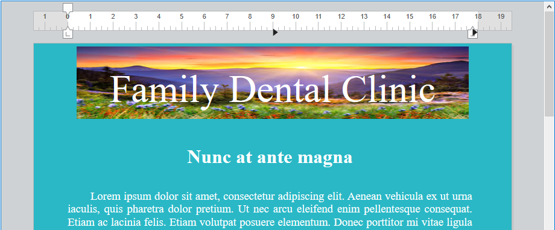

<!--REF #_command_.WP Add picture.Syntax-->**WP Add picture** ( *wpDoc* : Object {; *picture* : Picture} ) : Object<br/>**WP Add picture** ( *wpDoc* : Object {; *picturePath* : Text} ) : Object<br/>**WP Add picture** ( *wpDoc* : Object {; *pictureFileObj* : 4D.File} ) : Object<!-- END REF-->

<!--REF #_command_.WP Add picture.Params-->

| Parámetros     | Tipo                    |                             | Descripción                                                     |
| -------------- | ----------------------- | --------------------------- | --------------------------------------------------------------- |
| wpDoc          | Object                  | &#8594; | Documento 4D Write Pro                                          |
| picture        | Picture                 | &#8594; | Imagen 4D                                                       |
| picturePath    | Text                    | &#8594; | Ruta de la imagen                                               |
| pictureFileObj | 4D.File | &#8594; | Objeto 4D.File que representa un archivo imagen |
| Resultado      | Object                  | &#8592; | Objeto que hace referencia a la imagen                          |

<!-- END REF-->

## Descripción

El comando **WP Add imagen** <!--REF #_command_.WP Add image.Summary--> ancla la imagen pasada como parámetro en una ubicación fija dentro del *wpDoc* especificado y devuelve su referencia.<!-- END REF--> La referencia devuelta puede pasarse al comando [WP SET ATTRIBUTES](wp-set-attributes.md) para mover la imagen a cualquier ubicación en *wpDoc* (página, sección, encabezado, pie de página, etc.) con una capa definida, tamaño, etc.

En *wpDoc*, pase el nombre de un objeto documento de 4D Write Pro.

Para el segundo parámetro opcional, puede pasar:

- En *imagen*:  una imagen 4D
- En *picturePath*:  una cadena que contiene una ruta a un archivo imagen almacenado en disco (sintaxis sistema). Puede pasar una ruta completa o una ruta relativa al archivo de estructura de la base de datos. También puede pasar un nombre de archivo, en cuyo caso el archivo debe estar situado junto al archivo de estructura de la base de datos. Si pasa un nombre de archivo, debe indicar la extensión del archivo.
- En *PictureFileObj*: un objeto `4D.File` que representa un archivo imagen.

:::note

Todo formato imagen [soportado por 4D](../../FormEditor/pictures.md#native-formats-supported) puede ser usado. Puede obtener la lista de formatos de imagen disponibles usando el comando [PICTURE CODEC LIST](../../commands-legacy/picture-codec-list.md). Si la imagen encapsula varios formatos (codecs), 4D Write Pro solo mantiene un formato para la visualización y otro para la impresión (si son diferentes) en el documento; los "mejores" formatos se seleccionan automáticamente.

:::

- Si se omite *imagen*, se devuelve una referencia de imagen válida y se añade una imagen vacía. Esto le permite llamar a [WP SET ATTRIBUTES](wp-set-attributes.md) con el selector wk image expression para llenar la imagen con una expresión 4D. Si la expresión no puede evaluarse o no devuelve una imagen válida, se muestra una imagen vacía (imagen de marco negro por defecto).

Por defecto, la imagen añadida es:

- Incorporado detrás del texto
- Aparece en la esquina superior izquierda de la papelera
- Mostrar en todas las páginas

La ubicación, la capa (en línea, delante/detrás del texto), la visibilidad y cualquier otra propiedad de la imagen pueden modificarse mediante el comando [WP SET ATTRIBUTES](wp-set-attributes.md), o mediante acciones estándar (ver *Uso de las acciones estándar 4D Write Pro*).

**Nota:** el comando [WP Selection range](../commands-legacy/wp-selection-range.md) devuelve un objeto *referencia a imagen* si se selecciona una imagen anclada y un objeto *rango* si se selecciona una imagen en línea. Puede determinar si un objeto seleccionado es un objeto imagen comprobando el atributo `wk type`:

- **Value = 2**: el objeto seleccionado es un objeto imagen.
- **Valor = 0**: el objeto seleccionado es un objeto de rango.

## Ejemplo 1

Desea añadir una imagen con la configuración predeterminada utilizando una ruta de acceso.

```4d
 var $obPict : Object
 $obPict:=WP Add picture(myDoc;"/PACKAGE/Pictures/Saved Pictures/Sunrise.jpg")
```

El resultado es:


## Ejemplo 2

Quiere añadir una imagen redimensionada, centrada y anclada al encabezado:

```4d
 var $obImage : Object
 var $myPictureFile : 4D.File

 $myPictureFile:=File("/PACKAGE/Pictures/Saved Pictures/Sunrise.jpg")
 $obImage:=WP Add picture(myDoc;$myPictureFile)
 WP SET ATTRIBUTES($obImage;wk anchor origin;wk header box)
 WP SET ATTRIBUTES($obImage;wk anchor horizontal align;wk center)
 WP SET ATTRIBUTES($obImage;wk anchor vertical align;wk center)
 WP SET ATTRIBUTES($obImage;wk width;"650px";wk height;"120px")
```

El resultado es:



## Ejemplo 3

Desea utilizar una expresión de campo para añadir una imagen anclada a un documento que muestra algún texto de la base de datos:

```4d
 QUERY([Flowers];[Flowers]Common_Name="tulip")
 WP SET TEXT(myDoc;[Flowers]Description;wk append) //insertar texto
 var $obImage : Object
 $obImage:=WP Add picture(myDoc)
 WP SET ATTRIBUTES($obImage;wk image formula;Formula([Flowers]Image))
```


## Ver también

[WP DELETE PICTURE](../commands-legacy/wp-delete-picture.md)</br>
[WP Picture range](../commands-legacy/wp-picture-range.md)