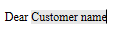

<!--REF #_command_.WP Insert formula.Syntax-->**WP Insert formula** ( *targetObj* ; *formula* ; *mode* {; *rangeUpdate*} ) : Object<!-- END REF-->

<!--REF #_command_.WP Insert formula.Params-->

| Parámetros  | Tipo   |                             | Descripción                                                        |
| ----------- | ------ | --------------------------- | ------------------------------------------------------------------ |
| targetObj   | Object | &#8594; | Rango o elemento o documento 4D Write Pro                          |
| formula     | Object | &#8594; | Objeto de fórmula U Objeto con propiedades de fórmula y de nombre  |
| mode        | Number | &#8594; | Modo de inserción                                                  |
| rangeUpdate | Number | &#8594; | Incluye o excluye el contenido insertado dentro del intervalo      |
| Resultado   | Object | &#8592; | Objeto de rango de texto que representa el resultado de la fórmula |

<!-- END REF-->

## Descripción

El comando **WP Insert formula** <!--REF #_command_.WP Insert formula.Summary--> inserta una *formula* en *targetObj* de acuerdo con el *mode* de inserción especificado y devuelve el rango de texto resultante.<!-- END REF-->

En el parámetro *targetObj*, puede pasar:

- un rango, o
- un elemento (tabla / línea / celda(s) / párrafo / cuerpo / encabezado / pie / sección / subsección / imagen en línea), o bien
- un documento 4D Write Pro.

En el parámetro *formula*, pase la fórmula 4D a evaluar. Puede pasar:

- o un [objeto de la fórmula](../../commands/formula.md-objects) creado por el comando [**Formula**](../../commands/formula.md) o [**Formula from string**](../../commands/formula.md-from-string),
- o un objeto que contiene dos propiedades:

| **Propiedad** | **Tipo** | **Description**                                                                                                                                                                                 |
| ------------- | -------- | ----------------------------------------------------------------------------------------------------------------------------------------------------------------------------------------------- |
| name          | Text     | Nombre que se mostrará para la fórmula en el documento                                                                                                                                          |
| formula       | Object   | El [objeto de la fórmula](../../commands/formula.md-objects) creado por el comando [**Formula**](../../commands/formula.md) o [**Formula from string**](../../commands/formula.md-from-string), |

Cuando se utiliza un objeto con una fórmula *name*, este nombre se muestra en el documento en lugar de la referencia de fórmula cuando las fórmulas se muestran como referencia, y en el consejo de fórmula cuando se muestran como valor o símbolos. Si la propiedad *name* contiene una cadena vacía o se omite, se elimina del objeto y la fórmula se muestra por defecto. Para más información, vea la página [Gestión de formulas](../managing-formulas.md).

En el parámetro *mode*, pase una de las siguientes constantes para indicar el modo de inserción que se va a utilizar:

| Constante  | Tipo    | Valor | Comentario                                      |
| ---------- | ------- | ----- | ----------------------------------------------- |
| wk append  | Integer | 2     | Insertar el contenido al final del objetivo     |
| wk prepend | Integer | 1     | Insertar el contenido al principio del objetivo |
| wk replace | Integer | 0     | Sustituir contenido de destino                  |

- Si *targetObj* es un rango, puede utilizar el parámetro opcional *rangeUpdate* para pasar una de las siguientes constantes para especificar si la *formula* insertada se incluye o no en el rango resultante:

| Constante             | Tipo    | Valor | Comentario                                                                            |
| --------------------- | ------- | ----- | ------------------------------------------------------------------------------------- |
| wk exclude from range | Integer | 1     | Contenido insertado no incluido en el rango actualizado                               |
| wk include in range   | Integer | 0     | Contenido insertado incluido en el rango actualizado (por defecto) |

Si no pasa un parámetro *rangeUpdate*, por defecto la *formula* insertada se incluye en el rango resultante.

- Si *targetObj* no es un rango, *rangeUpdate* se ignora.

:::note

Tenga en cuenta que, cuando se llama, el objeto fórmula se evalúa dentro del contexto de la base de datos o del componente que lo creó.

:::

## Ejemplo 1

Para reemplazar todas las fórmulas de fecha actuales con cadenas formateadas:

```4d
 var $_formulas : Collection
 var $find;$newFormula : Object
 
  // definir la fórmula a buscar
 $find:=Formula(Current date)
 
  // definir la fórmula de sustitución
 $newFormula:=Formula(String(Current date;System date long))
 
  // encontrar todas las fórmulas en el documento
 $_formulas:=WP Get formulas(WriteProArea)
 
  // consultar la colección desde WP Get formulas
 $_formulas:=$_formulas.query("formula.source =:1";$find.source)
 
  // luego reemplazar cada fórmula
 For each($formula;$_formulas)
    WP Insert formula($formula.range;$newFormula;wk replace)
 End for each
```

## Ejemplo 2

Desea utilizar un nombre de fórmula para el nombre del cliente:

```4d
  //añade algunos datos
 $data:=New object("customer";New object("lastname";"Smith";"firstname";"John"))
 WP SET DATA CONTEXT(WPArea;$data)
 
  //crea un objeto fórmula con un nombre
 $o:=New object
 $o.formula:=Formula(This.data.customer.firstname+" "+This.data.customer.lastname)
 $o.name:="Customer name"
 
  //inserta como texto
 $range:=WP Text range(WPArea;wk start text;wk end text)
 WP SET TEXT($range;"Dear ";wk append)
 WP Insert formula($range;$o;wk append)
```

Resultado:



## Ejemplo 3

Desea resaltar una fórmula en amarillo:

```4d
WParea:=WP New
WP SET TEXT(WParea; "The project was completed on: "; wk append)
$range1:=WP Insert formula(WParea; Formula(Current date); wk append)

WP SET ATTRIBUTES($range1; wk background color; "yellow")

```

Resultado:


## Ver también

*Managing formulas*\
[WP COMPUTE FORMULAS](../commands-legacy/wp-compute-formulas.md)</br>
[WP FREEZE FORMULAS](../commands-legacy/wp-freeze-formulas.md)</br>
[WP Get formulas](../commands-legacy/wp-get-formulas.md)