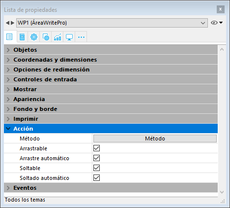
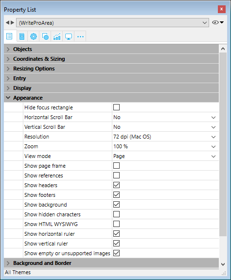
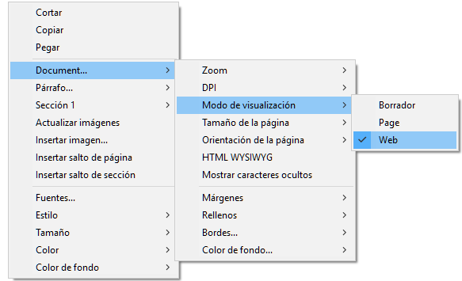

## Arrastrar y soltar 

Para configurar las funcionalidades de arrastrar y soltar para sus áreas 4D Write Pro, es necesario seleccionar las opciones adecuadas en el tema "Acción" de la Lista de propiedades:

Las áreas 4D Write Pro soportan dos modos de arrastrar y soltar:

* **Modo personalizado:** solamente las opciones "Arrastrable" y "Soltable" están marcadas.  
En este modo, puede seleccionar texto y empezar a moverlo. El método del objeto se llama con el evento On Begin Drag Over, así que puede definir la acción soltar utilizando código personalizado.
* **Modo automático**: las opciones "Arrastrable", "Soltable", "Arrastrar automático" y "Soltar automático" seleccionadas.  
En este modo, puede mover o copiar de forma automática (presione la tecla **Alt/Opción**) el texto seleccionado. El evento On Begin Drag Over no se dispara.

**Nota:** seleccionando únicamente las opciones "Arrastrar automático" y "Soltar automático" no tendrá ningún efecto en el área 4D Write Pro.

## Propiedades Vista 

Las propiedades de vista del documento están disponibles directamente en la lista de propiedades para áreas 4D Write Pro para permitirle definir cómo un documento 4D Write Pro se muestra de forma predeterminada en esta área. Estas propiedades le permiten personalizar, por ejemplo, si los documentos 4D Write Pro se muestran igual que si se fueran a imprimir, o a renderizar en un navegador. Se pueden establecer diferentes vistas del mismo documento 4D Write Pro en el mismo formulario.

**Nota:** la configuración de la vista se puede administrar dinámicamente utilizando los comandos [WP SET VIEW PROPERTIES](../commands/wp-set-view-properties) y [WP Get view properties](../commands/wp-get-view-properties).

La configuración de vista del documento se manejan a través de temas específicos en el tema **Apariencia** de la lista de propiedades para objetos de formulario 4D Write Pro:

* **Resolución**: define la resolución de pantalla para los contenidos del área 4D Write Pro. De forma predeterminada, se establece en **72 dpi (macOS)**, que es la resolución estándar para formularios 4D en todas las plataformas. Al establecer esta propiedad en **Automático** significa que el documento de renderización será diferente entre las plataformas macOS y Windows. El establecimiento de un valor específico dpi hará la misma renderización del documento en ambas plataformas macOS y Windows.
* **Zoom**: establece el porcentaje de zoom para mostrar los contenidos del área 4D Write Pro.
* **Modo Vista**: establece el modo de visualización del documento 4D Write Pro en el área del formulario. Tres valores están disponibles:  
   * **Página**: el más completo modo de visualización que incluye contornos de página, orientación, márgenes, saltos de página, encabezados y pies de página, etc. Para más información, consulte el párrafo *Funcionalidades de vista página*.  
   * **Borrador**: modo borrador con propiedades de documentos básicas  
   * **Anidado**: modo de visualización adecuado para áreas anidadas; no muestra los márgenes, los pies de página, los encabezados, los marcos de página, etc.  
   Este modo también se puede utilizar para producir una vista de salida Web (si selecciona también la resolución 96 dpi y la opción **Mostrar HTML WYSIWYG**).  
         
   **Nota**: la propiedad Modo Vista sólo se utiliza para la renderización en pantalla. En cuanto a la configuración de impresión, se utilizan automáticamente las reglas de renderización específicas (ver *Impresión de documentos 4D Write Pro*).
* **Mostrar marco de página:** muestra/oculta el marco de página cuando el modo de vista Página se establece en "Página".
* **Mostrar referencias**: muestra todas las fórmulas (o expresiones) insertadas en el documento como *referencias* (ver *Gestión de fórmulas*). Cuando esta opción no está marcada, las fórmulas 4D se muestran como *valores*.  
**Nota**: las referencias de fórmula se pueden mostrar como símbolos  (ver abajo).
* **Mostrar encabezados/pies**: muestra/oculta los encabezados y pies cuando el modo de vista Página se establece en "Página" (que aparece por defecto). Para más información sobre las encabezados y pies de página, por favor consulte la sección *Utilizar un área 4D Write Pro*.
* **Mostrar fondo y elementos anclados**: muestra/oculta imágenes de fondo, color de fondo, imágenes ancladas y cajas de texto.
* **Mostrar caracteres ocultos**: muestra/oculta caracteres invisibles.
* **Mostrar HTML WYSIWYG**: activa/desactiva la vista HTML WYSIWYG, en la que todos los atributos 4D Write Pro avanzados que no son compatibles con todos los navegadores son retirados.
* **Mostrar regla horizontal**: horizontal. Para más información acerca de las reglas en las áreas 4D Write Pro, consulte la sección *Gestión de reglas*.
* **Mostrar regla vertical**: muestra/oculta la regla vertical cuando el documento está en modo Página. Para mayor información sobre reglas en áreas 4D Write Pro, ver la sección *Gestión de reglas*.
* **Mostrar imágenes vacías o no soportadas**: muestra/oculta un rectángulo negro para las imágenes que no se pueden cargar o calcular (imágenes vacías o en un formato no soportado). Para más información, consulte la sección *Imágenes vacías*.
* **Mostrar la fuente de la fórmula como símbolo**: muestra el texto fuente de las fórmulas como  símbolos cuando las expresiones se muestran como referencias (ver arriba). Mostrar las fórmulas como símbolos hace que los documentos de plantilla sean más compactos y más *wysiwyg*.

## Menú contextual 

Si la propiedad **Menú contextual** está [seleccionada por un área 4D Write Pro](./defining-a-4d-write-pro-area.md#using-the-4d-write-pro-area-object), un menú contextual completo está disponible para los usuarios en modo Aplicación:  
  
 

Este menú ofrece acceso a todas las funcionalidades de 4D Write Pro.

## Seleccionar el modo vista 

Los documentos 4D Write Pro se pueden visualizar en tres modos de vista de página:

* **Borrador**: modo borrador con propiedades básicas
* **Página** (por defecto): modo "vista imprimir"
* **Embebido**: modo de vista conveniente para áreas anidadas; no muestra márgenes, pies de página, encabezados, columnas, marcos de página, etc.  
Este modo también se puede utilizar para producir una salida de vista como Web (si selecciona también la resolución 96 dpi y la opción **HTML WYSIWYG**).

El modo de visualización de la página se puede configurar mediante el menú emergente de área:

**Nota:** el modo de visualización de la página no se almacena con el documento.

Para las áreas anidadas en formularios 4D, el modo de visualización también se puede configurar por defecto utilizando la lista de propiedades. En este caso, el modo de visualización se almacena como una propiedad del objeto de formulario 4D Write Pro (para más información, consulte el párrafo *Configurar propiedades Vista*).

## Las acciones estandar

La interfaz de usuario de áreas 4D Write Pro se puede manejar a través de un amplio conjunto de **acciones estándar**. Las acciones estándar pueden asignarse a:

* comandos de menú, disponibles a través de la **barra de menú** o del comando [Dynamic pop up menu](../../commands/dynamic-pop-up-menu)
* elementos de lista, disponibles por medio de listas pop-up/desplegables o menús pop-up jerárquicos,
* botones, casillas de selección,
* o ejecutados por el comando [INVOKE ACTION](../../commands/invoke-action).

Cuando se le asignan a los objetos de interfaz, las acciones estándar manejan la activación/desactivación del objeto en función del contexto. Para más información, consulte la sección *Acciones estándar*.

Dos tipos de acciones están disponibles para áreas 4D Write Pro:

* Las acciones específicas 4D Write Pro, que sólo pueden utilizarse con áreas 4D Write Pro,
* *[Otras acciones](#other-actions)*, incluyendo las fuentes, expresiones, corrector ortográfico y acciones de edición, que se pueden utilizar con las áreas 4D Write Pro y las otras áreas 4D (ver *Acciones estándar*).

### Acciones 4D Write Pro 

Las siguientes acciones estándar están disponibles para las áreas 4D Write Pro.

**Notas:**

* Las acciones que muestran un menú/lista automático sólo se pueden asociar a los comandos de menús o a los objetos pop-ups/listas desplegables y menús pop-up jerárquicos (ver *Submenú*).
* Las casillas de selección y las casillas de selección 3D deben estar asociadas con acciones de estado, tales como "section/differentFirstPage" o "visibleHorizontalRuler". La opción de tres estados sólo se admite con casillas de selección estándar.
* Un estado de acción de sección siempre es igual al estado actual de la sección seleccionada (estado heredado si el atributo se hereda de la sección principal o del atributo por defecto) ya que debe reflejar el estado de sección seleccionado (el estado que se aplica actualmente a la sección). Sin embargo, la modificación de un atributo de sección con una acción estándar solo anulará el atributo de sección seleccionado.
* *Submenú*: cuando se utilizan sin parámetros y asociados a un comando de menú, un objeto pop-up/lista desplegable o pop-up menú jerárquico, estas acciones muestran un submenú automático. Por ejemplo, si asigna la acción "backgroundColor" a un comando de menú, la selección de este comando de menú a la ejecución mostrará automáticamente los comandos del submenú "Color de fondo". Si asigna la acción "zoom" a un menú pop-up jerárquico, contendrá automáticamente una lista de valores de zoom predefinidos. Tenga en cuenta que estas acciones no pueden asignarse a botones.
* *showDialog*: agregar la cadena "/showDialog" al nombre de la acción permite la visualización del diálogo estándar asociado a la acción. Por ejemplo, puede utilizar "paragraph/styleSheet/showDialog" para abrir el diálogo de entrada que permite la entrada de un nuevo nombre de hoja de estilo.

| Acción | Modelo | Disponible con  | Descripción  |
|---|---|---|---|
| anchorHorizontalAlign  | {image \| textBox}/anchorHorizontalAlign?value={left \| center \| right}  | Image, Textbox, Submenu | Defines the horizontal alignment of the element, relative to the anchorOrigin for images/text boxes in page, or to the layout box for images/text box in embedded mode. This action will reset the horizontal offset to 0. (not enabled for inline images).  | 
| anchoring | {image \| textBox}/anchoring  | Submenu | Default submenu with anchor settings actions for images or text boxes | 
| anchorLayout | image/anchorLayout?value={front \| behind \| wrapTopBottom \| wrapSquareLeft \| wrapSquareRight \| wrapSquareLargest \| wrapSquare \| inline}   textBox/anchorLayout?value={front \| behind \| wrapTopBottom \|  wrapSquareLeft \| wrapSquareRight \| wrapSquareLargest \| wrapSquare} | Image, Textbox, Submenu | Defines the anchor layout type for an image or a text box. Can be used to transform an inline image to an anchored image, or the reverse.  Note: If an image is moved from an anchored mode to inline, the image is inserted at the beginning of the current selected text.  "inline" value is not supported for text boxes | 
| anchorOrigin | {image \| textBox}/anchorOrigin?value={paper-box \| header-box \| footer-box} | Image, TextBox, Submenu | Defines the area relative to the absolute position of an anchored image or text box. If the element is relative to the header-box/footer-box which is not visible on a page, the element is not displayed. This action will reset horizontal and vertical offsets to 0.  Page mode only, not enabled for inline images. | 
| anchorPage | {image \| textBox}/anchorPage?value={all \| current \| currentSubSection} | Image, TextBox, Submenu | Defines the page(s) where the selected image or text box is displayed (not enabled for inline images).  Page mode only. | 
| anchorSection | {image \| textBox}/anchorSection?value={all \| current} | Image, TextBox, Submenu | Defines the section(s) where the selected image or text box is displayed. (not enabled for inline images).  Page mode only. | 
| anchorVerticalAlign | {image \| textBox}/anchorVerticalAlign?value={top \| center \| bottom} | Image, TextBox Submenu | Defines the vertical alignment of the image or text box, relative to the anchorOrgin for an image or text box in page, or to the layout box for an image or text box in embedded mode. This action will reset the vertical offset to 0 (not enabled for inline images). Note: See "verticalAlign" action for the vertical alignment inside the text box | 
| avoidPageBreakInside | {paragraph/}avoidPageBreakInside | Paragraph |   | 
| background |  {doc \| paragraph \| image \| textBox \| section \| header \| footer \| table \| row \| column \| cell/}background | Document, Paragraph, Image, TextBox, Section, Header, Footer, Table, Row, Column, Cell, Submenu | For menu commands only. Default submenu for all background attributes. | 
| backgroundClip | {doc \| paragraph \| image \| textBox \| section \| header \| footer \| table \| row \| column \| cell/}backgroundClip?value={paper-box \| border-box \| padding-box \| content-box} | Document, Paragraph, Image, TextBox, Section, Header, Footer, Table, Row, Column, Cell, Submenu | Changes target background clipping box (default target is paragraph). Paper-box targets document and section only. | 
| backgroundColor | {doc \| paragraph \| image \| textBox \| section \| header \| footer \| table \| row \| column \| cell/}backgroundColor?value={<Css_color> \| transparent} | Document, Paragraph, Image, TextBox, Section, Header, Footer, Table, Row, Column, Cell, Submenu, showDialog | Changes target background. | 
| backgroundDisplayMode | {doc \| paragraph \| image \| textBox \| section \| header \| footer \| table \| row \| column \| cell/}backgroundDisplayMode?value=scaledToFit \| truncated \| truncatedCentered \| proportional \| proportionalCentered \| replicated \| replicatedCentered | Document, Paragraph, Image, TextBox, Section, Header, Footer, Table, Row, Column, Cell, Submenu | Sets the display mode of images used as background. | 
| backgroundImage | {doc \| paragraph \| image \| textBox \| section \| header \| footer \| table \| row \| column \| cell/}backgroundImage?value=none | Document, Paragraph, Image, TextBox, Section, Header, Footer, Table, Row, Column, Cell, Submenu, showDialog | Clears target background image. (default target is paragraph) | 
| backgroundOrigin | {doc \| paragraph \| image \| textBox \| section \| header \| footer \| table \| row \| column \| cell/}backgroundOrigin?value={paper-box \| border-box \| padding-box \| content-box} | Document, Paragraph, Image, TextBox, Section, Header, Footer, Table, Row, Column, Cell, Submenu | Changes target background image origin box (default target is paragraph). Paper-box targets document and section only. | 
| backgroundPositionH | {doc \| paragraph \| image \| textBox \| section \| header \| footer \| table \| row \| column \| cell/}backgroundPositionH?value={left \| right \| center} | Document, Paragraph, Image, TextBox, Section, Header, Footer, Table, Row, Column, Cell, Submenu | Changes target background image horizontal alignment (default target is paragraph).  Ex: paragraph/backgroundPositionH?value=left | 
| backgroundPositionV | {doc \| paragraph \| image \| textBox \| section \| header \| footer \| table \| row \| column \| cell/}backgroundPositionV?value={top \| bottom \| center} | Document, Paragraph, Image, TextBox, Section, Header, Footer, Table, Row, Column, Cell, Submenu | Changes target background image vertical alignment (default target is paragraph).  Ex: paragraph/backgroundPositionV?value=top | 
| backgroundRepeat | {doc \| paragraph \| image \| textBox \| section \| header \| footer \| table \| row \| column \| cell/}backgroundRepeat?value={no-repeat \| repeat \| repeat-x \| repeat-y} | Document, Paragraph, Image, TextBox, Section, Header, Footer, Table, Row, Column, Cell, Submenu | Changes target background image repeat mode. (default target is paragraph) | 
| backgroundSizeH | {doc \| paragraph \| image \| textBox \| section \| header \| footer \| table \| row \| column \| cell/}backgroundSizeH?value={<Css_length> \| <Css_percentage> \| auto \| cover \| contain} | Document, Paragraph, Image, TextBox, Section, Header,  Footer, Table, Row, Column, Cell, Submenu | Changes target background image width (default target is paragraph).  Ex: paragraph/backgroundSizeH?value=100%. section/backgroundSizeH?value=cover | 
| backgroundSizeV | {doc \| paragraph \| image \| textBox \| section \| header \| footer \| table \| row \| column \| cell}/backgroundSizeV?value={<Css_length> \| <Css_percentage> \| auto} | Document, Paragraph, Image, TextBox, Section, Header,  Footer, Table, Row, Column, Cell, Submenu | Changes target background image height (default target is paragraph).  Ex: paragraph/backgroundSizeV?value=50%. Ex: section/backgroundSizeV?value=40pt | 
| bookmark | bookmark?index=<number> | Submenu | Selects the Nth bookmark.  Ex: bookmark?index=2 // selects the second bookmark | 
| borderCollapse | borderCollapse | Paragraph | Collapses selected paragraph borders and interior margins. | 
| borderColor | {doc \| paragraph \| image \| textBox \| section \| header \| footer \| table \| row \| column \| cell/}{inside \| outside/}{borderColor \| borderColorLeft \| borderColorRight \| borderColorTop \| borderColorBottom \| borderColorLeftRight \| borderColorTopBottom}?value=<Css_color> | Document, Paragraph, Image, TextBox, Section, Header,  Footer, Table, Row, Column, Cell, Submenu, showDialog | Changes target border color (default target is paragraph).  Ex: paragraph/borderColorLeft?value=green | 
| borderRadius | {doc \| paragraph \| image \| textBox \| section \| header \| footer/}borderRadius?value=<Css_length> | Document, Paragraph, Image, TextBox, Section, Header,  Footer, Submenu | Changes target border radius (default target is paragraph).  Ex: paragraph/borderRadius?value=4pt | 
| borders | {doc \| paragraph \| image \| textBox \| section \| header \| footer \| table \| row \| column \| cell/}{inside \| outside/}borders | Document, Paragraph, Image, TextBox, Section, Header,  Footer, Table, Row, Column, Cell, Submenu | Default submenu for target borders. | 
| borderStyle | {doc \| paragraph \| image \| textBox \| section \| header \| footer \| table \| row \| column \| cell/}{inside \| outside/}{borderStyle \| borderStyleLeft \| borderStyleRight \| borderStyleTop \| borderStyleBottom \| borderStyleLeftRight \| borderStyleTopBottom}?value={none \| hidden \| dotted \| dashed \| solid \| double \| groove \| ridge \| inset \| outset} | Document, Paragraph, Image, TextBox, Section, Header,  Footer, Table, Row, Column, Cell, Submenu | Changes target border style (default target is paragraph).  Ex: paragraph/borderStyleLeft?value=double. Ex: outside/borderStyle?value=solid //set selected paragraphs exterior borders to style solid. Ex: inside/borderStyle?value=none //remove selected paragraphs interior borders | 
| borderWidth | {doc \| paragraph \| image \| textBox \| section \| header \| footer \| table \| row \| column \| cell/}{inside \| outside/}{borderWidth \| borderWidthLeft \| borderWidthRight \| borderWidthTop \| borderWidthBottom \| borderWidthLeftRight \| borderWidthTopBottom}?value=<Css_length> | Document, Paragraph, Image, TextBox, Section, Header,  Footer, Table, Row, Column, Cell, Submenu | Changes target border width (default target is paragraph).  Ex: paragraph/borderWidthLeft?value=4pt | 
| columnCount | {section/}columnCount?value={1<=number<=20} | Document, Section, Submenu | Number of columns in the current document and/or section. (default target is doc)  Ex: section/columnCount?value=3 | 
| columnRuleColor | {section/}columnRuleColor?value={CSS color} | Document, Section, Submenu, showDialog | Color for the decorative line between document or section columns.  Ex: columnRuleColor?value="#FFFFFF" | 
| columnRuleStyle | {section/}columnRuleStyle?value={none \| dotted \| dashed \| solid \| double \| groove \| ridge \| inset \| outset} | Document, Section, Submenu | Style for the decorative line between document or section columns.  Ex: columnRuleStyle?value="solid" | 
| columnRuleWidth | {section/}columnRuleWidth?value={CSS length} | Document, Section, Submenu | Width of the decorative line between document or section columns.  Ex: columnRuleWidth?value="2pt" | 
| columns | {section/}columns | Document, Section, Submenu | Only for a menu item: creates automatically a complete Columns sub-menu with all column actions sub-menus (except insertColumnBreak) | 
| columnSpacing | {section/}columnSpacing?value={CSS length} | Document, Section, Submenu | Space between two columns in the current document and/or section.  Ex: columnSpacing?value="1cm" | 
| deleteColumns | deleteColumns | Table | Deletes all selected columns. | 
| deleteRows | deleteRows | Table | Deletes all selected rows. | 
| deleteStyleSheet | {paragraph \| image/}deleteStyleSheet?index={1<= number <= number of target style sheets} | Paragraph, Image, Submenu | Removes the Nth stylesheet from the stored stylesheets for the selected target (default target is paragraph). Menu item name is replaced at runtime with style sheet name. | 
| direction | direction?value={ltr \| rtl} | Paragraph, Submenu | Paragraph direction. | 
| displayFormulaAsSymbol | displayFormulaAsSymbol | Document | Displays formula references as a # symbol. Can only be used when formulas are displayed as references. | 
| doc | doc | Document, Submenu | Default submenu for document body layout (embedded mode attributes or default attributes for sections – but for margin which is reserved for embedded mode only). | 
| dpi | Modifies the dpi of the current view (independent of the document attribute wk dpi used internally for pixel conversion <-> points). | Submenu | Change view dpi.  Ex: dpi?value=72 | 
| emptyDatasource | {table}/emptyDatasource?value={showDataRow \| hideDataRow \| showPlaceholderRow \| hideTable } | Table, Submenu | Defines how the table is displayed when its datasource is empty.  | 
| fontStyleWrite | fontStyleWrite | Submenu | For menu commands only. Displays default font styles submenu for 4D Write Pro. | 
| fontSubscript | fontSubscript |   | Toggles subscript font attribute. | 
| fontSuperscript | fontSuperscript |   | Toggles superscript font attribute. | 
| footer | footer | Submenu | Displays the Footer submenu. | 
| footer/remove | footer/remove | Footer | Removes the selected footer. | 
| formulaHighlight | formulaHighlight?value={values \| references \| always \| never} | Document,  Submenu | Formula highlight mode for the document. Can be used with a dropdown menu or a button | 
| formulaHighlightColor | formulaHighlightColor?value=<Css_color> | Document,  Submenu,showDialog | Formula highlight color for the document | 
| formulaHighlightReferences | formulaHighlightReferences | Document | Toggles formula references highlighting. Can be used with a check box or a menu item | 
| formulaHighlightValues | formulaHighlightValues | Document | Toggles formula values highlighting. Can be used with a check box or a menu item | 
| header | header | Submenu | Displays the Header submenu. | 
| header/remove | header/remove | Header | Removes the selected header. | 
| height | {image \| textBox \| row}/height?value={<Css_length> \| auto} | Image, TextBox Row, Submenu | Target height.  Ex: image/height?value=50pt. For image/width, see width.  Ex: row/height?value=12pt | 
| headerRowCount | {table/}headerRowCount | Table, Submenu | Sets the number of header rows in a table. Maximum is 5. | 
| htmlWYSIWIGEnabled | htmlWYSIWIGEnabled | Document | Toggles between html wysiwyg mode. | 
| image | image | Image, Submenu | Displays image layout submenu. | 
| image/displayMode | image/displayMode?value=scaledToFit \| truncated \| truncatedCentered \| proportional \| proportionalCentered \| replicated \| replicatedCentered | Image, Submenu | Sets the display mode of anchored and inline images.  Ex: image/displayMode?value=scaledToFit | 
| image/verticalAlign | image/verticalAlign?value={top \| middle \| bottom \| baseline \| super \| sub} | Image, Submenu | Image vertical alignment.  Ex: image/verticalAlign?value=super | 
| insertColumnBreak | insertColumnBreak | Paragraph | Inserts a column break at the selection. | 
| insertColumnToTheLeft | insertColumnToTheLeft | Table | Inserts a column to the left of the first selected column(s). | 
| insertColumnToTheRight | insertColumnToTheRight | Table | Inserts a column to the right of the last selected column(s). | 
| insertContinuousSectionBreak | insertContinuousSectionBreak | Paragraph | Inserts a continuous section break at the selection. | 
| insertImage | insertImage |   | Opens a picture selection dialog box and inserts the selected picture (if any) as a character in the area. | 
| insertPageBreak | insertPageBreak | Paragraph | Inserts a page break at the selection. | 
| insertRowAbove | insertRowAbove | Table | Inserts a row above the selected row(s). | 
| insertRowBelow | insertRowBelow | Table | Inserts a row below the selected row(s). | 
| insertSectionBreak | insertSectionBreak | Paragraph | Inserts a section break at the selection. | 
| insertSoftHyphen | insertSoftHyphen |   | Inserts a soft hyphen at the cursor position. | 
| insertTextBox | insertTextBox | Document | Inserts a text box near the current selection, anchored to the first selected page (page mode).  | 
| keepWithNext | keepWithNext | Paragraph | Links a paragraph with the next so that they cannot be separated by automatic page or column breaks.   If applied to the last paragraph of the last cell in a table, the last row of the table is linked to the following paragraph.  | 
| lineHeight | lineHeight?value={<Css_length> \| <Css_percentage>} | Paragraph, Submenu | Paragraph line height.  Ex: lineHeight?value=120% | 
| layer | {image \| textBox}/layer | Submenu | Default submenu with layering actions for images or text boxes | 
| listStartNumber | listStartNumber?value={<number> (longint) \| auto} | Paragraph, Submenu | List start number. Ex: listStartNumber?value=10 | 
| listStyleImage | listStyleImage/showDialog | Paragraph, showDialog | Opens a file dialog to choose a image to display as list style bullet; it will set also list style type to disc – style to be used if image is not found. | 
| listStyleType | listStyleType?value={none \| disc \| circle \| square \| hollow-square \| diamond \| club \| decimal \| decimal-leading- zero \| lower-latin \| lower-roman \| upper-latin \| upper-roman \| lower-greek \| decimal-greek \| armenian \| georgian \| hebrew \| hiragana \| katakana \| cjk-ideographic} | Paragraph, Submenu | Paragraph list style type. | 
| margin | {doc \| paragraph \| image \| textBox \| section \| header \| footer \| table/}{inside \| outside/}{margin \| marginLeft \| marginRight \| marginTop \| marginBottom \| marginLeftRight \| marginTopBottom}?value={<Css_length> \| auto} | Document, Paragraph, Image, Textbox, Section, Header,  Footer, Table, Submenu | Changes target margin (default target is paragraph).  Ex: margin?value=4pt //sets all paragraph margins to 4pt.  Ex: outside/margin?value=4pt //set exterior paragraph margins to 4pt.  Ex: doc/marginLeft?value=1cm //sets left margin to 1cm for the document as used in embedded mode.  Ex: section/marginLeft?value=1cm //sets left margin to 1cm for the pages of the first selected section | 
| merge | {paragraph/}merge cell/merge | Paragraph,  Cell | Used with paragraphs: merges paragraphs. Used with cells: merges the selected cells. | 
| minHeight | {paragraph \| image/}minHeight?value=<Css_length> | Paragraph, Image, Submenu | Target min height (default target is paragraph).  Ex: paragraph/minHeight?value=50pt | 
| minWidth | {paragraph \| image/}minWidth?value=<Css_length> | Paragraph, Image, Submenu | Target min width (default target is paragraph).  Ex: paragraph/minWidth?value=50pt | 
| moveToBack | moveToBack | Image | Moves image to the back. (not enabled for inline images) | 
| moveToFront | moveToFront | Image | Moves image to the front. (not enabled for inline images) | 
| newLineStyleSheet | newLineStyleSheet?index={1<=number<=number of paragraph stylesheets \| newLineStyleSheet}?value=auto | Paragraph, Submenu | Selected paragraph elements will use Nth stylesheet as stylesheet to use for new paragraphs created on Return or while splitting paragraphs; If value=auto, new paragraphs will use the same stylesheet (default). (menu item name is replaced at runtime with stylesheet name) | 
| padding | {doc \| paragraph \| image \| textBox \| section \| header \| footer \| column \| row\| cell/}{inside \| outside/}{padding \| paddingLeft \| paddingRight \| paddingTop \| paddingBottom \| paddingLeftRight \| paddingTopBottom }?value=<Css_length> | Document, Paragraph, Image, TextBox, Section, Header,  Footer, Row, Column, Cell, Submenu | Changes target padding. (default target is paragraph) | 
| pageMode | pageMode?value={embedded \| page \| draft} | Submenu | Changes view mode.  Ex: pageMode?value=page | 
| pageOrientation | {section/}pageOrientation?value={landscape \| portrait} | Section, Submenu | Changes document or first selected section page orientation (if section is not specified, it will apply to all sections otherwise to the first selected section).  Ex: pageOrientation?value=portrait //change orientation to portrait for the whole document.  Ex: section/pageOrientation?value=landscape //change orientation to landscape for the first selected section | 
| pageSize | pageSize?index=<number> | Submenu | Changes document page size: number is Nth page size in the list of available pages sizes. The list contains the current printer page sizes, ISO page sizes and the custom page sizes defined by the user. | 
| paragraph | paragraph | Paragraph, Submenu | Default submenu for paragraph layout. | 
| paragraph/avoidPageBreakInside | {paragraph/}avoidPageBreakInside | Paragraph | Allows/disallows page breaks inside paragraphs. | 
| print | print | Document | Prints document as rendered in page mode with view settings of the focused 4D Write Pro area. | 
| refreshImages | refreshImages | Image | Reloads images from the network for images with URLs. | 
| removeSoftHyphens | removeSoftHyphens |   | Removes all soft hyphens in the current selection (if the selection is empty, removes soft hyphen before or after the caret if any) | 
| row/avoidPageBreakInside | row/avoidPageBreakInside | Table, Row | Allows/disallows page breaks inside table rows.  This action is disabled if:   the current selection does not contain a table the table does not allow page breaks the table is inside a header or footer Note: If several tables are selected and some of them don't allow page breaks, this option will be enabled but only applied to the tables that allow page breaks. | 
| section | section | Section, Submenu | Default submenu for page layout for the first selected section. | 
| section/differentFirstPage | section/differentFirstPage | Section | Section has different first page or not. | 
| section/differentLeftRightPages | section/differentLeftRightPages | Section | Section has different left and right pages or not. | 
| section/name/showDialog | section/name/showDialog | Section, showDialog | Displays a dialog allowing to enter the first selected section name. | 
| section/remove | section/remove | Section | Deletes the first section that intersects the user’s selection regardless if the user has selected one or multiple sections. Disabled when only one section remains in the document. | 
| section/reset | section/reset | Section | Resets all first selected section attributes to default attributes - which are inherited from doc attributes for background, border and padding (same as for embedded mode) and 2.5cm for page margins. First selected section column properties are also removed (so only default section properties will apply). | 
| split | {paragraph/}split cell/split | Paragraph, Cell | Used with paragraph: splits paragraph. Used with cells: splits the selected cells (only cells that have been already merged may be split). | 
| styleSheet | {paragraph \| image/}styleSheet?value={1<=number<=number of target style sheets} | Paragraph, Image, Submenu, showDialog | Applies Nth stylesheet to the selected target elements. With dialog, new stylesheet will use current attributes from the first selected target. (default target is paragraph)  Ex: styleSheet?value=1 //apply first paragraph style sheet to the selected paragraphs and set it as paragraph stylesheets. | 
| styleSheets | {paragraph \| image/}styleSheets | Paragraph, Image, Submenu | Default submenu for editing target stylesheets. | 
| tabDecimalSeparator | tabDecimalSeparator?value={point \| comma \| pointOrComma \| system} | Document, Submenu | Defines the character used as decimal separator by decimal tabulations.  | 
| tableAlign | tableAlign?value={left \| center \| right} or table/tableAlign?value={left \| center \| right}  | Table, Submenu | Specifies horizontal alignment for a table. | 
| table/avoidPageBreakInside | table/avoidPageBreakInside | Table | Allows/disallows page breaks inside tables.  Disabled if:  the current selection does not contain at least one table the table is in a header or a footer | 
| table/bottomCarryOverRow | table/bottomCarryOverRow | Table | Toggles between display/not display of carry-over rows (see Carry-over rows). | 
| textAlign | textAlign?value={left \| right \| center \| justify \| initial} | Paragraph | Paragraph text alignment (initial=use right for rtl or left for ltr direction). | 
| textBox | textBox | Submenu | Submenu with all actions available for the focused/selected text box | 
| textBox/remove | textBox/remove | TextBox | Removes the selected text box | 
| textIndent | textIndent?value=<Css_length> (may be negative) | Paragraph, Submenu | Paragraph text indentation (first line indentation).  Ex: textIndent?value=2cm | 
| textLinethrough | textLinethrough | Submenu | For menu commands only. Linethrough submenu (with style and color). | 
| textLinethroughColor | textLinethroughColor?value={<Css_color> \| currentColor} | Submenu, showDialog | Ex: textLinethroughColor?value=red | 
| textLinethroughStyle | textLinethroughStyle?value={none \| solid \| dotted \| dashed \| double \| semi-transparent \| word} | Submenu | Ex: textLinethroughStyle?value=dotted | 
| textShadow | textShadow | Submenu | For menu commands only. Default submenu for text shadow (with color and offset). | 
| textShadowColor | textShadowColor?value={<Css_color> \| none} | Submenu, showDialog | Changes shadow status or color for characters.  Ex: textShadowColor?value=green | 
| textShadowOffset | textShadowOffset?value=<Css_length> | Submenu | Only length in pt is supported.  Ex: textShadowOffset?value=2pt | 
| textTransform | textTransform?value={none \| capitalize \| uppercase \| lowercase \| small-uppercase} | Submenu | Formats text.  Ex: textTransform?value=capitalize | 
| textUnderline | textUnderline | Submenu | For menu commands only. Underline submenu (with style and color) | 
| textUnderlineColor | textUnderlineColor?value={<Css_color> \| currentColor} | Submenu, showDialog | Ex: textUnderlineColor?value=red | 
| textUnderlineStyle | textUnderlineStyle?value={none \| solid \| dotted \| dashed \| double \| semi-transparent \| word} | Submenu | Ex: textUnderlineStyle?value=dotted | 
| updateStyleSheet | {paragraph \| image/}updateStyleSheet | Paragraph, Image, Submenu | Updates first selected target stylesheet with first selected target current attributes (default target is paragraph) | 
| userUnit | userUnit?value={cm \| mm \| in \| pt} | Submenu | Changes document layout unit (will be reflected on rulers). | 
| verticalAlign | {paragraph \| row \| column \| cell \| textBox/}verticalAlign?value={top \| middle \| bottom} | Paragraph, Row, Column,  Cell, TextBox, Submenu | Paragraph vertical alignment.  Ex: verticalAlign?value=top. The effect depends on the minHeight value of the paragraph. | 
| view | view | Submenu | For menu commands only. Default submenu for view settings. | 
| visibleBackground | visibleBackground | Document | Shows/hides background, anchored pictures and text boxes | 
| visibleEmptyImages | visibleEmptyImages | Document | Shows/hides a default black rectangle for images that cannot be loaded or computed (empty images or images in an unsupported format). | 
| visibleFooters | visibleFooters | Document | Shows/hides footers. | 
| visibleHeaders | visibleHeaders | Document | Shows/hides headers. | 
| visibleHiddenChars | visibleHiddenChars | Document | Shows/hides hidden characters | 
| visibleHorizontalRuler | visibleHorizontalRuler | Document | Shows/hides horizontal ruler. | 
| visiblePageFrames | visiblePageFrames | Document | Shows/hides page frames. | 
| visibleVerticalRuler | visibleVerticalRuler | Document | Shows/hides vertical ruler (Page mode only). | 
| visibleTableBorders | visibleTableBorders | Document | Shows/hides internal and external table borders as dashed lines where no borders are defined. | 
| widowAndOrphanControlEnabled | widowAndOrphanControlEnabled | Paragraph | Toggles between widow and orphan control mode. | 
| width | {paragraph \| image \| textBox \| column/}width?value=<Css_length> \| auto | Paragraph, Image, TextBox, Column, Submenu | Target width (default target is paragraph). Auto value not available for text boxes (converted to 8 cm) and columns.   Ex: image/width?value=50pt | 
| zoom | zoom?value={25% <= percentage in Css <= 400%} | Document, Submenu | Changes document view zoom.  Ex: zoom?value=120% | 

### Otras acciones 

Otras acciones estándar están disponibles en los formularios 4D y pueden ser utilizadas en las áreas 4D Write Pro:

* *Acciones de edición*, tales como acciones de copiar/pegar.
* acciones *Fuente*, tales como FontBold o fontSize.
* acciones *Expresiones dinámicas*, permitiendo manejar la inserción de expresiones.
* acciones *Corrector ortográfico*.