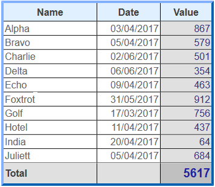
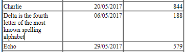
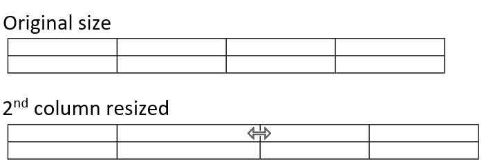
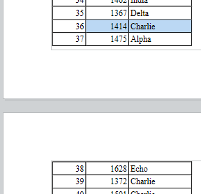
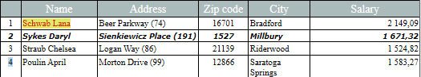

#### Manejo de tablas 

Los documentos 4D Write Pro pueden contener tablas. Las tablas 4D Write Pro son creadas y definidas por programación, pero su contenido puede ser modificado y manejado por el usuario. Varios atributos de tablas 4D Write Pro son editables, incluyendo la altura de la la línea, la alineación, los márgenes, el estilo del texto, el color o los bordes.



**Nota:** dado que las tablas 4D Write Pro pueden llenarse por programación, pueden contener un gran número de columnas y filas. Tenga en cuenta que las tablas muy grandes afectarán al rendimiento, especialmente si se muestran en pantalla. Ver también [esta entrada de blog](https://blog.4d.com/4d-write-pro-tables-without-limit) para más información.

#### Crear una tabla 

Las tablas 4D Write Pro se crean mediante una llamada al comando [WP Insert table](../commands/wp-insert-table). Luego puede añadir líneas utilizando el comando [WP Table append row](../commands/wp-table-append-row).

**Nota:** un usuario puede crear una tabla al copiar y pegar un rango de celdas:  


#### Edición de tablas 

El contenido de las celdas se puede agregar por programación utilizando el comando [WP Table append row](../commands/wp-table-append-row).

Una vez se crea una tabla, el contenido de la celda también puede ser editado en tiempo de ejecución por los usuarios. Pueden hacer clic en las celdas y seleccionar, editar, copiar o pegar o borrar texto o imágenes como en los párrafos regulares. Pueden navegar a través de las celdas con la tecla **Tab** (**Mayús**\+ **Tab** para navegar en dirección opuesta).

Usando la tecla **Retorno de carro** dentro de una celda crea un nuevo párrafo en la celda.

Tenga en cuenta que el ancho de la celda es fijo: cuando un usuario escribe texto o pega una imagen, la altura de la fila se amplía automáticamente si es necesario y el texto se ajusta automáticamente:



Los usuarios también pueden seleccionar columnas, filas o celdas y aplicar los atributos disponibles con respecto al estilo del texto, colores, alineación, etc. utilizando el menú emergente integrado o cualquier interfaz personalizada. 4D Write Pro ofrece varios comandos para seleccionar cualquier parte de una tabla:

* [WP Table get rows](../commands/wp-table-get-rows) para obtener un rango de líneas (o rango de líneas de encabezado)
* [WP Table get columns ](../commands/wp-table-get-columns) para obtener un rango de columnas (\*)
* [WP Table get cells](../commands/wp-table-get-cells) para obtener un rango de celdas

(\*) Las columnas no tienen equivalente en html. En 4D Write Pro, un rango de columnas es en realidad un rango de celdas, lo que significa que las columnas tienen la misma prioridad que las celdas.

Una vez que haya seleccionado un rango, puede aplicar cualquier atributo apropiado usando el comando [WP SET ATTRIBUTES](../commands/wp-set-attributes). Dentro de las celdas, los atributos se aplican a párrafos, caracteres o imágenes, dependiendo de su contenido. Por ejemplo, puede definir la altura, el tamaño de fuente, el borde, el relleno, etc. de tablas o celdas de tabla (para obtener más información, consulte la sección *Atributos 4D Write Pro*).

Cuando se aplican atributos diferentes a elementos concurrentes de una tabla, se aplica un orden de prioridad para la renderización:

1. La tabla se renderiza primero
2. Se renderizan las líneas (sobreescribir atributos de tabla)
3. Se renderizan las celdas/columnas (atributos de línea sobreescritos).

##### Redimensionar columnas 

El ancho de las columnas de la tabla se puede modificar arrastrando el separador de columnas hacia la izquierda o hacia la derecha. El cursor cambia para indicar que se puede mover horizontalmente y la línea vertical se muestra en la regla:


Cambiar el tamaño de las columnas genera un evento formulario On After Edit.

Para cambiar el tamaño de una columna, haga clic en el separador de columna y arrástrelo hacia la izquierda o hacia la derecha. El tamaño mínimo de la columna es de 8 puntos. Si la columna adyacente a la derecha alcanza el tamaño mínimo, todas las columnas a la derecha se moverán. Si la primera columna o una columna adyacente a la izquierda alcanza el tamaño mínimo, no se puede cambiar el tamaño en esa dirección.  
  


Si presiona la tecla **Mayús** mientras cambia el tamaño de una columna, el tamaño de la columna adyacente a la derecha no se modificará.  
  
  
  
**Nota**: la propiedad Editable debe estar habilitada para que el documento 4D Write Pro permita cambiar el tamaño de la columna.

##### Fusión y división de celdas 

Con 4D Write Pro, puede dividir y combinar celdas en una tabla. Fusionar celdas es combinar dos o más celdas adyacentes de una tabla situadas en la misma línea o columna en una única celda. Dividir celdas es tomar celdas ya fusionadas y separarlas en múltiples celdas adyacentes en la misma línea o columna. Las celdas pueden fusionarse utilizando el comando [WP TABLE MERGE CELLS](../commands/wp-table-merge-cells) o la acción estándar **cell/merge**, y dividirse utilizando el comando [WP TABLE SPLIT CELLS](../commands/wp-table-split-cells) o la acción estándar **cell/split**.


Las celdas de la tabla se pueden fusionar: 


**Ejemplo de fusión de celdas utilizando el lenguaje:**

1. Designe un rango de celdas para fusionar en su tabla, las celdas tienen que ser adyacentes horizontal o verticalmente, o ambas.
2. Llame al comando [WP TABLE MERGE CELLS](../commands/wp-table-merge-cells) en el rango seleccionado.

```4d
 $cells:=WP Table get cells($table;1;1;3;1)
 WP TABLE MERGE CELLS($cells)
  //o
 WP TABLE MERGE CELLS($table;1;1;3;1)
```

Los datos existentes de las celdas originales se concatenan en la celda fusionada resultante.

antes  


después   


**Ejemplo de división de celdas utilizando el lenguaje:**

1. Designe un rango de celdas a dividir en su tabla, el rango seleccionado tiene que contener algunas celdas ya fusionadas.
2. Llame al comando [WP TABLE SPLIT CELLS](../commands/wp-table-split-cells) en el rango seleccionado.

```4d
 $cells:=WP Table get cells($table;1;1;1;1)
 WP TABLE SPLIT CELLS($cells)
  //o
 WP TABLE SPLIT CELLS($table;1;1;1;1)
```

Los datos de la celda ya fusionada se mantienen todos en la primera celda resultante (arriba a la izquierda) después de la división, las otras celdas resultantes de la división permanecen vacías.

antes  


después  


**Importante**: 

* Las celdas que pertenezcan a una línea especial (línea de datos, línea de ruptura o línea de arrastre inferior) no pueden combinarse verticalmente.
* Las celdas que pertenecen a líneas de encabezado sólo pueden combinarse verticalmente si todas pertenecen a otras líneas de encabezado (no pueden combinarse con ninguna línea de encabezado que siga a las líneas de encabezado).

  
**Designación de celdas fusionadas:** 

Una celda fusionada puede manipularse igual que una celda individual (color de fondo, estilo de borde, estilos de párrafo..) utilizando la interfaz de 4D Write Pro, las acciones estándar o el comando [WP SET ATTRIBUTES](../commands/wp-set-attributes).

Todos los comandos de tabla existentes son aplicables a rangos o elementos que contienen celdas fusionadas. En una tabla que contiene celdas fusionadas, los índices de las celdas permanecen como si no se hubiera combinado ninguna celda.   

Ejemplo:

```4d
 $cell1:=WP Table get cells($table;1;1;1;1)
 $cell4:=WP Table get cells($table;4;1;1;1)
 WP SET ATTRIBUTES($cell1;wk background color;"yellow")
 WP SET ATTRIBUTES($cell4;wk background color;"pink")
```

antes  


después  


en este ejemplo también puede pasar $cell2 o $cell3 en lugar de $cell1 como:  

```4d
 $cell2:=WP Table get cells($table;2;1;1;1)
```

```4d
 $cell3:=WP Table get cells($table;3;1;1;1)
```

y tendrá el mismo resultado que utilizando $cell1 porque $cell1, $cell2, y $cell3 se refieren a la misma celda después de la fusión, y cualquier cambio aplicado a $cell1, $cell2, o $cell3 se aplica realmente a la nueva celda fusionada.  

Sin embargo, si se combinan un número x de líneas o columnas completas, los índices de las siguientes líneas o columnas se reducen en x. 

#### Paginación de tablas 

Cuando se muestran en modo Página o Borrador (o en el contexto de la impresión de un documento), las tablas 4D Write Pro pueden dividirse:

* automáticamente, si la altura de la tabla es mayor que la altura de página/columna disponible,
* dependiendo de los saltos de página/columna definidos por programación o por el usuario.

Las tablas se dividen entre líneas, y las líneas también pueden dividirse. La paginación de la tabla se actualiza dinámicamente si la orientación o el número de columna se modifican.

**Notas:** 

* Puede desactivar los saltos de página automáticos en las tablas utilizando los atributos wk page break inside row / wk page break inside table (ver *Atributos 4D Write Pro*) o las acciones estándar *table/avoidPageBreakInside* *y row/avoidPageBreakInside* (ver *Utilizar las acciones estándar 4D Write Pro*).
* Cuando una línea de la tabla y un párrafo tienen diferentes opciones de salto de página, las opciones aplicadas a la línea tienen prioridad. Por ejemplo, cuando un párrafo permite saltos de página, pero su línea padre no, la línea no se dividirá.

La paginación de la tabla se puede controlar por programación o por el usuario. Las acciones disponibles incluyen:

* insertar un salto de página en una tabla:  
   * Comando [WP INSERT BREAK](../commands/wp-insert-break)  
   * Acción estándar *insertPageBreak*  
   * Opción **I** **nsertar salto de página** del menú contextual predeterminado
* insertar un salto de columna en una tabla:  
   * Comando [WP INSERT BREAK](../commands/wp-insert-break)  
   * Acción estándar *insertColumnBreak*  
   * Opción **Insertar salto de columna** del menú contextual predeterminado

Cuando se inserta un salto de página o un salto de columna mediante una acción estándar o el menú contextual, se agrega antes del contenido seleccionado: la primera fila de la selección se mueve al principio de la siguiente página o columna. Por ejemplo:

 \===> 

**Notas:** 

* Sólo las tablas en el cuerpo de un documento pueden dividirse. Los cortes insertados en las tablas en los encabezados y pies de página se ignoran.
* Las tablas no se pueden dividir en diferentes secciones. Insertar un salto de sección en una tabla moverá toda la tabla a la nueva sección.
* Los saltos dentro de las líneas no están permitidos cuando las *Líneas de arrastre* están activadas.

#### Encabezados repetidos 

4D Write Pro le permite definir hasta cinco líneas de encabezado por tabla. Las líneas de encabezado seleccionadas se repetirán en cada columna o página cuando se produzca un salto de columna o de página.


Los encabezados de la tabla son la(s) primera(s) línea(s) de la tabla. Para definir las líneas de encabezado, puede:

* utilizar la acción estándar *headerRowCount* (ver *Utilizar las acciones estándar 4D Write Pro*), o
* utilizar la acción [WP SET ATTRIBUTES](../commands/wp-set-attributes) con wk header row count (en una tabla, ver *Tablas*), o wk header (en una línea, ver *Líneas y columnas*).

Si designa más de cinco líneas como encabezado (o si resulta de una inserción de líneas en un encabezado existente), 4D Write Pro sólo utiliza las cinco primeras líneas como encabezado. Si elimina la(s) línea(s) definida(s) en el encabezado, el número de líneas del encabezado disminuye.

#### Tabla fuentes de datos 

Puede asignar un objeto fórmula como fuente de datos para una tabla y acceder a los valores resultantes desde la tabla utilizando *Expresiones con This* (ver más abajo). La fórmula de la fuente de datos es procesada por 4D Write Pro cuando se calculan las fórmulas (por ejemplo, cuando se abre el documento, cuando se llama al comando [WP COMPUTE FORMULAS](../commands/wp-compute-formulas), etc.). Esta función aprovecha los contextos de datos (ver [WP SET DATA CONTEXT](../commands/wp-set-data-context)).

Para asignar una fuente de datos a una tabla, utilice el comando [WP SET ATTRIBUTES](../commands/wp-set-attributes) con el comando wk datasource y un objeto *4D formula* como valor. Por ejemplo, para llenar una tabla con una línea por cada persona que vive en Francia:

```4d
 $formula:=Formula(ds.people.query("country = :1";"France"))
 WP SET ATTRIBUTES($table;wk datasource;$formula)
```

* Si el objeto fórmula de la fuente de datos devuelve una colección o una selección de entidades (no vacía), la tabla se llena automáticamente cuando se calcula la fórmula: contiene al menos tantas líneas como elementos haya en la colección o entidades en la selección de entidades. La primera línea de la tabla, llamada la línea de datos, se utiliza como línea de plantilla (excluyendo las líneas de encabezado y las posibles líneas de ruptura).
* En la línea de datos (y líneas de ruptura), puede insertar expresiones que utilicen palabras claves especiales como *Este.elemento.apellido*. Las expresiones se sustituyen durante el procesamiento por los datos de la colección o la selección de entidades. La línea de datosse duplicará para que el número de líneas de elementos sea igual al número de elementos de la colección o selección de entidades después de calcular las fórmulas.
* Si la fórmula de la fuente de datos no devuelve una colección o una selección de entidades, o si devuelve una colección/selección de entidades vacía, las líneas de la tabla no se crean automáticamente y todas las líneas se tratan como líneas normales. Puede definir una fila de marcador de posición que se mostrará en caso de que la fuente de datos esté vacía.

Para eliminar una fuente de datos de una tabla, utilice el comando [WP RESET ATTRIBUTES](../commands/wp-reset-attributes). Definirá el valor del atributo datasource como null:

```4d
 WP RESET ATTRIBUTES($table;wk datasource)
```

##### Crear una tabla con fuente de datos 

Un diseño de tabla basado en una fuente de datos que contiene las siguientes líneas:

| **Icono**                                                     | **Líneas <br/>**      | **Número** | **Obligatorio** | **Condiciones**                                                    | **Descripción**                                                                                                                                                                                                                                                                                                                                                                                                    |
| ------------------------------------------------------------- | ----------------------------- | ---------- | --------------- | ------------------------------------------------------------------ | ------------------------------------------------------------------------------------------------------------------------------------------------------------------------------------------------------------------------------------------------------------------------------------------------------------------------------------------------------------------------------------------------------------------ |
|               | Líneas de encabezado          | hasta 5    | \-              | \-                                                                 | Encabezado de tabla estándar, ver *Encabezados repetidos*                                                                                                                                                                                                                                                                                                                                                          |
| <br/> | Línea de datos                | 1          | sí              | La fórmula de la fuente de datos debe devolver elementos iterables | Si la tabla no tiene líneas de encabezado y/o líneeas de ruptura, la línea de datos es la primera línea de la tabla; en caso contrario, es la primera línea después del encabezado o las líneas de ruptura. Suele llenarse con expresiones que utilizan **This** (por ejemplo, *This.item.value*) que dan acceso a los datos procesados cuando el documento está modo *Mostrar valores* y la línea está duplicada. |
|               | Líneas de ruptura ordenadas   | hasta 5    | \-              | La fórmula de la fuente de datos devuelve elementos iterables      | La línea o líneas que aparecen antes o después de la línea de datos. Ver *Líneas de ruptura*                                                                                                                                                                                                                                                                                                                       |
| <br/> | Líneas de arrastre inferior   | 1          | \-              | La fórmula de la fuente de datos debe devolver elementos iterables | La primera línea que sigue a la línea de datos o las líneas de ruptura. Ver *Líneas de arrastre*                                                                                                                                                                                                                                                                                                                   |
|               | Línea de marcador de posición | 1          | \-              | La fuente de datos debe estar definida                             | La fila de marcador de posición se mostrará en lugar de la fila de datos y las filas de interrupción (si las hay) cuando la fuente de datos esté vacía y el atributo "Mostrar fila de marcador de posición" esté activado en la tabla mediante la acción estándar *emptyDatasource* o la constante *wk empty datasource*. La fila del marcador de posición aparece inmediatamente antes de las demás filas.        |
| |  Otras líneas                                               | ilimitada                     | \-         | \-              | Líneas estándar (no duplicadas)                                    |                                                                                                                                                                                                                                                                                                                                                                                                                    |

Ejemplo (Mostrar modo referencias):


Cuando se calculan las fórmulas, la línea duplicada se duplica automáticamente según sea necesario para que coincida con todas las entidades o elementos de la colección devueltos por la fórmula de la fuente de datos:


En todo caso, la siguiente instrucción devuelve el número real de líneas:

```4d
 WP GET ATTRIBUTES($table;wk row count;$vcount) //31 para el ejemplo arriba
```

##### Líneas de arrastre 

Las tablas basadas en fuentes de datos soportan **líneas de arrastre inferiores** que se muestran automáticamente en la parte inferior de cada página/columna cuando la tabla se divide en más de una página/columna. Una línea de arrastre puede mostrar información adicional basada en los elementos mostrados/impresos anteriormente, gracias a la expresión **This.previousItems** (ver *Expresiones con This*). Esta función permite, por ejemplo, añadir líneas de subtotal.


Se muestran las líneas de arrastre:

* cuando una tabla de fuente de datos no cabe en una sola página (o columna)
* en la parte inferior de la tabla
* en la primera página (o primera columna) y en todas las demás excepto en la última.

**Importante:** las líneas de arrastre sólo están disponibles en las tablas llenadas por una fórmula de fuente de datos que devuelva una colección o una selección de entidades no vacía y en el modo de visualización de valores. En todos los demás casos o cuando la fórmula de la fuente de datos no se ha calculado, una línea de arrastre se muestra como una línea normal.

Para crear líneas de arrastre:

1. En la plantilla de la tabla, añada una línea justo después de la línea de datos o las líneas de ruptura e inserte las fórmulas necesarias en su interior, utilizando, por ejemplo **This.previousItems**.
2. Active la funcionalidad de arrastre de línes para su documento. Puede:  
\- utilizar la acción estándar *bottomCarryOverRow* (ver *Utilizar las acciones estándar 4D Write Pro*), o  
\- utilizar el comando [WP SET ATTRIBUTES](../commands/wp-set-attributes) con el selector de atributos wk bottom carry over row *Tablas*.

**Nota:** no se permiten saltos de página dentro de las líneas cuando la función de traspaso de líneas está activada (ver *Paginación de tablas*). Las opciones correspondientes, si se definen, se ignoran.

##### Líneas de ruptura 

Las tablas basadas en fuentes de datos soportan una o varias **Líneas de ruptura de orden** que pueden mostrarse antes o después de la línea de datos. Las **Líneas de ruptura de orden** le ayudan a dividir visualmente los elementos de la fuente de datos ya ordenados en la tabla en diferentes partes basadas en un valor de fórmula calculado.

Cada vez que cambia el valor de la fórmula, se inserta una nueva línea de ruptura. Por lo tanto, para que las tablas se muestren correctamente, la selección de entidades (o colección) utilizada como fuente de datos de la tabla debe estar ordenada en consecuencia. Por ejemplo, si se desean desgloses por países y ciudades, la fuente de datos debe ordenarse del siguiente modo: *ds.people.all().orderBy("country asc, city asc")*

El valor de ruptura se define mediante el atributo *wk break formula*. El valor suele ser una fórmula basada en una propiedad del elemento como "This.item.name'', de lo contrario el valor calculado puede no cambiar nunca, lo que hace que la fórmula de ruptura sea inútil. El atributo wk break formula se ignora si la tabla no tiene fuente de datos o si la línea es un encabezado. Una línea de ruptura debe ser adyacente a la línea de datos (ya sea antes o después), o a otra línea de interrupción, de lo contrario se ignora.

```4d
 WP SET ATTRIBUTES($row_2;wk break formula;Formula(This.item.country))
```

Gracias a la expresión **This.breakItems** puede utilizar esta funcionalidad, por ejemplo, para mostrar la media total de las líneas de datos dentro de una línea de interrupción. breakItems es un subconjunto evaluado de la fuente de datos de la tabla, ya sea una selección de entidades si la fuente de datos de la tabla es una selección de entidades, o una colección si la fuente de datos es una colección. Así, dentro de una línea de ruptura, puede escribir: This.breakItems.sum("salario")

Para crear líneas de ruptura:

1. Ordene la fuente de datos con los niveles correspondientes a las rupturas que desea mostrar, por ejemplo, *ds.People.all().orderBy("continent asc, country asc, city asc")*
2. Dibuje la(s) líneas(s) de ruptura en la plantilla de tabla. Si los saltos se encuentran después de la línea de datos, deben coincidir con el **orden inverso** de la fuente de datos, y si se encuentran antes de la línea de datos, deben coincidir con el mismo orden de la fuente de datos.
3. Defina el atributo *wk break formula* para la(s) línea(s) seleccionada(s):

```4d
 $row:=WP Table get rows($table;2;1) //select the second row as break
 WP SET ATTRIBUTES($row_2;wk break formula;Formula(This.item.country))
```

##### Expresiones con This 

Cuando se utiliza en una fórmula dentro de la tabla, la palabra clave **This** da acceso a diferentes datos según el contexto:

| **Contexto <br/>**                                                                                                               | **Expresión**                                    | **Tipo**                                                                             | **Devuelve**                                                                                                                                                                                                                                                                                                                                                                                                                      |
| ---------------------------------------------------------------------------------------------------------------------------------------- | ------------------------------------------------ | ------------------------------------------------------------------------------------ | --------------------------------------------------------------------------------------------------------------------------------------------------------------------------------------------------------------------------------------------------------------------------------------------------------------------------------------------------------------------------------------------------------------------------------- |
| Todos                                                                                                                                    | This.table                                       | Objeto                                                                               | Tabla actual                                                                                                                                                                                                                                                                                                                                                                                                                      |
| |  This.row                                                                                                                              | Objeto                                           | Elemento de la línea actual de la tabla                                              |                                                                                                                                                                                                                                                                                                                                                                                                                                   |
| |  This.rowIndex                                                                                                                         | Número                                           | Índice de la línea actual, empezando por 1                                           |                                                                                                                                                                                                                                                                                                                                                                                                                                   |
| Cuando se ha definido una fuente de datos para la tabla                                                                                  | This.table.dataSource                            | Objeto (formula)                                                                     | Datasource como una fórmula                                                                                                                                                                                                                                                                                                                                                                                                       |
| |  This.tableData                                                                                                                        | Colección o selección de entidades (normalmente) | table.dataSource evaluada                                                            |                                                                                                                                                                                                                                                                                                                                                                                                                                   |
| En cada línea duplicada cuando una fuente de datos tabla devuelve una colección o una selección de entidades                             | This.item.xxx                                    | Todos                                                                                | Asignado a cada elemento de la colección de datasource de la tabla o de la selección de entidades, por ejemplo **This.item.firstName** si la entidad asociada tiene el atributo *firstName*                                                                                                                                                                                                                                       |
| |  This.itemIndex                                                                                                                        | Número                                           | Índice del elemento actual en la colección o selección de entidades, empezando por 0 |                                                                                                                                                                                                                                                                                                                                                                                                                                   |
| En toda línea (excepto en las líneas de encabezado) cuando una fuente de datos tabla devuelve una colección o una selección de entidades | This.previousItems                               | Colección o selección de entidades                                                   | Elementos mostrados en las páginas anteriores a la línea de arrastre inferior (si la hay) o anteriores a la línea de la expresión, incluida la página en la que se muestra la línea que contiene la expresión. <br/>Esta expresión devuelve el mismo tipo de valor que la expresión **This.tableData**.                                                                                                                   |
| In a break row                                                                                                                           | This.breakItems                                  | Colección o selección de entidades                                                   | Elementos de la colección o selección de entidades mostrados en las líneas entre: la línea de ruptura actual y la línea de ruptura anterior del mismo nivel (o el inicio de la tabla) si la(s) línea(s) de ruptura se muestran después de la línea de datos. la línea de ruptura y la siguiente línea de ruptura del mismo nivel (o el final de la tabla) si la línea o líneas de ruptura se muestran antes de la línea de datos. |

En cualquier otro contexto, estas expresiones devolverán *undefined*.

**Nota:** para más información sobre la inserción de fórmulas, ver [WP INSERT FORMULA](../commands/wp-insert-formula).

##### Trabajar con una tabla fuente de datos 

Cuando se llena una tabla desde una fuente de datos, las filas se crean automáticamente cuando se calculan las referencias. Se pueden insertar o eliminar líneas, editar el contenido de las celdas, cambiar el estilo, etc:


Sin embargo, tenga en cuenta que si la fuente de datos de la tabla se vuelve a calcular, toda modificación realizada en las líneas calculadas (excepto en la primera línea) se pierde. Por otro lado, como la primera línea es la línea de datos, cualquier modificación realizada en esta línea se propagará a todas las líneas si se vuelve a calcular la fuente de datos de la tabla. Lo mismo ocurre con las líneas de interrupción, todas las modificaciones realizadas en las líneas de ruptura calculadas se pierden, excepto en el caso de las líneas de ruptura de plantilla (que pueden estar situadas al final o al principio de la tabla).

Por ejemplo:



Después de volver a calcular las expresiones:


Cuando el cursor se inserta en una celda de una tabla llenada con una fuente de datos, aparece un icono de advertencia a la izquierda junto con un consejo que muestra información:


Cuando las fórmulas se muestran como referencias o cuando se guarda el documento, sólo se muestra/guarda la primera fila como plantilla (si las fórmulas no están congeladas).

Cuando se congelan las fórmulas, la tabla se convierte en una tabla estándar y se restablece la fuente de datos de la tabla.

**Nota:** la acción estándar *freezeExpressions* no recalcula las fórmulas.