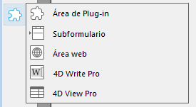
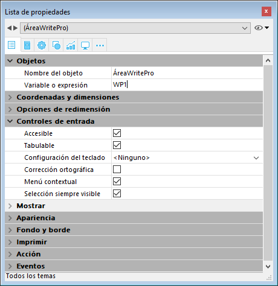
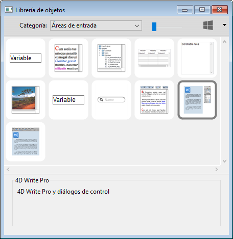
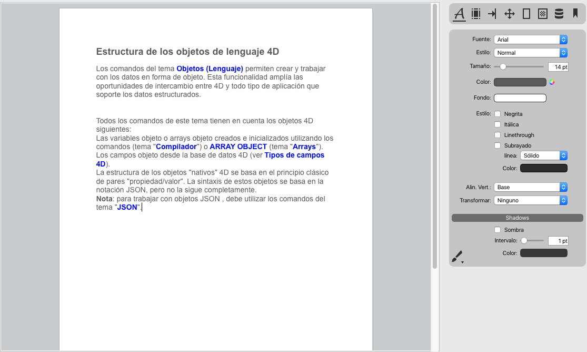

4D Write Pro ofrece a los usuarios 4D una herramienta avanzada de procesamiento de texto, totalmente integrada asu base de datos 4D. Utilizando 4D Write Pro, puede escribir mensajes de correo electrónico pre-formateados y/o cartas o cualquier documento con imágenes,  tablas, marcadores, una firma escaneada, texto con formato y marcadores de posición para variables dinámicas. También puede crear facturas o informes de forma dinámica, incluyendo formatos de texto e imágenes.

Las funcionalidades principales del producto son las siguientes:

* Procesamiento de textos: un objeto 4D Write Pro objeto anidado en una formulario ofrece funcionalidades de procesamiento de texto estándar, incluyendo texto y manipulación de párrafos y de estilos, inserción de imágenes, importación y exportación, y mucho más.
* Integración en la base de datos:  
   * un objeto 4D Write Pro puede contener partes variables que se llenan con los datos de la base, o datos calculados por 4D.  
   * los documentos 4D Write Pro se pueden almacenar dentro de los campos de la base de datos o en el disco.
   
4D Write Pro comes with:

- a **form object** that you can install in your forms. You can load, handle, and save **4D Write Pro documents** in this area. This object is configurable through the Property list and includes a comprehensive developer pop up menu at runtime.
- **language commands**, added to the 4D Language and allowing you to deeply customize the area.
- **standard actions**, to help building a fully customized interface. 
- **4D Write Pro Interface**, an extension that offers a set of predefined palettes for end users.

## Instalación y activación 

4D Write Pro está totalmente integrado en el propio 4D, por lo que es más fácil de desplegar y administrar. No se requiere ninguna instalación adicional, puede agregar áreas 4D Write Pro en sus formularios y manejar las variables 4D Write Pro en sus aplicaciones 4D directamente.  
  
Sin embargo, es necesario tener instalada una licencia de 4D Write Pro en la aplicación para poder habilitar la función.

## Creación de un área 4D Write Pro

### Uso del objeto de área 4D Write Pro

En 4D, los documentos 4D Write Pro se pueden mostrar y editar manualmente en un objeto formulario 4D, llamado **4D Write Pro**. Este objeto está disponible como parte de la última herramienta (Área de plug-in, área Web, etc.) de la [barra de objetos](../../FormEditor/formEditor.md#object-bar):
  
  

Un área de formulario 4D Write Pro form se configura por medio de las propiedades estándar de la Lista de propiedades, tales como **nombre del objeto** y **nombre de la variable**, **coordenadas**, **entrada**, **visualización** y **apariencia**, y/o **eventos**.

  

La propiedad **Nombre de la variable** puede ser utilizada en el lenguaje como una referencia al área 4D Write Pro. Tenga en cuenta que la variable debe ser del tipo [objeto](../../Concepts/dt_object.md).

Las propiedades de «Entrada» gestionan las funciones básicas para la introducción de texto:

* **Editable**: le permite bloquear/desbloquear el área con el fin de permitir o impedir su modificación
* **Auto revisión ortográfica**: disponible para áreas 4D Write Pro
* **Menú contextual:** le permite activar/desactivar el menú contextual cuando el formulario se ejecute (ver la sección [Utilizar un área 4D Write Pro](./using-a-4d-write-pro-area.md))

* **Selección siempre visible**: se encarga de la selección de texto como en las áreas de texto estándar.

### Uso de la interfaz 4D Write Pro

Puede crear áreas 4D Write Pro preconfigurada utilizando objetos **4D Write Pro** en la [librería de objetos](../../FormEditor/objectLibrary.md) (tema "Áreas de entrada"):

Estas áreas vienen con un panel de control o una barra de herramientas para gestionar todos los atributos del área (fuente, color, estilo, etc.):

Para más información, consulte la sección [Área 4D Write Pro](../writeprointerface.md).