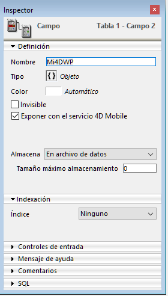
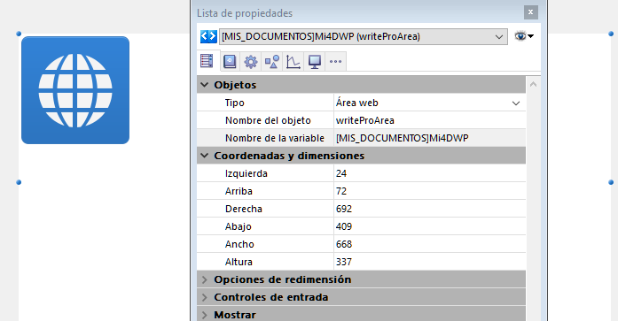

## Formato del documento .4wp 

Puede guardar los documentos 4D Write Pro en el disco y reabrirlos sin pérdidas con el formato **.4wp** nativo.

El formato **.4wp** consiste en una carpeta zip cuyo nombre es el título del documento y cuyo contenido es el texto HTML y las imágenes:

* el texto HTML combina HTML estándar con expresiones 4D (no interpretadas), así como también etiquetas 4D específicas,
* las imágenes se almacenan en una carpeta con el mismo nombre que el título del documento, junto al archivo HTML.

Como los documentos .4wp se basan en HTML, pueden importarse o abrirse en cualquier aplicación externa que soporte HTML.

El formato interno de los documentos 4D Write Pro es HTML extendido propietario, compatible con HTML5/XHTML5, pero utiliza su propio subconjunto de atributos y de etiquetas HTML/CSS. Como resultado, sólo los documentos HTML exportados por 4D Write Pro pueden ser abiertos por 4D Write Pro sin riesgo de perder información. La importación de documentos HTML creados externamente puede producir errores.

Para mayor información puede [**descargar la lista de atributos de 4D Write pro con la definición asociada como estilo CSS o etiqueta XHTML**](https://download.4d.com/Documents/Products%5FDocumentation/LastVersions/Line%5F19/4DWP-attributes-and-xhtml.pdf) en 4D Write Pro XHTML.

### Retrocompatibilidad 

Siempre puede reabrir un documento .4wp con una versión anterior de 4D Write Pro. Si contiene atributos que fueron añadidos en versiones más recientes, estos atributos son simplemente ignorados. Sin embargo, si guarda el documento, los atributos se eliminan del documento y se pierden.

## Almacenar los documentos 4D Write Pro en los campos objeto 4D

Puede guardar automáticamente sus documentos 4D Write Pro en el archivo de datos de 4D. Si ha creado un área 4D Write Pro en un formulario y crear un campo Objeto para almacenar el contenido del área, el texto introducido en el área y se guarda automáticamente con cada registro cuando se valida el registro. Luego puede utilizar el comando [QUERY BY ATTRIBUTE](../../commands/query-by-attribute) para seleccionar los registros en función del valor de sus atributos internos. También puede añadir y consultar sus propios atributos con las áreas 4D Write Pro. 

Esta sección describe las siguientes funcionalidades:

* Asociar un campo objeto 4D a un área 4D Write Pro en un formulario
* Definir, leer o buscar atributos personalizados en los documentos 4D Write Pro, utilizando los comandos estándar [OB SET](../../commands/ob-set), [OB Get](../../commands/ob-get) y [QUERY BY ATTRIBUTE](../../commands/query-by-attribute).

### Asociar un campo objeto 4D a un área 4D Write Pro 

Para asociar un área 4D Write Pro con un campo 4D Objeto, sólo tiene que hacer referencia al campo en la propiedad Nombre de la variable del área.

### Crear el campo objeto en estructura 

En la estructura de su base de datos, todo campo objeto 4D se puede utilizar para almacenar los documentos 4D Write Pro. Como en cualquier campo Objeto, debe definir, en función de sus necesidades:

* el nombre del campo,
* los atributos, como "Exponer con REST resource," así como también el índice,
* la opción de almacenamiento.



Estos parámetros son estándar para los campos Objeto.

### Asignar el campo objeto al área 4D Write Pro 

Una vez haya definido el campo objeto destinado a almacenar sus documentos 4D Write Pro, sólo tiene que hacer referencia a él en el formulario que contiene el área. Puede utilizar cualquier tabla o formulario proyecto.  
En el editor de formularios, escriba el nombre del campo, utilizando la notación estándar "\[Tabla\]Campo" en el área **Nombre de la variable** de la Lista de propiedades para el área 4D Write Pro:



Su área 4D Write Pro se asocia a continuación al campo, lo que garantiza que su contenido se guardará automáticamente con cada registro. Tenga en cuenta que si no utiliza los botones automáticos de 4D, tendrá que guardar el área de forma manual utilizando los comandos 4D.

### Utilizar atributos personalizados 

Cuando las áreas 4D Write Pro se almacenan en los campos de tipo Objeto, puede guardar y leer los atributos personalizados en los documentos 4D Write Pro, tal como, por ejemplo, el nombre del autor, la categoría del documento, o cualquier información adicional que puede resultar útil. A continuación, puede buscar los atributos personalizados con el fin de seleccionar los registros que cumplen los criterios.

Los atributos personalizados se exportarán con los comandos [WP EXPORT DOCUMENT](../commands/wp-export-document) o [WP EXPORT VARIABLE](../commands/wp-export-variable). Los atributos personalizados se exportarán al convertir un campo objeto 4D Write Pro a JSON utilizando el comando [JSON Stringify](../../commands/json-stringify) (junto con los atributos del documento principal 4D Write Pro).

Para definir o leer los atributos personalizados, puede utilizar notación objeto o los comandos [OB Get](../../commands/ob-get) y [OB SET](../../commands/ob-set).

Por ejemplo, en el método de formulario, puede escribir:

```4d
 If(Form event code=On Validate)
    [MyDocuments]My4DWP["myatt_Last edition by"]:=Current user
    [MyDocuments]My4DWP.myatt_Category:="Memo"
    [MyDocuments]My4DWP:=[MyDocuments]My4DWP //to record the edit
 End if
```

o:

```4d
 If(Form event code=On Validate)
    OB SET([MyDocuments]My4DWP;"myatt_Last edition by";Current user)
    OB SET([MyDocuments]My4DWP;"myatt_Category";"Memo")
 End if
```

También puede leer los atributos personalizados de los documentos:

```4d
 vAttrib:=[MyDocuments]My4DWP.myatt_Category
```

o:

```4d
 vAttrib:=OB Get([MyDocuments]My4DWP;"myatt_Category")
```

Si ha guardado los atributos personalizados con los documentos 4D Write Pro en su archivo de datos, puede efectuar las búsqueda en estos atributos para crear una selección de registros que contienen el valor del atributo apropiado. En el siguiente ejemplo, se consulta la tabla que contiene el campo Objeto para seleccionar registros:

```4d
 QUERY BY ATTRIBUTE([MyDocuments];[MyDocuments]My4DWP;"myatt_Category";=;"Memo")
  //selecciona todos los registros en MyDocuments cuyo atributo personalizado "myatt_Category" tiene el valor "Memo"
  //en el campo objeto My4DWP (asociado a un área 4D Write Pro)
```

:::warning Sobre los nombres de los atributos personalizados

como los atributos personalizados comparten el mismo espacio de nombre que los atributos internos de los documentos 4D Write Pro, le recomendamos encarecidamente que utilice prefijos al definir sus propios nombres de atributos, con el fin de evitar cualquier conflicto entre los atributos internos y personalizados. Los nombres sin prefijo están reservados para los atributos internos de 4D Write Pro. Puede utilizar cualquier prefijo personalizado (utilizamos "myatt\_" como prefijo en el ejemplo anterior).

:::

**Nota:** Los atributos personalizados no pueden ser gestionados por los comandos [WP SET ATTRIBUTES](../commands/wp-set-attributes), [WP GET ATTRIBUTES](../commands/wp-get-attributes), y [WP RESET ATTRIBUTES](../commands/wp-reset-attributes) (sólo soportan atributos internos de 4D Write Pro).

## Abrir y exportar documentos

En las aplicaciones 4D, los documentos, 4D Write Pro son creados importados y exportados por medio de comandos específicos que se encuentran en el tema **4D Write Pro** ([WP EXPORT DOCUMENT](../commands/wp-export-document), [WP EXPORT VARIABLE](../commands/wp-export-variable), [WP Import document](../commands/wp-import-document), [WP New](../commands/wp-new)). 

También puede [asociar un área 4D Write Pro con un campo Objeto](../user-legacy/defining-a-4d-write-pro-area.md#storing-4d-write-pro-documents-in-4d-object-fields) de la base. De esta manera, cada documento 4D Write Pro se guarda automáticamente con el registro y se almacena en los datos de la base.

## Impresion de documentos 4D Write Pro
 
Los documentos 4D Write Pro se pueden imprimir de dos formas

* como partes de formularios 4D
* como documentos independientes

### Impresión de documentos 

Puede imprimir objetos 4D Write Pro incluidos en cualquier tipo de [formulario 4D](../../FormEditor/forms.md) (proyecto, tabla, entrada, o salida) utilizando comandos de impresión 4D estándar como [PRINT SELECTION](../../commands/print-selection) o [PRINT RECORD](../../commands/print-record). 

La opción estándar *Impresión tamaño variable* también es soportada(\*) para las áreas 4D Write Pro, lo que permite gestionar cambios de tamaño durante la impresión. Cuando se activa esta opción, el margen (exterior e interior) y el borde superior se aplican sólo a la primera página. El margen (exterior e interior) y el borde inferior se aplican sólo a la última página. Las propiedades de paginación del documento se ignoran: el control de viudas y huérfanos se desactiva y los saltos de página no se aplican (estas propiedades sólo se utilizan para la renderización de páginas en la pantalla o en la impresión independiente del documento). Cuando se selecciona la opción **Impresión tamaño variable**, se imprimen sólo los objetos situados por encima del área en el formulario. Para obtener más información sobre esta opción, consulte "*Impresión tamaño variable*" en el Manual de Diseño.  
  
(\*) Los comandos [Print object](../../commands/print-object) y [Print form](../../commands/print-form) no son compatibles con esta opción.

#### Modo Vista para impresión 

Cualquiera que sea el **modo Vista** para el área 4D Write Pro (ver *Configurar propiedades Vista*), siempre se imprime como en el modo **Anidado** cuando se utiliza un comando de impresión 4D como [Print form](../../commands/print-form). En este caso, las siguientes opciones de Apariencia no se tienen en cuenta para los objetos de formulario 4D Write Pro: modo vista Página (siempre "Anidado"), Mostrar encabezados, Mostrar pies de página, Mostrar marco de página (siempre "no"), Mostrar caracteres ocultos (siempre "no").

#### Ejemplo 

El siguiente ejemplo muestra el efecto de la opción **Impresión tamaño variable** en un área 4D Write Pro anidada en el formulario de salida por defecto. El siguiente código se ejecuta:

```4d
 ALL RECORDS([Movies])
 ORDER BY([Movies]Title)
 PRINT SELECTION([Movies])
```

* Con la opción Imprimir tamaño variable no **seleccionada**, tendrá el siguiente resultado:  

* Con la opción de Imprimir tamaño variable **seleccionada**, tendrá el siguiente resultado:  
  
*(fuente del texto de ejemplo: Wikipedia)*

### Impresión de documentos independientes 

A partir de 4D v15 R5, 4D Write Pro incluye nuevas funcionalidades de impresión. Utilizando estas funcionalidades estándar, podrá imprimir documentos 4D Write Pro independientes, así como también controlar las opciones de impresión estándar tales como formato, orientación o números de página.

#### Comandos 4D Write Pro 

Básicamente, dos comandos manejan la función de impresión 4D Write Pro: *WP PRINT* y *WP USE PAGE SETUP*.

* [WP PRINT](../commands/wp-print) inicia un trabajo de impresión para el documento 4D Write Pro o agrega el documento al trabajo de impresión actual.
* [WP USE PAGE SETUP](../commands/wp-use-page-setup) modifica la configuración de página de la impresora actual de los atributos de documento 4D Write Pro para el tamaño y orientación.

**Nota:** en máquinas con Windows 7 o Windows Server 2008 R2, asegúrese de que la *actualización de plataforma para Windows 7* se ha instalado de manera que las funcionalidades de impresión sean compatibles.

#### Comandos 4D regulares 

Los siguientes comandos 4D soportan las funcionalidades de impresión 4D Write Pro:

* [SET PRINT OPTION](../../commands/set-print-option) y [GET PRINT OPTION](../../commands/get-print-option): todas las opciones son soportadas para documentos 4D Write Pro impresos por [WP PRINT](../commands/wp-print). Para Paper option y Orientation option, es más eficiente llamar a [WP USE PAGE SETUP](../commands/wp-use-page-setup) para sincronizar fácilmente estos atributos con la configuración del documento 4D Write Pro. Page range option (15) le permite definir el rango de página a imprimir.
* [PRINT SETTINGS](../../commands/print-settings): permite establecer los ajustes de impresión para la impresora actual; si [WP PRINT](../commands/wp-print) se llama después, se utilizará la configuración de impresora modificada si son modificados por diálogos de configuración de impresión (con excepción de los márgenes de diálogo de configuración de página que siempre se basan en el documento 4D Write Pro).
* [OPEN PRINTING JOB](../../commands/open-printing-job) y [CLOSE PRINTING JOB](../../commands/close-printing-job): [WP PRINT](../commands/wp-print) puede llamarse entre estos comandos para insertar uno o más documentos 4D Write Pro en un trabajo de impresión.