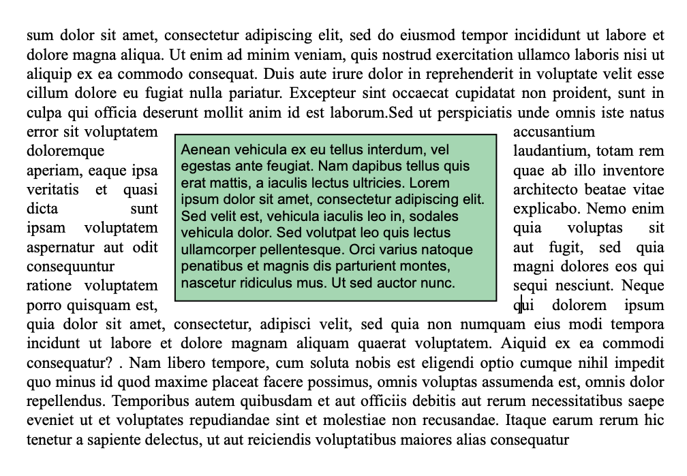

Las cajas de texto son áreas que se anclan a una página o sección y pueden llenarse con texto, imágenes en línea o tablas. Las cajas de texto pueden colocarse en cualquier lugar de la página y responder a necesidades específicas, por ejemplo, para insertar el nombre o el logotipo de una empresa o un área de direcciones.

**Nota:** una caja de texto no puede contener encabezados, pies de página, columnas, imágenes ancladas u otras cajas de texto.

Las cajas de texto se añaden con una posición absoluta, delante/detrás del texto, así como ancladas a una página o a partes específicas de un documento en el modo Página: encabezado, pie de página, una sección, todas las secciones o una subsección. Las cajas de texto también pueden utilizarse en modo anidado (ancladas a la caja de capa).

Añadir una caja de texto a un documento 4D Write Pro puede hacerse de las siguientes maneras:

* utilizando el comando **WP New text box**,
* utilizando la acción estándar *insertTextBox*

Para seleccionar una caja de texto, el usuario tiene que hacer clic sobre ella (**Ctrl/Cmd+clic** si la caja de texto está en la capa de fondo). Una vez seleccionado, se puede mover o redimensionar la caja de texto utilizando el ratón o las teclas de flecha.

Para eliminar una caja de texto seleccionada, puede presionar la tecla **Suprimir** o **Retroceso**, utilizar la acción estándar **textBox/eliminar**, o ejecutar el comando **WP DELETE TEXT BOX**.

Los atributos de las cajas de texto se manejan con el comando [WP SET ATTRIBUTES](../commands/wp-set-attributes) o *Acciones 4D Write Pro*. Están disponibles los siguientes atributos y acciones:  
  
| **Propiedad (constante)** | **Acción estándar**   | **Comentarios**                                                                                              |
| ------------------------- | --------------------- | ------------------------------------------------------------------------------------------------------------ |
| wk width                  | textBox/ancho         | Si se define en "auto", el ancho se convierte a 8cm ya que el ancho de la caja de texto no puede ser "auto". |
| wk height                 | textBox/alto          | Si está en "auto", la altura se ajusta al contenido.                                                         |
| wk padding                | textBox/relleno       |                                                                                                              |
| wk border \[...\]         | textBox/borde\[...\]  |                                                                                                              |
| wk background \[...\]     | textBox/fondo\[...\]  |                                                                                                              |
| wk vertical align         | textBox/verticalAlign |                                                                                                              |
| wk id                     | \-                    | no puede estar vacío para una caja de texto                                                                  |
| wk anchor \[...\]         | textBox/anchor\[...\] |                                                                                                              |
| wk owner                  | \-                    | sólo lectura                                                                                                 |
| wk protected              | \-                    |                                                                                                              |
| wk style sheet            | \-                    | sólo lectura y siempre "" (sin hoja de estilo)                                                               |

Las cajas de texto soportan el ajuste automático del texto cuando se anclan a un documento con opciones como a la izquierda, a la derecha, en el lado más grande, arriba y abajo, o todo alrededor suministradas a través de la propiedad wk anchor layout o la acción estándar anchorLayout. Ver esta entrada del blog para más detalles.

Las cajas de texto con ajuste de texto ancladas al cuerpo de la página no afectan al encabezado ni al pie de página (la caja de texto se muestra delante del encabezado o del pie de página); por el contrario, las cajas de texto ancladas al encabezado y al pie de página afectan al cuerpo de la página si se solapan con él.  
  
**Nota**: si desea anclar una caja de texto con ajuste de texto al encabezado o al pie de página, también debe definir la alineación vertical de la caja de texto en la parte superior.

Las cajas de texto no se muestran si:

* el modo de vista es Borrador;
* están centrados o anclados a secciones y la opción **Mostrar HTML WYSIWYG** está marcada;
* la opción "fondo visible" no está activada.