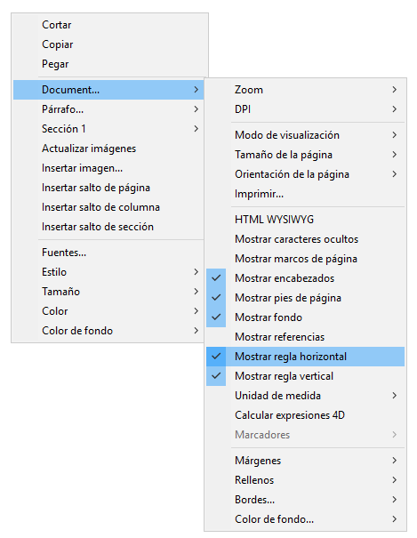

 

## Conceptos básicos 

Cuando el documento está en el [modo de vista **Página**](./defining-a-4d-write-pro-area.md#selecting-the-view-mode), las siguientes propiedades del documento se muestran al usuario:

* Trazos de página para representar los límites de impresión
* Ancho de página y Altura de la página (por defecto: 21x29.7 cm)
* Orientación de la página (por defecto: retrato)
* Margen de la página (por defecto: 2.5 cm)

También puede utilizar comandos adicionales relacionados con la página como **Document.../Page size** o **Document.../Page orientation**.

**Nota:** cuando un documento está en modo vista **Anidado** o **Borrador**, las propiedades de la página se pueden definir, aunque su efecto no sea visible. En el modo **Borrador**, los siguientes efectos propiedad de párrafo son visibles: 
* Limitación de altura página (líneas dibujadas)
* Columnas
* Evitar salto de página dentro de la propiedad
* Control de viudas y huérfanos.

## Saltos de párrafo 

Cuando se muestra en modo Página o Borrador (o en el contexto de la impresión de un documento), los párrafos de 4D Write Pro pueden romperse

* automáticamente, si la altura del párrafo es mayor que la altura de la página disponible,
* en función de los saltos de párrafo establecidos por la programación o por el usuario.

Los saltos pueden ser añadidos por programación o por el usuario. Las acciones disponibles son:

* comando [WP INSERT BREAK](../commands/wp-insert-break)
* acción estándar *insertPageBreak*
* Opción **Inserción de salto de página** del menú contextual por defecto

### Controlar los saltos automáticos

Puede controlar los saltos automáticos en los párrafos mediante las siguientes funcionalidades:

* **Control de viudos y huérfanos**: cuando se define esta opción para un párrafo, 4D Write Pro no permite viudas (última línea de un párrafo aislada en la parte superior de una página) ni huérfanas (primera línea de un párrafo aislada en la parte inferior de una página) en el documento. En el primer caso, la línea anterior del párrafo se añade a la parte superior de la página para que se muestren allí dos líneas. En el segundo caso, la primera línea aislada se traslada a la página siguiente.
* **Evitar el salto de página en el interior**: cuando se define esta opción para un párrafo, 4D Write Pro impide que este párrafo se divida en partes en dos o más páginas.
* **Mantener con el siguiente**: cuando se establece esta opción para un párrafo, ese párrafo no puede separarse del que le sigue por un salto automático. Ver wk keep with next y la [acción estándar](./defining-a-4d-write-pro-area.md#standard-actions) correspondiente.

Estas opciones pueden definirse mediante el menú contextual, o los [atributos](../commands-legacy/4d-write-pro-attributes.md) (`wk avoid widows and orphans`, `wk page break inside paragraph`, o las [acciones estándar](./defining-a-4d-write-pro-area.md#standard-actions) *widowAndOrphanControlEnabled*, *avoidPageBreakInside*).

## Fondo 

El fondo de los documentos 4D Write Pro y los elementos del documento (tablas, párrafos, secciones, encabezados/pies, etc.) se pueden configurar con los siguientes efectos:

* colores
* bordes
* imágenes
* origen, posicionamiento horizontal y vertical
* área de dibujo
* repetir

Estos [atributos](../commands-legacy/4d-write-pro-attributes.md) se pueden definir por programación para elementos individuales en una página y/ o fondos de documento completos con el comando [WP SET ATTRIBUTES](../commands/wp-set-attributes) o por las [acciones estándar](./defining-a-4d-write-pro-area.md#standard-actions). 

Los usuarios pueden modificar atributos de fondo a través del menú contextual como se muestra a continuación:

  


Para ver un ejemplo de cómo añadir una imagen de tamaño completo como fondo, vea la demostración de cómo hacerlo [aquí](http://download.4d.com/Demos/4D%5Fv16%5FR5/HDI%5F4DWP%5FBackImagePaperBox.zip).

## Encabezados, pies y secciones 

Los documentos 4D Write Pro soportan encabezados y pies de página. Los encabezados y pies de página están relacionados con las secciones.

Una sección es una parte de un documento que está definida por un rango de páginas y puede tener su propia paginación y atributos comunes. Un documento puede contener cualquier número de secciones (de uno al número total de páginas). Cada página sólo puede pertenecer a una sección, excepto las páginas con saltos de sección continuos (ver abajo).

Los documentos 4D Write Pro pueden contener:

- una o más secciones (una sección por defecto)
- para cada sección, hasta tres subsecciones:
   - subsección de la primera página
   - subsección de la(s) página(s) izquierda(s)
   - subsección de la(s) página(s) derecha(s)

Se puede definir un conjunto de encabezados y pies de página para cada sección.

### Definir una sección 

Una sección es un subconjunto de páginas continuas en un documento 4D Write Pro. Un documento puede contener una o más secciones. Una sección puede contener cualquier número de páginas, desde una sola página a el número total de páginas del documento. Una sección puede contener una sola columna o hasta 20 columna(s). 

Por defecto, un documento contiene una sola sección, llamada **Sección 1**. 4D Write Pro muestra el menú contextual de este número de la sección donde se hace clic en el documento:


Se crea una nueva sección añadiendo una ruptura de sesión en el flujo de texto:


Cuando se ha añadido una ruptura de sección, el menú contextual muestra un número incrementado para cada sección. Sin embargo, puede cambiar el nombre de cualquier sección:


El nombre introducido se utiliza como el nombre de sección en todo el documento:

 

Tenga en cuenta que si se ha definido una primera página diferente o diferentes páginas izquierda/derecha para una sección, el tipo de página también se muestra en el menú (ver abajo).

### Insertar un salto de sección continuo 

Un salto de sección continuo crea una nueva sección en la misma página. Esto permite crear páginas con secciones que tienen diferentes números de columnas (vet *Creación de una página con secciones de varias columnas y de una sola columna*).

Las secciones creadas con saltos de sección continuos se cuentan en el documento (tienen números de sección), pero a diferencia de las secciones creadas con saltos de sección estándar, sus encabezados, pies, imágenes ancladas, etc. sólo se tienen en cuenta cuando se ha producido un salto de página físico.

**Nota:** si cambia la orientación de la página de la nueva sección después de insertar un salto de sección continuo, éste se convierte en un salto de sección estándar.

### Atributos Sección 

Las secciones heredan atributos de los documentos. Sin embargo, los atributos de documentos comunes, incluyendo los encabezados y pies de página, se pueden modificar por separado para cada sección. El menú emergente contextual muestra las propiedades y atributos disponibles en el nivel de sección:  
  


* **Orientación de página**: le permite definir una orientación de página específica (vertical u horizontal) por sección
* **Primera página diferente**: le permite definir diferentes atributos para la primera página de la sección; esta funcionalidad se puede utilizar para crear hojas de guarda, por ejemplo. Cuando se selecciona este atributo, la primera página de la sección se maneja como una subsección y puede tener sus propios atributos.  
 ">/\]
* **Diferentes páginas derecha e izquierda**: le permite establecer diferentes atributos para las páginas izquierda y derecha de la sección. Cuando se activa este atributo, las páginas izquierda y derecha de la sección se manejan como subsecciones y puede tener sus propios atributos.  
 ">/\]
* Comandos **Columnas**: permiten definir el número y propiedades de columnas para la sección. Estas opciones se detallan a continuación.
* Comandos **Header** y **Footer**: estas opciones permiten definir encabezados y pies de página separados. Estas opciones se detallan a continuación.
* **Márgenes**/**Relleno**/**Bordes**/**Fondo**: estos atributos pueden definirse por separado para cada sección. Para más información acerca de estos atributos, consulte el artículo *Atributos 4D Write Pro*.

### Insertar encabezados y pies de página 

Cada sección puede tener encabezado y pie de página específicos. Los encabezados y pies de página sólo se muestran cuando el documento modo vista página está en **Página**.  
  
Dentro de una sección, puede definir hasta tres encabezados y pies diferentes, dependiendo de las opciones activadas:

* primera página,
* página(s) izquierda(s),
* página(s) derecha(s).

Para crear un encabezado o un pie de página: 

1. Asegúrese de que el documento está en el modo de visualización **Página**.
2. Haga doble clic en el área de encabezado o pie de página de la sección y página deseada para entrar en el modo de edición.  
   * El área de encabezado está en la parte superior de la página:  
     
   * El área de pie de página es en la parte inferior de la página:  
   

  
A continuación, puede introducir contenidos estáticos, que se repetirán automáticamente en cada página de la sección (a excepción de la primera página, si está habilitada).


También puede insertar contenidos dinámicos tales como el número de página o el conteo de páginas utilizando el comando [ST INSERT EXPRESSION](../../commands/st-insert-expression) (para más información, consulte el párrafo *Insertar expresiones de documento y de página*).

Una vez definidos un encabezado o un pie de página para una sección, puede configurar sus atributos comunes utilizando el menú contextual:


Para más información sobre atributos **Márgenes**, **Rellenos**, **Bordes** y **Fondo**, consulte la sección *Atributos 4D Write Pro*. 

Puede eliminar toda la definición de un encabezado o de un pie de página (contenidos y atributos) seleccionando **Eliminar encabezado** o **Eliminar pie** en el menú contextual.

### Compatibilidad 

4D Write Pro maneja encabezados y pies de página de documentos convertidos desde el plug-in 4D Write conuna altura fija.

Las siguientes expresiones y propiedades también son soportadas y se convierten de los encabezados y pies de página del plug-in 4D Write:

* número de página y variables de conteo de página
* distinta primera página
* distintas páginas izquierda/derecha


## Reglas 

Las reglas están disponibles en todos los modos de visualización de 4D Write Pro y tienen las siguientes características:

* Graduaciones en cm, mm, pulgadas o pt de acuerdo con la unidad de diseño actual definida en el documento 4D Write Pro. Puede cambiar las unidades de medida mediante el menú contextual o modificando el atributo wk layout unit.
* Símbolo de indentación de primera línea
* Símbolo de margen de párrafo izquierdo
* Símbolo de margen de párrafo derecho
* Tabulaciones mostradas a lo largo del borde inferior de la regla
* El contraste de color visible representa los márgenes de página izquierdo y derecho

Las reglas verticales están disponibles solo en modo Página y tienen las siguientes características:

* Graduaciones en cm, mm, pulgadas o pt según la unidad de diseño actual definida en el documento 4D Write Pro. Puede cambiar las unidades de medida utilizando el menú contextual o modificando el atributo wk layout unit.
* Contraste de color visible que representa los márgenes superior e inferior de la página.

Puede cambiar el estado de visualización de las reglas por medio de acciones estándar (ver *Utilizar las acciones estándar 4D Write Pro*) o marcando o desmarcando la opción **Mostrar regla horizontal** o **Mostrar regla vertical** en el menú contextual del área 4D Write Pro:  
  
  

**Nota:** una propiedad específica del área 4D Write Pro permite definir la visualización predeterminada para las reglas (ver la sección *Configurar propiedades Vista*).

### Ajustar márgenes de texto e indentaciones 

#### Regla horizontal 

Puede modificar márgenes izquierda y derecha, indentaciones y posiciones de tabulación haciendo clic y arrastrando los símbolos correspondientes en la regla horizontal:


Cuando coloca el ratón sobre uno de estos símbolos, el cursor cambia para indicar que puede moverse y aparece una línea de guía vertical mientras lo arrastra:  
  


Cuando se seleccionan varios párrafos, arrastrar márgenes o símbolos de indentación aplica estos márgenes o indentaciones a todos los párrafos seleccionados. Manteniendo presionada la tecla Mayús mientras arrastra estos símbolos mantiene los intervalos existentes entre indentaciones o márgenes en los párrafos seleccionados.

#### Regla Vertical 

Puede modificar los márgenes superior e inferior con la regla vertical. Cuando mueve el ratón sobre el límite del margen, el cursor cambia para indicar que se puede mover, y aparece una línea de guía horizontal mientras lo arrastra:  
  
 

Esta acción se puede utilizar para modificar el espacio entre la parte superior e inferior de la página y el cuerpo y el encabezado y pie de página de un documento. 

### Gestión de tabulaciones 

Puede utilizar el menú contextual de la regla para crear, modificar o eliminar tabulaciones:  
  
  

Para crear una tabulación, simplemente haga clic directamente en la regla y elija su tipo en el menú contextual. Un solo clic izquierdo crea automáticamente una tabulación izquierda predeterminada. También puede hacer clic con el botón derecho en las tabulaciones existentes para modificar su tipo utilizando el menú contextual.

**Eliminar tabulación** solo está disponible cuando hace clic con el botón derecho del ratón directamente en una tabulación existente; También puede eliminar tabulaciones arrastrándolas fuera del área de la regla horizontal.

:::note Notas 

* La tabulación también se pueden definir por programación con los comandos [WP SET ATTRIBUTES](../commands/wp-set-attributes), [WP GET ATTRIBUTES](../commands/wp-get-attributes), y [WP RESET ATTRIBUTES](../commands/wp-reset-attributes) con los selectores wk tab default y wk tabs.
* Para las tabulaciones decimales, 4D Write Pro considera el primer punto o coma de la derecha como el separador decimal; esta configuración predeterminada puede modificarse con el selector wk tab decimal separator.

:::

#### Definir caracteres iniciales 

Los caracteres que preceden a las tabulaciones (caracteres iniciales) se pueden definir seleccionando entre cinco caracteres predefinidos o designando un carácter específico a usar. Los caracteres predefinidos son:

* Ninguno (no se muestran los caracteres - *predeterminado*)
* .... (puntos)
* \--- (guiones)
* \_\_ (guiones bajos)
* \*\*\* (asteriscos)

Los caracteres iniciales siempre aparecen antes de la tabulación y siguen la dirección del texto (de izquierda a derecha o de derecha a izquierda). Se pueden definir por programación con los comandos [WP SET ATTRIBUTES](../commands/wp-set-attributes), [WP GET ATTRIBUTES](../commands/wp-get-attributes) y [WP RESET ATTRIBUTES](../commands/wp-reset-attributes) utilizando `wk leading` con los selectores `wk tab default` o `wk tabs`, o vía el menú contextual de regla horizontal (como se muestra a continuación).


Cuando se selecciona **Otro...**, se muestra un diálogo donde se puede definir un carácter principal personalizado.

### Reglas Multi columnas 

Cuando se definen dos o más columnas para el documento o la sección, la regla horizontal muestra un área específica para cada columna:


**Nota:** la funcionalidad de múltiples columnas no está disponible en el modo de vista **Embebido**.

### Evento On After Edit 

Un evento de formulario [`On After Edit`](../../Events/onAfterEdit.md) se dispara para un objeto de formulario de área 4D Write Pro siempre que se muevan, agreguen o eliminen cualquier tabulación o control de margen, ya sea arrastrándolos o utilizando el menú contextual.

## Columnas 

4D Write Pro le permite administrar columnas en sus documentos. Las columnas están encadenadas desde la columna de la izquierda hasta la columna de la derecha. En otras palabras, al ingresar texto, el flujo de texto comenzará a llenar la columna izquierda y continuará con la columna directamente hacia la derecha hasta que llegue al final de la página. Una vez que se llega al final de la página, el flujo de texto pasa por la siguiente página. Para poder equilibrar la configuración de la página, 4D Write Pro le permite insertar saltos de columna.


Las columnas se pueden definir a nivel de documento (se muestran en el documento completo) y/o en el nivel de sección (cada sección puede tener su propia configuración de columna).

**Nota:** las columnas solo se soportan en el modo **Vista de página** y **Vista Borrador** (no se muestran en modo de vista **Embebido**) y se exportan a .docx utilizando [WP EXPORT DOCUMENT](../commands/wp-export-document) pero no a formatos HTML y MIME HTML wk web page complete).

Las columnas se pueden configurar utilizando:

* el submenú **Columnas** del menú contextual del área 4D Write Pro,
* [Atributos](../commands-legacy/4d-write-pro-attributes.md) 4D Write Pro,
* [Acciones estándar](./using-4d-write-pro-standard-actions.md) 4D Write Pro.

Puede definir u obtener las siguientes propiedades y acciones para las columnas:

| **Propiedad**                                | **Descripción**                                                                                                                                                                                                                                                                      | **Atributos** *Documento*                                                   | **Acciones estándar**                                   |
| -------------------------------------------- | ------------------------------------------------------------------------------------------------------------------------------------------------------------------------------------------------------------------------------------------------------------------------------------ | --------------------------------------------------------------------------- | ------------------------------------------------------- |
| Número de columnas                           | Puede definir hasta 20 columnas para el documento/sección                                                                                                                                                                                                                            | wk column count                                                             | *columnCount*                                           |
| Espacio entre columnas                       | Espacio entre columnas en pts, pulgadas o cm. Tenga en cuenta que todas las columnas tendrán el mismo tamaño. Cada ancho de columna se calcula automáticamente con 4D Write Pro según el número de columnas, el ancho de página y el espaciado                                       | wk column spacing                                                           | *columnSpacing*                                         |
| Ancho de columna                             | (atributo de solo lectura) Ancho actual para cada columna, es decir, ancho calculado                                                                                                                                                                                                 | wk column width                                                             | \-                                                      |
| Estilo, color y ancho de la regla de columna | Puede agregar un separador vertical (una línea decorativa) entre columnas. Estas opciones le permiten diseñar el estilo, el color y el ancho del separador. Para eliminar el separador vertical, seleccione **Ninguno** como estilo. | wk column rule style, wk column rule color, wk column rule width            | *columnRuleStyle*, *columnRuleColor*, *columnRuleWidth* |
| Insertar salto                               | Insertar salto de columna                                                                                                                                                                                                                                                            | wk column break, ver también [WP INSERT BREAK](../commands/wp-insert-break) | *insertColumnBreak*                                     |
| Menú Columnas                                | Crear un submenú Columna                                                                                                                                                                                                                                                             | \-                                                                          | *columns*                                               |

### Creación de una página con secciones de varias columnas y de una sola columna 

*Insertar un salto de sección continuo* en su documento le permite tener secciones de varias columnas y secciones de una columna en la misma página. 

Por ejemplo:


Puede insertar un salto de sección continuo y cambiar el número de columnas a dos para la primera sección:


## Marcadores

4D Write Pro le permite crear y trabajar con referencias dinámicas para intervalos, llamados **marcadores**. Un marcador es una referencia con nombre asociada a un [rango](./ranges.md) específico en un documento 4D Write Pro.

Los marcadores son dinámicos, lo que significa que si el usuario mueve, añade o elimina del texto el marcador, el rango asociado se actualizará automáticamente y el marcador seguirá haciendo referencia al mismo contenido dentro del documento. Por ejemplo:

- Se crea un marcador llamado "MyBM" que hace referencia al texto "Hola mundo" en la página 20 del documento.
- Luego, inserta 50 páginas al principio del documento.
- Usted aún podrá acceder automáticamente al mismo texto "Hola mundo", ahora en la página 70 del documento, mediante el marcador "MyBM".

Un documento puede contener un número ilimitado de marcadores. Varios marcadores pueden hacer referencia al mismo rango, y los rangos de marcadores pueden ser intercalados. Sin embargo, cada nombre de marcador debe ser único en el documento. Los marcadores no se importan cuando se utiliza el comando [WP INSERT DOCUMENT BODY](../commands/wp-insert-document-body) (los marcadores en el documento de destino no pueden ser sobrescritos).

Una vez creado, un marcador se almacena dentro del documento. Se guarda con el documento y puede ser manejado por diferentes comandos. También se puede utilizar para hacer referencia a partes de un documento plantilla. Estas piezas pueden ensamblarse de forma automática con los datos de la base para producir documentos de salida dinámicos tales como facturas o catálogos.

Varios comandos permiten crear, eliminar y utilizar marcadores:

- [WP NEW BOOKMARK](../commands-legacy/wp-new-bookmark.md) para crear un nuevo marcador en un rango,
- [WP GET BOOKMARKS](../commands-legacy/wp-get-bookmarks.md) para obtener todos los marcadores definidos en un documento,
- [WP Bookmark range](../commands-legacy/wp-bookmark-range.md) para recuperar un rango de un marcador existente,
- [WP DELETE BOOKMARK](../commands-legacy/wp-delete-bookmark.md) para eliminar un marcador.

## Enlaces

4D Write Pro le permite asignar hipervínculos a todo rango de su documento, incluyendo rangos (texto, imagen, etc.), elementos (tabla, cuerpo, pie de página, etc.) o todo el documento. Por ejemplo, puede definir un hipervínculo a un rango imagen; si el documento 4D Write Pro se exporta a HTML, los usuarios pueden hacer clic en la imagen para abrir una página en una dirección específica.

Los hipervínculos se pueden activar desde documentos 4D Write Pro utilizando el atajo **Ctrl+clic** (Windows) o **Cmd+clic** (macOS). En un documento 4D Write Pro, un enlace se puede activar utilizando un simple clic.

4D Write Pro soporta enlaces de los siguientes tipos:

| Tipo de enlace | Descripción |
|----------------|-------------|
| `url` | Enlaces a páginas web o a cualquier documento, abre la aplicación asociada cuando se activa (\*). La activación de un enlace URL al documento 4D Write Pro (`.4wp`, `.4w7`) reemplaza al documento actual en el área de 4D Write Pro. <br>(\*) Igual que el comando [OPEN URL](../../commands-legacy/open-url.md). |
| `bookmark` | Enlaces a marcadores en el documento |
| `method` | Activando un enlace a un método 4D ejecuta el método (siempre que esté registrado por el método [SET ALLOWED METHODS](../../commands/set-allowed-methods.md)). |

Los hipervínculos se manejan por medio de los siguientes comandos:

- [WP SET LINK](../commands-legacy/wp-set-link.md) para insertar un enlace utilizando un objeto de destino.
- [WP Get links](../commands-legacy/wp-get-links.md) para obtener la colección de todos los enlaces en un objeto de destino.

:::note

Nota: los enlaces se manejan como atributos, por lo tanto se pueden definir u obtener utilizando los comandos [WP SET ATTRIBUTES](../commands/wp-set-attributes) y [WP GET ATTRIBUTES](../commands/wp-get-attributes) junto con la constante `wk link url`. Sin embargo, recomendamos utilizar [WP SET LINK](../commands-legacy/wp-set-link.md) y [WP Get links](../commands-legacy/wp-get-links.md) porque automáticamente codifican/decodifican enlaces como URLs. Cuando se leen enlaces utilizando el comando [WP GET ATTRIBUTES](../commands/wp-get-attributes), si el rango contiene varios hipervínculos, el comando devuelve la primera cadena de url.

:::

Por ejemplo, si desea transformar el texto seleccionado por el usuario en una URL en un sitio web:


Puede escribir:

```4d
$range:=WP Get selection(*;"WParea")
WP SET LINK($range;New object("url";"http://www.4d.com"))
```


Para eliminar un vínculo de rango, puede escribir:

```4d
WP RESET ATTRIBUTES($range;wk link url)
```

o

```4d
WP SET ATTRIBUTES($range;wk link url;"")
```

**Nota**: si *$range* no incluye todo el enlace, el enlace se trunca pero no se elimina completamente.

## Utilizar los comandos del tema Objeto (Formularios) 

Los siguientes comandos 4D del tema [Objetos (Formularios)](../../commands/theme/Objects_Forms.md) son compatibles con los objetos de formulario de 4D Write Pro:

| Comando | Comentarios |
|--------|-------------|
| OBJECT DUPLICATE | |
| OBJECT Get auto spellcheck / OBJECT SET AUTO SPELLCHECK | |
| OBJECT Get border style / OBJECT SET BORDER STYLE | |
| OBJECT Get context menu / OBJECT SET CONTEXT MENU | |
| OBJECT GET COORDINATES / OBJECT SET COORDINATES | |
| OBJECT Get data source / OBJECT SET DATA SOURCE | |
| OBJECT GET DRAG AND DROP OPTIONS / OBJECT SET DRAG AND DROP OPTIONS | |
| OBJECT Get enabled / OBJECT SET ENABLED | |
| OBJECT Get enterable / OBJECT SET ENTERABLE | |
| OBJECT GET EVENTS / OBJECT SET EVENTS | |
| OBJECT Get focus rectangle invisible / OBJECT SET FOCUS RECTANGLE INVISIBLE | |
| OBJECT Get font / OBJECT SET FONT | Aplicado a la selección actual (si la hay) |
| OBJECT Get font size / OBJECT SET FONT SIZE | Aplicado a la selección actual (si la hay) |
| OBJECT Get font style / OBJECT SET FONT STYLE | Aplicado a la selección actual (si la hay) |
| OBJECT Get horizontal alignment / OBJECT SET HORIZONTAL ALIGNMENT | Aplicado a la selección actual (si la hay). Soporte de la constante wk justify para áreas 4D Write Pro |
| OBJECT GET RESIZING OPTIONS / OBJECT SET RESIZING OPTIONS | |
| _o_ OBJECT SET COLOR | Aplicado a la selección actual (si la hay) |
| OBJECT GET RGB COLORS / OBJECT SET RGB COLORS | Aplicado a la selección actual (si la hay) |
| OBJECT Get type | |
| OBJECT Get vertical alignment / OBJECT SET VERTICAL ALIGNMENT | Alineación vertical de párrafos: sólo tiene efecto cuando la altura del párrafo es mayor a la altura del texto del párrafo |
| OBJECT Get visible / OBJECT SET VISIBLE | |
| OBJECT Is styled text | Devuelve true |
| OBJECT MOVE | |
| OBJECT GET SUBFORM CONTAINER SIZE | |
| OBJECT Get name | |
| OBJECT Get pointer | |

Todos los comandos OBJECT no enumerados anteriormente no son aplicables a áreas 4D Write Pro.
