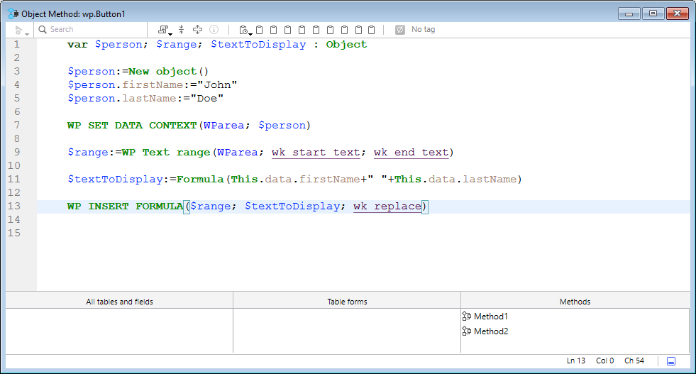
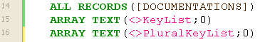
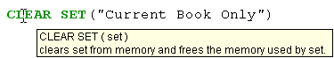
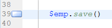

4D tiene un poderoso editor de código integrado que ofrece un amplio conjunto de funcionalidades para la edición de código altamente productivo, como la finalización inteligente de código, la navegación de código, la depuración, la búsqueda y más.



El editor de código funciona como un editor de texto. Escribir un método o una clase suele ser una combinación de escribir texto, seleccionar componentes y arrastrar elementos desde el Explorador u otras ventanas. También se pueden utilizar varias funciones de tecleo predictivo para crear métodos más rápidamente.

Puede desplazarse por el contenido de métodos, clases y funciones, que pueden incluir hasta 32.000 líneas de código o 2 GB de texto.

El Editor de Código 4D ofrece una comprobación básica de errores de sintaxis. Cuando se ejecuta el código se realiza una comprobación adicional de errores. Para más información sobre cómo gestionar los errores, consulte [Depuración](../Debugging/basics.md).

:::note

If you are used to coding with **VS Code**, you can also use this editor with 4D code after installing the [4D-Analyzer](https://github.com/4d/4D-Analyzer-VSCode) extension.

:::

## Interface

### Toolbar (Barra de herramientas)

Cada ventana del Editor de Código tiene una barra de herramientas que ofrece acceso instantáneo a las funciones básicas relacionadas con la ejecución y edición de código.

| Elemento                             | Icono                                                                             | Descripción                                                                                                                                                                                                                                                                                                                                                                                                                                                                                                                                                                                                                                                                                                                                                                                                                                                                                                                                                                                                                                                                                                                                                                                                                                                                             |
| ------------------------------------ | --------------------------------------------------------------------------------- | --------------------------------------------------------------------------------------------------------------------------------------------------------------------------------------------------------------------------------------------------------------------------------------------------------------------------------------------------------------------------------------------------------------------------------------------------------------------------------------------------------------------------------------------------------------------------------------------------------------------------------------------------------------------------------------------------------------------------------------------------------------------------------------------------------------------------------------------------------------------------------------------------------------------------------------------------------------------------------------------------------------------------------------------------------------------------------------------------------------------------------------------------------------------------------------------------------------------------------------------------------------------------------------- |
| **Ejecución del método**             |                     | Cuando se trabaja con métodos, cada ventana del Editor de Código tiene un botón que puede utilizarse para ejecutar el método actual. Utilizando el menú asociado a este botón, puede elegir el tipo de ejecución:<ul><li> **Ejecutar nuevo proceso**: Crea un proceso y ejecuta el método en modo estándar en este proceso.</li><li>**Ejecutar y depurar nuevo proceso**: Crea un nuevo proceso y muestra el método en la ventana Depurador para su ejecución paso a paso en este proceso.</li><li>**Ejecutar en proceso Aplicación**: Ejecuta el método en modo estándar en el contexto del proceso Aplicación (es decir, en la ventana de visualización del registro).</li><li>**Ejecutar y depurar en el proceso Aplicación**: Muestra el método en la ventana del Depurador para su ejecución paso a paso en el contexto del proceso Aplicación (en otras palabras, la ventana de visualización de registros).</li></ul>Para más información sobre la ejecución de métodos, ver [Llamada a métodos proyecto](../Concepts/methods.md#calling-project-methods). |
| **Buscar en el método**              |                                | Muestra el [_Área de búsqueda_](#find-and-replace).                                                                                                                                                                                                                                                                                                                                                                                                                                                                                                                                                                                                                                                                                                                                                                                                                                                                                                                                                                                                                                                                                                                                                                                                                     |
| **Macros**                           |                              | Inserta una macro en la selección. Haga clic en la flecha desplegable para mostrar una lista de macros disponibles. Para obtener más información sobre como crear e instanciar macros, consulte [Macros](#macros).                                                                                                                                                                                                                                                                                                                                                                                                                                                                                                                                                                                                                                                                                                                                                                                                                                                                                                                                                                                                                      |
| **Expandir todo/Contraer todo**      |        | Estos botones permiten expandir o contraer todas las estructuras de flujo de control del código.                                                                                                                                                                                                                                                                                                                                                                                                                                                                                                                                                                                                                                                                                                                                                                                                                                                                                                                                                                                                                                                                                                                                                                        |
| **Información del método**           |        | Muestra el diálogo [Propiedades del método](../Concepts/methods.md#project-method-properties) (sólo métodos proyecto).                                                                                                                                                                                                                                                                                                                                                                                                                                                                                                                                                                                                                                                                                                                                                                                                                                                                                                                                                                                                                                                                                                                               |
| **Últimos valores del portapapeles** |  | Muestra los últimos valores almacenados en el portapapeles.                                                                                                                                                                                                                                                                                                                                                                                                                                                                                                                                                                                                                                                                                                                                                                                                                                                                                                                                                                                                                                                                                                                                                                                                             |
| **Portapapeles**                     |                        | Nueve portapapeles disponibles en el editor de código. Puede [utilizar estos portapapeles](./write-class-method.md#multiple-copy-paste-and-numbering-of-clipboards) haciendo clic directamente sobre ellos o utilizando atajos de teclado. Puede utilizar la opción [Preferencias](Preferences/methods.md#options-1) para ocultarlas.                                                                                                                                                                                                                                                                                                                                                                                                                                                                                                                                                                                                                                                                                                                                                                                                                                                                                                   |
| **Menú desplegable de navegación**   |                        | Le permite navegar dentro de métodos y clases con contenido etiquetado automáticamente o marcadores declarados manualmente. Ver abajo                                                                                                                                                                                                                                                                                                                                                                                                                                                                                                                                                                                                                                                                                                                                                                                                                                                                                                                                                                                                                                                                                                                                   |

### Área de edición

Aquí es donde se escribe y edita el código. El editor aplica automáticamente sangrías al texto del código y colorea los distintos elementos sintácticos para que la estructura del código sea clara.

Puede personalizar la visualización del área de edición. Toda personalización se transmite automáticamente a todas las ventanas del editor de código:

| Option                                          | Descripción                                                                                                                                                                                                                                                                                                        | Definido en...                                                                                                                                                      |
| ----------------------------------------------- | ------------------------------------------------------------------------------------------------------------------------------------------------------------------------------------------------------------------------------------------------------------------------------------------------------------------ | ------------------------------------------------------------------------------------------------------------------------------------------------------------------------------------------------------------------- |
| **fuente** y **tamaño de fuente**               | Define la fuente y el tamaño de los caracteres que se utilizarán en el área de edición                                                                                                                                                                                                                             | **Preferencias** > [**Métodos**](../Preferences/methods.md) o **Método > Ver** > **Fuente más grande** o **Fuente más pequeña**                                                                                     |
| **estilo y color de los elementos de sintaxis** | Asignar un color y/o estilo específico a cada tipo de elemento del lenguaje 4D.  También puede cambiar los distintos colores utilizados en la interfaz del área de edición (resaltado, fondo, etc.).                                            | Haga clic derecho en un elemento lingüístico (variable, palabra clave, etc.) > Submenú **Estilo**. O **Preferencias** > [**Métodos**](../Preferences/methods.md) |
| **espacios**                                    | Puede visualizar los espacios entre palabras mediante puntos (.) en lugar de espacios en blanco. Esta opción se aplica a todos los elementos del código (nombres de comandos, variables, comentarios, etc.). | **Método > Ver > Espacios en blanco**                                                                                                                                                                               |
| **temas**                                       | Puedes seleccionar el tema Dark o Light, o definir uno personalizado                                                                                                                                                                                                                                               | **Preferencias** > [**Métodos**](../Preferences/methods.md)                                                                                                                                                         |
| **ancho de indentaciones de código**            | Define el ancho de las sangrías de código                                                                                                                                                                                                                                                                          | **Preferencias** > [**Métodos**](../Preferences/methods.md)                                                                                                                                                         |

#### Barras de cambio

Las barras de colores muestran al instante dónde se han modificado las líneas de código desde que se abrió el método:



Las barras de modificación cambian de color para indicar si las modificaciones se han guardado o no:

- amarillo: se ha modificado la línea y aún no se ha guardado el método.
- verde: se ha modificado la línea y se ha guardado el método.

### Área listas

El área listas permite visualizar una o varias listas de elementos necesarios para escribir métodos y clases (comandos, constantes, formularios, etc.). Puede elegir el número y el contenido de las listas que aparecen en la ventana.

Por defecto, el editor de código muestra cuatro listas. Puede ocultar o mostrar todas las listas haciendo clic en el icono situado en la parte inferior derecha de la ventana. 

Puede ampliar o reducir el ancho relativo de cada área lista arrastrando una de sus particiones. También es posible ajustar el tamaño del área lista en relación con el del área de edición arrastrando la línea divisoria entre ambas.

- Al hacer doble clic en un elemento de una lista, éste se inserta en el área de edición, en la posición del cursor.
- Para **modificar el contenido** de una lista, haga clic en el área del título de la lista en cuestión: aparecerá un menú emergente que le permitirá elegir el tipo de elemento que desea visualizar.


- Para añadir o eliminar una lista, haga clic en el área del título de una de las listas y elija el comando correspondiente en el menú emergente.
  El comando **Eliminar esta lista** se desactiva al hacer clic en la última lista. Si desea ocultar todas las listas, debe hacer clic en el botón **mostrar u ocultar listas** situado en la parte inferior derecha de la ventana u ocultarlas por defecto en las **Preferencias**.

- Puede ocultar las listas en todas las ventanas de las siguientes maneras:
  - Seleccione la opción **Ver > Listas** en el menú **Método** (una marca de verificación indica si se muestran las listas)
  - Desmarque la opción **Preferencias** > **Métodos** > **Opciones** > **Mostrar listas**. Para que se tengan en cuenta las modificaciones realizadas en la ventana de diálogo de **Preferencias**, primero es necesario cerrar y luego volver a abrir cualquier método, clase o función que esté abierto.

#### Listas de elementos disponibles

Puede mostrar las siguientes listas de elementos en el área de listas de la ventana del Editor de código:

- **Todas las tablas y campos**: nombres de tablas y campos de la base de datos en forma de lista jerárquica. Cuando inserta un nombre de campo en el método haciendo doble clic sobre su nombre, 4D lo inserta respetando la sintaxis y añade el nombre de la tabla o subtabla según el caso.
- **Tabla** (submenú): nombres de los campos de la tabla seleccionada utilizando el submenú.
- **Tabla actual**: nombres de campo de la tabla actual (disponibles en triggers, métodos de formulario y métodos de objeto).
- **Formularios proyecto**: nombres de formularios proyectos de bases de datos. Cuando hace doble clic en el nombre de un formulario de proyecto, 4D lo inserta respetando la sintaxis: el nombre del formulario se inserta entre comillas.
- **Formularios tabla**: nombres de tablas y formularios de la base de datos en forma de lista jerárquica. Cuando inserta un nombre de formulario en un método haciendo doble clic en su nombre, 4D lo inserta respetando la sintaxis: el nombre del formulario se inserta entre comillas y va precedido del nombre de la tabla y de un punto y coma. Por ejemplo: [Table];"Form".
- **Métodos**: nombres de los métodos proyecto de la base de datos.
- **Todas las carpetas**: nombres de carpetas y subcarpetas de objetos definidos en la base de datos mostrados en forma de lista jerárquica. Las carpetas pueden utilizarse para organizar los objetos de forma personalizada. Se gestionan desde la página de inicio del Explorador.
- **Carpetas** (submenú): contenido de la carpeta seleccionada utilizando el submenú.
- **Macros**: nombres de macros definidos para la base de datos (ver [Creación y utilización de macros](#creating-and-using-macros)).
- **Comandos**: vomandos del lenguaje 4D por orden alfabético.
- **Comandos por temas**: comandos del lenguaje 4D clasificados por temas en forma de lista jerárquica.
- **Barras de menú**: nombres y números de las barras de menú [creadas con el editor de barras de menú 4D](../Menus/creating.md).
- **Constantes**: constantes 4D y de los posibles plug-ins, clasificadas por temas en forma de lista jerárquica.
- **Listas**: nombres de las listas.
- **Todos los comandos de los plug-ins**: comandos para todos los plug-ins instalados en la base de datos (si los hay), clasificados por temas en forma de lista jerárquica.
- **Palabras clave SQL**: conjunto de palabras clave reconocidas por el analizador sintáctico de 4D SQL. Esta lista incluye comandos (por ejemplo, SELECT), cláusulas (por ejemplo, WHERE) y funciones (ABS).
- **Funciones SQL**: Funciones SQL 4D.

**Nota:** excepto para el elemento Macros, todas las listas están en orden alfabético.

#### Guardar como plantilla

Puede guardar las listas definidas en la ventana del Editor de código en forma de plantilla. Una vez guardada la plantilla, los parámetros establecidos en ella se utilizarán para cada nueva ventana del Editor de código que se abra.

Los siguientes parámetros se almacenan en la plantilla:

- Tamaño relativo de las áreas de edición y de la lista
- Número de listas
- Ubicación y contenido de cada lista
- Ancho relativo de cada lista

Para guardar una ventana del Editor de código como plantilla, seleccione **Método** > **Guardar como plantilla**. La plantilla se guarda inmediatamente (no aparece ningún diálogo). Se guarda en la página **Preferencias** de la aplicación 4D. Si ya existe una plantilla anterior, se sustituye.

### Área de puntos de ruptura

Esta áreaa, situada a la izquierda del área de edición, le permite visualizar los números de línea e insertar puntos de interrupción directamente junto a instrucciones específicas. Los puntos de interrupción son útiles durante la fase de depuración de su programación. Detienen la ejecución de su código en lugares específicos y muestran el depurador.

Para obtener más información sobre los puntos de interrupción, consulte la sección [Depurador](../Debugging/breakpoints.md#breakpoints).

Puede mostrar u ocultar los números de línea en el área de puntos de interrupción para cada ventana del Editor de código.

- Para activar o desactivar la visualización de los números de línea por defecto, seleccione **Preferencias** > **Métodos** > **Mostrar números de línea**.
- Para modificar esta visualización por separado para cada ventana del Editor de Código, elija **Método** > **Ver** > **Números de línea**.

La visualización de los números de línea facilita la orientación en la ventana. \*\*Método \*\* > **Ir al número de línea...** también le permite aprovechar esta visualización.

Este tipo de búsqueda es útil cuando se utiliza junto con el [compilador](../Project/compiler.md), que señala los errores de ejecución por el número de línea en el que se producen.

### Barra de estado

La barra de estado situada en la parte inferior derecha de la ventana del editor muestra la posición del cursor en todo momento:


- **Ln**: número de línea
- **Col**: número de columna, es decir, el nivel en la jerarquía de las estructuras de programación. El primer nivel es 0. El número de columna es útil para la depuración, ya que esta información puede ser proporcionada por el intérprete en caso de error en el código.
- **Ch**: ubicación del caracter en la línea.
- : ocultar/mostrar listas.

Al situar el cursor en un comando, función o parámetro(s), la barra de estado muestra la sintaxis del comando. Si escribe o selecciona un parámetro, el área muestra el parámetro actual en **negrita**:


### Despliegue de navegación

La lista desplegable de navegación le ayuda a organizar su código y a navegar más fácilmente dentro de sus clases y métodos:


Algunas etiquetas se añaden automáticamente y puede complementar la lista desplegable utilizando los [marcadores ](#manual-tagging).

#### Navegación en el código

Haga clic en un elemento de la lista desplegable para acceder a su primera línea en el código. También puede navegar con las teclas de flecha y presionar **Intro**.

#### Etiquetado automático

Los constructores, las declaraciones de métodos, las funciones y los atributos calculados se etiquetan automáticamente y se añaden a la lista desplegable.

Cuando no hay ninguna etiqueta en la clase/método, la herramienta muestra "Sin etiqueta".

Los siguientes elementos se añaden automáticamente:

| Icono                                                                       | Elemento                                                          |
| --------------------------------------------------------------------------- | ----------------------------------------------------------------- |
|                          | Sin etiqueta                                                      |
|                | Class constructor o declaración de método                         |
|  | Atributo calculado (get, set, orderBy y query) |
|                      | Nombre de la función de clase                                     |

#### Etiquetado manual

Añadiendo marcadores en su código, puede añadir las siguientes etiquetas a la lista desplegable:

| Icono                                                   | Elemento                       |
| ------------------------------------------------------- | ------------------------------ |
|  | MARK: etiqueta |
|  | TODO: etiqueta |
|    | FIXME: tag     |

Se declaran añadiendo comentarios como:

```4d
// FIXME: Corrige los siguientes elementos
```

Las declaraciones no distinguen entre mayúsculas y minúsculas; escribir `fixme:` tiene el mismo efecto.

Añadir un guión después de la etiqueta `MARK:` dibuja una línea de separación en el editor de código y en el menú desplegable. Así que escribiendo esto:


Esto es lo que resulta:


Todos los marcadores situados dentro de las funciones tienen sangría en la lista desplegable, excepto las etiquetas `MARK:` situadas al final de las funciones y no seguidas de instrucciones. Estos aparecerán en el primer nivel.

#### Orden de visualización

Las etiquetas se muestran en su orden de aparición dentro del método/clase.

Para mostrar las etiquetas de un método o de una clase en orden alfabético, realice una de las siguientes acciones:

- **haga clic derecho** en la herramienta desplegable
- mantenga **Cmd** en macOS o **Alt** en Windows, y haga clic en la herramienta de lista desplegable

> Las etiquetas dentro de las funciones se mueven con sus elementos padres.

### Atajos

Múltiples funcionalidades del editor de código de 4D están disponibles a través de atajos de teclado por defecto.

:::info macOS

En macOS, utilice la tecla **Command** en lugar de la tecla **Ctrl** mencionada (Windows).

:::

| **Atajo**                                                                                                                                                                                           | **Acción**                                                                                                                                                                             |
| --------------------------------------------------------------------------------------------------------------------------------------------------------------------------------------------------- | -------------------------------------------------------------------------------------------------------------------------------------------------------------------------------------- |
| **Selección y navegación**                                                                                                                                                                          |                                                                                                                                                                                        |
| Doble clic                                                                                                                                                                                          | Seleccionar un nombre de elemento del lenguaje                                                                                                                                         |
| [Alt]+doble clic                                                                                                                                | Seleccionar un nombre de elemento del lenguaje que contenga espacios (constante, método, etc.)                                                      |
| [Shift]+[flecha derecha]                                                                    | Crear y ampliar la selección, caracter por caracter, hacia la derecha, o Reducir la selección, caracter por caracter, desde la izquierda                                               |
| [Shift]+[flecha izquierda]                                                                  | Reducir la selección, caracter por caracter, desde la derecha o Crear y ampliar la selección, caracter por caracter, hacia la izquierda                                                |
| [Shift]+[flecha abajo]                                                                      | Crear y ampliar una selección, línea por línea, de arriba abajo                                                                                                                        |
| [Shift]+[flecha arriba]                                                                     | Crear y ampliar una selección, línea por línea, desde abajo hacia arriba                                                                                                               |
| [Ctrl]+[Shift]+[flecha derecha]         | Crear y ampliar la selección, palabra por palabra, desde la derecha                                                                                                                    |
| [Ctrl]+[Shift]+[flecha izquierda]       | Reducir la selección, palabra por palabra, desde la derecha, o crear y ampliar la selección, palabra por palabra, desde la izquierda                                                   |
| [Ctrl]+[flecha derecha]                                                                     | Mover el punto de inserción, palabra por palabra, de izquierda a derecha                                                                                                               |
| [Ctrl]+[flecha izquierda]                                                                   | Mover el punto de inserción, palabra por palabra, de derecha a izquierda                                                                                                               |
| [Alt]+[flecha abajo]                                                                        | Mover la(s) línea(s) donde está el cursor hacia abajo                                                                                            |
| [Alt]+[flecha arriba]                                                                       | Mover la(s) línea(s) donde está el cursor a la parte superior                                                                                    |
| [Home]                                                                                                                                          | Colocar el punto de inserción al comienzo de la línea                                                                                                                                  |
| [End]                                                                                                                                           | Coloca el punto de inserción al final de la línea                                                                                                                                      |
| [Ctrl]+[Home]                                                                               | Colocar el punto de inserción al comienzo del método                                                                                                                                   |
| [Ctrl]+[End]                                                                                | Coloca el punto de inserción al final del método                                                                                                                                       |
| [Shift]+[Home]                                                                              | Seleccionar todos los caracteres de la línea situados a la izquierda del cursor                                                                                                        |
| [Shift]+[End]                                                                               | Selecciona todos los caracteres de la línea que están a la derecha del cursor                                                                                                          |
| [PgUp]                                                                                                                                          | Desplazar el contenido del método, página a página, de abajo a arriba (no modifica el punto de inserción)                                                           |
| [PgDn]                                                                                                                                          | Desplazar el contenido del método, página a página, de arriba abajo (no modifica el punto de inserción)                                                             |
| [**Introspección**](#goto-definition)                                                                                                                                                               |                                                                                                                                                                                        |
| [Ctrl]+K o [Alt]+doble clic                                                                 | Igual que el comando [**Goto definition**](#goto-definition)                                                                                                                           |
| [Ctrl] (Windows) o [Alt] (macOS)+pasar sobre un token | Subraye el token (elemento lingüístico identificado). Haz clic en el token subrayado = igual que el comando [**Goto definition**](#goto-definition) |
| [**Buscar y reemplazar**](#buscar y reemplazar)                                                                              |                                                                                                                                                                                        |
| [Ctrl]+F                                                                                                                                        | Buscar                                                                                                                                                                                 |
| [Ctrl]+G                                                                                                                                        | Buscar siguiente                                                                                                                                                                       |
| [Ctrl]+[Shift]+G                                                                            | Buscar anterior                                                                                                                                                                        |
| [Ctrl]+E                                                                                                                                        | Buscar el siguiente                                                                                                                                                                    |
| [Ctrl]+[Shift]+E                                                                            | Buscar el mismo anterior                                                                                                                                                               |
| [Ctrl]+[Alt]+F                                                                              | Reemplazar                                                                                                                                                                             |
| [Ctrl]+[Alt]+G                                                                              | Reemplazar siguiente                                                                                                                                                                   |
| [Ctrl]+[Alt]+[Shift]+G                  | Reemplazar anterior                                                                                                                                                                    |
| [**Portapapeles**](#portapapeles)                                                                                                                                                                   |                                                                                                                                                                                        |
| [Shift]+clic o [Alt]+clic en el icono del portapapeles                                      | Copiar el texto seleccionado en el portapapeles                                                                                                                                        |
| [Ctrl]+[Shift]+tecla numérica                                                               | Copiar el texto seleccionado en el portapapeles numérico                                                                                                                               |
| [Ctrl]+clic en el icono del portapapeles                                                                                                        | Pegar el contenido de un portapapeles en la posición del cursor                                                                                                                        |
| [Ctrl]+tecla numérica                                                                                                                           | Pegar el contenido del portapapeles numérico en la posición del cursor                                                                                                                 |

:::tip

La mayoría de estos atajos pueden personalizarse en la caja de diálogo [Preferencias 4D](../Preferences/shortcuts.md).

:::

## Edición de código

4D utiliza técnicas estándar de edición de texto para digitar y editar en el Editor de código.

El editor de código utiliza convenciones de visualización (estilo, color) para los elementos de sintaxis. Puede [personalizar estas convenciones](#customizing-the-editing-area). A medida que digita, cuando valida su entrada, 4D evalúa el texto de la línea y aplica el formato de visualización adecuado. 4D también indenta cada línea a su nivel adecuado en relación con la línea precedente cuando utiliza estructuras de programación (If, End if...).

Puede utilizar las teclas de flecha para moverse rápidamente de línea a línea. Utilizar las teclas de flecha para desplazarse por varias líneas es más rápido que hacer clic porque el editor tarda en evaluar la línea en busca de errores.

En Windows, el editor de código incluye un editor de código de entrada (IME) para facilitar la edición de código en sistemas japoneses o chinos.

El Editor de código incluye numerosos [atajos de navegación](#shortcuts).

#### Uso de la barra invertida

El carácter barra invertida (`\`) tiene un soporte específico en el lenguaje 4D:

- insertado al final de las líneas, permite escribir una única instrucción en [varias líneas](../Concepts/quick-tour.md#code-on-several-lines).
- permite definir [secuencias de escape](../Concepts/quick-tour.md#escape-sequences).

:::caution

El caracter de barra invertida (`\`) se utiliza como separador en [los nombres de ruta en Windows](../Concepts/paths.md#windows). En general, 4D interpretará correctamente los nombres de ruta de Windows introducidos en el Editor de código sustituyendo la barra invertida simple por una barra invertida doble. Por ejemplo, `C:\MyDocuments` se convertirá en `C:\\MyDocuments`. Sin embargo, si escribe `"C:\MyDocuments\New"`, 4D mostrará `"C:\\MyDocuments\New"`. En este caso, la segunda barra invertida se interpreta incorrectamente como `\N` (una [secuencia de escape](../Concepts/quick-tour.md#escape-sequences) existente). Por lo tanto, debe introducir una barra invertida doble cuando quiera insertar una barra invertida antes de un caracter que se utiliza en una de las secuencias de escape reconocidas por 4D.

:::

### Arrastrar y soltar

Desde el Explorador, puede arrastrar y soltar tablas, campos, formularios, métodos proyecto, constantes o comandos 4D. Cuando arrastra y suelta un elemento, 4D siempre utiliza la sintaxis correcta. Por ejemplo, si arrastra el nombre del campo First Name `[People]`, aparecerá en el Editor de código como `[People]First Name`. Del mismo modo, si arrastra el nombre del formulario Entrada desde la tabla People, aparecerá en el Editor de Código como `[People];"Input"`.

Cuando inserta un comando arrastrándolo desde la página **Comandos** del Explorador, aparece con su sintaxis (que consiste en todos sus parámetros) en el Editor de Código. Esta funcionalidad simplemente le recuerda los parámetros que espera el comando. A continuación, puede utilizar una sintaxis que se adapte mejor a su uso.

También puede arrastrar y soltar dentro de un método, clase, función o entre dos diferentes. En el Editor de código, el mecanismo de arrastrar y soltar se activa en cuanto se selecciona una parte del texto.
Por defecto, el mecanismo de arrastrar y soltar **mueve** el texto seleccionado. Para **copiarlo**, mantenga presionada la tecla **Ctrl** (Windows) o la tecla **Opción** (macOS) durante la operación.

### Alternancia entre mayúsculas y minúsculas

Puede modificar automáticamente las mayúsculas y minúsculas de los caracteres seleccionados utilizando los comandos en **Métodos** > **Mayúsculas y minúsculas** o el menú contextual del editor:

- **Mayúsculas** / **Minúsculas**: cambia los caracteres seleccionados a mayúsculas o minúsculas.
- **cameyúsculas** / **cameyúsculas**: cambia los caracteres seleccionados a "cameyúsculas". Consiste en cambiar cada primera letra de un grupo de palabras adjuntas a mayúsculas. Este tipo de notación se utiliza a menudo para las nomenclaturas variables. hireDate y PurchaseDate son ejemplos de dos variantes de la notación cameyúsculas.

Cuando aplica uno de estos comandos a una selección de texto, se eliminan los espacios y los caracteres "_" y la primera letra de cada palabra pasa a ser mayúscula.

### Intercambiar expresión

La función **cameyúsculas** puede utilizarse para invertir los argumentos de una expresión que asigna un valor. Por ejemplo,

`variable1:=variable2`

se convierte en

`variable2:=variable1`

Esta función es extremadamente útil para invertir un conjunto de asignaciones utilizadas para obtener o definir propiedades, o para corregir errores de entrada. Para utilizar esta función, seleccione la(s) línea(s) que desea modificar y, a continuación, elija **Método** > **Intercambiar expresión** o utilice el menú contextual del área. To use this function, select the line(s) to be modified, then choose <strong x-id="1">Method</strong> > <strong x-id="1">Swap Expression</strong> or use the context menu of the area.

### Portapapeles

Además de la operación estándar de copiar y pegar, 4D ofrece dos funciones adicionales que le permiten trabajar con el contenido de diferentes portapapeles:

- El programa almacena en memoria las 10 últimas acciones de "copiar" o "cortar" realizadas en el Editor de código durante la sesión actual. Cada uno de los diferentes contenidos guardados de esta manera puede ser reutilizado en cualquier momento. Para ello, utilice el comando **Historial del Portapapeles** del menú contextual del Editor de Código o el botón "Últimos valores del Portapapeles" de la barra de herramientas:

  

  Se muestran las primeras palabras de los elementos copiados o cortados. Seleccione un elemento para insertarlo en la ubicación actual del cursor.

- Dispone de nueve portapapeles numerados adicionales que pueden emplearse directamente mediante los botones de la barra de herramientas del Editor de código o [utilizando atajos de teclado](#shortcuts):


### Líneas móviles

Puede mover la línea donde está el cursor directamente sin seleccionarla primero utilizando los comandos **Mover líneas hacia arriba** y **Mover líneas hacia abajo** del menú **Método**. También puede hacerlo utilizando el atajo de teclado **Alt/Opción** + **Flecha arriba** o **Flecha abajo** .

### Funciones de autocompletar

El editor de código ofrece funciones de autocompletado. 4D muestra automáticamente sugerencias basadas en los primeros caracteres tecleados.

En el ejemplo siguiente, al teclear la cadena "poli" aparece un triángulo azul que indica que hay varias sugerencias disponibles:


Cuando los caracteres que ingresa corresponden a una única posibilidad, este valor sugerido aparece en gris (y se inserta si presiona la tecla **Tab**):
 ---> 

> Si marcó la opción **Insertar () y cerrar } ) ] "** en la página **Métodos** de las **Preferencias**, 4D añadirá automáticamente **()** después de un comando 4D, palabra clave o método de proyecto que requiere uno o más argumentos obligatorios (después de aceptar una sugerencia o finalización):
> ! ](. /assets/en/code-editor/insert-and-closing-1.png) -> 

El autocompletado también funciona con estructuras de código (por ejemplo, If..End if, For each...End for each): cuando introduzca la primera parte de la estructura, el Editor de código le sugerirá automáticamente la parte de cierre:


Si hay varias sugerencias disponibles, 4D las muestra en una lista emergente al presionar la tecla **Tab**:


La lista está en orden alfabético. Elija el valor haciendo doble clic en él o desplácese por la lista utilizando las teclas de flecha del teclado y, a continuación, presione **Intro**, **Retorno de carro** o **Tab** para insertar el valor seleccionado.

Por defecto, también puede insertar un valor sugerido presionando uno de los siguientes delimitadores `( ; : = < [ {` teclas después de seleccionar un valor: el valor insertado va seguido del delimitador, listo para la entrada de datos.

  +  **(** key --> 

> Puede desactivar el uso de delimitadores para insertar valores sugeridos en **Preferencias** > **Métodos** > **Opciones**.

Puede presionar la tecla **Esc** para cerrar la lista emergente o puede seguir escribiendo mientras está abierta. Los valores sugeridos en la lista emergente se actualizan a medida que se introducen los caracteres adicionales.

Si los caracteres tecleados corresponden a distintos tipos de objetos, la lista los muestra en su estilo actual. Se pueden mostrar los siguientes tipos de objetos:

- Comandos 4D
- Comandos SQL
- Métodos Usuario
- Nombres de las tablas
- Nombres de los campos
- Constantes
- Variables declaradas en el método
- Nombres de propiedad objeto
- Comandos del Plug-in
- Palabras claves 4D
- Palabras clave SQL
- Macros (mostradas entre < >)

> Por razones prácticas, puede desactivar la visualización automática de la lista de sugerencias para **constantes**, **variables (locales o interprocesos) y atributos de objeto**, **tablas** y/o **prototipos**. Estas opciones se encuentran en **Preferencias** > **Métodos** > **Opciones**

#### Nombres de propiedad objeto

4D muestra automáticamente sugerencias que distinguen mayúsculas y minúsculas de todos los nombres de propiedades de objetos válidos en el código 4D cuando:

- escribe un punto "." después de un objeto o
- utilizar la tecla Tab después de un puntero objeto desreferenciado "->".


> La propiedad `length` se incluye siempre para su uso con colecciones.

Una vez creados, los nombres de las propiedades se almacenan en una lista global interna y están disponibles cada vez que un método/clase/función se abre, se cierra o cambia de foco.


La lista de sugerencias se actualiza dinámicamente mientras se edita el código. Al cambiar de una ventana a otra, los nombres de las propiedades nuevas/editadas se añaden siempre a la lista global. La lista también se actualiza cuando se previsualiza un método, clase o función en el Explorador.

Cuando se reinicia la base de datos, la lista se reinicia.

> Puede desactivar la visualización automática de las propiedades de los objetos en **Preferencias** > **Métodos** > **sugerencias**.

## Buscar y reemplazar

El editor de código dispone de poderosas funcionalidades de **buscar y reemplazar** que se aplican a la ventana actual.

En la barra de herramientas de toda ventana de método se puede mostrar un área de buscar y reemplazar:


Para mostrar esta área, haga clic en el icono **Buscar en método** de la [barra de herramientas](#barra de herramientas) o seleccione una función de búsqueda o sustitución a través de un [**método abreviado**](#métodos abreviados) o un comando del submenú **Edición > Buscar**. Puede cerrar esta área en cualquier momento presionando el botón **x** situado en el extremo derecho de la barra de herramientas.

:::tip

La función **Buscar en diseño** de la barra de herramientas de 4D o del menú **Editar** no es específico del editor de código, pero puede utilizarse para buscar un valor entre todos los métodos y clases.

:::

### Buscar

Seleccione **Buscar > Buscar...** en el menú **Editar** o escriba **Ctrl+F** (Windows)/**Cmd+F** (macOS) para mostrar/activar el área _Buscar_.

La búsqueda definida en esta área se realizará en el código situado en la ventana.

El área de entrada **buscar** permite introducir la cadena a buscar. Esta área es un combo box que almacena las últimas 10 cadenas que se han buscado o reemplazado durante la sesión. Si resalta el texto antes de elegir el comando **Buscar...**, aparecerá en esta área. Entonces puede utilizar este texto o reemplazarlo por otro.

Una vez introducida o seleccionada una cadena, se resaltan todas las ocurrencias encontradas en la ventana abierta y en la parte derecha del área se muestra el número total de aciertos encontrados. También indica la posición actual del cursor entre todos los aciertos.

Presione la tecla **Intror** para seleccionar la ocurrencia más cercana al cursor. También puede hacer clic en los botones **Siguiente / Anterior**  para seleccionar todas las ocurrencias secuencialmente hacia el principio o el final del método actual, comenzando desde la posición inicial del cursor, o utilizar los comandos **Buscar siguiente** y **Buscar anterior** del [menú **Edición**](#shortcuts).

#### Opciones

- **Sensible a mayúsculas y minúsculas** : tenga en cuenta las mayúsculas y minúsculas tal como se ingresaron en el área de búsqueda. Esta opción también tiene en cuenta los caracteres diacríticos. Por ejemplo, una búsqueda de "MyVar" no encontrará "myVar"; una búsqueda de "dej" no encontrará "déjà".
- **Toda la palabra** : limita la búsqueda a las ocurrencias exactas de la palabra buscada. Cuando esta opción está marcada, por ejemplo, una búsqueda de "cliente" no encontrará ni "clientes" ni "micliente" Por defecto, esta opción no está marcada; por lo tanto, una búsqueda de "var" encontrará "Myvar", "variation", etc.

### Reemplazar

Haga clic en el botón de alternancia **v** situado a la izquierda del área _Buscar_ para mostrar/ocultar el área _Reemplazar_. También puede seleccionar **Buscar > Reemplazar...** en el menú **Editar** o escribir **Ctrl+Alt+F** (Windows)/**Cmd+Alt+F** (macOS).

El área de entrada _Reemplazar_ se utiliza para definir la cadena de caracteres que sustituirá a la definida anteriormente.

Haga clic en el botón **Reemplazar** para iniciar la búsqueda con todas las opciones definidas y reemplazar la primera ocurrencia encontrada. 4D inicia la búsqueda a partir del punto de inserción del texto actual y continúa hasta el final del método. Luego es posible continuar encontrando/reemplazando utilizando los comandos **Reemplazar siguiente** y **Reemplazar anterior** del [menú Editar](#shortcuts).

Haga clic en el botón **Reemplazar todo** para reemplazar todas las ocurrencias correspondientes a los criterios de búsqueda directamente en el método abierto.

### Buscar lo mismo

El comando **Buscar el mismo** se utiliza para buscar cadenas de caracteres idénticas a la seleccionada. Este comando sólo está activo si ha seleccionado al menos un caracter en el Editor de código.

La búsqueda realizada es del tipo "Buscar siguiente" en la ventana actual del editor de código.

Los comandos **Find Same Next** y **Find Same Previous** se utilizan para encontrar cadenas de caracteres _estrictamente_ idénticas a las seleccionadas. Por ejemplo, las mayúsculas y minúsculas deben coincidir.

### Marcar todo

El comando **Editar > Marcar todo** se activa cuando ya se ha especificado una búsqueda en la caja de diálogo buscar o reemplazar. Cuando selecciona este comando, 4D pone un marcador en cada línea que contiene un elemento correspondiente al criterio de búsqueda "actual". Esto facilita la localización de todos los resultados de la búsqueda. Para más información sobre marcadores, consulte [Marcadores](#bookmarks).

## Advertencias y errores

Gracias al Verificador en vivo de código 4D, la sintaxis, la consistencia y la estructura del código introducido se comprueban automáticamente para evitar errores de ejecución. Por ejemplo, el Verificador en vivo de código puede detectar que falta un paréntesis derecho o que utilizo un atributo dataclass desconocido.

El Verificador en vivo de código se activa en tres niveles:

- cuando escriba código en el editor de código,
- cuando [verifique la sintaxis](../Project/compiler.md#check-syntax) en el compilador,
- cuando [compile](../Project/compiler.md) el proyecto.

4D comprueba automáticamente la sintaxis del código para ver si es correcta. Si introduce texto o selecciona un componente que no es correcto, 4D muestra un símbolo para indicar la expresión incorrecta.

Se muestran dos tipos de símbolos:

- **[warnings](../Project/compiler.md#warnings)** : los warnings están destinados a llamar su atención sobre declaraciones que podrían llevar a errores de ejecución. No impiden la compilación.
- **errores**: los errores son anomalías que impiden que el código se ejecute correctamente. Deben ser corregidos, de lo contrario el proyecto no se compilará.

Al pasar el ratón por encima del símbolo, un mensaje de ayuda muestra la causa del error:


El Verificador en vivo de código se activa mientras ingresa el código. Cuando una línea de un método, clase o función esté marcada como de sintaxis incorrecta, compruebe y corrija la entrada. Si la línea es correcta, 4D elimina el símbolo de error. Al guardar o cerrar la ventana, se valida todo el método.

Puede formatear la línea actual (sin avanzar a la línea siguiente) presionando la tecla **Intro** del teclado numérico. 4D evalúa la línea, le da formato, marca cualquier error y coloca el punto de inserción al final de la línea.

El Verificador en vivo de código verifica lo siguiente:

- errores de sintaxis básicos (operadores equivocados, errores ortográficos y similares)
- la estructura de las instrucciones (`If`, `End if` y así sucesivamente)
- coincidencia de caracteres en el código, tales como paréntesis o corchetes (ver el consejo más abajo)
- las llamadas de atributos y funciones según su modelo (ORDA) y las definiciones de clase de usuario. Por ejemplo, el Verificador de código en vivo genera un error cuando una llamada a un atributo calculado de base de datos no es compatible con el tipo de atributo calculado declarado.

:::tip

Cuando escribe un caracter de encierro, 4D indica la coincidencia enmarcando los caracteres de inicio/fin con rectángulos grises por defecto:


Puede modificar la forma en que 4D indica los caracteres de cierre coincidentes o desactivar esta función en las [**Preferencias**](../Preferences/methods.md#options-1).

:::

El Verificador en vivo de código no puede detectar algunos errores que solo ocurren durante la ejecución. Los errores de ejecución son detectados por 4D cuando se ejecuta el código. Sin embargo, tenga en cuenta que el compilador  también proporciona una ayuda indispensable para detectar errores.

## Mensajes de ayuda

El Editor de código ofrece diversa información contextual utilizando consejos de ayuda. Aparecen al pasar el ratón sobre un objeto.

:::tip

La [barra de estado](#status-bar) también ofrece información contextual.

:::

- **Errores**: al pasar el ratón sobre el símbolo que indica un error a la izquierda del área de edición, aparece un consejo de ayuda que muestra la causa del error (ver [Errores de sintaxis](#syntax-errors)).

- **Documentación de comandos 4D**: al pasar el ratón sobre un comando o función 4D, un mensaje de ayuda ofrece su sintaxis junto con una breve descripción de su funcionamiento.
  

- **Tipo de variable y descripción**: al pasar el ratón sobre una variable, un mensaje de ayuda muestra su tipo (si se ha definido explícitamente en el método) y el comentario asociado, si existe.
  

- **Métodos o funciones proyecto**: al pasar el ratón sobre un método proyecto o función clase, aparece un mensaje de ayuda:

  - o los comentarios especificados en el Explorador.
  - o las primeras líneas del método o función de clase si incluye comentarios (líneas que empiezan por // o /_..._/ bloque de comentarios). Es práctica habitual insertar la documentación del método, así como sus parámetros, en forma de comentarios al principio del método. Puede obtener esta información directamente en el mensaje de ayuda, sólo asegúrese de eliminar primero todo comentario que se encuentre en el Explorador.
    Comentarios al inicio de un método:
    
    Consejo de ayuda en otro método:
    

- También puede crear un **archivo de documentación dedicado** llamado `<MethodName>.md` en la carpeta `<package>/documentation`. Ver [Visualización de la documentación en el editor de código](../Project/documentation.md#viewing-documentation-in-the-code-editor)

## Comentar / Descomentar

El lenguaje 4D soporta los [comentarios](../Concepts/quick-tour.md#comments), que son líneas de código inactivas. El editor de código no aplica ningún estilo particular dentro de los comentarios. La longitud de los comentarios está limitada al tamaño máximo de 32.000 caracteres por línea.

Existen dos tipos de comentarios: `//comment` (comentario de una línea) y `/*comment*/`(comentarios en línea o bloques de comentarios multilínea).

Se pueden crear comentarios digitando los caracteres `/`. O, el comando **Comentar/Descomentar**, que se encuentra en el menú **Método** así como en el menú contextual del Editor de Código se utiliza para marcar un grupo de líneas de código seleccionadas como comentarios de una sola línea o, por el contrario, para eliminar los caracteres de comentario de una sola línea de una selección. Para utilizar este comando, seleccione el código que desea marcar como comentado y, a continuación, seleccione el comando **Comentar/Descomentar**:

 --> 

Cuando la selección sólo contiene código activo, se aplica el comando **Comentario**. Cuando la selección incluye tanto código activo como líneas comentadas, se añade a estas últimas un par adicional de caracteres de comentario ( // ); de este modo, conservarán su estado inicial de comentadas si la línea se "descomenta" posteriormente Cuando la selección contiene sólo líneas comentadas, se aplica el comando **Descomentar**.

> El comando **Comentar/Descomentar** sólo funciona con líneas completas --- no puede utilizarse para comentar sólo parte de una línea.

## Expandir / Contraer

El código 4D situado dentro de bucles y condiciones puede ahora contraerse o expandirse, para facilitar la lectura de los métodos:

- Código expandido:
  

- Código contraído:
  

Si sitúa el ratón sobre el botón de expansión [...], aparece un mensaje de ayuda que muestra las primeras líneas del código oculto.

Se puede seleccionar, copiar, pegar o eliminar una porción de código contraída. Todas las líneas incluidas en él se copiarán, pegarán o borrarán respectivamente. Cuando se pega una parte del código, se expande automáticamente.

Hay varias formas de expandir y contraer código:

- Haga clic en los iconos de expandir/contraer ([+] y [-] en Windows) o en el botón de abrir [...]
- Utilice los comandos del submenú **Método > Contraer/Expandir**:

  - **Contraer selección** / **Expandir selección**: contrae o expande todas las estructuras de código que se encuentran en la selección de texto.
  - **Contraer nivel actual** / **Expandir nivel actual**: contrae o expande la estructura del código en el nivel en el que se encuentra el cursor. Estos comandos también están disponibles en el **menú contextual** del editor.
  - **Contraer todo** / **Expandir todo**: contrae o expande todos los bucles y condiciones de un método. Estos comandos también están disponibles en la barra de herramientas del editor.

## Bloques

Los bloques pueden definirse por:

- Comillas
- Paréntesis
- Una estructura lógica (If/Else/End if, While/End while, Repeat/Until Case of/End case)
- Paréntesis

### Seleccionar bloque envolvente

La función **Seleccionar bloque envolvente** se utiliza para seleccionar el "bloque envolvente" del código que contiene el punto de inserción.

Si ya se ha seleccionado un bloque de texto, la función selecciona el bloque adyacente del nivel inmediatamente superior, y así sucesivamente, hasta seleccionar todo el método.

Si presiona **Ctrl+Mayús+B** (Windows) o **Comando+Mayús+B** (macOS), podrá invertir esta operación y anular la selección del último bloque delimitador seleccionado.

**Nota:** si el punto de inserción se sitúa en una estructura de tipo `If` o `Else`, el bloque que lo encierra será el que contenga, respectivamente, la sentencia `If` o `Else`.

### Inicio del bloque o fin del bloque

Dos comandos facilitan el desplazamiento dentro de estructuras de código (por ejemplo, `If...Else...End if`):

- **Inicio de bloque**: sitúa el cursor al final de la estructura actual, justo después de la palabra clave inicial.
- **Fin de bloque**: sitúa el cursor al final de la estructura actual, justo después de la palabra clave final.

Estos comandos se encuentran en el menú **Método**, así como en el menú contextual del editor. También puede utilizar los siguientes atajos:

- Windows: **Ctrl + flecha arriba** o **Ctrl** + **flecha abajo**'
- macOS: **Comando** + **flecha arriba** o **Comando** +**flecha abajo**.

## Marcadores

4D le permite asociar marcadores con ciertas líneas en sus métodos. A continuación, puede navegar rápidamente por el código pasando de un marcador a otro utilizando comandos específicos.



Un marcador se desplaza junto con su línea original si se insertan líneas adicionales en el método. Los marcadores se guardan con los métodos.

Los marcadores se gestionan utilizando el submenú **Marcadores** del menú **Método**:

- **Alternar**: asocia un marcador a la línea actual (donde se encuentra el cursor) si no tiene ya uno o elimina el marcador existente si lo tiene. Esta función también está disponible utilizando el comando **Alternar marcador** del menú contextual del editor o utilizando el atajo de teclado **Ctrl+F3** (Windows) o **Comando+F3** (macOS).
- **Eliminar todo**: elimina todos los marcadores de la ventana en primer plano.
- **Ir al siguiente** / **Ir al anterior**: permite navegar entre los marcadores de la ventana. Al seleccionar uno de estos comandos, el cursor se sitúa en el primer caracter de la línea asociada al marcador en cuestión. También puede utilizar los atajos de teclado **F3** (ir a la siguiente) o **Mayús+F3** (ir a la anterior).

:::info

Puede utilizar marcadores como señalizadores de líneas que contengan un elemento [encontrado mediante una búsqueda](#find). En este caso, 4D añade automáticamente los marcadores. Para más información, consulte [Marcar todos](#bookmark-all).

:::

## Revelar en el Explorador

El comando **Revelar en el Explorador...** abre una ventana del Explorador con el elemento de destino seleccionado. Para ello, coloque el cursor dentro del nombre del elemento o selecciónelo y, a continuación, elija **Método** > **Revelar en el Explorador...**.

## Buscar los llamantes

El comando **Buscar los llamantes** del menú **Método** solo está habilitado para métodos proyecto. Busca todos los objetos (otros métodos o menús) que hacen referencia al método proyecto.

**Nota:** el comando **Buscar llamantes...** también está disponible en **Explorador** > **Métodos**

Este comando muestra sus resultados en una nueva ventana.

## Ir a definición

El comando **Ir a definición** abre la definición de un elemento referenciado en el Editor de Código. Para ello, coloque el cursor dentro del nombre del objeto o selecciónelo, y elija **Método** > **Ir a Definición...** o utilice el menú contextual del editor.

:::tip

Esta función también está disponible a través del atajo de teclado **Ctrl+K** (Windows) / **Comando+K** (macOS) o **Alt+doble clic**.

:::

El efecto del comando **Ir a definición...** varía en función del elemento de destino:

- con un método proyecto, muestra el contenido del método en una nueva ventana del Editor de código
- con un nombre clase o una función clase, abre la clase en el Editor de código
- con un comando o función 4D integrado, tiene el mismo efecto que el comando [**Mostrar documentación**](#show-documentation).

## Mostrar la documentación

El comando **Mostrar documentación...** abre la documentación del elemento de destino. Para ello, coloque el cursor dentro del nombre del elemento o selecciónelo y, a continuación, elija **Método** > **Mostrar documentación...** o utilice el menú contextual. El efecto varía en función del elemento objetivo. Por ejemplo:

- Seleccionar un método proyecto o una clase usuario y elegir **Mostrar documentación...** selecciona el método en el Explorador y cambia a la pestaña de documentación
- Al seleccionar un comando, función o nombre de clase 4D y elegir **Mostrar documentación...** se muestra la documentación en línea.
- Si no se selecciona ningún elemento, el comando abre la documentación del método actualmente abierto en el Editor de Código, [si existe](../Project/documentation.md).

:::tip

Para mostrar la documentación de un comando del lenguaje "clásico" 4D, seleccione el nombre del comando o simplemente sitúe el cursor en el nombre y presione **F1**. La documentación del comando se muestra en una nueva ventana de su navegador predeterminado. 4D busca la documentación en función de los ajustes realizados en las Preferencias (ver [Ubicación de la documentación](../Preferences/general.md#documentation-location)).

:::

## Buscar referencias

El comando **Buscar Referencias...** que se encuentra en el menú **Método** o en el menú contextual del Editor de Código encuentra todos los objetos (métodos y formularios) del proyecto en los que el elemento actual del método está referenciado (utilizado

El elemento actual es el seleccionado o aquel en el que se encuentra el cursor. Puede ser un nombre de campo, un nombre de variable, un comando, una cadena, etc. Por ejemplo, la siguiente acción busca todas las ocurrencias de la variable _vlNbCmd_ en la base de datos:


Este comando muestra sus resultados en una nueva ventana.

## Macros

Puede utilizar macrocomandos en sus métodos. El uso de macrocomandos permite ahorrar mucho tiempo durante la entrada de código.

Un macro-comando es una parte de código 4D accesible permanentemente y que puede insertarse en cualquier parte de sus métodos, sea cual sea el tipo de la base abierta. Las macros pueden contener todo tipo de texto, comandos y constantes 4D, así como también etiquetas especiales, que se sustituyen en el momento de la inserción de la macro por valores derivados del contexto del método. Por ejemplo, una macro puede contener la etiqueta `<method_name/>;` en el momento de la inserción de la macro, esta etiqueta será sustituida por el nombre del método proyecto actual.

Las macros se almacenan en uno o varios archivos en formato XML (texto). Pueden colocarse en una lista del editor de código; también pueden llamarse utilizando el menú contextual del editor o utilizando la función de entrada predictiva.

Las macros 4D están escritas en formato XML. Puede utilizar el archivo de macros por defecto de 4D tal como está o modificarlo.

### Ubicación de las macros

4D carga las macros desde una carpeta llamada **Macros v2**. Las macros deben estar en forma de uno o varios archivos XML ubicados en esta carpeta.

La carpeta "Macros v2" puede ser ubicada:

- En la carpeta 4D activa de la máquina. Las macros son compartidas para todas las bases.
  **Nota:** la ubicación de la carpeta 4D activa varía según el sistema operativo utilizado. Para más información, consulta la descripción del comando [Get 4D folder](https://doc.4d.com/4Dv19R4/4D/19-R4/Get-4D-folder.301-5739515.en.html) en el manual _Lenguaje_ 4D.
- Junto al archivo de estructura de la base. Las macros sólo se cargan para esta estructura.
- Para los componentes: en la carpeta **Components** de la base. Las macros sólo se cargan si el componente está instalado.

Estas tres ubicaciones pueden utilizarse simultáneamente: es posible instalar una carpeta "Macros v2" en cada una de ellas. Las macros se cargarán en el siguiente orden: carpeta 4D, archivo de estructura, componente 1... componente X.

### Macros por defecto

4D ofrece un conjunto de macros por defecto que contienen, por ejemplo, palabras clave de flujo de control. Estas macros se incluyen en el archivo por defecto "_Macros.xml_", ubicado en la carpeta "Macros v2" que se crea en la carpeta 4D activa de la máquina durante el arranque inicial de 4D.

Posteriormente, puede modificar este archivo o el contenido de la carpeta como desee (ver el párrafo siguiente). En caso de problemas con esta carpeta, se puede borrar y 4D la volverá a crear en el siguiente inicio.

### Añadir macros personalizadas

Puede añadir macros personalizadas en el archivo "Macros.xml" utilizando un editor de texto estándar o por programación. También puede añadir archivos XML de macros personalizados en esta carpeta.

En modo local, el archivo de macros puede abrirse mientras se utiliza 4D. La lista de macros disponibles se actualiza en cada evento de activación de 4D. Por ejemplo, es posible traer el editor de texto al primer plano, modificar el archivo de macros y, a continuación, volver al método: la nueva macro estará entonces disponible en el Editor de código.

No se muestran macros vacías o erróneas.

#### Comprobación de la sintaxis de las macros personalizadas

Los archivos de macrocomandos de 4D deben ser conformes al estándar XML. Esto significa, más concretamente, que las declaraciones XML `<?xml version="1.0" ...?>` y la declaración de documento `<!DOCTYPE macros SYSTEM "http://www.4d.com/dtd/2007/macros.dtd">` son obligatorias al principio de un archivo de macros para que pueda cargarse. Se soportan los diferentes tipos de codificación XML. No obstante, se recomienda utilizar una codificación compatible con Mac/PC (UTF-8). 4D ofrece un DTD que puede utilizarse para validar los archivos de macros. Este archivo se encuentra en la siguiente ubicación:

- Windows: \Resources\DTD\macros.dtd
- Mac OS: :Contents:Resources:DTD:macros.dtd

Si un archivo de macros no contiene las declaraciones o no puede validarse, no se carga.

#### Síntaxis de macros 4D

Las macros 4D se crean utilizando etiquetas XML personalizadas llamadas "elementos"

Algunas etiquetas indican el inicio y el final de la definición (etiquetas dobles del tipo `<tag> </tag>`), otras se sustituyen por valores de contexto de inserción (`<tag/>`).

De conformidad con las especificaciones XML, algunas etiquetas de elementos pueden incluir atributos. A menos que se indique lo contrario, estos atributos son opcionales y se utiliza un valor por defecto cuando se omiten. La sintaxis de los elementos con atributos es la siguiente:

- Etiquetas dobles: `<tag attribute="value"> </macro>`
- Etiquetas individuales: `<tag attribute="value"/>`

Si el elemento acepta varios atributos, puede agruparlos en la misma línea de comando, separados por un espacio:
`\<tag attribute1="value" attribute2="value" attribute3="value"... >`

Aquí está la lista de etiquetas y su modo de uso:

| **Etiquetas de elementos** | **Description**                                                                                                                                                                                                                                                                                                                                                                                                                                                                                                                                                                                                                                                                                                                                                           |
| -------------------------- | ------------------------------------------------------------------------------------------------------------------------------------------------------------------------------------------------------------------------------------------------------------------------------------------------------------------------------------------------------------------------------------------------------------------------------------------------------------------------------------------------------------------------------------------------------------------------------------------------------------------------------------------------------------------------------------------------------------------------------------------------------------------------- |
| `<macros> </macros>`       | Inicio y fin del archivo macro (etiqueta obligatoria).                                                                                                                                                                                                                                                                                                                                                                                                                                                                                                                                                                                                                                                                                 |
| `<macro> </macro>`         | Inicio y fin de la definición de una macro y sus atributos.                                                                                                                                                                                                                                                                                                                                                                                                                                                                                                                                                                                                                                                                                               |
|                            | _Atributos_:                                                                                                                                                                                                                                                                                                                                                                                                                                                                                                                                                                                                                                                                                                                                              |
|                            | - name: Nombre\*\*de la macro tal y como aparece en los menús y en las listas del Editor de código (atributo obligatorio).                                                                                                                                                                                                                                                                                                                                                                                                                                                                                                                                                                                             |
|                            | - type_ahead_text: Cadena de caracteres\*\* que debe introducirse para llamar a la macro utilizando la función type-ahead (también conocida como autocompletar)\*.                                                                                                                                                                                                                                                                                                                                                                                                                                                                                                           |
|                            | - in_menu: booleano que indica si la macro se puede llamar utilizando el menú contextual\*. Valores = "true" (por defecto) o "false"                                                                                                                                                                                                                                                                                                                                                                                                                                                                                                                                                              |
|                            | - type_ahead: Booleano que indica si la macro puede llamarse utilizando la función de tecleo predictivo (o autocompletar)\*. Valores = "true" (por defecto) o "false"                                                                                                                                                                                                                                                                                                                                                                                                                                                                                                          |
|                            | - method_event: se utiliza para activar la llamada automática de la macro en función de la fase actualde manejo de cada método (creación, cierre, etc.). Valores = "on_load": la macro se dispara al abrir cada método, "on_save": la macro se dispara al guardar cada método (cierre de un método modificado o guardado utilizando el comando Archivo>Guardar, "on_create": la macro se dispara cuando se crea cada método, "on_close": la macro se dispara cuando se cierra cada método. |
|                            | "on_save" y "on_close" pueden utilizarse conjuntamente --- en otras palabras, ambos eventos se generan cuando se cierra un método modificado. Por otro lado, "on_create" y "on_load" nunca se generan de forma consecutiva. Este atributo puede utilizarse, por ejemplo, para preformatear los métodos cuando se crean (comentarios en el área de encabezado) o para registrar información como la fecha y la hora en que se cierran.                                                                                                                                                                              |
|                            | - version: utilizada para activar el nuevo modo de soportar selecciones de texto para la macro (ver más adelante la sección "Acerca de la etiqueta `<method>`"). Para activar este nuevo modo, pase el valor "2". Si omite este atributo o pasa la version="1", se conserva el modo anterior.                                                                                                                                                                                                                                                                                                                                                                                          |
|                            | - in_toolbar: booleano que indica si la macro debe estar presente en el menú del botón Macro de la barra de herramientas. Valores= "true" (por defecto) o "false".                                                                                                                                                                                                                                                                                                                                                                                                                                                                                                                |
| `<selection/>`             | Etiqueta reemplazada por el texto seleccionado cuando la macro se inserta. La selección puede estar vacía.                                                                                                                                                                                                                                                                                                                                                                                                                                                                                                                                                                                                                                |
| `<text> </text>`           | Inicio y fin del código que debe insertarse en el método. Se añadirá un retorno de carro antes y después del código.                                                                                                                                                                                                                                                                                                                                                                                                                                                                                                                                                                                                                      |
| `<method> </method>`       | Inicio y fin del nombre del método proyecto y de su parámetro (opcional). El método se ejecuta cuando se llama a la macro. Puede pasar un parámetro de la forma ("param1;param2;..."). Este parámetro se recibirá en el método utilizando las variables $1, $2, etc. Para más información sobre esta etiqueta, consulte la sección "Acerca de la etiqueta `<method>`".                                                                                                                                                                                                                              |
| `<caret/>`                 | Ubicación del punto de inserción en el código una vez insertada la macro.                                                                                                                                                                                                                                                                                                                                                                                                                                                                                                                                                                                                                                                                                 |
| `<user_4D/>`               | Etiqueta reemplazada por el nombre del usuario 4D actual.                                                                                                                                                                                                                                                                                                                                                                                                                                                                                                                                                                                                                                                                                                 |
| `<user_os/>`               | Etiqueta reemplazada por el nombre de usuario actual del sistema.                                                                                                                                                                                                                                                                                                                                                                                                                                                                                                                                                                                                                                                                                         |
| `<method_name/>`           | Etiqueta reemplazada por el nombre del método actual.                                                                                                                                                                                                                                                                                                                                                                                                                                                                                                                                                                                                                                                                                                     |
| `<method_path/>`           | Etiqueta reemplazada por sintaxis de ruta (como se devuelve por [`METHOD Get path`](https://doc.4d.com/4dv19R/help/command/en/page1164.html) del método actual.                                                                                                                                                                                                                                                                                                                                                                                                                                                                                                                                                                        |
| `<date/>`                  | Etiqueta reemplazada por la fecha actual.                                                                                                                                                                                                                                                                                                                                                                                                                                                                                                                                                                                                                                                                                                                 |
|                            | _Atributo_:                                                                                                                                                                                                                                                                                                                                                                                                                                                                                                                                                                                                                                                                                                                                               |
|                            | - format: formato 4D utilizado para mostrar la fecha. Si no se define ningún formato, se utilizará el formato predeterminado. Valores = número de formato 4D (0 a 8).                                                                                                                                                                                                                                                                                                                                                                                                                                                                                                                  |
| `<time/>`                  | Etiqueta reemplazada por la hora actual.                                                                                                                                                                                                                                                                                                                                                                                                                                                                                                                                                                                                                                                                                                                  |
|                            | _Atributo_:                                                                                                                                                                                                                                                                                                                                                                                                                                                                                                                                                                                                                                                                                                                                               |
|                            | - format: formato 4D utilizado para mostrar la hora. Si no se define ningún formato, se utilizará el formato predeterminado. Valores = número de formato 4D (0 a 6).                                                                                                                                                                                                                                                                                                                                                                                                                                                                                                                   |
| `<clipboard/>`             | Etiqueta reemplazada por el contenido del portapapeles.                                                                                                                                                                                                                                                                                                                                                                                                                                                                                                                                                                                                                                                                                                   |
|                            | _Atributo_:                                                                                                                                                                                                                                                                                                                                                                                                                                                                                                                                                                                                                                                                                                                                               |
|                            | - index: portapapeles a pegar. Valores = número del portapapeles (0 a 9).                                                                                                                                                                                                                                                                                                                                                                                                                                                                                                                                                                                                                              |

- Macros can be called using the context menu of the Code Editor or using the type-ahead function (see the following section).<br s-id="1" />
  \*\* If you want to conform to XML language specifications, you must not use extended characters (accented characters, quotation marks, etc.).

- Si desea ajustarse a las especificaciones del lenguaje XML, no debe utilizar caracteres extendidos (caracteres acentuados, comillas, etc.).

Este es un ejemplo de definición de una macro:

| **Contenido de la macro**                                                            | **Comments**                                                                                                                                                                       |
| ------------------------------------------------------------------------------------ | ---------------------------------------------------------------------------------------------------------------------------------------------------------------------------------- |
| `<?xml version="1.0"...?>`                                                           | Declaración XML                                                                                                                                                                    |
| `<!DOCTYPE macros SYSTEM>`                                                           | Declaración del documento                                                                                                                                                          |
| `<macros>`                                                                           | Inicio del archivo XML de macros                                                                                                                                                   |
| `<macro name="RecordLoop">`                                                          | Inicio de la definición y del nombre de la macro                                                                                                                                   |
| `<text>`                                                                             | Inicio del código de la macro                                                                                                                                                      |
| For($i;1;Records in selection(`<Selection/>`)) | La etiqueta `<Selection/>` será reemplazada por el código seleccionado en el método 4D al momento de la inserción de la macro (por ejemplo, un nombre de tabla) |
| SAVE RECORD(`<Selection/>`)                                       |                                                                                                                                                                                    |
| NEXT RECORD(`<Selection/>`)                                       |                                                                                                                                                                                    |
| End for                                                                              |                                                                                                                                                                                    |
| `</text>`                                                                            | Fin del código macro                                                                                                                                                               |
| `</macro>`                                                                           | Fin de la definición de macro                                                                                                                                                      |
| `</macros>`                                                                          | Fin del archivo XML de macros                                                                                                                                                      |

#### Acerca de la etiqueta `<method>`

La etiqueta `<method>` permite generar y utilizar macrocomandos que ejecutan métodos proyecto 4D. Esto permite a los desarrolladores crear funciones sofisticadas que pueden distribuirse mediante macrocomandos asociados a los componentes. Por ejemplo, la siguiente macro hará que el método _MyMethod_ se ejecute con el nombre del método actual como parámetro:

`<method>MyMethod("<method_name/>")</method>`

El código de un método llamado se ejecuta en un nuevo proceso. Este proceso se cierra una vez se ejecuta el método.

> <strong x-id="1">Note:</strong> The structure process remains frozen until the called method execution is completed. Debe asegurarse de que la ejecución es rápida y de que no hay riesgo de que bloquee la aplicación. Si esto ocurre, utilice el comando **Ctrl+F8** (Windows) o **Comando+F8** (Mac OS) para "matar" el proceso.

### Llamando macros

Por defecto, las macros pueden llamarse mediante el menú contextual o la barra de herramientas del editor de código, de la función de autocompletar o de una lista específica en la parte inferior de la ventana del editor de código.

Tenga en cuenta que para cada macro es posible restringir la posibilidad de llamarla utilizando el menú contextual y/o la función de autocompletar.

#### Menú contextual y barra de herramientas

Por defecto, todas las macros pueden ser llamadas a través del menú contextual del Editor de Código (utilizando el comando jerárquico **Insert macro**) o el botón **Macros** de la barra de herramientas.

El atributo _in_menu_ de la etiqueta `<macro>` se utiliza para definir si la macro aparece o no en este menú.

En el menú contextual, las macros se muestran en el orden del archivo "Macros.xml" y de cualquier archivo XML adicional. Por lo tanto, es posible cambiar el orden modificando estos archivos.

#### Autocompletar

Por defecto, todos los macros son accesibles utilizando la función de autocompletar (también conocida como escritura anticipada) (ver [Escribir un método](./write-class-method.md)). El atributo _type_ahead_ de la etiqueta `<macro>` se puede utilizar para excluir una macro de este tipo de operación.

**Nota:** si la macro contiene la etiqueta `<selection/>`, no aparecerá en la ventana emergente de autocompletar.

#### Lista del editor de código

Puede mostrar sus macros en una lista del Editor de Código (ver [Escribir un método](./write-class-method.md)). Basta con hacer doble clic en el nombre de una macro de la lista para llamarla. No es posible excluir una macro específica de esta lista.

### Notas de compatibilidad

El soporte de macros puede cambiar de una versión de 4D a otra. Con el fin de mantener la compatibilidad entre las diferentes versiones y conservar sus personalizaciones, 4D no elimina ninguna versión anterior. Si desea utilizar las últimas funciones disponibles, debe adaptar su versión en consecuencia.

#### Variables de selección de texto para métodos

Se recomienda gestionar las selecciones de texto utilizando los comandos [GET MACRO PARAMETER](https://doc.4d.com/4dv19/help/command/en/page997.html) y [SET MACRO PARAMETER](https://doc.4d.com/4dv19/help/command/en/page998.html). Estos comandos pueden utilizarse para superar la partición de los espacios de ejecución del proyecto local/componente y permitir así la creación de componentes dedicados a la gestión de macros. Para activar este modo para una macro, debe declarar el atributo Version con el valor 2 en el elemento Macro. En este caso, 4D ya no gestiona las variables predefinidas _textSel,_textReplace, etc. y se utilizan los comandos [GET MACRO PARAMETER](https://doc.4d.com/4Dv19R4/4D/19-R4/GET-MACRO-PARAMETER.301-5739797.es.html) y [SET MACRO PARAMETER](https://doc.4d.com/4Dv19R4/4D/19-R4/SET-MACRO-PARAMETER.301-5739788.es.html). Este atributo debe declararse así:

`<macro name="MyMacro" version="2">`<br/> `--- Text of the macro ---`<br/> `</macro>`

Si no se pasa este atributo, el modo anterior se mantiene.

#### Incompatibilidades relacionadas con el estándar XML

Para que los archivos de macros respeten la norma XML, deben observarse reglas sintácticas estrictas. Esto puede provocar incompatibilidades con el código de las macros creadas con versiones anteriores e impedir la carga de archivos XML. Las siguientes son las principales fuentes de mal funcionamiento:

- Los comentarios del tipo "// mi comentario", permitidos dentro de los elementos `<macro>` en versiones anteriores de 4D, no son compatibles con la sintaxis XML. Las líneas de comentarios deben respetar la forma estándar `"<!-- mi comentario -->"`.
- Los símbolos `<>` utilizados más particularmente para los nombres de objetos interprocesos deben codificarse. Por ejemplo, la variable `<>params` debe escribirse `&lt;>params`.
- La etiqueta de declaración inicial `<macros>` podía omitirse en versiones anteriores de 4D. Ahora es obligatorio; de lo contrario, el archivo no se cargará.
