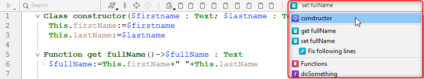
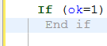

4D tiene un poderoso editor de código integrado que ofrece un amplio conjunto de funcionalidades para la edición de código altamente productivo, como la finalización inteligente de código, la navegación de código, la depuración, la búsqueda y más.


El editor de código funciona como un editor de texto. Escribir un método o una clase suele ser una combinación de escribir texto, seleccionar componentes y arrastrar elementos desde el Explorador u otras ventanas. También se pueden utilizar varias funciones de tecleo predictivo para crear métodos más rápidamente.

Puede desplazarse por el contenido de métodos, clases y funciones, que pueden incluir hasta 32.000 líneas de código o 2 GB de texto.

El Editor de Código 4D ofrece una comprobación básica de errores de sintaxis. Cuando se ejecuta el código se realiza una comprobación adicional de errores. Para más información sobre cómo gestionar los errores, consulte [Depuración](../Debugging/basics.md).

## Interfaz

### Toolbar (Barra de herramientas)

Cada ventana del Editor de Código tiene una barra de herramientas que ofrece acceso instantáneo a las funciones básicas relacionadas con la ejecución y edición de código.

| Elemento                             | Icono                                                                             | Descripción                                                                                                                                                                                                                                                                                                                                                         |
| ------------------------------------ | --------------------------------------------------------------------------------- | ------------------------------------------------------------------------------------------------------------------------------------------------------------------------------------------------------------------------------------------------------------------------------------------------------------------------------------------------------------------- |
| **Ejecución del método**             |                     | Cuando se trabaja con métodos, cada ventana del Editor de Código tiene un botón que puede utilizarse para ejecutar el método actual. Mediante el menú asociado a este botón, se puede elegir el tipo de ejecución:<ul><li> **Ejecutar nuevo proceso**: crea un proceso y ejecuta el método en modo estándar en este proceso.</li><li>**Ejecutar y depurar nuevo proceso**: crea un nuevo proceso y muestra el método en la ventana Depurador para la ejecución paso a paso en este proceso.</li><li>**Ejecutar en el proceso de Aplicación**: ejecuta el método en modo estándar en el contexto del proceso de Aplicación (en otras palabras, la ventana de visualización de registros).</li><li>**Run and debug in Application process**: Displays the method in the Debugger window for step by step execution in the context of the Application process (in other words, the record display window).</li></ul>For more information on method execution, see [Calling Project Methods](../Concepts/methods.md#calling-project-methods). |
| **Buscar en el método**              |                                | Displays the [*Search* area](#find-and-replace).                                                                                                                                                                                                                                                                                                                    |
| **Macros**                           |                              | Inserta una macro en la selección. Haga clic en la flecha desplegable para mostrar una lista de macros disponibles. Para obtener más información sobre como crear e instanciar macros, consulte [Macros](creating-using-macros.md).                                                                                                                                 |
| **Expandir todo/Contraer todo**      |        | These buttons allow expanding or collapsing all the control flow structures of the code.                                                                                                                                                                                                                                                                            |
| **Información del método**           |        | Displays the [Method Properties](../Concepts/methods.md#project-method-properties) dialog box (project methods only).                                                                                                                                                                                                                                               |
| **Últimos valores del portapapeles** |  | Muestra los últimos valores almacenados en el portapapeles.                                                                                                                                                                                                                                                                                                         |
| **Portapapeles**                     |                | Nueve portapapeles disponibles en el editor de código. You can [use these clipboards](./write-class-method.md#multiple-copy-paste-and-numbering-of-clipboards) by clicking on them directly or by using keyboard shortcuts. You can use a [Preferences option](Preferences/methods.md#options-1) to hide them.                                                      |
| **Despliegue de navegación**         |                        | Le permite navegar dentro de métodos y clases con contenido etiquetado automáticamente o marcadores declarados manualmente. Ver abajo                                                                                                                                                                                                                               |


### Área de edición

Aquí es donde se escribe y edita el código. El editor aplica automáticamente sangrías al texto del código y colorea los distintos elementos sintácticos para que la estructura del código sea clara.

Puede personalizar la visualización del área de edición. Toda personalización se transmite automáticamente a todas las ventanas del editor de código:

| Opción                                          | Descripción                                                                                                                                                                                                 | Definido en...                                                                                                                                                   |
| ----------------------------------------------- | ----------------------------------------------------------------------------------------------------------------------------------------------------------------------------------------------------------- | ---------------------------------------------------------------------------------------------------------------------------------------------------------------- |
| **fuente** y **tamaño de la fuente**            | Define la fuente y el tamaño de los caracteres que se utilizarán en el área de edición                                                                                                                      | **Preferencias** > [**Métodos**](../Preferences/methods.md) o **Método > Vista** > **Fuente más grande** o **Fuente más pequeña**                                |
| **estilo y color de los elementos de sintaxis** | Asignar un color y/o estilo específico a cada tipo de elemento del lenguaje 4D.  También puede cambiar los distintos colores utilizados en la interfaz del área de edición (resaltado, fondo, etc.).        | Haga clic derecho en un elemento lingüístico (variable, palabra clave, etc.) > Submenú **Estilo**. O **Preferencias** > [**Métodos**](../Preferences/methods.md) |
| **espacios**                                    | Puede mostrar los espacios entre palabras utilizando puntos (.) en lugar de espacios en blanco. Esta opción se aplica a todos los elementos del código (nombres de comandos, variables, comentarios, etc.). | **Método > Ver > Espacios en blanco**                                                                                                                            |
| **temas**                                       | Puedes seleccionar el tema Dark o Light, o definir uno personalizado                                                                                                                                        | **Preferencias** > [**Métodos**](../Preferences/methods.md)                                                                                                      |
| **ancho de indentaciones de código**            | Define el ancho de las sangrías de código                                                                                                                                                                   | **Preferencias** > [**Métodos**](../Preferences/methods.md)                                                                                                      |

#### Barras de cambio

Las barras de colores muestran al instante dónde se han modificado las líneas de código desde que se abrió el método:


Las barras de modificación cambian de color para indicar si las modificaciones se han guardado o no:

- amarillo: se ha modificado la línea y aún no se ha guardado el método.
- verde: se ha modificado la línea y se ha guardado el método.


### Área listas

El área listas permite visualizar una o varias listas de elementos necesarios para escribir métodos y clases (comandos, constantes, formularios, etc.). Puede elegir el número y el contenido de las listas que aparecen en la ventana.

Por defecto, el editor de código muestra cuatro listas. Puede ocultar o mostrar todas las listas haciendo clic en el icono situado en la parte inferior derecha de la ventana. 

Puede ampliar o reducir el ancho relativo de cada área lista arrastrando una de sus particiones. También es posible ajustar el tamaño del área lista en relación con el del área de edición arrastrando la línea divisoria entre ambas.

- Al hacer doble clic en un elemento de una lista, éste se inserta en el área de edición, en la posición del cursor.
- Para **modificar el contenido** de una lista, haga clic en el área del título de la lista en cuestión: aparecerá un menú emergente que le permitirá elegir el tipo de elemento que desea visualizar.


- Para añadir o eliminar una lista, haga clic en el área del título de una de las listas y elija el comando correspondiente en el menú emergente. El comando **Eliminar esta lista** se desactiva al hacer clic en la última lista. Si desea ocultar todas las listas, debe hacer clic en el botón **mostrar u ocultar listas** situado en la parte inferior derecha de la ventana u ocultarlas por defecto en las **Preferencias**.

- Puede ocultar las listas en todas las ventanas de las siguientes maneras:
  - Seleccione la opción **Ver > Listas** en el menú **Método** (una marca de verificación indica si se muestran las listas)
  - For practical reasons, you can disable the automatic display of the list of suggestions for **constants**, **(local or interprocess) variables and object attributes** and/or **tables**. These options are found in **Preferences** > **Methods** > **Options**

#### Listas de elementos disponibles

Puede mostrar las siguientes listas de elementos en el área de listas de la ventana del Editor de código:

- **Todas las tablas y campos**: nombres de tablas y campos de la base de datos en forma de lista jerárquica. Cuando inserta un nombre de campo en el método haciendo doble clic sobre su nombre, 4D lo inserta respetando la sintaxis y añade el nombre de la tabla o subtabla según el caso.
- **Tabla** (submenú): nombres de los campos de la tabla seleccionada utilizando el submenú.
- **Tabla actual**: nombres de campo de la tabla actual (disponibles en triggers, métodos de formulario y métodos de objeto).
- **Formularios proyecto**: nombres de formularios proyectos de bases de datos. Cuando hace doble clic en el nombre de un formulario de proyecto, 4D lo inserta respetando la sintaxis: el nombre del formulario se inserta entre comillas.
- **Formularios tabla**: nombres de tablas y formularios de la base de datos en forma de lista jerárquica. Cuando inserta un nombre de formulario en un método haciendo doble clic en su nombre, 4D lo inserta respetando la sintaxis: el nombre del formulario se inserta entre comillas y va precedido del nombre de la tabla y de un punto y coma. Por ejemplo: [Table];"Form".
- **Métodos**: nombres de los métodos proyecto de la base de datos.
- **Todas las carpetas**: nombres de carpetas y subcarpetas de objetos definidos en la base de datos mostrados en forma de lista jerárquica. Las carpetas pueden utilizarse para organizar los objetos de forma personalizada. Se gestionan desde la página de inicio del Explorador.
- **Carpetas** (submenú): contenido de la carpeta seleccionada utilizando el submenú.
- **Macros**: nombres de macros definidos para la base de datos (ver [Creación y utilización de macros](#creating-and-using-macros)).
- **Comandos**: vomandos del lenguaje 4D por orden alfabético.
- **Comandos por temas**: comandos del lenguaje 4D clasificados por temas en forma de lista jerárquica.
- **Barras de menú**: nombres y números de las barras de menú [creadas con el editor de barras de menú 4D](../Menus/creating.md).
- **Constantes**: constantes 4D y de los posibles plug-ins, clasificadas por temas en forma de lista jerárquica.
- **Listas**: nombres de listas.
- **Todos los comandos de los plug-ins**: comandos para todos los plug-ins instalados en la base de datos (si los hay), clasificados por temas en forma de lista jerárquica.
- **Palabras clave SQL**: conjunto de palabras clave reconocidas por el analizador sintáctico de 4D SQL. Esta lista incluye comandos (por ejemplo, SELECT), cláusulas (por ejemplo, WHERE) y funciones (ABS).
- **Funciones SQL**: Funciones SQL 4D.

**Nota:** excepto para el elemento Macros, todas las listas están en orden alfabético.

#### Guardar como plantilla

Puede guardar las listas definidas en la ventana del Editor de código en forma de plantilla. Una vez guardada la plantilla, los parámetros establecidos en ella se utilizarán para cada nueva ventana del Editor de código que se abra.

Los siguientes parámetros se almacenan en la plantilla:

- Tamaño relativo de las áreas de edición y de la lista
- Número de listas
- Ubicación y contenido de cada lista
- Ancho relativo de cada lista

Para guardar una ventana del Editor de código como plantilla, seleccione **Método** > **Guardar como plantilla**. La plantilla se guarda inmediatamente (no aparece ningún diálogo). Se guarda en la página **Preferencias** de la aplicación 4D. Si ya existe una plantilla anterior, se sustituye.

### Área de puntos de ruptura

Esta áreaa, situada a la izquierda del área de edición, le permite visualizar los números de línea e insertar puntos de interrupción directamente junto a instrucciones específicas. Los puntos de interrupción son útiles durante la fase de depuración de su programación. Detienen la ejecución de su código en lugares específicos y muestran el depurador.

Para obtener más información sobre los puntos de interrupción, consulte la sección [Depurador](../Debugging/breakpoints.md#breakpoints).

Puede mostrar u ocultar los números de línea en el área de puntos de interrupción para cada ventana del Editor de código.

- To enable or disable the display of line numbers by default,  choose **Preferences** > **Methods** > **Show line numbers**.
- To modify this display separately for each window of the Code Editor, choose **Method** > **View** > **Line Numbers**.

Displaying the line numbers makes it easier to find your way around in the window. The **Method** > **Go to Line Number...** command in the also lets you take advantage of this display.

This type of search is useful when used in conjunction with the [compiler](../Project/compiler.md), which flags runtime errors by the line number in which they occur.

### Barra de estado

The status bar located at the bottom right part of the editor window displays the position of the cursor at all times:


- **Ln**: número de línea
- **Col**: Column number, i.e., the level in the hierarchy of programming structures. El primer nivel es 0. The column number is useful for debugging since this information can be provided by the interpreter in the event of an error in the code.
- **Ch**: ubicación del caracter en la línea.
- : Ocultar/mostrar listas.

When you set the cursor in a command, function or parameter(s), the status bar displays the syntax of the command. If you write or select a parameter, the area shows the current parameter in **bold**: 

### Despliegue de navegación

La lista desplegable de navegación le ayuda a organizar su código y a navegar más fácilmente dentro de sus clases y métodos:



Algunas etiquetas se añaden automáticamente y puede complementar la lista desplegable utilizando los [marcadores ](#manual-tagging).

#### Navegación en el código

Haga clic en un elemento de la lista desplegable para acceder a su primera línea en el código. También puede navegar con las teclas de flecha y presionar **Intro**.

#### Etiquetado automático

Los constructores, las declaraciones de métodos, las funciones y los atributos calculados se etiquetan automáticamente y se añaden a la lista desplegable.

Cuando no hay ninguna etiqueta en la clase/método, la herramienta muestra "Sin etiqueta".

Los siguientes elementos se añaden automáticamente:

| Icono                                                                       | Elemento                                       |
| --------------------------------------------------------------------------- | ---------------------------------------------- |
|                          | Sin etiqueta                                   |
|                | Class constructor o declaración de método      |
|  | Atributo calculado (get, set, orderBy y query) |
|                      | Nombre de la función de clase                  |

#### Etiquetado manual

Añadiendo marcadores en su código, puede añadir las siguientes etiquetas a la lista desplegable:

| Icono                                                   | Elemento       |
| ------------------------------------------------------- | -------------- |
|  | MARK: etiqueta |
|  | TODO: etiqueta |
|    | FIXME: tag     |

Se declaran añadiendo comentarios como:

```4d
// FIXME: Corrige los siguientes elementos
```

Las declaraciones no distinguen entre mayúsculas y minúsculas; escribir `fixme:` tiene el mismo efecto.

Añadir un guión después de la etiqueta `MARK:` dibuja una línea de separación en el editor de código y en el menú desplegable. Así que escribiendo esto:


Esto es lo que resulta:


Todos los marcadores situados dentro de las funciones tienen sangría en la lista desplegable, excepto las etiquetas `MARK:` situadas al final de las funciones y no seguidas de instrucciones. Estos aparecerán en el primer nivel.

#### Orden de visualización

Las etiquetas se muestran en su orden de aparición dentro del método/clase.

Para mostrar las etiquetas de un método o de una clase en orden alfabético, realice una de las siguientes acciones:

- **haga clic derecho** en la herramienta desplegable
- mantenga **Cmd** en macOS o **Alt** en Windows, y haga clic en la herramienta de lista desplegable

> Las etiquetas dentro de las funciones se mueven con sus elementos padres.


### Atajos

Multiple features of 4D's Code Editor are available through default keyboard shortcuts.

:::info macOS

Under macOS, use the **Command** key instead of the **Ctrl** key mentioned (Windows).

:::

| **Atajo**                                                 | **Acción**                                                                                                                                    |
| --------------------------------------------------------- | --------------------------------------------------------------------------------------------------------------------------------------------- |
| **Selección y navegación**                                |                                                                                                                                               |
| Doble clic                                                | Seleccionar un nombre de elemento del lenguaje                                                                                                |
| [Alt]+doble clic                                          | Seleccionar un nombre de elemento del lenguaje que contenga espacios (constante, método, etc.)                                                |
| [Shift]+[flecha derecha]                                  | Create and enlarge the selection, character by character, to the right, or Reduce the selection, character by character, from the left        |
| [Shift]+[flecha izquierda]                                | Reduce the selection, character by character, from the right or Create and enlarge the selection, character by character, to the left         |
| [Shift]+[flecha abajo]                                    | Create and enlarge a selection, line by line, from the top to the bottom                                                                      |
| [Shift]+[flecha arriba]                                   | Create and enlarge a selection, line by line, from the bottom to the top                                                                      |
| [Ctrl]+[Shift]+[flecha derecha]                           | Crear y ampliar la selección, palabra por palabra, desde la derecha                                                                           |
| [Ctrl]+[Shift]+[flecha izquierda]                         | Reducir la selección, palabra por palabra, desde la derecha, o crear y ampliar la selección, palabra por palabra, desde la izquierda          |
| [Ctrl]+[flecha derecha]                                   | Mover el punto de inserción, palabra por palabra, de izquierda a derecha                                                                      |
| [Ctrl]+[flecha izquierda]                                 | Mover el punto de inserción, palabra por palabra, de derecha a izquierda                                                                      |
| [Alt]+[flecha abajo]                                      | Mover la(s) línea(s) donde está el cursor hacia abajo                                                                                         |
| [Alt]+[flecha arriba]                                     | Mover la(s) línea(s) donde está el cursor a la parte superior                                                                                 |
| [Home]                                                    | Colocar el punto de inserción al comienzo de la línea                                                                                         |
| [End]                                                     | Coloca el punto de inserción al final de la línea                                                                                             |
| [Ctrl]+[Home]                                             | Colocar el punto de inserción al comienzo del método                                                                                          |
| [Ctrl]+[End]                                              | Coloca el punto de inserción al final del método                                                                                              |
| [Shift]+[Home]                                            | Seleccionar todos los caracteres de la línea situados a la izquierda del cursor                                                               |
| [Shift]+[End]                                             | Selecciona todos los caracteres de la línea que están a la derecha del cursor                                                                 |
| [PgUp]                                                    | Desplazar el contenido del método, página a página, de abajo a arriba (no modifica el punto de inserción)                                     |
| [PgDn]                                                    | Desplazar el contenido del método, página a página, de arriba abajo (no modifica el punto de inserción)                                       |
| [**Introspección**](#goto-definition)                     |                                                                                                                                               |
| [Ctrl]+K o [Alt]+doble clic                               | Same as [**Goto definition**](#goto-definition) command                                                                                       |
| \[Ctrl\] (Windows) o \[Alt\] (macOS)+pasar sobre un token | Subraye el token (elemento lingüístico identificado). Click on the underlined token = same as [**Goto definition**](#goto-definition) command |
| [**Buscar y reemplazar**](#find-and-replace)              |                                                                                                                                               |
| [Ctrl]+F                                                  | Buscar                                                                                                                                        |
| [Ctrl]+G                                                  | Find Next                                                                                                                                     |
| [Ctrl]+[Shift]+G                                          | Find Previous                                                                                                                                 |
| [Ctrl]+E                                                  | Find Same Next                                                                                                                                |
| [Ctrl]+[Shift]+E                                          | Find Same Previous                                                                                                                            |
| [Ctrl]+[Alt]+F                                            | Reemplazar                                                                                                                                    |
| [Ctrl]+[Alt]+G                                            | Replace Next                                                                                                                                  |
| [Ctrl]+[Alt]+[Shift]+G                                    | Replace Previous                                                                                                                              |
| [**Portapapeles**](#clipboards)                           |                                                                                                                                               |
| [Shift]+clic o [Alt]+clic en el icono del portapapeles    | Copiar el texto seleccionado en el portapapeles                                                                                               |
| [Ctrl]+[Shift]+tecla numérica                             | Copy selected text to the number clipboard                                                                                                    |
| [Ctrl]+clic en el icono del portapapeles                  | Pegar el contenido de un portapapeles en la posición del cursor                                                                               |
| [Ctrl]+tecla numérica                                     | Paste contents of the number clipboard at cursor location                                                                                     |

:::tip

Most of these shortcuts can be customized in the [4D Preferences](../Preferences/shortcuts.md) dialog box.

:::


## Editing Code

4D uses standard text editing techniques for typing and editing in the Code Editor.

The Code Editor uses display conventions (style, color) for the syntax elements. You can [customize these conventions](#customizing-the-editing-area). As you type, when you validate your entry, 4D evaluates the text of the line and applies the appropriate display format. 4D also indents each line to its proper level in relation to the preceding line when you use programming structures (If, End if...).

Puede utilizar las teclas de flecha para moverse rápidamente de línea a línea. Using the arrow keys to move across several lines is quicker than clicking because the editor delays evaluating the line for errors.

Under Windows, the code editor includes an Input Code Editor (IME) to facilitate code editing on Japanese or Chinese systems.

The Code Editor includes numerous [navigation shortcuts](#shortcuts).

#### Using the backslash

The backslash character (`\`) has a specific support in the 4D language:

- inserted at the end of lines, it allows to write a single statement on [several lines](../Concepts/quick-tour.md#code-on-several-lines).
- it allows to define [escape sequences](../Concepts/quick-tour.md#escape-sequences).


:::caution

The backslash character (`\`) is used as a separator in [pathnames under Windows](../Concepts/paths.md#windows). In general, 4D will correctly interpret Windows pathnames entered in the Code Editor by replacing the single backslash `\` with a double backslash ``\\`. For instance,``C:\MyDocuments`will become`C:\\MyDocuments`. However, if you write`"C:\MyDocuments\New"`, 4D will display`"C:\\MyDocuments\New"`. In this case, the second backslash is interpreted incorrectly as`\N`(an existing [escape sequence](../Concepts/quick-tour.md#escape-sequences)). You must therefore enter a double backslash`\\` when you want to have a backslash in front of a character used in one of the escape sequences recognized by 4D.

:::


### Arrastrar y soltar

From the Explorer, you can drag and drop tables, fields, forms, project methods, constants, or 4D commands. When you drag and drop an element, 4D always uses the correct syntax. For example, if you drag the field name First Name from the `[People]` table, it appears in the Code Editor as `[People]First Name`. Similarly, if you drag the Form name Input from the People table, it appears in the Code Editor as `[People];"Input"`.

When you insert a command by dragging it from the **Commands** page of the Explorer, it appears with its syntax (which consists of all of its parameters) in the Code Editor. Esta funcionalidad simplemente le recuerda los parámetros que espera el comando. A continuación, puede utilizar una sintaxis que se adapte mejor a su uso.


You can also drag-and-drop within a method, class, function or between two different ones. In the Code Editor, the drag-and-drop mechanism is activated as soon as a portion of text is selected. By default, the drag-and-drop mechanism **moves** the selected text. In order to **copy** it, hold down the **Ctrl** key (Windows) or the **Option** key (macOS) during the operation.


### Changing case

You can automatically modify the case of selected characters using the commands in **Methods** > **Case** or the context menu of the editor:

- **Uppercase** / **Lowercase**: Switch the selected characters to uppercase or lowercase.
- **camelCase** / **CamelCase** : Switch the selected characters to "camel case". This consists in changing each first letter of a group of attached words to uppercase. Este tipo de notación se utiliza a menudo para las nomenclaturas variables. hireDate and PurchaseDate are examples of two variants of camel case notation.

When you apply one of these commands to a text selection, the spaces and "_" characters are removed and the first letter of each word becomes uppercase.

### Swap expression

The **Swap Expression** function can be used to reverse the arguments of an expression assigning a value. Por ejemplo,

`variable1:=variable2`

se convierte en

`variable2:=variable1`

This function is extremely useful for reversing a set of assignments used to get or set properties, or to correct input errors. Within the selection, only the lines assigning a value will be modified. To use this function, select the line(s) to be modified, then choose **Method** > **Swap Expression** or use the context menu of the area.

### Portapapeles

In addition to the standard copy-paste operation, 4D offers two additional functions that let you work with the contents of different clipboards:

- The program stores the last 10 "copy" or "cut" actions that were performed in the Code Editor in memory during the current session. Cada uno de los diferentes contenidos guardados de esta manera puede ser reutilizado en cualquier momento. To do this, use the **Clipboard History** command of the Code Editor context menu or the "Last Clipboard values" button of the toolbar:

    

    Se muestran las primeras palabras de los elementos copiados o cortados. Seleccione un elemento para insertarlo en la ubicación actual del cursor.

- Nine additional numbered clipboards are available and can be employed directly using the buttons of the Code Editor toolbar or [using keyboard shortcuts](#shortcuts):


### Líneas móviles

Puede mover la línea donde está el cursor directamente sin seleccionarla primero utilizando los comandos **Mover líneas hacia arriba** y **Mover líneas hacia abajo** del menú **Método**. You can also do this using the **Alt/Option** + **Up Arrow** or **Down Arrow** [keyboard shorcut](#shortcuts).


### Funciones de autocompletar

El editor de código ofrece funciones de autocompletado. 4D muestra automáticamente sugerencias basadas en los primeros caracteres tecleados.

En el ejemplo siguiente, al teclear la cadena "poli" aparece un triángulo azul que indica que hay varias sugerencias disponibles:


When the characters you enter correspond to a single possibility, this suggested value appears greyed out (and is inserted if you hit the **Tab** key):  ---> 

> If you checked the **Insert () and closing } ) ] "** option in the **Methods** page of the **Preferences**, 4D will also automatically add **()** after a 4D command, keyword or project method that requires one or more mandatory arguments (after accepting a suggestion or completion):  -> 

Autocompletion also works with code structures (e.g. If..End if, For each... End for each): when you enter the first part of the structure, the Code Editor will automatically suggest the closing part:

Si hay varias sugerencias disponibles, 4D las muestra en una lista emergente al presionar la tecla **Tab**:


La lista está en orden alfabético. Elija el valor haciendo doble clic en él o desplácese por la lista utilizando las teclas de flecha del teclado y, a continuación, presione **Intro**, **Retorno de carro** o **Tab** para insertar el valor seleccionado.

Por defecto, también puede insertar un valor sugerido presionando uno de los siguientes delimitadores `( ; : = < [ {` teclas después de seleccionar un valor: el valor insertado va seguido del delimitador, listo para la entrada de datos.

  +  **(** key --> 

> Puede desactivar el uso de delimitadores para insertar valores sugeridos en **Preferencias** > **Métodos** > **Opciones**.

Puede presionar la tecla **Esc** para cerrar la lista emergente o puede seguir escribiendo mientras está abierta. Los valores sugeridos en la lista emergente se actualizan a medida que se introducen los caracteres adicionales.

Si los caracteres tecleados corresponden a distintos tipos de objetos, la lista los muestra en su estilo actual. Se pueden mostrar los siguientes tipos de objetos:

- Comandos 4D
- Comandos SQL
- Métodos Usuario
- Table names
- Field names
- Constantes
- Variable local, proceso o interproceso, declarada en el método
- Nombres de propiedad objeto
- Comandos del Plug-in
- Palabras claves 4D
- Palabras clave SQL
- Macros (mostradas entre < >)

> For practical reasons, you can disable the automatic display of the list of suggestions for **constants**, **(local or interprocess) variables and object attributes** and/or **tables**. These options are found in **Preferences** > **Methods** > **Options**

#### Nombres de propiedad objeto

4D automatically displays case-sensitive suggestions of all valid object property names in 4D code when you:

- escribe un punto "." después de un objeto o
- utilizar la tecla Tab después de un puntero objeto desreferenciado "->".


> The `length` property is always included for use with collections.

Once created, property names are stored in an internal global list and are available anytime a method/class/function is opened, closed or changes focus.


La lista de sugerencias se actualiza dinámicamente mientras se edita el código. When switching between windows, new/edited property names are always added to the global list. The list is also updated when you preview a method, class or function in the Explorer.

Cuando se reinicia la base de datos, la lista se reinicia.

> You can disable the automatic display of object properties in **Preferences** > **Methods** > **suggestions**.


## Buscar y reemplazar


The Code editor has powerful **find and replace** features that apply to the current window.

A search and replace area can be displayed in the toolbar of any method window:


To display this area, click on the **Find in method** icon of the [toolbar](#toolbar) or select a find or replace function either through a [**shortcut**](#shortcuts) or a command from the **Edit > Find** submenu. You can close this area at any moment by clicking on the **x** button at the rightmost side of the toolbar.

:::tip

The **Find in Design** feature in the 4D toolbar or in the **Edit** menu is not specific to the Code editor but may be used to search for a value among all the methods and classes.

:::


### Buscar

Select **Find > Find...** in the **Edit** menu or type **Ctrl+F** (Windows)/**Cmd+F** (macOS) to display/enable the *Search* area.

The search defined in this area will be performed in the code located in the window.

The **find** entry area enables you to enter the string to be searched for. This area is a combo box that stores the last 10 strings that have been searched for or replaced during the session. Si resalta el texto antes de elegir el comando **Buscar...**, aparecerá en esta área. Entonces puede utilizar este texto o reemplazarlo por otro.

Once a string is entered or selected, all occurrences found in the opened window are highlighted and the right side of the area displays the total number of hits found. It also indicates the current position of the cursor among all hits.

Hit the **Enter** key to select closest occurrence to the cursor. You can also click on the **Next / Previous** buttons  to select all occurrences sequentially towards the beginning or end of the current method, starting from the initial location of the cursor, or use the **Find Next** and **Find Previous** commands of the [**Edit** menu](#shortcuts).


#### Opciones

- **Case Sensitive** : Take the case of characters as they were entered in the find area into account. Por ejemplo, una búsqueda de "MiVar" no encontrará "miVar"
- **Whole Word** : Limit the search to exact occurrences of the word being searched for. Cuando esta opción está marcada, por ejemplo, una búsqueda de "cliente" no encontrará ni "clientes" ni "micliente" By default, this option is not checked; therefore, a search for "var" will find "Myvar," "variation," etc.


### Reemplazar

Click on the **v** toggle button on the left side of the *Search* area to display/hide the *Replace* area. You can also select **Find > Replace...** in the **Edit** menu or type **Ctrl+Alt+F** (Windows)/**Cmd+Alt+F** (macOS) .

The *Replace* entry area is used to define the character string that will replace the one defined above.

Click the **Replace** button to launch the search with all defined options and replace the first occurrence found. 4D begins searching from the current text insertion point and continues to the end of the method. It is then possible to continue finding/replacing using the **Replace Next** and **Replace Previous** commands of the [**Edit** menu](#shortcuts).

Click the **Replace all** button to replace all the occurrences corresponding to the search criteria directly in the open method.


### Buscar lo mismo

El comando **Buscar el mismo** se utiliza para buscar cadenas de caracteres idénticas a la seleccionada. Este comando sólo está activo si ha seleccionado al menos un caracter en el Editor de código.

La búsqueda realizada es del tipo "Buscar siguiente" en la ventana actual del editor de código.

The **Find Same Next** and **Find Same Previous** commands are used to find character strings *strictly* identical to the ones selected. For example, the case must match.


### Bookmark All

The **Edit > Bookmark All** command is enabled when a search has already been specified in the find or replace dialog box. When you select this command, 4D puts a bookmark at each line that contains an item corresponding to the "current" search criteria. Esto facilita la localización de todos los resultados de la búsqueda. For more information about bookmarks, refer to [Bookmarks](#bookmarks).


## Syntax errors

4D comprueba automáticamente la sintaxis del método para ver si es correcta. If you enter text or select a component that is not syntactically correct, 4D displays a symbol to indicate the incorrect expression . When you move the mouse over the symbol, a help tip displays the cause of the error:


When entering code, you can immediately check the syntax of the current line (without advancing to the next line) by pressing the **Enter** key on the numeric keypad. 4D evaluates the line, formats it, marks any errors, and places the insertion point at the end of the line. Cuando una línea de un método, clase o función esté marcada como de sintaxis incorrecta, compruebe y corrija la entrada. Si la línea es correcta, 4D elimina el símbolo de error. Al guardar o cerrar la ventana, se valida todo el método. También puede forzar la validación presionando la tecla **Intro**.

When the method, class or function is validated, 4D checks for:

- errores de sintaxis básicos
- the structure of statements (`If`, `End if` and so on)
- matching enclosing characters in the code such as parentheses or quotation marks. When you type an enclosing character, 4D indicates the match by framing the start/end characters with gray rectangles:


> If you click on an enclosing character in the code, 4D indicates its match with gray rectangles by default. You can modify the way 4D indicates matching enclosing characters or disable this feature in **Preferences** > **Methods** > **Options** > **Matching parentheses**.

The Code Editor can only check for obvious syntax errors (misspellings and the like). No verifica errores que sólo ocurren durante la ejecución. Los errores de ejecución son detectados por 4D cuando se ejecuta el código.

4D has a built-in debugger (see [Debugging](../Debugging/debugger.md)) for handling and correcting these errors. El compilador también ofrece una ayuda indispensable para detectar errores. Para más información sobre el compilador, consulte el capítulo [Compilación](../Project/compiler.md).

## Help tips

The Code Editor provides various contextual information using help tips. They appear when you mouse over an object.

:::tip

The [status bar](#status-bar) also provides contextual information.

:::

- **Errors**: When you mouse over the symbol indicating an error to the left of the editing area, a help tip displays the cause of the error (see [Syntax errors](#syntax-errors)).

- **4D command documentation**: When you move the mouse over a 4D command or function, a help tip provides its syntax along with a brief description of how it works. 

- **Variable type and description**: When you mouse over a variable, a help tip shows its type (if it has been explicitly defined in the method) and associated comment, if any. 

- **Project methods or functions**: When you mouse over a project method or class function, a help tip displays:

  - o los comentarios especificados en el Explorador.
  - or the first few lines of the method or class function if it includes comments (lines beginning with // or /*...*/ comment block). It is common practice to insert documentation for the method as well as its parameters in the form of comments at the beginning of the method. You can get this information directly in the help tip, just make sure to first remove any comments found in the Explorer. Comments at the beginning of a method:  Help tip in another method: 

- You can also create a **dedicated documentation file** named `<MethodName>.md` in the `<package>/documentation` folder. See [Viewing documentation in the code editor](../Project/documentation.md#viewing-documentation-in-the-code-editor)


## Comment / Uncomment

The 4D language supports [comments](../Concepts/quick-tour.md#comments), which are inactive lines of code. El editor de código no aplica ningún estilo particular dentro de los comentarios. La longitud de los comentarios está limitada al tamaño máximo de 32.000 caracteres por línea. No hay límite en el número de líneas.

Existen dos tipos de comentarios: `//comment` (comentario de una línea) y `/*comment*/`(comentarios en línea o bloques de comentarios multilínea).

Comments can be created by typing `/` characters. Or, the **Comment/Uncomment** command, found in the **Method** menu as well as in the Code Editor context menu is used to mark a group of selected lines of code as single line comments, or, on the contrary, to remove the single line comment characters from a selection. To use this command, select the code to be marked as commented, then select the **Comment/Uncomment** command:

 --> 

When the selection contains only active code, the **Comment** command is applied. When the selection includes both active code and commented lines, an additional pair of comment characters ( // ) is added to the latter; this way, they will retain their initial commented status if the line is subsequently "uncommented." Cuando la selección contiene sólo líneas comentadas, se aplica el comando **Descomentar**.

> The **Comment/Uncomment** command only operates with full lines --- it cannot be used to comment only part of a line.


## Expandir / Contraer

4D code located inside loops and conditions can now be collapsed or expanded, in order to facilitate the reading of methods:

- Expanded code: 

- Collapsed code: 

If you place the mouse over the expand button [...], a help tip appears, displaying the first lines of the hidden code.

Se puede seleccionar, copiar, pegar o eliminar una porción de código contraída. All the lines included therein will be copied, pasted or deleted respectively. When a portion of code is pasted, it is automatically expanded.

Hay varias formas de expandir y contraer código:

- Click on the expand/collapse icons ([+] and [-] under Windows) or on the opening button [...]
- Use the commands of the **Method > Collapse/Expand** submenu:

  - **Collapse Selection** / **Expand Selection**: collapses or expands all the code structures found in the text selection.
  - **Collapse Current Level** / **Expand Current Level**: collapses or expands the code structure at the level where the cursor is located. These commands are also available in the **context menu** of the editor.
  - **Collapse All** / **Expand All**: collapses or expands all the loops and conditions of a method. Estos comandos también están disponibles en la barra de herramientas del editor.


## Blocks

Blocks can be defined by:

- Comillas
- Paréntesis
- A logical structure (If/Else/End if, While/End while, Repeat/Until Case of/End case)
- Paréntesis

### Select Enclosing Block

The **Select Enclosing Block** function is used to select the "enclosing block" of the code containing the insertion point.

If a block of text is already selected, the function selects the enclosing block of the next highest level and so on, until the entire method is selected.

Pressing **Ctrl+Shift+B** (Windows) or **Command+Shift+B** (macOS) enables you to reverse this operation and deselect the last enclosing block selected.

**Note:** If the insertion point is placed in an `If` or `Else` type structure, the enclosing block will be the one containing, respectively, the `If` or `Else` statement.


### Inicio del bloque o fin del bloque

Two commands make it easier to move around within code structures (e.g. `If...Else...End if`):

- **Start Of Block**: places the cursor at the start of the current structure, just before the initial keyword.
- **End Of Block**: places the cursor at the end of the current structure, just after the final keyword.

Estos comandos se encuentran en el menú **Método**, así como en el menú contextual del editor. También puede utilizar los siguientes atajos:

- Windows: **Ctrl + up arrow** or **Ctrl** + **down arrow**‚
- macOS: **Comando** + **flecha arriba** o **Comando** +**flecha abajo**.

## Bookmarks

4D le permite asociar marcadores con ciertas líneas en sus métodos. You can then browse quickly within the code by passing from one bookmark to another using specific commands.


A bookmark moves along with its original row if additional rows are inserted in the method. Los marcadores se guardan con los métodos.

Bookmarks are managed using the **Bookmarks** submenu of the **Method** menu:

- **Toggle**: Associates a bookmark with the current line (where the cursor is located) if it does not already have one or removes the existing bookmark if it does. This function is also available using the **Toggle Bookmark** command of the editor's context menu or using the **Ctrl+F3** (Windows) or **Command+F3** (macOS) keyboard shortcut.
- **Remove All**: Removes all bookmarks from the foreground window.
- **Goto Next** / **Goto Previous**: Enables browsing among bookmarks in the window. Selecting one of these commands places the cursor on the first character of the line associated with the bookmark concerned. You can also use the keyboard shortcuts **F3** (go to next) or **Shift+F3** (go to previous).

|

You can use bookmarks as markers for lines that contain an [item found by a search](#find). En este caso, 4D añade automáticamente los marcadores. For more information, refer to [Bookmark all](#bookmark-all).

:::

## Revelar en el Explorador

The **Reveal in Explorer...** command opens an Explorer window with the target element selected. Para ello, coloque el cursor dentro del nombre del elemento o selecciónelo y, a continuación, elija **Método** > **Revelar en el Explorador...**.


## Search Callers

The **Search Callers** command in the **Method** menu is only enabled for project methods. Busca todos los objetos (otros métodos o menús) que hacen referencia al método proyecto.

Selecting the **Find...** command displays the following dialog box:

Este comando muestra sus resultados en una nueva ventana.


## Goto Definition

The **Goto Definition** command opens the definition of an element referenced in the Code Editor. To do this, place the cursor inside the object name or select it, and choose **Method** > **Goto Definition...** or use the context menu of the editor.

:::tip

This feature is also available through the keyboard shortcut **Ctrl+K** (Windows) / **Command+K** (macOS) or  **Alt+double-click**.

:::

The effect of the **Goto Definition...** command varies depending on the target element:

- with a project method, it displays the contents of the method in a new window of the Code Editor
- with a class name or class function, it opens the class in the the Code Editor
- with a built-in 4D command or function, it has the same effect as the [**Show documentation**](#show-documentation) command.

## Mostrar la documentación

The **Show documentation...** command opens the documentation for the target element. To do this, place the cursor inside the element's name or select it, then choose **Method** > **Show documentation...** or use the contextual menu. El efecto varía en función del elemento objetivo. Por ejemplo:

- Selecting a project method or a user class and choosing **Show documentation...** selects the method in the Explorer and switches to the documentation tab
- Selecting a 4D command, function, or class name and choosing **Show documentation...** displays the online documentation.
- If no element is selected, the command opens the documentation of the method currently opened in the Code Editor, [if any](../Project/documentation.md).

:::tip

To display the documentation of a 4D "classic" language command, select the command name or simply place the cursor in the name and press **F1**. The documentation of the command is displayed in a new window of your default browser. 4D looks for the documentation depending on the settings made in the Preferences (see [Documentation location](../Preferences/general.md#documentation-location)).

:::


## Search References

The **Search References...** command found in the **Method** menu or the context menu of the Code Editor finds all the objects (methods and forms) in the project where the current item of the method is referenced (used).

The current item is either the one selected or the one where the cursor is located. Puede ser un nombre de campo, un nombre de variable, un comando, una cadena, etc. For example, the following action looks for all the occurrences of the *vlNbCmd* variable in the database:


Este comando muestra sus resultados en una nueva ventana.

