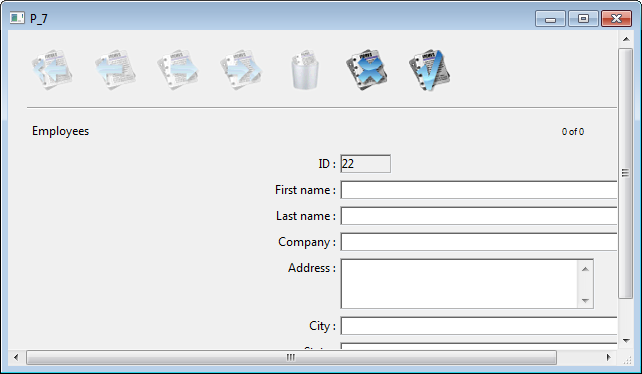
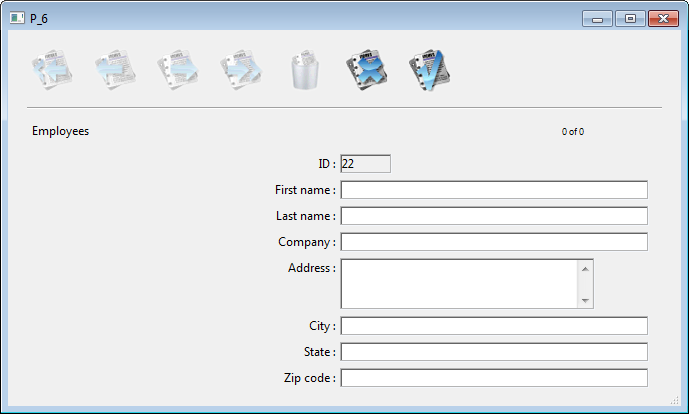

<!--REF #_command_.ADD RECORD.Syntax-->**ADD RECORD** ( {*tabla*}{;}{*} )<!-- END REF-->
<!--REF #_command_.ADD RECORD.Params-->
| Parámetro | Tipo |  | Descripción |
| --- | --- | --- | --- |
| tabla | Table | &#8594;  | Tabla a utilizar para entrada de datos o Tabla por defecto, si se omite |
| * | Operator |  &#8594;  | Ocultar barras de desplazamiento |

<!-- END REF-->

*Este comando no es hilo seguro, no puede ser utilizado en código apropiativo.*


#### Compatibilidad 

<!--REF #_command_.ADD RECORD.Summary-->**Este comando se implementó en las primeras versiones de 4D y sigue siendo útil para la creación de prototipos o desarrollos básicos.<!-- END REF--> Sin embargo, para construir interfaces personalizadas y modernas, ahora se recomienda utilizar formularios genéricos basados en el comando [DIALOG](../commands/dialog.md) que ofrecen funciones avanzadas y un mejor control sobre el flujo de datos.* 

#### Descripción 

El comando **ADD RECORD** permite al usuario añadir un nuevo registro en la tabla *tabla* o en la tabla por defecto, si omite el parámetro *tabla*. 

**ADD RECORD** crea un nuevo registro, hace del nuevo registro el registro actual para el proceso actual y muestra el formulario de entrada actual. En el entorno Menús personalizados, después de que el usuario acepta el nuevo registro, el nuevo registro es el único registro en la selección actual. 

La siguiente imagen presenta un formulario de entrada de datos típico. 



El formulario aparece en la ventana del primer plano del proceso. La ventana tiene barras de desplazamiento y una caja de control del tamaño. Si pasa el parámetro opcional *\** las barras de desplazamiento no aparecen y la ventana del formulario no puede reducirse.



**ADD RECORD** muestra el formulario hasta que el usuario acepta o cancela el registro. Si el usuario está añadiendo varios registros, el comando debe ejecutarse una vez para cada registro. 

El registro se guarda (aceptado) si el usuario hace clic en el botón Aceptar o al presionar la tecla Intro (teclado numérico), o si se ejecuta el comando [ACCEPT](accept.md). 

El registro no se guarda (cancelado) si el usuario hace clic en el botón Cancelar o presiona la tecla de anulación Esc o si se ejecuta el comando [CANCEL](cancel.md). 

**Nota:** este comando no requiere *tabla* para estar en modo lectura/escritura. Puede ser utilizado incluso si la tabla está en modo lectura únicamente (ver *Record Locking*). 

Después de llamar a **ADD RECORD**, OK toma el valor 1 si se acepta el registro y 0 si se cancela.

**Nota:** el registro permanece en memoria, incluso cuando se cancela, y puede guardarse si se ejecuta [SAVE RECORD](save-record.md) antes de que cambie el puntero del registro actual. 

#### Ejemplo 1 

El siguiente ejemplo es un bucle utilizado generalmente para añadir nuevos registros a una base: 

```4d
 FORM SET INPUT([Clientes];"Entrada") // Designar el formulario de entrada de la tabla [Clientes]
 Repeat // Bucle hasta que el usuario cancele
    ADD RECORD([Clientes];*) // Añadir un registro a la tabla [Clientes]
 Until(OK=0) // Hasta que el usuario cancele
```

#### Ejemplo 2 

El siguiente ejemplo busca un cliente en la base. Dependiendo de los resultado de la búsqueda, sucederá una de estas cosas. Si no se encuentra un cliente, entonces se le permite al usuario añadir un nuevo cliente con ADD RECORD. Si se encuentra al menos un cliente, se le presenta al usuario el primer registro encontrado, el cual puede modificarse con [MODIFY RECORD](modify-record.md "MODIFY RECORD"): 

```4d
 READ WRITE([Clientes])
 FORM SET INPUT([Clientes];"Entrada") // Designar el formulario de entrada
 vlCustNum:=Num(Request("Introducir un número de cliente:")) // Obtener el número de cliente
 If(OK=1)
    QUERY([Clientes];[Clientes]CustNo=vlCustNum) // Buscar el cliente
    If(Records in selection([Clientes])=0) // si no se encuentra ningún cliente…
       ADD RECORD([Clientes]) // Añadir un nuevo registro
    Else
       If(Not(Locked([Clientes])))
          MODIFY RECORD([Clientes]) // Modificar el registro
          UNLOAD RECORD([Clientes])
       Else
          ALERT("El registro está siendo utilizado actualmente.")
       End if
    End if
 End if
```

#### Variables y conjuntos del sistema 

La variable sistema OK toma el valor 1 si se acepta el registro y 0 si se cancela. La variable OK no toma ningún valor hasta que el registro haya sido validado o anulado.

#### Ver también 

[ACCEPT](accept.md)  
[CANCEL](cancel.md)  
[CREATE RECORD](create-record.md)  
[MODIFY RECORD](modify-record.md)  
[SAVE RECORD](save-record.md)  