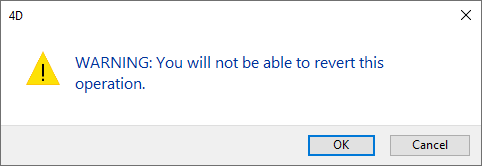
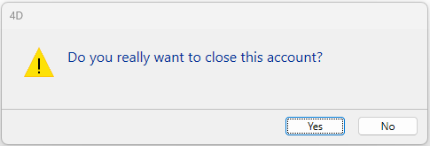
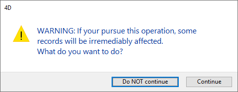

<!--REF #_command_.CONFIRM.Syntax-->**CONFIRM** ( *mensaje* {; *titulobotonOK* {; *titulobotoncancel*}} )<!-- END REF-->
<!--REF #_command_.CONFIRM.Params-->
| Parámetro | Tipo |  | Descripción |
| --- | --- | --- | --- |
| mensaje | Text | &#8594;  | Mensaje a mostrar en la caja de diálogo de confirmación |
| titulobotonOK | Text | &#8594;  | Título del botón Aceptar |
| titulobotoncancel | Text | &#8594;  | Título del botón Cancelar |

<!-- END REF-->

#### Descripción 

<!--REF #_command_.CONFIRM.Summary-->El comando CONFIRM muestra una caja de diálogo de confirmación compuesta de un icono, un mensaje, un botón OK, y un botón Cancelar.<!-- END REF-->

Pase el mensaje a mostrar en el parámetro *mensaje*.

Por defecto, título del botón OK es “Aceptar” y el del botón Cancelar es “Cancelar.” Para cambiar los títulos de estos botones, pase los nuevos títulos en los parámetros opcionales *ok titulobotonOK* y *titulobotoncancel*. Si es necesario, el ancho de los botones se redimensiona hacia la izquierda, de acuerdo al ancho de los títulos personalizados que usted pase.

El botón OK tiene la propiedad [botón por defecto](https://developer.4d.com/docs/FormObjects/propertiesAppearance#default-button). Si el usuario hace clic en el botón OK o presiona Intro para aceptar la caja de diálogo, la variable sistema OK toma el valor 1\. Si el usuario hace clic en el botón Cancel para cancelar la caja de diálogo, la variable sistema OK toma el valor 0.

**Consejo:** no llame al comando CONFIRM desde un método de formulario o de objeto que maneje los eventos de formulario On Activate o On Deactivate; esto provocará un bucle infinito.

#### Ejemplo 1 

La línea:

```4d
 CONFIRM("ATENCIÓN: no podrá deshacer esta operación.")
 If(OK=1)
    ALL RECORDS([Old Stuff])
    DELETE SELECTION([Old Stuff])
 Else
    ALERT("Operación cancelada.")
 End if
```

Mostrará la siguiente caja de diálogo de confirmación (en Windows):



#### Ejemplo 2 

La línea:

```4d
 CONFIRM("¿Realmente quiere cerrar esta cuenta?";"Sí";"No")
```

Mostrará la siguiente caja de diálogo de confirmación (en Windows):



#### Ejemplo 3 

Usted está desarrollando una aplicación 4D para el mercado internacional. Escribió sus cadenas de interfaz junto con sus traducciones al lenguaje objetivo en archvos XLIFF. Al hacer esto, el código:

```4d
 var $title;$yes;$no : Text
 $title:=Localized string("add_Memo")
 $yes:=Localized string("yes")
 $no:=Localized string("no")
 CONFIRM($title;$yes;$no)
```

Mostrará la siguiente caja de diálogo de confirmación:


**Nota:** Para más información sobre la localización de la base de datos xliff, consulte la sección *Apéndice B: Arquitectura XLIFF*. 

#### Ejemplo 4 

La línea:

```4d
 CONFIRM("ADVERTENCIA: Si realiza esta operación, algunos registros serán "+"afectados irremediablemente."+\
 Char(13)+"¿Que quiere hacer?";"NO continuar";"Continuar")
```

Mostrará la siguiente caja de diálogo de confirmación (en Windows):



#### Ver también 

[ALERT](alert.md)  
[Request](request.md)  

#### Propiedades
|  |  |
| --- | --- |
| Número de comando | 162 |
| Hilo seguro | &check; |
| Modifica variables | OK |
| Prohibido en el servidor ||


