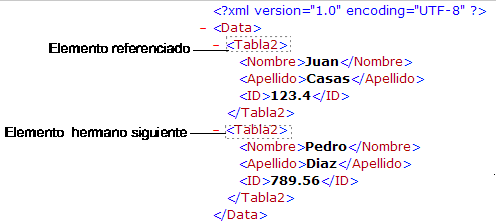
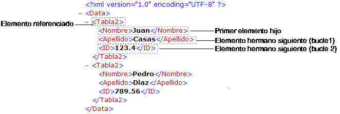

<!--REF #_command_.DOM Get next sibling XML element.Syntax-->**DOM Get next sibling XML element** ( *elementRef* {; *nomElemHermano* {; *valorElemHermano*}} ) -> Resultado<!-- END REF-->
<!--REF #_command_.DOM Get next sibling XML element.Params-->
| Parámetro | Tipo |  | Descripción |
| --- | --- | --- | --- |
| elementRef | Cadena | &#x1F852; | Referencia del elemento XML |
| nomElemHermano | Cadena | &#x1F858; | Nombre del elemento XML hermano |
| valorElemHermano | Cadena | &#x1F858; | Valor del elemento XML hermano |
| Resultado | Cadena | &#x1F850; | Referencia del elemento XML hermano |

<!-- END REF-->

#### Descripción 

<!--REF #_command_.DOM Get next sibling XML element.Summary-->El comando DOM Get next sibling XML element devuelve una referencia al próximo “hermano” del elemento XML pasado como referencia.<!-- END REF--> Esta referencia puede utilizarse con otros comandos de análisis XML. 

  
Los parámetros *nomElemHermano* y *valorElemHermano*, si se pasan, reciben respectivamente el nombre y el valor del elemento “hermano”. 

Este comando se utiliza para navegar entre los “hijos” de un elemento XML. 

Después del último “hermano,” la variable sistema OK toma el valor 0\. 

#### Ejemplo 1 

Recuperación de la referencia del elemento XML hermano seguido por el elemento pasado como parámetro:

```4d
 var $xml_Padre_Ref;$siguiente_XML_Ref : Text
 $siguiente_XML_Ref:=DOM Get next sibling XML element($xml_Padre_Ref)
```



#### Ejemplo 2 

Recuperación en un bucle de las referencias de todos los elementos XML hijos del elemento padre pasado como parámetro, comenzando con el primer hijo:

```4d
 var $xml_Padre_Ref;$primer_XML_Ref;$siguiente_XML_Ref : Text
 
 $primer_XML_Ref:=DOM Get first child XML element($xml_Padre_Ref)
 $siguiente_XML_Ref:=$primer_XML_Ref
 While(OK=1)
    $siguiente_XML_Ref:=DOM Get next sibling XML element($siguiente_XML_Ref)
 End while
```



#### Variables y conjuntos del sistema 

Si el comando se ha ejecutado correctamente y si el elemento analizado no es el último “hermano” del elemento referenciado, la variable sistema OK toma el valor 1\. Si ocurre un error o si el elemento analizado es el último “hermano” del elemento referenciado, toma el valor 0.

#### Ver también 

[DOM Get first child XML element](dom-get-first-child-xml-element.md)  