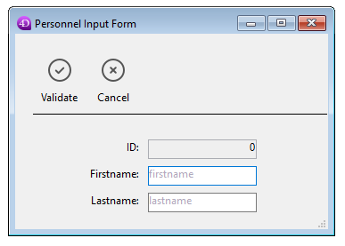

<!--REF #_command_.FORM SET INPUT.Syntax-->**FORM SET INPUT** ( {*tabla* ;} *form* {; *formUsuario* {; *}} )<!-- END REF-->
<!--REF #_command_.FORM SET INPUT.Params-->
| Parámetro | Tipo |  | Descripción |
| --- | --- | --- | --- |
| tabla | Table | &#8594;  | Tabla para la cual definir el formulario de entrada o Tabla por defecto, si se omite |
| form | Text, Object | &#8594;  | Nombre del formulario a definir como formulario de entrada |
| formUsuario | Text | &#8594;  | Nombre del formulario usuario a utilizar |
| * | Operator |  &#8594;  | Tamaño de ventana automático |

<!-- END REF-->

*Este comando no es hilo seguro, no puede ser utilizado en código apropiativo.*


#### Descripción 

<!--REF #_command_.FORM SET INPUT.Summary-->El comando FORM SET INPUT define el formulario de entrada actual de *tabla* para *form* o *formUsuario*.<!-- END REF--> El formulario debe pertenecer a *tabla*.

El alcance de este comando es el proceso actual. Cada tabla tiene su propio formulario de entrada en cada proceso. 

En el parámetro *nomForm*, puede pasar:

* el nombre de un formulario (formulario proyecto o tabla) a utilizar;
* la ruta (en sintaxis POSIX) a un archivo .json válido que contiene una descripción del formulario a usar. Ver *Ruta de archivo del formulario*;
* un objeto que contiene una descripción del formulario a utilizar.

**Nota:** por razones estructurales, este comando no es compatible con formularios de proyectos.   

FORM SET INPUT no muestra el formulario; sólo designa cuál formulario se utiliza para la entrada de datos, importación, u operación por otro comando. Para mayor información sobre la creación de formularios, consulte el *Manual de Diseño* 4D.

El formulario de entrada por defecto para cada tabla se define en la ventana del Explorador. Este formulario de entrada por defecto se utiliza si el comando FORM SET INPUT no se utiliza para especificar un formulario de entrada, o si especifica un formulario que no existe.

Los formularios de entrada también se utilizan automáticamente mediante acciones estándar como ak edit subrecord o ak add subrecord.

El parámetro opcional *formUsuario* le permite especificar un formulario usuario (proveniente de *form*) como formulario de entrada por defecto. Si pasa un nombre de formulario usuario correcto, este formulario será utilizado por defecto en lugar del formulario de entrada en el proceso actual. Esto le permite tener simultáneamente diferentes formularios usuarios personalizados (generados utilizando el comando *\_o\_CREATE USER FORM*) y utilizar aquel que sea conveniente en función del contexto.

Para mayor información sobre formularios de usuario, consulte la sección *Presentación de los formularios de usuario*. 

Los formularios de entrada son mostrados por numerosos comandos, los cuales generalmente se utilizan para permitir al usuario introducir nuevos datos o modificar datos antiguos. Los siguientes comandos muestran un formulario de entrada para entrada de datos o búsquedas:

* [ADD RECORD](add-record.md)
* [DISPLAY RECORD](display-record.md)
* [MODIFY RECORD](modify-record.md)
* [QUERY BY EXAMPLE](query-by-example.md)

Los comandos [DISPLAY SELECTION](display-selection.md) y [MODIFY SELECTION](modify-selection.md) muestran una lista de registros utilizando el formulario de salida. El usuario puede hacer doble clic en un registro en la lista y se muestra el formulario de entrada.

Los comandos de importación [IMPORT TEXT](import-text.md), [IMPORT SYLK](import-sylk.md) e [IMPORT DIF](import-dif.md) utilizan el formulario de entrada actual para importar registros.

El parámetro opcional *\** se utiliza en conjunto con las propiedades del formulario que definió en la ventana de propiedades del formulario del entorno Diseño y el comando [Open window](open-window.md). El especificar el parámetro \* le indica a 4D que utilice las propiedades del formulario para redimensionar automáticamente la ventana para el siguiente uso del formulario (como un formulario de entrada o como una caja de diálogo). Ver mayor información en [Open window](open-window.md).

**Nota:** bien sea que pase el parámetro opcional *\** o no, FORM SET INPUT cambia el formulario de entrada para la tabla.

#### Ejemplo 1 

El siguiente ejemplo muestra un uso típico de FORM SET INPUT: 

```4d
 FORM SET INPUT([Empresas];"Nueva empresa") // Formulario para añadir nuevas empresas
 ADD RECORD([Empresas]) // Añadir una nueva empresa
```

#### Ejemplo 2 

En una base de facturación que administra varias empresas, la creación de una factura debe efectuarse utilizando el formulario usuario correspondiente: 

```4d
 Case of
    :(empresa="4D SAS")
       FORM SET INPUT([Facturas];"Entrada";"4D_SAS")
    :(empresa="4D Inc")
       FORM SET INPUT([Facturas];"Entrada";"4D_Inc")
    :(empresa="Acme")
       FORM SET INPUT([Facturas];"Entrada";"ACME")
 End case
 ADD RECORD([Facturas])
```

#### Ejemplo 3 

Los siguientes ejemplos usan la ruta a un formulario .json para ingresar los registros en una lista de empleados:

```4d
 FORM SET INPUT([Personnel];"/RESOURCES/PersonnelForm.json")
 ADD RECORD([Personnel])
```

que devuelve:



#### Ver también 

[ADD RECORD](add-record.md)  
[DISPLAY RECORD](display-record.md)  
[DISPLAY SELECTION](display-selection.md)  
[FORM SET OUTPUT](form-set-output.md)  
[IMPORT DIF](import-dif.md)  
[IMPORT SYLK](import-sylk.md)  
[IMPORT TEXT](import-text.md)  
[MODIFY RECORD](modify-record.md)  
[MODIFY SELECTION](modify-selection.md)  
[Open window](open-window.md)  
[QUERY BY EXAMPLE](query-by-example.md)  