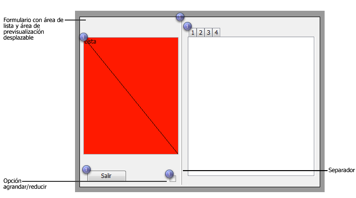
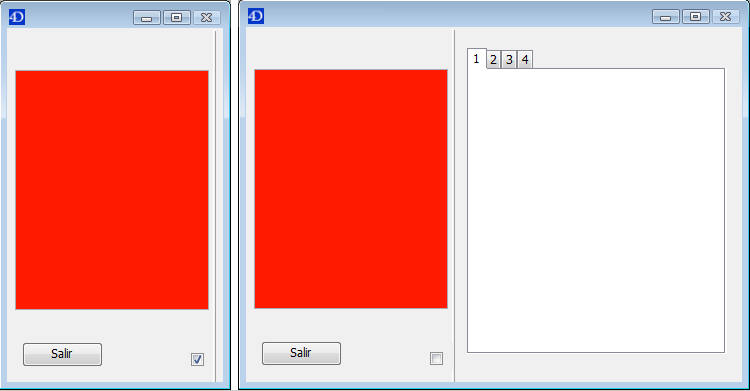

<!--REF #_command_.FORM SET SIZE.Syntax-->**FORM SET SIZE** ( {*objeto* ;} *horizontal* ; *vertical* {; *} )<!-- END REF-->
<!--REF #_command_.FORM SET SIZE.Params-->
| Parámetro | Tipo |  | Descripción |
| --- | --- | --- | --- |
| objeto | Text | &#8594;  | Nombre del objeto que indica los límites del formulario |
| horizontal | Integer | &#8594;  | Si se pasa *: margen horizontal (píxeles) Si se omite *: ancho (píxeles) |
| vertical | Integer | &#8594;  | Si se pasa *: margen vertical (píxeles) Si se omite *: altura (píxeles) |
| * | Operador | &#8594;  | • Si se pasa: añadir las márgenes definidas por los parámetros horizontal y vertical (tamaño automático o basado en un objeto, si se pasa un objeto) • Si se omite: utilizar horizontal y vertical como ancho y altura del formulario |

<!-- END REF-->

*Este comando no es hilo seguro, no puede ser utilizado en código apropiativo.*


#### Descripción 

<!--REF #_command_.FORM SET SIZE.Summary-->El comando FORM SET SIZE le permite cambiar el tamaño del formulario actual por programación.<!-- END REF--> El nuevo tamaño es definido por el proceso actual; no está almacenado con el formulario.

  
Como en el entorno Diseño, puede utilizar este comando para definir el tamaño del formulario de tres maneras:

* Automáticamente, 4D determina el tamaño del formulario basado en la noción de que todos los objetos deben ser visibles y eventualmente añadiendo una margen horizontal y vertical,
* Basado en la ubicación de un objeto del formulario, al cual se añaden eventualmente una margen horizontal y una margen vertical,
* Introduciendo tamaños “fijos” (ancho y altura).

Para mayor información sobre los posibles redimensionamientos de los formularios, consulte el *Manual de Diseño* de 4D.

* **Tamaño automático**
Si quiere que el tamaño del formulario se defina de manera automática, debe utilizar la siguiente sintaxis: 

```4d
 FORM SET SIZE(horizontal;vertical;*)
```

En este caso, debe pasar las márgenes (en píxeles) que quiere añadir a la derecha y en la parte inferior del formulario en *horizontal* and *vertical*. 

* **Tamaño basado en un objeto**
Si quiere que el tamaño del formulario esté basado en un objeto, debe utilizar la siguiente sintaxis: 

```4d
 FORM SET SIZE(objeto;horizontal;vertical)
```

En este caso, debe pasar las márgenes (en píxeles) que quiere añadir a la derecha y en la parte inferior del objeto en *horizontal* y *vertical*. No puede pasar el parámetro *\**.

* **Tamaño fijo**
Si quiere tener un tamaño de formulario fijo, debe utilizar la siguiente sintaxis: 

```4d
 FORM SET SIZE(horizontal;vertical)
```

En este caso, debe pasar el ancho y la altura (en píxeles) del formulario en *horizontal* y *vertical*.

El comando FORM SET SIZE cambia el tamaño del formulario, pero también tiene en cuenta las propiedades de redimensionamiento. Por ejemplo, si el ancho mínimo de un formulario es 500 píxeles y si el comando define un ancho de 400 píxeles, el nuevo ancho del formulario será de 500 píxeles.   
Igualmente note que este comando no cambia el tamaño de la ventana del formulario (puede redimensionar un formulario sin cambiar el tamaño de la ventana y viceversa). Para cambiar el tamaño de la ventana del formulario, consulte el comando [RESIZE FORM WINDOW](resize-form-window.md "RESIZE FORM WINDOW").

#### Ejemplo 

El siguiente ejemplo muestra cómo colocar una ventana de tipo Explorador. El siguiente formulario se crea en el entorno Diseño:

  
El tamaño del formulario es “automático”.

La ventana se visualiza utilizando el siguiente código:

```4d
 $ref:=Open form window([Tabla 1];"Form1";Standard form window;Horizontally centered;Vertically centered;*)
 DIALOG([Tabla 1];"Form1")
 CLOSE WINDOW
```

La parte de la derecha de la ventana puede mostrarse u ocultarse haciendo clic en la opción agrandar/reducir:



El método de objeto asociado con este botón es el siguiente:

```4d
 Case of
    :(FORM Event=On Load)
       var b1;<>contraido : Boolean
       var margen : Integer
       margen:=15
       b1:=<>contraido
       If(<>contraido)
          FORM SET HORIZONTAL RESIZING(False)
          FORM SET SIZE("b1";margen;margen)
       Else
          FORM SET HORIZONTAL RESIZING(True)
          FORM SET SIZE("tab";margen;margen)
       End if
 
    :(FORM Event=On Clicked)
       <>contraido:=b1
       If(b1)
  //contraido
          OBJECT GET COORDINATES(*;"b1";$l;$t;$r;$b)
          GET WINDOW RECT($lf;$tf;$rf;$bf;Current form window)
          SET WINDOW RECT($lf;$tf;$lf+$r+margen;$tf+$b+margen;Current form window)
          FORM SET HORIZONTAL RESIZING(False)
          FORM SET SIZE("b1";margen;margen)
 
       Else
  //expandido
          OBJECT GET COORDINATES(*;"tab";$l;$t;$r;$b)
          GET WINDOW RECT($lf;$tf;$rf;$bf;Current form window)
          SET WINDOW RECT($lf;$tf;$lf+$r+margen;$tf+$b+margen;Current form window)
          FORM SET HORIZONTAL RESIZING(True)
          FORM SET SIZE("tab";margen;margen)
       End if
 
 End case
```

#### Ver también 

[FORM SET HORIZONTAL RESIZING](form-set-horizontal-resizing.md)  
[FORM SET VERTICAL RESIZING](form-set-vertical-resizing.md)  