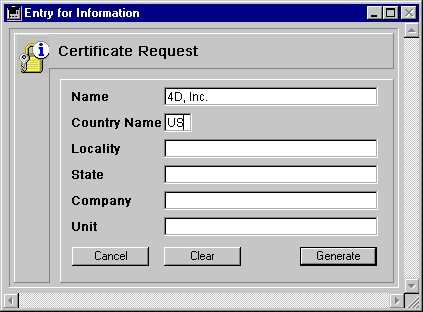

<!--REF #_command_.GENERATE CERTIFICATE REQUEST.Syntax-->**GENERATE CERTIFICATE REQUEST** ( *llavePriv* ; *peticionCertif* ; *arrayCod* ; *arrNombres* )<!-- END REF-->
<!--REF #_command_.GENERATE CERTIFICATE REQUEST.Params-->
| Parámetro | Tipo |  | Descripción |
| --- | --- | --- | --- |
| llavePriv | Blob | &#8594;  | BLOB que contiene la llave privada |
| peticionCertif | Blob | &#8592; | BLOB que recibe la solicitud del certificado |
| arrayCod | Integer array | &#8594;  | La lista de códigos de información |
| arrNombres | Text array | &#8594;  | Lista de nombres |

<!-- END REF-->

#### Descripción 

<!--REF #_command_.GENERATE CERTIFICATE REQUEST.Summary-->El comando GENERATE CERTIFICATE REQUEST genera una solicitud de certificación al formato PKCS el cual puede ser utilizado directamente por las autoridades de certificación tal como Verisign(R).<!-- END REF--> El certificado es una parte importante en el protocolo seguro SSL. El certificado se envía a cada navegador que se conecta en modo SSL y contiene la “tarjeta de identidad” del sitio web (con la información introducida en el comando), así como también su llave pública permitiendo a los navegadores descifrar la información recibida. Además, el certificado contiene diferente información añadida por la autoridad de certificación lo cual garantiza su integridad. 

**Nota:** para mayor información sobre el protocolo SSL utilizado con el servidor web 4D, consulte la sección [WEB SERVICE SET PARAMETER](web-service-set-parameter.md). 

La solicitud de certificación utiliza un par de llaves generadas por el comando [GENERATE ENCRYPTION KEYPAIR](generate-encryption-keypair.md) y contiene diferente información. La autoridad de certificación generará su certificado combinando esta solicitud con otros parámetros.

Pase en *llavePriv* un BLOB que contenga la llave privada genera con el comando [GENERATE ENCRYPTION KEYPAIR](generate-encryption-keypair.md).

Pase en *peticionCertif* un BLOB vacío. Una vez el comando ha sido ejecutado, contiene la solicitud de certificación al formato PKCS codificada en base64\. Puede almacenar esta solicitud en un archivo de texto, por ejemplo utilizando el comando [BLOB TO DOCUMENT](blob-to-document.md), para presentarlo a la autoridad de certificación. 

**Advertencia:** la llave privada se utiliza para generar la solicitud de certificación pero NO debe ser enviada a la autoridad de certificación.

Los arrays *arrayCod* (entero largo) y *arrayNom* (cadena) deben llenarse con los números de código y la información requerida por la autoridad de certificación respectivamente. 

Los códigos y nombres requeridos pueden cambiar de acuerdo a la autoridad de certificación y el uso del certificado. Sin embargo, dentro del uso normal del certificado (conexiones del servidor web vía SSL), los arrays deben contener los siguientes elementos:

| **Información a suministrar** | **arrayCod** | **arrayNom (Ejemplos)** |
| ----------------------------- | ------------ | ----------------------- |
| Nombre del dominio            | 13           | www.4dhispano.com       |
| Código del país (dos letras)  | 14           | ES                      |
| Ciudad                        | 15           | Barcelona               |
| Estado, Departamento,...      | 16           | Cataluña                |
| Nombre de la organización     | 17           | 4D Hispano              |
| Servicio/Persona a cargo del  | 18           | Administrador Web       |
| servidor                      |              |                         |

El orden en el que se introducen los códigos y la información no importa, sin embargo los dos arrays deben estar sincronizados: si el tercer elemento de *codeArray* contiene el valor *15* (ciudad), el tercer elemento de *nameArray* debe contener esta información, en nuestro ejemplo Barcelona.

#### Ejemplo 

Un formulario “Solicitud de certificado” contiene los seis campos necesarios para una solicitud de certificación estándar. El botón **Generar** crea un documento en disco que contiene la solicitud del certificado. El documento “Privatekey.txt” que contiene la llave privada (generada con el comando [GENERATE ENCRYPTION KEYPAIR](generate-encryption-keypair.md "GENERATE ENCRYPTION KEYPAIR")) debe estar en el disco:

  
  
Este es el método del botón **Generar**

```4d
  // Método de objeto bGenerar
 
 var $vbllavePriv;$vbpeticionCertif : Blob
 var $tablaNum : Integer
 ARRAY LONGINT($tLCodigos;6)
 ARRAY STRING(80;$tSInfos;6)
 
 $tableNum:=Table(Current form table)
 For($i;1;6)
    $tSInfos{$i}:=Field($tablaNum;$i)->
    $tLCodigoss{$i}:=$i+12
 End for
 If(Find in array($tSInfos;"")#-1)
    ALERT("Todos los campos deben ser completados.")
 Else
    ALERT("Seleccione su llave privada.")
    $vhDocRef:=Open document("")
    If(OK=1)
       CLOSE DOCUMENT($vhDocRef)
       DOCUMENT TO BLOB(Document;$vbllavePriv)
       GENERATE CERTIFICATE REQUEST($vbllavePriv;$vbcertifRequest;$tLCodigos;$tSInfos)
       BLOB TO DOCUMENT("Request.txt";$vbcertifRequest)
    Else
       ALERT("Llave privada inválida.")
    End if
 End if
```

#### Ver también 

[GENERATE ENCRYPTION KEYPAIR](generate-encryption-keypair.md)  
[HTTP SET CERTIFICATES FOLDER](http-set-certificates-folder.md)  