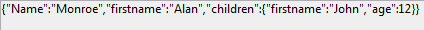
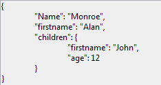

<!--REF #_command_.JSON Stringify.Syntax-->**JSON Stringify** ( *valor* {; *} ) : Text<!-- END REF-->
<!--REF #_command_.JSON Stringify.Params-->
| Parámetro | Tipo |  | Descripción |
| --- | --- | --- | --- |
| valor | Object, any | &#8594;  | Datos a convertir en cadena JSON |
| * | Operador | &#8594;  | Mejorar el formato |
| Resultado | Text | &#8592; | Cadena que contiene el texto JSON serializado |

<!-- END REF-->

#### Descripción 

<!--REF #_command_.JSON Stringify.Summary-->El comando **JSON Stringify** convierte el parámetro *valor* en una cadena JSON.<!-- END REF--> Este comando realiza la acción opuesta del comando [JSON Parse](json-parse.md).  
  
Pase los datos a serializar en *valor*. Se pueden expresar en forma escalar (cadena, número, fecha u hora) o vía un objeto 4D o una colección.

**Nota**: las fechas 4D se convertirán en formato "aaaa-mm-dd" o "AAAA-MM-DDThh:mm:sssZ" según la configuración actual de la fecha de la base (ver la opción "Utilizar el tipo fecha en lugar del formato fecha ISO en los objetos" en *Página Compatibilidad*).

En el caso de un objeto o una colección, puede incluir todo tipo de valores (ver el párrafo *Tipos de datos JSON*), respetando las siguientes reglas de JSON:

* Los valores de tipo cadena deben ir entre comillas. Todos los caracteres Unicode pueden usarse excepto los caracteres especiales que deben ser precedidos por una barra oblicua invertida.
* Números: intervalo ±10.421e±10
* Booleano: cadenas "true " o " false"
* Punteros a un campo, variable o array (el puntero se evalúa al momento del stringify)
* Fecha: tipo texto en formato "aaaa-mm-dd" o "\\"AAAA-MM-DDTHH:mm:ssZ"\\", en función de los parámetros actuales de la base (ver arriba).
* Hora: tipo real (número de segundos por defecto)  
**Notas:**
* Los atributos imagen se convierten a la siguiente cadena: "\[objeto Imagen\]".
* Los punteros a campos, variables o array son evaluados en el momento del stringify.
Puede pasar el parámetro opcional *\** con el fin de incluir caracteres con formato en la cadena resultante. Esta opción mejora la presentación de los datos JSON (pretty formatting).

#### Ejemplo 1 

Conversión de valores escalares:

```4d
 $vc:=JSON Stringify("Eureka!") // "Eureka!"
 $vel:=JSON Stringify(120) // "120"
 $vh:=JSON Stringify(?20:00:00?) // "72000000" segundos desde la media noche
 $vd:=JSON Stringify(!28/08/2013!) // "2013-08-27T22:00:00.000Z" (Paris timezone)
 SET DATABASE PARAMETER(Dates inside objects;String type without time zone)
 $vdd:=JSON Stringify(!28/08/2013!) // "2013-08-28T00:00:00.000Z"
```

#### Ejemplo 2 

Conversión de una cadena que contiene caracteres especiales:

```4d
 $s:=JSON Stringify("{\"name\":\"john\"}")
  // $s="{\\"name\\":\\"john\\"}"
 $p:=JSON Parse($s)
  // $p={"name":"john"}
```

#### Ejemplo 3 

Ejemplos de serialización de un objeto 4D con y sin el parámetro *\**:

```4d
 var $MyContact : Text
 var $MyPContact : Text
 var $Contact;$Children : Object
 OB SET($Contact;"lastname";"Monroe";"firstname";"Alan")
 OB SET($Children;"firstname";"Jim";"age";"12")
 OB SET($Contact;"children";$Children)
 $MyContact:=JSON Stringify($Contact)
 $MyPContact:=JSON Stringify($Contact;*)
  //$MyContact= {"lastname":"Monroe","firstname":"Alan","children":{"firstname":"John","age":"12"}}
  //$MyPContact= {\n\t"lastname": "Monroe",\n\t"firstname": "Alan",\n\t"children": {\n\t\t"firstname": "John",\n\t\t"age": "12"\n\t}\n}
```

La ventaja de este formato es clara cuando el JSON se muestra en un área web:

* Formato estándar:  

* Formato mejorado:  


#### Ejemplo 4 

Ejemplo utilizando un puntero en una variable:

```4d
 var $MyTestVar : Object
 var $name ;$jsonstring  : Text
 OB SET($MyTestVar;"name";->$name) // definición del objeto
  // $MyTestVar= {"name":"->$name"}
 
 $jsonstring :=JSON Stringify($MyTestVar)
  // $jsonstring ="{"name":""}"
  //...
 
 $name:="Smith"
 $jsonstring :=JSON Stringify($MyTestVar)
  //$jsonstring = "{"name" : "Smith"}"
```

#### Ejemplo 5 

Serialización de un objeto 4D:

```4d
 var $varjsonTextserialized : Text
 var $Contact : Object
 OB SET($Contact;"firstname";"Alan")
 OB SET($Contact;"lastname";"Monroe")
 OB SET($Contact;"age";40)
 OB SET($Contact;"phone";"[555-0100,555-0120]")
 
 $varjsonTextserialized:=JSON Stringify($Contact)
 
  // $varjsonTextserialized = "{"lastname":"Monroe","phone":"[555-0100,
  // 555-0120]","age":40,"firstname":"Alan"}"
```

#### Ejemplo 6 

Serialización de un objeto 4D que contiene un valor fecha (zona horaria de París). La cadena resultante depende de la configuración actual de la fecha de la base.

```4d
 var $varjsonTextserialized : Text
 var $Contact : Object
 OB SET($Contact;"name";"Smith";"birthday";!22/10/1975!)
 $varjsonTextserialized:=JSON Stringify($Contact)
```

* Si la opción "Utilizar tipo fecha en lugar de formato fecha ISO en objetos" no está seleccionada:  
```json  
"name":"Smith","birthday":"1975-10-21T22:00:00.000Z"  
```
* Si la opción "Utilizar tipo fecha en lugar de formato fecha ISO en objetos" está seleccionada:  
```json  
"name":"Smith","birthday":"1975-10-22"  
```

**Nota**: para obtener más información sobre esta configuración, consulte *Página Compatibilidad*.

#### Ejemplo 7 

Conversión de una colección (zona horaria de París). La cadena resultante depende de la configuración actual de la fecha de la base de datos.

```4d
 var $myCol : Collection
 var $myTxtCol : Text
 $myCol:=New collection(33;"mike";!28/08/2017!;False)
 $myTxtCol:=JSON Stringify($myCol)
```

* Si la opción "Utilizar tipo fecha en lugar de formato fecha ISO en objetos" no está seleccionada:  
```json  
$myTxtCol="[33,"mike","2017-08-27T22:00:00.000Z",false]"  
```
* Si la opción "Utilizar tipo fecha en lugar de formato fecha ISO en objetos" está seleccionada:  
```json  
$myTxtCol="[33,"mike","2017-08-28",false]"  
```

**Nota**: para más información sobre esta opción, consulte *Página Compatibilidad*.

#### Ver también 

[JSON Parse](json-parse.md)  
[JSON Stringify array](json-stringify-array.md)  

#### Propiedades
|  |  |
| --- | --- |
| Número de comando | 1217 |
| Hilo seguro | &check; |
| Prohibido en el servidor ||


