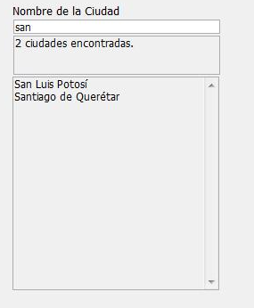

<!--REF #_command_.Keystroke.Syntax-->**Keystroke**  -> Resultado<!-- END REF-->
<!--REF #_command_.Keystroke.Params-->
| Parámetro | Tipo |  | Descripción |
| --- | --- | --- | --- |
| Resultado | Text | &#x1F850; | Carácter introducido por el usuario |

<!-- END REF-->

#### Descripción 

<!--REF #_command_.Keystroke.Summary-->Keystroke devuelve el carácter introducido por el usuario en un campo o en un área editable.<!-- END REF--> 

Generalmente, Keystroke se llama en un método de formulario o de objeto durante la gestión del evento de formulario On Before Keystroke. Para detectar eventos de tecleo, utilice el comando [Form event](form-event.md "Form event"). 

Para reemplazar el carácter introducido por el usuario con otro carácter, utilice el comando [FILTER KEYSTROKE](filter-keystroke.md "FILTER KEYSTROKE").

**Nota:** la función Keystroke no funciona en subformularios.

**IMPORTANTE:** si quiere efectuar algunas operaciones “al vuelo” dependiendo del valor actual del área de entrada que está siendo editada, así como del nuevo carácter a introducir, recuerde que el texto que ve en la pantalla NO ES aún el valor del campo o de la variable fuente. El valor del campo o de la variable fuente de datos se asigna después de que se valida la entrada de datos para el área (tabulación en otra área, clic en un botón, etc). Por lo tanto depende de usted el colocar los datos introducidos en una variable y luego trabajar con el valor de la variable. Debe hacer esto si necesita saber el valor actual del texto para efectuar acciones especiales. Igualmente puede utilizar la función [Get edited text](get-edited-text.md "Get edited text").

Puede utilizar el comando Keystroke para:

* efectuar un filtro personalizado de caracteres
* crear un filtro de entrada no disponible en estándar, por ejemplo en los filtros de entrada
* implementar áreas dinámicas de búsqueda o de tecleo anticipado

#### Ejemplo 1 

Consulte los ejemplos del comando [FILTER KEYSTROKE](filter-keystroke.md "FILTER KEYSTROKE").

#### Ejemplo 2 

Cuando procesa un evento On Before Keystroke, usted está administrando la edición del área de texto actual (donde se encuentra el cursor), no el “valor futuro” de la fuente de datos (campo o variable) de esta área. El método de proyecto Manejo tecleo permite colocar en una segunda variable los datos introducidos en un área de texto, de manera que usted puede utilizar esta variable para efectuar diferentes acciones mientras introduce caracteres en el área. Usted pasa como primer parámetro un puntero hacia la fuente de datos del área, y como segundo parámetro un puntero hacia la segunda variable. El método devuelve el nuevo valor del área de texto en la segunda variable, y devuelve [True](true.md "True") si este valor es diferente del valor antes de la entrada del último carácter. 

```4d
  // Método de proyecto Manejo tecleo
  // Manejo tecleo ( Puntero ; Puntero ) -> Booleano
  // Manejo tecleo ( -> srcArea ; -> curValor ) -> Es un nuevo valor
 
 var $1;$2 : Pointer
 var $vtNuevoValor : Text
 
  // Obtener el texto seleccionado en el área editable
 GET HIGHLIGHT($1->;$vlInicio;$vlFin)
  // Comenzar a trabajar con el valor actual
 $vtNuevoValor:=$2->
  // Dependiendo de la tecla presionada o del carácter introducido,
  // Realizar las acciones apropriadas
 Case of
 
  // La tecla Retroceso ha sido presionada
    :(Character code(Keystroke)=Backspace)
  // Suprimir los caracteres seleccionados o el carácter a la izquierda del cursor
       $vtNuevoValor:=Substring($vtNuevoValor;1;$vlInicio-1-Num($vlInicio=$vlFin))
       +Substring($vtNuevoValor;$vlFin)
 
  // Un carácter aceptable ha sido introducido
    :(Position(Keystroke;"abcdefghjiklmnopqrstuvwxyz -0123456789")>0)
       If($vlInicio#$vlFin)
  // Uno o varios caracteres son seleccionados, el keystroke va a borrarlos
          $vtNuevoValor:=Substring($vtNuevoValor;1;$vlInicio-1)
          +Keystroke+Substring($vtNuevoValor;$vlFin)
       Else
  // La selección de texto es el cursor
          Case of
  // El cursor está actualmente al comienzo del texto
             :($vlInicio<=1)
  // Inserción del carácter al principio del texto
                $vtNuevoValor:=Keystroke+$vtNuevoValor
  // El cursor está actualmente al final del texto
             :($vlInicio>=Length($vtNuevoValor))
  // Añadir el carácter al final del texto
                $vtNuevoValor:=$vtNuevoValor+Keystroke
             Else
  // El cursor se encuentra en el texto, insertar el nuevo carácter
                $vtNuevoValor:=Substring($vtNuevoValor;1;$vlInicio-1)+Keystroke
                +Substring($vtNuevoValor;$vlInicio)
          End case
       End if
 
  // Una tecla flecha ha sido presionada
  // No haga nada, sólo acepte el carácter tecleado
    :(Character code(Keystroke)=Left arrow key)
    :(Character code(Keystroke)=Right arrow key)
    :(Character code(Keystroke)=Up arrow key)
    :(Character code(Keystroke)=Down arrow key)
  `
    Else
  // No acepte caracteres diferentes de letras, dígitos, espacios y guiones
       FILTER KEYSTROKE("")
 End case
  // ¿Es diferente el valor ahora?
 $0:=($vtNuevoValor#$2->)
  // Devolver el valor para la gestión del próximo keystroke
 $2->:=$vtNuevoValor
```

Una vez este método de proyecto se añada a su aplicación, puede utilizarlo de la siguiente forma: 

```4d
  // Método de objeto del área de entrada MiObjeto
 Case of
    :(FORM Event=On Load)
       MiObjeto:=""
       MiObjetoCaché:=""
    :(FORM Event=On Before Keystroke)
       If(Manejo tecleo(->MiObjeto;->MiObjetoCaché))
  // Efectuar las acciones apropiadas utilizando el valor almacenado en MiObjetoCaché
       End if
 End case
```

Examinemos por ejemplo el siguiente formulario:


Esta compuesto de los siguientes objetos: un área editable *vsBusqueda*, un área no editable *vsMensaje*, y un área de desplazamiento *asBusqueda*. Durante la entrada de caracteres en *vsBusqueda*, el método para ese objeto efectúa una búsqueda en la tabla \[Codigos postales\], permitiendo al usuario encontrar ciudades solamente presionando los primeros caracteres de los nombres de la ciudades. 

Este es el método de objeto *vsBusqueda*:

```4d
  // Método de objeto del área de entrada vsBusqueda
 Case of
    :(FORM Event=On Load)
       vsBusqueda:=""
       vsResult:=""
       vsMensaje:="Introduzca los primeros caracteres de la ciudad que busca."
       CLEAR VARIABLE(asBusqueda)
    :(FORM Event=On Before Keystroke)
       If(Manejo tecleo(->vsBusqueda;->vsResult))
          If(vsResult#"")
             QUERY([Codigos postales];[Codigos postales]Ciudad=vsResult+"@")
             MESSAGES OFF
             DISTINCT VALUES([Codigos postales]Ciudad;asBusqueda)
             MESSAGES ON
             $vlResult:=Size of array(asBusqueda)
             Case of
                :($vlResult=0)
                   vsMensaje:="No se encontró ninguna ciudad."
                :($vlResult=1)
                   vsMensaje:="Se encontró una ciudad."
                Else
                   vsMensaje:=String($vlResult)+" ciudades encontradas."
             End case
          Else
             DELETE FROM ARRAY(asBusqueda;1;Size of array(asBusqueda))
             vsMensaje:="Introduzca los primeros caracteres de la ciudad que está buscando."
          End if
       End if
 End case
```

Este es el formulario en ejecución:



Utilizando las habilidades de la comunicación interproceso de 4D, puede construir interfaces de usuario en las cuales las características de búsqueda se ofrezcan en ventanas flotantes que se comuniquen con procesos en los cuales los registros son listados o editados. 

#### Ver también 

[FILTER KEYSTROKE](filter-keystroke.md)  
[Form event code](form-event-code.md)  
[Get edited text](get-edited-text.md)  