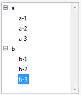

<!--REF #_command_.List item parent.Syntax-->**List item parent** ( {* ;} *lista* ; refElem | * ) : Integer<!-- END REF-->
<!--REF #_command_.List item parent.Params-->
| Parámetro | Tipo |  | Descripción |
| --- | --- | --- | --- |
| * | Operador | &#8594;  | Si se especifica, lista es un nombre de objeto (cadena) Si se omite, lista es un número de referencia de lista |
| lista | Integer, Text | &#8594;  | Número de referencia de la lista (si se omite *), o Nombre de objeto de tipo lista (si se pasa*) |
| refElem &#124; * | Operador, Entero largo | &#8594;  | Número de referencia del elemento o 0 para el último elemento añadido a la lista o * para el elemento actual de la lista |
| Resultado | Integer | &#8592; | Número de referencia del elemento padre o 0 si no hay |

<!-- END REF-->

#### Descripción 

<!--REF #_command_.List item parent.Summary-->El comando List item parent devuelve el número de referencia del elemento padre.<!-- END REF-->

Pase en *lista* el número de referencia o el nombre de objeto de la lista.

Si pasa el primer parámetro opcional \*, indica que el parámetro *lista* es un nombre de objeto (cadena) correspondiente a una representación de lista en el formulario. Si no pasa este parámetro, indica que el parámetro *lista* es una referencia de lista jerárquica (RefLista). Si utiliza sólo una representación de lista o trabaja con elementos estructurales (el segundo \* se omite), puede utilizar indiferentemente una u otra sintaxis. Por el contrario, si utiliza varias representaciones de la misma lista y trabaja con el elemento actual (el segundo \* es pasado), la sintaxis basada en el nombre del objeto es necesaria ya que cada representación tiene su propio elemento actual.

**Nota**: si utiliza el carácter @ en el nombre del objeto de la lista y el formulario contiene varias listas que tienen este nombre, el comando List item parent se aplicará al primer objeto cuyo nombre corresponda.

Pase en *refElem* un número de referencia de elemento en la lista ó 0 ó *\**. Si pasa 0, el comando aplica al último elemento añadido a la lista. Si pasa \*, el comando aplica el elemento actual de la lista. Si varios elementos han sido seleccionados manualmente, el elemento actual es el último elemento seleccionado. 

En cambio, si el elemento correspondiente existe en la lista y si este elemento está en una sublista (y por lo tanto tiene un elemento padre), usted obtiene el número de referencia del elemento padre.

Si no existe un elemento con el número de referencia que pasó, o si pasó \* y ningún elemento está seleccionado, o si el elemento no tiene padre, List item parent devuelve 0 (cero).

Si trabaja con números de referencia de los elementos, asegúrese de construir una lista en la cual los elementos tengan números de referencia únicos; de lo contrario no podrá diferenciar los elementos. Para mayor información, consulte la descripción del comando [APPEND TO LIST](append-to-list.md "APPEND TO LIST").

#### Ejemplo 

He aquí una lista llamada *hList* mostrada en el entorno Aplicación:



Los números de referencia de los elementos son los siguientes:

| **Elemento** | **Número** |
| ------------ | ---------- |
| a            | 100        |
| a - 1        | 101        |
| a - 2        | 102        |
| a - 3        | 103        |
| b            | 200        |
| b - 1        | 201        |
| b - 2        | 202        |
| b - 3        | 203        |

  
* En el siguiente código, si se selecciona el elemento “b - 3”, la variable *$vlPadreElemRef* toma el valor 200, es decir el número de referencia del elemento “b”:

```4d
 $vlItemPos:=Selected list items(hList)
 GET LIST ITEM(hList;$vlItemPos;$vlItemRef;$vsItemText)
 $vlPadreElemRef :=List item parent(hList;$vlItemRef) // $vlPadreElemRef vale 200
```

* Si se selecciona el elemento “a - 1”, la variable *$vlPadreElemRef* toma el valor 100, es decir el número de referencia del elemento “a”.
* Si se selecciona el elemento el elemento “a” o “b”, la variable *$vlPadreElemRef* toma el valor 0, porque estos elementos no tienen elemento padre.

#### Ver también 

[GET LIST ITEM](get-list-item.md)  
[List item position](list-item-position.md)  
[SELECT LIST ITEMS BY REFERENCE](select-list-items-by-reference.md)  
[SET LIST ITEM](set-list-item.md)  

#### Propiedades
|  |  |
| --- | --- |
| Número de comando | 633 |
| Hilo seguro | &check; |
| Prohibido en el servidor ||


