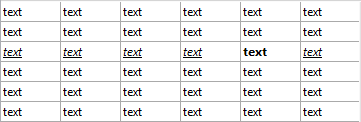

<!--REF #_command_.LISTBOX Get row font style.Syntax-->**LISTBOX Get row font style** ( {* ;} *objeto* ; *linea* ) -> Resultado<!-- END REF-->
<!--REF #_command_.LISTBOX Get row font style.Params-->
| Parámetro | Tipo |  | Descripción |
| --- | --- | --- | --- |
| * | Operador | &rarr; | Si se especifica, objeto es un nombre de objeto (cadena)<br/>Si se omite, objeto es una variable |
| objeto | any | &rarr; | Nombre del objeto(si se especifica *) o<br/>Variable (si se omite *) |
| linea | Integer | &rarr; | Número de línea |
| Resultado | Integer | &larr; | Valor de estilo |

<!-- END REF-->

#### Descripción 

<!--REF #_command_.LISTBOX Get row font style.Summary-->**Nota:** este comando sólo funciona con los list box de tipo array.<!-- END REF-->

El comando **LISTBOX Get row font style** devuelve el estilo de fuente de una línea o de una celda del list box designado por los parámetros *objeto* y *\** .

Al pasar el parámetro opcional *\** indica que el parámetro *objeto* es un nombre de objeto (cadena). Si no pasa este parámetro, indica que el parámetro *objeto* es una variable. En este caso, se pasa una referencia de variable en lugar de una cadena. Puede designar como parámetro *objeto* un list box o una columna de list box:

* si *objeto* designa un list box, el comando devuelve el estilo de la línea.
* si *objeto* designa una columna, el comando devuelve el estilo de la celda.

En *linea*, pase el número de la línea cuyo estilo desea obtener. 

**Nota:** el comando no tiene en cuenta los estados oculto/visible de las líneas del list box.

**Atención:** un estilo asignado a una línea no se muestra necesariamente en todas las celdas de línea (ver el ejemplo). Si se definen valores de estilo contradictorios usando las propiedades del list box o de la columna, se aplica un orden de prioridad. Para obtener más información, consulte el Manual de *Diseño*.

#### Ejemplo 

Dado el siguiente list box: 



```4d
 vStyle:=LISTBOX Get row font style(*;"Col5";3)
 vStyle2:=LISTBOX Get row font style(*;"List Box";3)
  // vStyle contiene 1 (Bold)
  // vStyle2 contiene 6 (Italic + Underline)
```

#### Ver también 

[LISTBOX SET ROW FONT STYLE](listbox-set-row-font-style.md)  