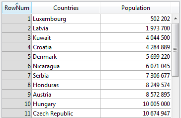

<!--REF #_command_.LISTBOX SET ROW HEIGHT.Syntax-->**LISTBOX SET ROW HEIGHT** ( {* ;} *objeto* ; *linea* ; *altura* )<!-- END REF-->
<!--REF #_command_.LISTBOX SET ROW HEIGHT.Params-->
| Parámetro | Tipo |  | Descripción |
| --- | --- | --- | --- |
| * | Operador | &#8594;  | Si se especifica, objeto es un nombre de objeto (cadena) Si se omite, objeto es una variable |
| objeto | any | &#8594;  | Nombre objeto (si * se especifica) o Variable (si * se omite) |
| linea | Integer | &#8594;  | Línea de list box cuya altura desea definir |
| altura | Integer | &#8594;  | Altura de línea de list box |

<!-- END REF-->

*Este comando no es hilo seguro, no puede ser utilizado en código apropiativo.*


#### Descripción 

<!--REF #_command_.LISTBOX SET ROW HEIGHT.Summary-->El comando **LISTBOX SET ROW HEIGHT** le permite modificar la altura de la *fila* especificada en el objeto list box designado utilizando los parámetros *objeto* y *\**.<!-- END REF-->

Si pasa el parámetro opcional *\**, indica que el parámetro *objeto* es un nombre de objeto (cadena). Si no pasa este parámetro, indica que el parámetro *objeto* es una variable. En este caso, se pasa una referencia variable en lugar de una cadena. Para más información sobre nombres de objetos, consulte la sección *Propiedades de los objetos*. 

Si la *fila* especificada no existe en el list box, el comando no hace nada.

La unidad utilizada para la *altura* especificada corresponde a la definida globalmente para las filas del list box, ya sea en la lista de propiedades o por una llamada anterior al comando [LISTBOX SET ROWS HEIGHT](listbox-set-rows-height.md).

**Nota**: para más información sobre el cálculo de la altura de las filas, consulte el Manual de *Diseño*.

Si no hay un array de altura de fila asociado al list box, este comando crea uno dinámico; de lo contrario, se utiliza el array existente especificado en la propiedad **Array de altura de fila**. El uso de este comando para establecer el alto de fila individual produce el mismo resultado visual que la asociación de un array de altura de fila; Sin embargo, llenar un array con valores de altura de la fila es mucho más rápido que llamar a este comando en un bucle para ajustar la altura de las filas de una en una para el list box.

**Nota importante:** si el comando [LISTBOX SET ROWS HEIGHT](listbox-set-rows-height.md) se llama posteriormente con una unidad diferente a la que se definió previamente, este valor predeterminado reemplazará e reinicializará el array de altura de las filas existentes definidas utilizando **LISTBOX SET ROW HEIGHT** (ver el ejemplo).

#### Ejemplo 1 

Usted desea cambiar la altura de unas pocas líneas en el siguiente list box:



Si ejecuta este código:

```4d
  //la unidad actual es píxeles
 LISTBOX SET ROW HEIGHT(*;"listboxname";3;40) //Kuwait
 LISTBOX SET ROW HEIGHT(*;"listboxname";7;14) //Serbia
```

... obtiene el siguiente resultado:


#### Ejemplo 2 

Ha definido una altura de fila predeterminada y luego define varios valores de altura de fila individuales utilizando el comando **LISTBOX SET ROW HEIGHT**:

```4d
 LISTBOX SET ROWS HEIGHT(*;"listboxname";25;lk pixels) // altura global definida en píxeles
 LISTBOX SET ROW HEIGHT(*;"listboxname";1;30) // línea 1: 30 píxeles
 LISTBOX SET ROW HEIGHT(*;"listboxname";5;40) // línea 5: 40 píxeles
 LISTBOX SET ROW HEIGHT(*;"listboxname";11;50) //  línea 11: 50 píxeles
```

Más tarde, si se ejecuta el código siguiente...

```4d
 LISTBOX SET ROWS HEIGHT(*;"listboxname";18;lk pixels)
```

…Entonces la altura global de fila se establece en 18 píxeles; Sin embargo, puesto que la unidad no ha cambiado, las filas 1, 5 y 11 mantendrán sus valores de altura específicos, es decir, 30, 40 y 50 píxeles como se definió anteriormente por el comando **LISTBOX SET ROW HEIGHT**.

Por otro lado, si el código siguiente se ejecuta posteriormente...

```4d
 LISTBOX SET ROWS HEIGHT(*;"listboxname";2;lk lines)
```

... Entonces las filas 1, 5 y 11 se ponen a la altura global de fila predeterminada establecida por [LISTBOX SET ROWS HEIGHT](listbox-set-rows-height.md) (es decir, 2 líneas) ya que la unidad ha cambiado de píxeles a líneas. Puesto que no hay conversión automática aplicada, el cambio de unidades siempre resulta en altos de fila reinicializados en el nuevo valor por defecto definido.

#### Ver también 

  
[LISTBOX Get row height ](listbox-get-row-height.md)  
[LISTBOX SET AUTO ROW HEIGHT](listbox-set-auto-row-height.md)  
[LISTBOX SET ROWS HEIGHT](listbox-set-rows-height.md)  