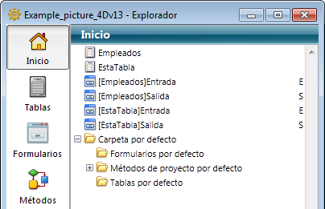

<!--REF #_command_.METHOD GET FOLDERS.Syntax-->**METHOD GET FOLDERS** ( *arrNoms* {; *filtro*}{; *} )<!-- END REF-->
<!--REF #_command_.METHOD GET FOLDERS.Params-->
| Parámetro | Tipo |  | Descripción |
| --- | --- | --- | --- |
| arrNoms | Text array | &#8592; | Array de nombres de carpetas de la página de inicio |
| filtro | Text | &#8594;  | Filtro de nombres |
| * | Operador | &#8594;  | Si se pasa = el comando se aplica a la base local cuando se ejecuta desde un componente (parámetro ignorado fuera de este contexto) |

<!-- END REF-->

#### Descripción 

<!--REF #_command_.METHOD GET FOLDERS.Summary-->El comando **METHOD GET FOLDERS** devuelve en el array *arrNoms*, los nombres de las carpetas creadas en la página Inicio del Explorador de 4D:  
  
  
Como los nombres de las carpetas deben ser únicos, la jerarquía no se devuelve en este array.<!-- END REF-->   
  
Puede limitar la lista de carpetas pasando una cadena de comparación en el parámetro *filtro*, en este caso, sólo se devuelven las carpetas cuyos nombres coincidan con el filtro. Puede utilizar el carácter @ para definir los filtros de tipo "comienza por", "termina en" o "contiene". Si pasa una cadena vacía, el parámetro *filtro* se ignora.   
  
Si se ejecuta este comando desde un componente, devuelve por defecto las rutas de los métodos del componente. Si pasa el parámetro *\**, el array contendrá las rutas de los métodos de la base local.

#### Ver también 

[METHOD GET PATHS](method-get-paths.md)  

#### Propiedades
|  |  |
| --- | --- |
| Número de comando | 1206 |
| Hilo seguro | &check; |
| Prohibido en el servidor ||

