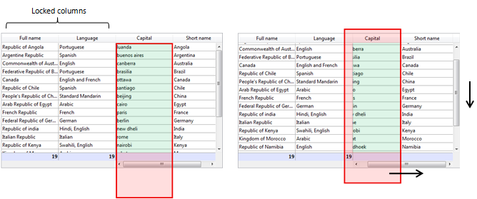

<!--REF #_command_.OBJECT GET COORDINATES.Syntax-->**OBJECT GET COORDINATES** ( {* ;} *objeto* ; *izquierdo* ; *superior* ; *derecho* ; *inferior* )<!-- END REF-->
<!--REF #_command_.OBJECT GET COORDINATES.Params-->
| Parámetro | Tipo |  | Descripción |
| --- | --- | --- | --- |
| * | Operador | &#8594;  | Si se especifica, objeto es el nombre del objeto (cadena) Si se omite, objeto es una variable |
| objeto | any | &#8594;  | Nombre de objeto (si se especifica *), o Campo o variable (si se omite *) |
| izquierdo | Integer | &#8592; | Coordenada izquierada del objeto |
| superior | Integer | &#8592; | Coordenada superior del objeto |
| derecho | Integer | &#8592; | Coordenada derecha del objeto |
| inferior | Integer | &#8592; | Coordenada inferior del objeto |

<!-- END REF-->

#### Descripción 

<!--REF #_command_.OBJECT GET COORDINATES.Summary-->El comando **OBJECT GET COORDINATES**devuelve las coordenadas *izquierda*, *superior*, *derecha* e *inferior* (en puntos) en las variables o campos de los objetos del formulario actual definido por los parámetros *\** y *objeto*.<!-- END REF-->

Si pasa el parámetro opcional *\**, indica que el parámetro *objeto* es un nombre de objeto (una cadena de caracteres). Si no pasa el parámetro opcional \*, indica que *objeto* es un campo o una variable. En este caso, no se pasa una cadena sino una referencia de un campo o de una variable (campo o variable de tipo objeto únicamente).

Si pasa un nombre de objeto en el parámetro objeto y utiliza el carácter arroba (“@”) para seleccionar más de un objeto, las coordenadas devueltas serán las del rectángulo formado por todos los objetos concernientes. 

**Nota:** desde la versión 6.5, es posible definir el modo de interpretación del carácter arroba (“@”), cuando se incluye en una cadena de caracteres. Esta opción tiene un impacto en los comandos “Propiedades de los objetos”. Por favor consulte el Manual de Diseño.

Si el objeto no existe o si no se llama el comando en el contexto de un formulario, las coordenadas devueltas son (0;0;0;0).

En el contexto de los list box, el comando **OBJECT GET COORDINATES** puede devolver las coordenadas de partes específicas del listbox, es decir, columnas, encabezados, pies de página, y no sólo los del objeto listbox padre. En las versiones anteriores a v14 R5, este comando siempre devuelve las coordenadas del listbox padre, independientemente del área pasada como parámetro. A partir de ahora, cuando el *objet*o referenciado es un encabezado, una columna o un pie de listbox, las coordenadas devueltas son los del sub-objeto listbox designado. Puede utilizar esta nueva funcionalidad, por ejemplo, para mostrar un pequeño icono en la celda de encabezado de un listbox cuando se pasa sobre él, indicándole al usuario que puede hacer clic para mostrar un menú contextual.  
Para mantener la coherencia, el marco de referencia utilizado es el mismo cuando el objeto es un sub-objeto list box o un objeto list box: el origen es la esquina superior izquierda del formulario que contiene el objeto. Para los sub-objetos de listbox, las coordenadas devueltas son teóricas; tienen en cuenta el estado de desplazamiento del list box antes de que ocurra un clipping (es decir, el corte de acuerdo con las coordenadas del list box padre). Como resultado, el sub-objeto puede que no sea visible (o sólo parcialmente) en sus coordenadas, y estas coordenadas pueden estar fuera de los límites del formulario (o incluso ser negativas). Para averiguar si el sub\-objeto es visible (y que parte es visible) es necesario comparar las coordenadas devueltas con las coordenadas del listbox, mientras tiene en cuenta las siguientes reglas:

* Todos los sub-objetos se recortan según las coordenadas de su listbox padre (devueltas por **OBJECT GET COORDINATES** en el list box).
* Los sub-objetos encabezado y pie se muestran sobre el contenido de la columna: cuando las coordenadas de una columna cruzan las coordenadas de las líneas de encabezado o pie de página, luego la columna no se muestra en esta intersección.
* Los elementos de las columnas bloqueadas se muestran arriba de los elementos de las columnas desplazables: cuando las coordenadas de un elemento en una columna desplazable cruzan las coordenadas de un elemento en una columna bloqueada, no se muestra en esta intersección.

Por ejemplo, considere el siguiente gráfico, donde las coordenadas de la columna *Capital* están simbolizadas por un rectángulo rojo:



Como se puede ver en la primera imagen, la columna es más grande que el listbox, por lo que sus coordenadas van más allá del límite inferior del listbox, incluyendo el pie de página. En la segunda imagen, el listbox se ha desplazado, por lo que la columna también se ha movido "bajo" la columna *Language* y el área de encabezado. En cualquier caso, con el fin de calcular la parte visible real (área verde), es necesario sustraer las áreas rojas.

#### Ejemplo 1 

Asumamos que quiere obtener las coordenadas de un rectángulo formado por todos los objetos que comienzan por “botón”:

```4d
 OBJECT GET COORDINATES(*;"botón@";izquierda;superior;derecha;inferior)
```

#### Ejemplo 2 

Para las necesidades de su interfaz, usted desea rodear el área en la que el usuario hizo clic con un rectángulo rojo:


En el método objeto del listbox, puede escribir:

```4d
 OBJECT SET VISIBLE(*;"rectangleInfo";False) //inicializar un rectángulo rojo
 $ptr:=OBJECT Get pointer(Object current)
 OBJECT GET COORDINATES($ptr->;$x1;$y1;$x2;$y2)
 OBJECT SET VISIBLE(*;"RedRect";True)
 OBJECT SET COORDINATES(*;"RedRect";$x1;$y1;$x2;$y2)
 
 OBJECT GET COORDINATES(*;"LB1";$lbx1;$lby1;$lbx2;$lby2)
 If($lby1>$y1)|($lby2<$y2)&NBSP; // si el área en la que se hace clic está fuera del listbox
    OBJECT SET VISIBLE(*;"Alert";True)&NBSP; // mostrar un alerta
 Else
    OBJECT SET VISIBLE(*;"Alert";False)
 End if
```

El método devuelve las coordenadas teóricas. Si el listbox es redimensionado, puede necesitar calcular el recorte para saber qué parte es visible:


#### Ver también 

[CONVERT COORDINATES](convert-coordinates.md)  
[LISTBOX GET CELL COORDINATES](listbox-get-cell-coordinates.md)  
[OBJECT MOVE](object-move.md)  
[OBJECT SET COORDINATES](object-set-coordinates.md)  

#### Propiedades
|  |  |
| --- | --- |
| Número de comando | 663 |
| Hilo seguro | &check; |
| Prohibido en el servidor ||


