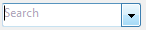

<!--REF #_command_.OBJECT SET PLACEHOLDER.Syntax-->**OBJECT SET PLACEHOLDER** ( {* ;} *objeto* ; *textoEjemplo* )<!-- END REF-->
<!--REF #_command_.OBJECT SET PLACEHOLDER.Params-->
| Parámetro | Tipo |  | Descripción |
| --- | --- | --- | --- |
| * | Operador | &#8594;  | Si se especifica, objeto es un nombre de objeto (cadena) Si se omite, objeto es un campo o una variable |
| objeto | any | &#8594;  | Nombre de objeto (si se especifica *) o<br/>Campo o variable (si se omite *) |
| textoEjemplo | Text | &#8594;  | Texto de ejemplo asociado al objeto |

<!-- END REF-->

*Este comando no es hilo seguro, no puede ser utilizado en código apropiativo.*


#### Descripción 

<!--REF #_command_.OBJECT SET PLACEHOLDER.Summary-->El comando **OBJECT SET PLACEHOLDER** asocia un texto de ejemplo al objeto o a los objetos designados por los parámetros *objeto* y *\** .<!-- END REF-->  
  
Para obtener más información sobre los textos de ejemplo, consulte el manual de *Diseño*.  
  
Si un texto de ejemplo ya está asociado al objeto vía la Lista de propiedades, este texto se sustituye en el proceso actual por el contenido del parámetro *textoEjemplo*.  
  
Si pasa el parámetro opcional *\** indica que el parámetro *objeto* es un nombre de objeto (cadena). Si no pasa este parámetro, indica que el parámetro *objeto* es un campo o una variable. En este caso, se pasa una referencia de campo o variable en lugar de una cadena (campo o variable objeto únicamente ) .  
  
En *textoEjemplo*, pase el texto de ayuda o la indicación que debe aparecer cuando el objeto esté vacío.  
  
**Nota**: el comando **OBJECT SET PLACEHOLDER** no soporta la inserción de referencias XLIFF en los textos de ejemplo. Esto sólo es posible para los textos de ejemplo definidos mediante la Lista de propiedades.  
  
Este comando sólo se puede utilizar con objetos de formulario de tipo variable, campo o combo box. También puede se asociar a los datos de tipo fecha u hora si el objeto de formulario tiene la propiedad "Vacío si nulo".

#### Ejemplo 

Usted quiere mostrar el texto "Buscar" un combo box:

```4d
 OBJECT SET PLACEHOLDER(*;"search_combo";"Search")
```



#### Ver también 

[OBJECT Get placeholder](object-get-placeholder.md)  