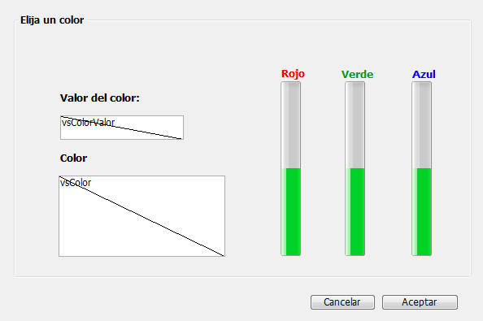
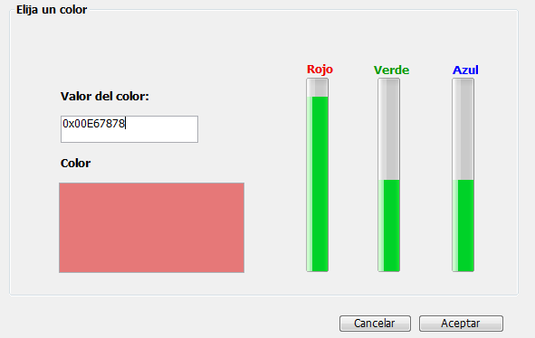

<!--REF #_command_.OBJECT SET RGB COLORS.Syntax-->**OBJECT SET RGB COLORS** ( {* ;} *objeto* ; *colorPrimerPlano* {; *colorFondo* {; *colorFondoAlt*}} )<!-- END REF-->
<!--REF #_command_.OBJECT SET RGB COLORS.Params-->
| Parámetro | Tipo |  | Descripción |
| --- | --- | --- | --- |
| * | Operador | &#8594;  | Si se especifica, objeto es un nombre de objeto (cadena) Si se omite, objeto es un campo o una variable |
| objeto | any | &#8594;  | Nombre de objeto (si se especifica *), o Campo o variable (si se omite *) |
| colorPrimerPlano | Text, Integer | &#8594;  | Valor del color RGB del primer plano |
| colorFondo | Text, Integer | &#8594;  | Valor del color RGB del fondo |
| colorFondoAlt | Text, Integer | &#8594;  | Valor del color RGB del fondo alterno |

<!-- END REF-->

#### Descripción 

<!--REF #_command_.OBJECT SET RGB COLORS.Summary-->El comando **OBJECT SET RGB COLORS** cambia los colores de fondo y primer plano de los objetos especificados por *objeto* y el parámetro opcional *\**.<!-- END REF--> Cuando el comando se aplica a un objeto list box, un parámetro adicional le permite modificar el color alterno de las filas.

Si pasa el parámetro opcional *\**, especifica que el parámetro *objeto* es el nombre de objeto (una cadena). Si omite el parámetro opcional \*, especifica que *objeto* es un campo o una variable. En este caso, no pasa en *objeto* una cadena sino una referencia a un campo o a una variable (campo o variable de tipo objeto únicamente) en lugar de una cadena. Para mayor información sobre nombres de objetos, consulte la sección *Propiedades de los objetos*.

El parámetro opcional *colorFondoAlt* le permite definir un color alternativo para el fondo de las líneas pares. Este parámetro sólo se utiliza cuando el objeto se especifica como List box o columna de List box. Cuando se utiliza este parámetro, el parámetro *c* *olorFondo* se utiliza para las líneas impares únicamente. La utilización de colores alternativos hace que las listas sean más fáciles de leer. 

Si *objeto* especifica un objeto List box, los colores alternos se utilizan en todo el List box. Si *objeto* especifica una columna del List box, sólo la columna utilizará los colores definidos.

**Definición de colores**

Los valores de los colores RGB se indican en los parámetros *colorPrimerPlano* y opcionalmente en *colorFondo* y *colorFondoAlt*. Los siguientes formatos se soportan:

| **Nombre del formato<br/>** | **Tipo**     | **Descripción**                                                                                                                                                                                                                                                                                                                                                                                                                                                   | **Ejemplos**                                                                                      |
| ----------------------------------- | ------------ | ----------------------------------------------------------------------------------------------------------------------------------------------------------------------------------------------------------------------------------------------------------------------------------------------------------------------------------------------------------------------------------------------------------------------------------------------------------------- | ------------------------------------------------------------------------------------------------- |
| CSS color name                      | Texto        | Nombre de color CSS2 estándar. La lista de nombres disponibles se puede encontrar en varios lugares en la web, por ejemplo, en el sitio web [htmlcolorcodes.com](https://htmlcolorcodes.com/color-names/). Utiliza "transparente" para definir la transparencia en el fondo (solo se puede utilizar con los parámetros *colorFondo* y *colorFondoAlt*). Utiliza "" (cadena vacía) en *colorPrimerPlano* y/o *colorFondo* para dejarlo sin cambios.                | "red", "cyan", "lightblue"                                                                        |
| CSS color "#rrggbb" syntax          | Texto        | Código de color hexadecimal CSS2 estándar: rr = componente rojo del color gg = componente verde del color bb = componente azul del color                                                                                                                                                                                                                                                                                                                          | "#ff0000", "#00FFFF", "#ADD8E6"                                                                   |
| CSS color "rgb(r,g,b)" syntax       | Texto        | Código de color rgb CSS2 estándar: r = componente rojo del color (0...255) g = componente verde del color (0...255) b = componente azul del color (0...255)                                                                                                                                                                                                                                                                                                       | "rgb(255,255,0)", "rgb(255,0,0)"                                                                  |
| 4-byte RGB value                    | Entero largo | Entero largo de 4 bytes (formato 0x00rrggbb). Valores hexadecimales:<br/> rr = componente rojo del color gg = componente verde del color bb = componente azul del color                                                                                                                                                                                                                                                                                   | 0x00000000, 0x00FF7F7F                                                                            |
| 4D "system" color constant          | Entero largo | Colores utilizados por 4D para dibujar objetos con colores automáticos. Constantes disponibles (del tema *DEFINIR COLORES RVA*):<br/> Background color Background color none (solo puede utilizasrse con los parámetros *colorFondo* y *colorFondoAlt*) Dark shadow color Disable highlight item color Foreground color Highlight menu background color Highlight menu text color Highlight text background color Highlight text color Light shadow color | **Nota:** *los colores automáticos dependen del sistema y del tipo de objeto al cual se asignan.* |

#### Ejemplo 1 

Este formulario contiene dos variables editables, *vsColorValor* y *vsColor* así como tres termómetros: *thRojo*, *thVerde*, y *thAzul*.



Estos son los métodos de estos objetos:

```4d
  // Método de objeto de la variable no editable vsColorValor
 Case of
    :(FORM Event=On Load)
       vsColorValor:="0x00000000"
 End case
 
  // Método de objeto de la variable no editable vsColor
 Case of
    :(FORM Event=On Load)
       vsColor:=""
       OBJECT SET RGB COLORS(vsColor;0x00FFFFFF;0x0000)
 End case
 
  // Método de objeto del termómetro thRojo
 CLIC EN TERMOMETRO DE COLOR
  // Método de objeto del termómetro thVerde
 CLIC EN TERMOMETRO DE COLOR
 
  // Método de objeto del termómetro thAzul
 CLIC EN TERMOMETRO DE COLOR
```

El método de proyecto llamado por los tres termómetros es:

```4d
  // Método de proyecto CLIC EN TERMOMETRO DE COLOR
 OBJECT SET RGB COLORS(vsColor;0x00FFFFFF;(thRojo&NBSP;<<&NBSP;16)+(thVerde&NBSP;<<&NBSP;8)+thAzul)
 vsColorValor:=String((thRojo << 16)+(thVerde << 8)+thAzul;" & x")
 If(thRojo=0)
    vsColorValor:=Substring(vsColorValor;1;2)+"0000"+Substring(vsColorValor;3)
 End if
```

Note la utilización de los *Bitwise operators* para el calculo de los valores de los colores a partir de los valores de los termómetros.

En ejecución, el formulario se ve así:



#### Ejemplo 2 

Cambia a fondo transparente con un color de fuente claro:


```4d
 OBJECT SET RGB COLORS(*;"myVar";Light shadow color;Background color none)
```


#### Ver también 

[OBJECT GET RGB COLORS](object-get-rgb-colors.md)  
[Select RGB Color](select-rgb-color.md)  

#### Propiedades
|  |  |
| --- | --- |
| Número de comando | 628 |
| Hilo seguro | &check; |
| Prohibido en el servidor ||


