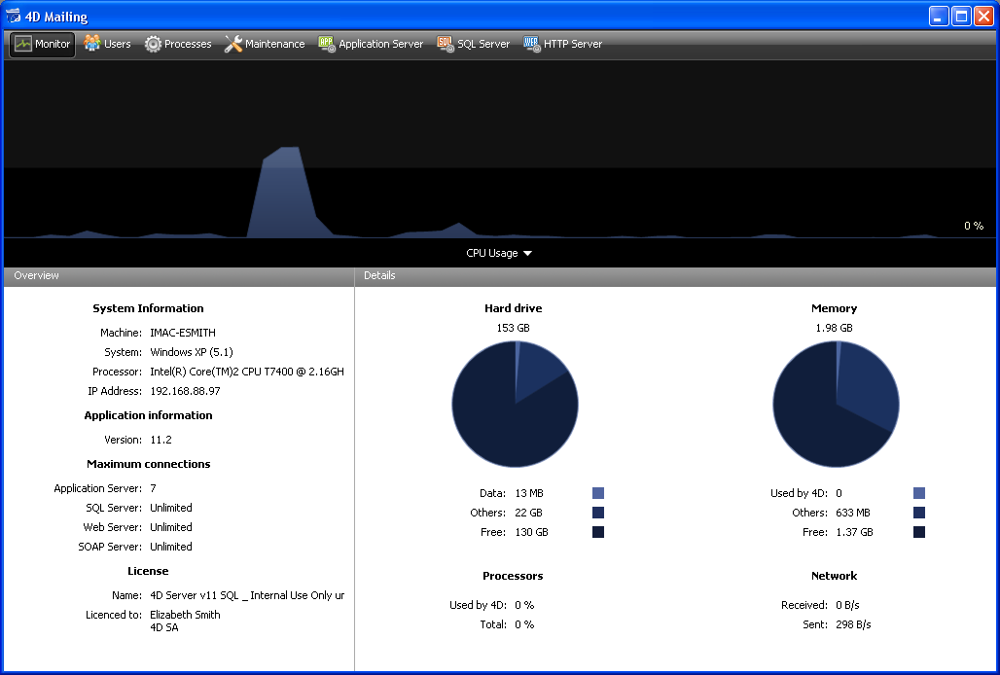

<!--REF #_command_.OPEN ADMINISTRATION WINDOW.Syntax-->**OPEN ADMINISTRATION WINDOW**<!-- END REF-->
<!--REF #_command_.OPEN ADMINISTRATION WINDOW.Params-->
| Este comando no requiere parámetros |  |
| --- | --- |

<!-- END REF-->

#### Descripción 

<!--REF #_command_.OPEN ADMINISTRATION WINDOW.Summary-->El comando OPEN ADMINISTRATION WINDOW muestra la ventana de administración del servidor en el equipo que lo ejecuta.<!-- END REF--> La ventana de administración de 4D Server permite visualizar los parámetros actuales y efectuar varias operaciones de mantenimiento (ver la Guía de referencia de 4D). A partir de la versión 11 de 4D Server, esta ventana puede mostrarse desde un equipo cliente: 



Este comando debe llamarse en el contexto de una aplicación 4D conectada o de un 4D Server. No hace nada si:

* se llama en una aplicación 4D en modo local,
* es ejecutado por un usuario diferente al Diseñador o al Administrador (en este caso, se genera el error -9991, ver la sección *Errores de la base de datos*).

#### Ejemplo 

Este es el código de un botón de administración:  
  
```4d
 If(Application type=4D local mode)
    OPEN SECURITY CENTER
  // ...
 End if
 If(Application type=4D remote mode)
    OPEN ADMINISTRATION WINDOW
  // ...
 End if
 If(Application type=4D Server)
  // ...
    OPEN SECURITY CENTER
 End if
```

#### Variables y conjuntos del sistema 

Si el comando ha sido ejecutado correctamente, la variable sistema OK toma el valor 1\. En caso contrario, toma el valor 0.

#### Ver también 

[OPEN SECURITY CENTER](open-security-center.md)  