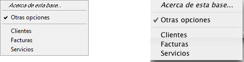

<!--REF #_command_.Pop up menu.Syntax-->**Pop up menu** ( *contenido* {; *porDefecto* {; *CoordX* ; *CoordY*}} )  : Integer<!-- END REF-->
<!--REF #_command_.Pop up menu.Params-->
| Parámetro | Tipo |  | Descripción |
| --- | --- | --- | --- |
| contenido | Text | &#8594;  | Definición del texto del menú |
| porDefecto | Integer | &#8594;  | Número del elemento seleccionado por defecto |
| CoordX | Integer | &#8594;  | Coordenada X de la esquina superior izquierda |
| CoordY | Integer | &#8594;  | Coordenada Y de la esquina superior izquierda |
| Resultado | Integer | &#8592; | Número de elemento de menú seleccionado |

<!-- END REF-->

#### Descripción 

<!--REF #_command_.Pop up menu.Summary-->El comando Pop up menu muestra un menú pop up en la ubicación actual del ratón.<!-- END REF-->

Para seguir las reglas de interfaz de usuario, por lo general este comando debe llamarse en respuesta a un clic y si el botón del ratón aún está presionado.

Los elementos del menú pop up se definen con el parámetro *contenido*, de la siguiente manera:

* Cada elemento se separa de los otros por un punto y coma (*;*). Por ejemplo, *"Element1;Element2;Element3".*
* Para desactivar un elemento, coloque un paréntesis abierto (*(*) en el texto del elemento.
* Para definir una línea de separación, pase "-" o "(-" como texto del elemento.
* Para definir el estilo de fuente para una línea, coloque en el texto del elemento un signo menor que (*<*) seguido por uno de estos caracteres:  

| <B | Negrita                         |  
| -- | ------------------------------- |  
| <I | Itálica                         |  
| <U | Subrayado                       |  
| <O | Contorno (Macintosh únicamente) |  
| <S | Sombra (Macintosh únicamente)   |
* Para añadir una marca de selección a un elemento, coloque en el texto del elemento un signo de admiración (*!*) seguido por el carácter que quiere utilizar como marca de selección.  
   * En Macintosh, el carácter se muestra directamente. Para mostrar la marca estándar sin importar la versión o el lenguaje del sistema, utilice la instrucción: Char(18).  
   * En Windows, se muestra una marca estándar, sin importar el carácter que pase.
* Para añadir un icono a un elemento, coloque en el texto del elemento un acento circunflejo (^) seguido por un carácter cuyo código más 208 es el recurso del icono Mac OS.
* Para añadir un atajo a un elemento, coloque en el texto del elemento una barra oblicua (*/*) seguida por el carácter del atajo. Note que esta última opción es informativa únicamente; ningún atajo de teclado activa el menú pop up. Sin embargo, puede incluir un atajo si el elemento de menú pop up tiene un equivalente en la barra de menús principal de su aplicación.

**Consejo:** es posible desactivar el mecanismo de interpretación de los caracteres especiales (!, /, etc.) en el menú pop up para, por ejemplo, tener estos caracteres incluidos en los textos. Para hacer esto, simplemente inicie el parámetro *contenido* con la instrucción **Char*(1)* (Por ejemplo Char(1)+"1/4 pt" para definir una elemento "1/4 pt").

El parámetro opcional *porDefecto* le permite especificar el elemento de menú seleccionado por defecto cuando se muestra el menú. Pase un valor entre 1 y el número de elementos del menú. Si omite este parámetro, el comando selecciona por defecto el primer elemento del menú.

Los parámetros opcionales *coordX* y c*oordY* se utilizan para designar la ubicación del menú pop-up a mostrar. En *coordX* y c*oordY*, pase respectivamente las coordenadas horizontal y vertical de la esquina superior izquierda del menú. Estas coordenadas deben expresarse en píxeles en el sistema de coordenadas local del formulario actual. Estos dos parámetros deben pasarse juntos; si sólo se pasa uno, se ignorará.

Si utiliza los parámetros *coordX* y c*oordY*, el parámetro *por defecto* se ignora. En este caso, el ratón no se encuentra necesariamente en el nivel del menú pop up.

Estos parámetros son útiles en particular para administrar los botones 3D con un menú pop up asociado.

Si selecciona un elemento de menú, el comando devuelve su número; de lo contrario, devuelve cero (0).

**Nota:** utilice los menús pop up con un número razonable de elementos. Si quiere mostrar más de 50 elementos, puede utilizar mejor un área de desplazamiento en un formulario.

#### Ejemplo 

El método de proyecto MI MENU RAPIDO hace aparecer un menú de navegación pop up:

```4d
  // Método de proyecto MI MENU RAPIDO
 MOUSE POSITION($vlRatonX;$vlRatonY;$vlBoton)
 If(Macintosh control down|($vlBoton=2))
    $vtElementos:="Sobre esta base...<i;(-;!-otras opciones;(-"=""     for($vltabla;1;get="" last="" table="" number)=""        if(is="" number="" valid($vltabla))=""           $vtelementos:="$vtElementos+";"+Table" name($vltabla)=""        end="" if=""     end="" for=""     $vleleccionusuario:="Pop" up="" menu($vtelementos)=""     case="" of=""        :($vleleccionusuario="1)"   //="" mostrar="" información="" las="" opciones=""        else=""           if($vleleccionusuario="">0)
  // Ir a la tabla cuyo número es $vlEleccionUsuario-4
          End if
    End case
 End if</i;(-;!-otras>
```

Este método de proyecto puede llamarse desde:

* el método de un objeto de formulario que reacciona a un clic sin esperar a que el botón del ratón sea liberado (por ejemplo un botón invisible)
* un proceso que “espía” los eventos y se comunica con los otros procesos
* un método de gestión de eventos instalado por el comando [ON EVENT CALL](on-event-call.md "ON EVENT CALL").

En los dos últimos casos, no es necesario que el clic se produzca en un objeto de formulario. Esta es una de las ventajas del comando Pop up menu. Generalmente, los menús pop up se muestran por medio de objetos de formulario. Con Pop up menu, puede mostrar un menú pop up en cualquier lugar.

El menú pop up se muestra en Windows al presionar el botón derecho del ratón, y en Macintosh al presionar Control-Clic. Note, sin embargo, que el método no verifica si en realidad hubo un clic; el método llamante hace esa prueba.

El siguiente es el menú pop-up tal como aparece en Windows (izquierda) y Macintosh (derecha). Note la marca de selección estándar para la versión Windows.



#### Ver también 

[Dynamic pop up menu](dynamic-pop-up-menu.md)  
[MOUSE POSITION](mouse-position.md)  

#### Propiedades

|  |  |
| --- | --- |
| Número de comando | 542 |
| Hilo seguro | &cross; |


