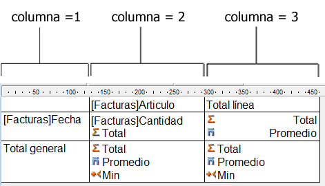

<!--REF #_command_.QR GET INFO COLUMN.Syntax-->**QR GET INFO COLUMN** ( *area* ; *numColumna* ; *titulo* ; *objeto* ; *oculta* ; *tamaño* ; *valoresRepetidos* ; *formato* {; *varResultado*} )<!-- END REF-->
<!--REF #_command_.QR GET INFO COLUMN.Params-->
| Parámetro | Tipo |  | Descripción |
| --- | --- | --- | --- |
| area | Integer | &#8594;  | Referencia del área |
| numColumna | Integer | &#8594;  | Número de columna |
| titulo | Text | &#8592; | Título de la columna |
| objeto | Text | &#8592; | Objeto asignado a la columna |
| oculta | Integer | &#8592; | 0 = visible, 1 = oculto |
| tamaño | Integer | &#8592; | Largo de la columna |
| valoresRepetidos | Integer | &#8592; | 0 = no repetido, 1 = repetido |
| formato | Text | &#8592; | Formato de visualización de los datos |
| varResultado | Text | &#8592; | Nombre de la variable de fórmula |

<!-- END REF-->

#### Descripción 

<!--REF #_command_.QR GET INFO COLUMN.Summary-->##### Informes en lista 

El comando QR GET INFO COLUMN permite recuperar los parámetros de una columna existente.<!-- END REF--> 

*area* es la referencia del área del informe rápido.

*numColumna* es el número de la columna a modificar.

*titulo* devuelve el título que será mostrado en el encabezado de la columna.

*objeto* devuelve el nombre del objeto de la columna (variable, campo o fórmula).

**Nota:** el comando no tiene en cuenta ninguna estructura virtual definida por medio de los comandos [SET TABLE TITLES](set-table-titles.md) y [SET FIELD TITLES](set-field-titles.md). El nombre real del campo se devuelve en el parámetro *objeto*. 

*oculta* indica si la columna es visible o está oculta:

* si *oculta* es igual a 1, la columna está oculta;
* si *oculta* es igual a 0, la columna es mostrada.

*tamaño* devuelve el tamaño de la columna en píxeles. Si el valor devuelto es negativo, el tamaño de la columna es automático.

*valoresRepetidos* devuelve el estado de la propiedad de repetición de datos. Por ejemplo, si el valor de un campo o variable no cambia de un registro a otro, es posible repetirlo o no en cada línea de la columna.  
  
• Si *valoresRepetidos* es igual a 0, los valores no se repiten.   
• Si *valoresRepetidos* es igual a 1, los valores se repiten.

*formato* devuelve el formato de salida. Los formatos de salida son los formatos 4D compatibles con los datos mostrados en la columna.

Cuando se pasa, el parámetro opcional *varResultado*  devuelve el nombre de la variable asignada automáticamente por el editor de Informes rápidos a la columna de la fórmula (si lo hay): "C1" para la primera columna de la fórmula, "C2" para la segunda y así sucesivamente. 4D utiliza esta variable para almacenar los resultados de la última ejecución de la fórmula de la columna cuando se genera el informe.

##### Informes tablas cruzadas 

Con este tipo de informe, el comando QR GET INFO COLUMN permite recuperar globalmente los mismos parámetros pero la referencia de las áreas a las cuales aplica es diferente y varia dependiendo del parámetro que quiera definir. 

Además, los parámetros *titulo*, *oculta*, y *valoresRepetidos* no se utilizan cuando este comando se utiliza en informes tablas cruzadas. 

El valor a pasar en el parámetro *numColumna* depende de la operación que quiera efectuar de si quiere definir el tamaño de la columna o la fuente de datos y el formato de visualización. 

* Tamaño de la columna

Este es un atributo “visual”, por lo tanto las columnas son numeradas de izquierda a derecha, como se muestra en la siguiente imagen:



  
La siguiente instrucción define el tamaño automático para todas las columnas en un informe tabla cruzada y deja los otros elemento intactos:

```4d
 For($i;1;3)
    QR GET INFO COLUMN(qr_area;$i;$titulo;$obj;$oculta;$tamaño;$rep;$format)
    QR SET INFO COLUMN(qr_area;$i;$titulo;$obj;$oculta;0;$rep;$format)
 End for
```

Notará que como quiere alterar únicamente el tamaño de la columna, tiene que utilizar QR GET INFO COLUMN para recuperar las propiedades de la columna y pasarlas a [QR SET INFO COLUMN](qr-set-info-column.md "QR SET INFO COLUMN") para dejarla intacta, excepto el tamaño de la columna.

* Fuente de datos (objeto) y formato de salida

En este caso, la numeración de las columnas opera como se muestra a continuación:


  
Si pasa un número de *area* inválido, se genera el error -9850.  
Si el parámetro *numColumna* es incorrecto se genera el error -9852.

#### Ejemplo 

Usted ha diseñado el siguiente informe:


Puede escribir:

```4d
 var $vTitle;$vObject;$vDisplayFormat;$vResultVar : Text
 var $area;$vHide;$vSize;$vRepeatedValue : Integer
 QR GET INFO COLUMN($area;3;$vTitle;$vObject;$vHide;$vSize;$vRepeatedValue;$vDisplayFormat;$vResultVar)
  //$vTitle = "Age"
  //$vObject = "[People]Birthdate-Current date"
  //$vHide = 0
  //$vSize = 57
  //$vRepeatedValue = 1
  //$vDisplayFormat = ""
  //$vResultVar = "C1"
```

#### Ver también 

[QR Get info row](qr-get-info-row.md)  
[QR SET INFO COLUMN](qr-set-info-column.md)  
[QR SET INFO ROW](qr-set-info-row.md)  

#### Propiedades
|  |  |
| --- | --- |
| Número de comando | 766 |
| Hilo seguro | &check; |
| Modifica variables | error |
| Prohibido en el servidor ||


