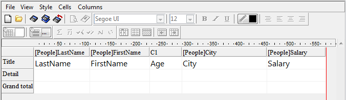

<!--REF #_command_.QR MOVE COLUMN.Syntax-->**QR MOVE COLUMN** ( *area* ; *numColumna* ; *nuevaPosicion* )<!-- END REF-->
<!--REF #_command_.QR MOVE COLUMN.Params-->
| Parámetro | Tipo |  | Descripción |
| --- | --- | --- | --- |
| area | Integer | &#8594;  | Referencia del área |
| numColumna | Integer | &#8594;  | Número de la columna |
| nuevaPosicion | Integer | &#8594;  | Nueva posición de la columna |

<!-- END REF-->

#### Descripción 

<!--REF #_command_.QR MOVE COLUMN.Summary-->El comando **QR MOVE COLUMN** mueve la columna que se encuentra actualmente en la posición *numColumna* a la posición *nuevaPosicion*.<!-- END REF-->

Tanto los parámetros *numColumna* y *nuevaPosicion* deben ser números válidos de columna (entre 1 y el número total de columnas en el informe); de lo contrario, se devuelve el error -9852.

**Nota:** este comando se puede usar solamente con los informes en lista.

#### Ejemplo 

Usted diseñó el siguiente informe:



Si ejecuta:

```4d
 QR MOVE COLUMN(area;3;4)
```

El resultado es:


#### Propiedades
|  |  |
| --- | --- |
| Número de comando | 1325 |
| Hilo seguro | &check; |
| Prohibido en el servidor ||


