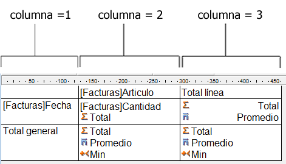
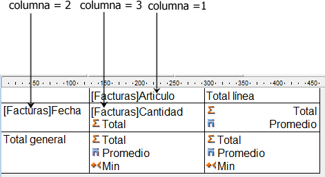
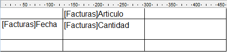

<!--REF #_command_.QR SET INFO COLUMN.Syntax-->**QR SET INFO COLUMN** ( *area* ; *numColumna* ; *titulo* ; *objeto* ; *oculta* ; *tamaño* ; *valoresRepetidos* ; *formato* )<!-- END REF-->
<!--REF #_command_.QR SET INFO COLUMN.Params-->
| Parámetro | Tipo |  | Descripción |
| --- | --- | --- | --- |
| area | Integer | &#8594;  | Referencia del área |
| numColumna | Integer | &#8594;  | Número de columna |
| titulo | Text | &#8594;  | Título de la columna |
| objeto | Field, Variable | &#8594;  | Objeto asignado a la columna |
| oculta | Integer | &#8594;  | 0 = visible, 1 = oculto |
| tamaño | Integer | &#8594;  | Largo de la columna |
| valoresRepetidos | Integer | &#8594;  | 0 = no repetidos, 1 = repetido |
| formato | Text | &#8594;  | Formato de visualización |

<!-- END REF-->

*Este comando no es hilo seguro, no puede ser utilizado en código apropiativo.*


#### Descripción 

<!--REF #_command_.QR SET INFO COLUMN.Summary-->##### Informes en lista 

El comando QR SET INFO COLUMN permite definir los parámetros de una columna existente.<!-- END REF--> 

*area* es la referencia del área del informe rápido.

*numColumna* es el número de la columna a definir.

*titulo* es el título que será mostrado en el encabezado de la columna.

*objeto* es el objeto de la columna (variable, campo o fórmula).

*oculta* especifica si la columna es visible o está oculta:

* si *oculta* es igual a 1, la columna está oculta;
* si *oculta* es igual a 0, la columna es mostrada.

*tamaño* es el tamaño en píxeles a asignar a la columna. Si *tamaño* es igual a -1, el tamaño de la columna es automático.

*valoresRepetidos* indica el estado de la propiedad de repetición de datos. Por ejemplo, si el valor de un campo o variable no cambia de un registro a otro, es posible repetirlo o no en cada línea de la columna.  
  
• Si *valoresRepetidos* es igual a 0, los valores no se repiten.   
• Si *valoresRepetidos* es igual a 1, los valores se repiten.

*formato* es el formato de salida. Los formatos de salida son los formatos 4D compatibles con los datos mostrados en la columna. 

La siguiente instrucción define el título para la columna #1, el contenido del Campo2, hace que la columna sea visible con un ancho de 150 píxeles y define el formato de salida ###.##.

```4d
 QR SET INFO COLUMN(area;1;"Titulo";"[Tabla 1]Campo2";0;150;0;"###,##")
```

##### Informes tablas cruzadas 

El comando QR SET INFO COLUMN permite definir globalmente los mismos parámetros pero la referencia de las áreas a las cuales aplica es diferente y varia dependiendo del parámetro que quiera definir. 

Además, los parámetros *titulo*, *oculta*, y *valoresRepetidos* no se utilizan cuando este comando se utiliza en informes tablas cruzadas. El valor a utilizar en *numColumna* varia dependiendo de si quiere definir el tamaño de la columna o la fuente de datos y el formato de visualización. 

* Tamaño de la columna

Este es un atributo “visual”, por lo tanto las columnas son numeradas de izquierda a derecha, como se muestra en la siguiente imagen:



El siguiente método define el tamaño automático para todas las columnas en informe tablas cruzadas y deja los otros elementos intactos:

```4d
 For($i;1;3)
    QR GET INFO COLUMN(qr_area;$i;$titulo;$obj;$oculta;$tamaño;$rep;$format)
    QR SET INFO COLUMN(qr_area;$i;$titulo;$obj;$oculta;0;$rep;$format)
 End for
```

Notará que como quiere modificar únicamente el tamaño de la columna, debe utilizar el comando [QR GET INFO COLUMN](qr-get-info-column.md "QR GET INFO COLUMN") para recuperar las propiedades actuales de la columna y pasarla a QR SET INFO COLUMN con el fin de conservarla intacta, excepto por el tamaño de la columna. 

* Fuente de datos (objeto) y formato de visualización

En este caso la numeración de las columnas se efectúa de la siguiente manera:



Notará que no es posible direccionar todas las celdas utilizando el comando QR SET INFO COLUMN, las celdas que no son numeradas arriba son direccionadas utilizando [QR SET TOTALS DATA](qr-set-totals-data.md "QR SET TOTALS DATA").

El siguiente código asigna las fuentes de datos a las tres celdas necesarias para la creación de un informe tabla cruzada simple:

```4d
 QR SET REPORT TABLE(qr_area;Table(->[Facturas]))
 ALL RECORDS([Facturas])
 QR SET REPORT KIND(qr_area;2)
 QR SET INFO COLUMN(qr_area;1;"";->[Facturas]Elemento;1;-1;1;"")
 QR SET INFO COLUMN(qr_area;2;"";->[Facturas]Fecha;1;-1;1;"")
 QR SET INFO COLUMN(qr_area;3;"";->[Facturas]Cantidad;1;-1;1;"")
```

Se genera la siguiente área de informe:



  
Si pasa un número de *area* inválido, se genera el error -9850.  
Si el parámetro *numColumna* es incorrecto, se genera el error -9852.

#### Ver también 

[QR GET INFO COLUMN](qr-get-info-column.md)  
[QR Get info row](qr-get-info-row.md)  
[QR SET INFO ROW](qr-set-info-row.md)  