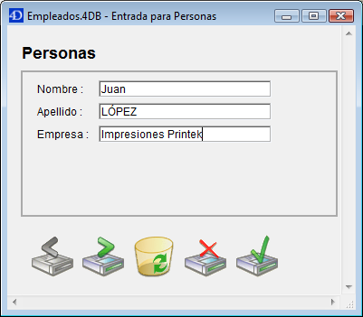
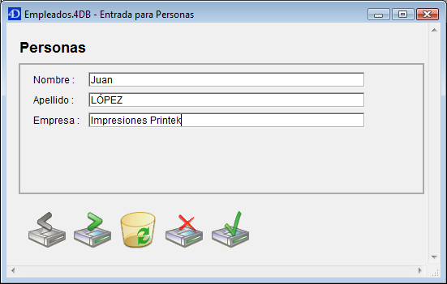

<!--REF #_command_.RESIZE FORM WINDOW.Syntax-->**RESIZE FORM WINDOW** ( *ancho* ; *alto* )<!-- END REF-->
<!--REF #_command_.RESIZE FORM WINDOW.Params-->
| Parámetro | Tipo |  | Descripción |
| --- | --- | --- | --- |
| ancho | Integer | &#8594;  | Píxeles a añadir o eliminar del ancho actual de la ventana formulario |
| alto | Integer | &#8594;  | Píxeles a añadir o eliminar del largo actual de la ventana formulario |

<!-- END REF-->

#### Descripción 

<!--REF #_command_.RESIZE FORM WINDOW.Summary-->El comando RESIZE FORM WINDOW  permite modificar el tamaño de la ventana del formulario actual.<!-- END REF-->

Pase el número de píxeles que quiere añadir al tamaño de la ventana actual en los parámetros *ancho*  
y *alto*. Pase 0 en el parámetro que no quiera modificar. Para reducir el tamaño, pase un valor negativo en los parámetros *ancho* y *alto*. 

Este comando produce exactamente el mismo resultado que un redimensionamiento manual utilizando la casilla de redimensionamiento (si el tipo de ventana lo permite). Por consiguiente, el comando tiene en cuenta las propiedades de redimensionamiento de los objetos y las limitaciones de tamaño definidas en las propiedades del formulario. Si, por ejemplo, el comando redimensiona la ventana a un tamaño superior al máximo del formulario, el comando no tiene efecto. 

Por favor tenga en cuenta que este comportamiento es diferente del comportamiento del comando [SET WINDOW RECT](set-window-rect.md "SET WINDOW RECT"), el cual no tiene en cuenta las propiedades del formulario ni su contenido cuando redimensiona la ventana. Igualmente, note que este comando no necesariamente modifica el tamaño del formulario. Para modificar el tamaño de un formulario por programación, por favor consulte la descripción del comando [FORM SET SIZE](form-set-size.md "FORM SET SIZE").

#### Ejemplo 

Dada la siguiente ventana (los campos y el marco tienen la propiedad de dimensionamiento horizontal “Agrandar”):



Después de la ejecución de esta línea:

```4d
 RESIZE FORM WINDOW(25;0)
```

... la ventana aparece así:



#### Ver también 

[FORM GET PROPERTIES](form-get-properties.md)  
[FORM SET SIZE](form-set-size.md)  
[SET WINDOW RECT](set-window-rect.md)  

#### Propiedades
|  |  |
| --- | --- |
| Número de comando | 890 |
| Hilo seguro | &check; |
| Prohibido en el servidor ||


