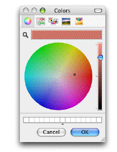

<!--REF #_command_.Select RGB Color.Syntax-->**Select RGB Color** {( *colorDefecto* {; *mensaje*} )} : Integer<!-- END REF-->
<!--REF #_command_.Select RGB Color.Params-->
| Parámetro | Tipo |  | Descripción |
| --- | --- | --- | --- |
| colorDefecto | Integer | &#8594;  | Color RGB preseleccionado |
| mensaje | Text | &#8594;  | Título de la ventana de selección |
| Resultado | Integer | &#8592; | Color RGB |

<!-- END REF-->

#### Descripción 

<!--REF #_command_.Select RGB Color.Summary-->El comando Select RGB Color muestra la ventana sistema de selección de color y devuelve el valor RGB del color seleccionado por el usuario.<!-- END REF--> 

La ventana sistema de selección de color se ve de esta manera:  

| **Macintosh**                                | **Windows**                                 |
| -------------------------------------------- | ------------------------------------------- |
|  |  |

El parámetro opcional *colorDefecto* permite preseleccionar un color en la ventana. Este parámetro permite por ejemplo restaurar por defecto el último color definido por el usuario. Pase en este parámetro un valor de color formato RGB (para mayor información, consulte la descripción del comando [OBJECT SET RGB COLORS](object-set-rgb-colors.md)). Puede utilizar una de las constantes del tema *DEFINIR COLORES RVA*. Si se omite el parámetro *colorDefecto* o si pasa 0, el color negro es seleccionado al abrir la caja de diálogo.

El parámetro opcional *mensaje* permite personalizar el título de la ventana sistema. Por defecto, si se omite este parámetro, aparece el título “Colores”.

El efecto de la validación de esta caja de diálogo difiere dependiendo de la plataforma:

* Bajo Windows, si el usuario hace clic en el botón **OK**, el comando devuelve el valor de color seleccionado en formato RGB y la variable sistema *OK* toma el valor 1\. Si el usuario cancela la caja de diálogo, el comando devuelve -1 y la variable sistema *OK* toma el valor 0.
* Bajo Mac OS, sólo puede cerrar esta caja de diálogo haciendo clic en la casilla de cierre o presionando la tecla **Esc**. En ambos caos, la variable sistema *OK* toma el valor 1, sin importar las acciones del usuario en la ventana. El comando devuelve el valor del color seleccionado en formato RGB. Si el usuario no selecciona un color, el valor devuelto es el pasado en *colorDefecto* (si lo hay) o 0 si no se pasa *colorDefecto*.

**Nota:** este comando no debe ejecutarse en el equipo servidor ni en un proceso web.

#### Ver también 

[OBJECT SET RGB COLORS](object-set-rgb-colors.md)  

#### Propiedades

|  |  |
| --- | --- |
| Número de comando | 956 |
| Hilo seguro | &cross; |
| Modifica variables | OK |
| Prohibido en el servidor ||

