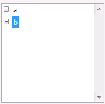
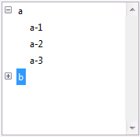
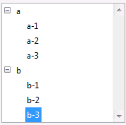
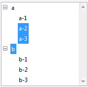
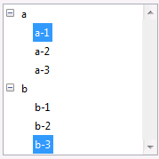

<!--REF #_command_.Selected list items.Syntax-->**Selected list items** ( {* ;} *lista* {; *arrayElem* {; *}} )  : Integer<!-- END REF-->
<!--REF #_command_.Selected list items.Params-->
| Parámetro | Tipo |  | Descripción |
| --- | --- | --- | --- |
| * | Operador | &#8594;  | Si se especifica: lista es un nombre de objeto (cadena) Si se omite, lista es una referencia de lista |
| lista | Integer, Text | &#8594;  | Número de referencia de lista (si se omite *) o Nombre del objeto tipo lista (si se pasa *) |
| arrayElem | Integer array | &#8592; | Si  se omite el segundo *: Array contiene las posiciones de los elementos seleccionados en la(s) lista(s) Si se pasa el segundo *: Array contiene las referencias de los elementos seleccionados |
| * | Operador | &#8594;  | Si se omite: posición(es) de(l) (los) elemento(s) Si se pasa: referencia(s) de(l) (los) elemento(s) |
| Resultado | Integer | &#8592; | Si se omite segundo *: posición del elemento seleccionado en la(s) lista(s) desplegada(s) Si se pasa el segundo *: Referencia del elemento seleccionado |

<!-- END REF-->

*Este comando no es hilo seguro, no puede ser utilizado en código apropiativo.*


#### Descripción 

<!--REF #_command_.Selected list items.Summary-->El comando Selected list items devuelve la posición o referencia del elemento seleccionado en la lista cuyo número de referencia o nombre de objeto se pasa en *lista*.<!-- END REF--> 

Si pasa el primer parámetro opcional \*, indica que el parámetro *lista* es un nombre de objeto (cadena) correspondiente a una representación de lista en el formulario. Si no pasa este parámetro, indica que el parámetro *lista* es una referencia de lista jerárquica (RefLista). Si utiliza sólo una representación de lista o trabaja con referencias de elementos (el segundo \* se pasa), puede utilizar indiferentemente una u otra sintaxis. Por el contrario, si utiliza varias representaciones de una misma lista y trabaja con posiciones de elementos (el segundo \* se omite), la sintaxis basada en el nombre del objeto es necesaria ya que cada representación puede tener su propia configuración de elementos desplegados/contraídos. 

**Nota**: si utiliza el carácter @ en el nombre del objeto de la lista y el formulario contiene varias listas que responden a este nombre, el comando Selected list items sólo aplicará al primer objeto cuyo nombre corresponde. 

En el caso de selección múltiple, el comando puede devolver también en el array *elemArray*, la posición o referencia de cada elemento seleccionado. Esta función debe ser aplicada a una lista mostrada en un formulario con el fin de detectar el (los) elementos seleccionado(s) por el usuario. 

El segundo parámetro \* le permite indicar si quiere trabajar con las posiciones actuales de los elementos (en este caso, se debe omitir el parámetro \*) o con referencias fijas de los elementos (en este caso, debe utilizarse el parámetro \*). 

Puede pasar un array entero largo en el parámetro *elemArray.* Si es necesario, el array será creado y redimensionado por el comando. Una vez ejecutado el comando, *elemArray* contendrá:

* la posición de cada elemento seleccionado relativa al estado contraído/desplegado de la(s) lista(s) desplegada(s) si se omite el parámetro \*.
* la referencia fija de cada elemento seleccionado si se pasa el parámetro \*.  
Si no se han seleccionado elementos, el array se devuelve vacío.

**Nota:** en caso de selección múltiple, el comando devuelve la posición o la referencia del primer elemento seleccionado en *lista*, bien sea por un clic del usuario (selección manual) o por los comandos [SELECT LIST ITEMS BY POSITION](select-list-items-by-position.md) o [SELECT LIST ITEMS BY REFERENCE](select-list-items-by-reference.md) (selección por programación). 

Si la lista tiene sublistas, aplique el comando a la lista principal (la que está definida en el formulario), y no a una de sus sublistas. Las posiciones son expresadas con respecto al elemento superior de la lista principal, utilizando el estado actual desplegado/expandido de la lista y sus sublistas.

En todos los casos, si ningún elemento está seleccionado, la función devuelve 0.

#### Ejemplo 

Esta es una lista llamada *hList,* mostrada en el entorno Aplicación:

  


```4d
 $vlItemPos:=Selected list items(hList) // en este punto $vlItemPos vale 2
```



```4d
 $vlItemPos:=Selected list items(hList) // en este punto $vlItemPos vale 4
 $vlItemRef:=Selected list items(hList;*) // $vlItemRef vale 200 (por ejemplo)
```



```4d
 $vlItemPos:=Selected list items(hList) // en este punto $vlItemPos vale 8
 $vlItemRef:=Selected list items(hList;*) // $vlItemRef vale 203 (por ejemplo)
```



```4d
 $vlItemPos:=Selected list items(hList;$arrPos) // en este punto, $vlItemPos vale 3
  // $arrPos{1} vale 3, $arrPos{2} vale 4 y $arrPos{3} vale 5
```



```4d
 $vlItemRef:=Selected list items(hList;$arrRefs;*) // $vlItemRef vale 101 (por ejemplo)
  // $arrRefs{1} gets 101, $arrRefs{2} vale 203 (por ejemplo)
```

#### Ver también 

[SELECT LIST ITEMS BY POSITION](select-list-items-by-position.md)  
[SELECT LIST ITEMS BY REFERENCE](select-list-items-by-reference.md)  