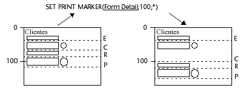
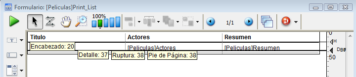
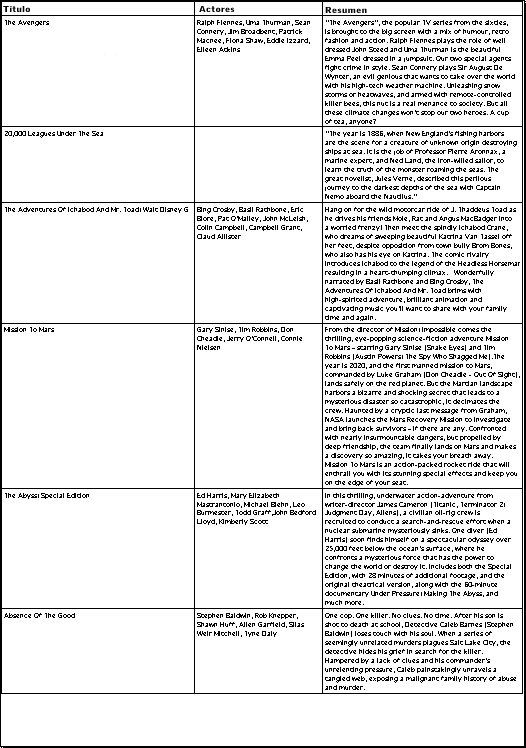

<!--REF #_command_.SET PRINT MARKER.Syntax-->**SET PRINT MARKER** ( *markNum* ; *posicion* {; *} )<!-- END REF-->
<!--REF #_command_.SET PRINT MARKER.Params-->
| Parámetro | Tipo |  | Descripción |
| --- | --- | --- | --- |
| markNum | Integer | &#8594;  | Número de marcador |
| posicion | Integer | &#8594;  | Nueva posición del marcador |
| * | Operador | &#8594;  | Si se pasa = mover los marcadores siguientes Si se omite = no mover los marcadores siguientes |

<!-- END REF-->

*Este comando no es hilo seguro, no puede ser utilizado en código apropiativo.*


#### Descripción 

<!--REF #_command_.SET PRINT MARKER.Summary-->El comando SET PRINT MARKER permite definir la posición de un marcador durante la impresión.<!-- END REF--> Combinado con los comandos [Get print marker](get-print-marker.md "Get print marker"), [OBJECT MOVE](object-move.md "OBJECT MOVE") o [Print form](../commands/print-form.md "Print form"), este comando le permite ajustar el tamaño de las áreas de impresión. 

SET PRINT MARKER puede utilizarse en dos contextos:

* durante el evento de formulario On header, en el contexto de los comandos [PRINT SELECTION](print-selection.md "PRINT SELECTION") y [PRINT RECORD](print-record.md "PRINT RECORD").
* durante el evento de formulario On Printing Detail, en el contexto del comando [Print form](../commands/print-form.md "Print form"). Esta operación facilita la impresión de informes personalizados (ver ejemplo).  
El efecto del comando está limitado a la impresión; ninguna modificación aparece en la pantalla. Las modificaciones realizadas a los formularios no se guardan.

Pase en el parámetro *markNum* una de las constantes del tema :

| Constante     | Tipo         | Valor |
| ------------- | ------------ | ----- |
| Form break0   | Entero largo | 300   |
| Form break1   | Entero largo | 301   |
| Form break2   | Entero largo | 302   |
| Form break3   | Entero largo | 303   |
| Form break4   | Entero largo | 304   |
| Form break5   | Entero largo | 305   |
| Form break6   | Entero largo | 306   |
| Form break7   | Entero largo | 307   |
| Form break8   | Entero largo | 308   |
| Form break9   | Entero largo | 309   |
| Form detail   | Entero largo | 0     |
| Form footer   | Entero largo | 100   |
| Form header   | Entero largo | 200   |
| Form header1  | Entero largo | 201   |
| Form header10 | Entero largo | 210   |
| Form header2  | Entero largo | 202   |
| Form header3  | Entero largo | 203   |
| Form header4  | Entero largo | 204   |
| Form header5  | Entero largo | 205   |
| Form header6  | Entero largo | 206   |
| Form header7  | Entero largo | 207   |
| Form header8  | Entero largo | 208   |
| Form header9  | Entero largo | 209   |

En *posicion*, pase la nueva posición deseada, expresada en píxeles.

Si pasa el parámetro opcional *\**, todos los marcadores ubicados debajo del marcador especificado por *markNum* se moverán el mismo número de píxeles y en la misma dirección que este marcador cuando se ejecuta el comando. **Advertencia:** en este caso, los objetos presentes en las áreas situadas debajo del marcador también se mueven. 

Cuando el parámetro \* se utiliza, es posible posicionar el marcador *markNum* más allá de la posición inicial de los marcadores que le siguen, estos últimos marcadores se moverán simultáneamente.



**Notas:**  
  
• Este comando modifica sólo la posición de los marcadores existentes. No permite la adición de marcadores. Si designa un marcador que no existe en el formulario, el comando no hará nada.   
• El funcionamiento de los marcadores de impresión en modo Diseño se conserva: un marcador no puede ir más arriba del que lo precede, ni más abajo del que lo sigue (cuando el parámetro \* no se utiliza).

#### Ejemplo 

Este ejemplo completo permite generar la impresión de un informe de tres columnas, la altura de cada línea se calcula de acuerdo a los contenidos de los campos.  
  
El formulario de salida utilizado para la impresión es el siguiente:



El evento de formulario On Printing Detail fue seleccionado para el formulario (recuerde que sin importar en que área se imprima, el comando [Print form](../commands/print-form.md "Print form") sólo genera este tipo de evento de formulario).   
Para cada registro, la altura de la línea debe estar adaptada de acuerdo a los contenidos de la columna "Actores" o "Resumen" (columna tiene la mayoría del contenido). Este es el resultado deseado:



El método de proyecto de impresión es el siguiente:

```4d
 var vLaltura_imp;$vLaltura;vLaltura_impreso : Integer
 C_STRING(31;vSprint_area)
 PAGE SETUP([Peliculas];"List_Imp3")
 GET PRINTABLE AREA(vLaltura_imp)
 vLaltura_impreso:=0
 ALL RECORDS([Peliculas])
 
 vSprint_area:="Encabezado" //Impresión del área de encabezado
 $vLaltura:=Print form([Peliculas];"List_Imp3";Form header)
 $vLaltura:=21 //Altura fija
 vLaltura_impreso:=vLaltura_impreso+$vLaltura
 
 While(Not(End selection([Peliculas])))
    vSprint_area:="Detalle" //Impresión del área de detalle
    $vLaltura:=Print form([Peliculas];"List_Imp3";Form detail)
  //El cálculo del detalle se lleva a cabo en el método de formulario
    vLaltura_impreso:=vLaltura_impreso+$vLaltura
    If(OK=0) //CANCEL ha sido ejecutado en el método de formulario
       PAGE BREAK
       vLaltura_impreso:=0
       vSprint_area:="Encabezado" //Reimpresión del área de encabezado
       $vLaltura:=Print form([Peliculas];"List_Imp3";Form header)
       $vLaltura:=21
       vLaltura_impreso:=vLaltura_impreso+$vLaltura
       vSprint_area:="Detalle"
       $vLaltura:=Print form([Peliculas];"List_Imp3";Form detail)
       vLaltura_impreso:=vLaltura_impreso+$vLaltura
    End if
    NEXT RECORD([Peliculas])
 End while
 PAGE BREAK //Asegúrese de que la última página se imprima
```

El método de formulario List\_Imp3 es el siguiente:

```4d
 var $l;$t;$r;$b;$fixed_wdth;$exact_hght;$l1;$t1;$r1;$b1 : Integer
 var $final_pos;$i : Integer
 var $detalle_pos;$encabezado_pos;$altura_a_imprimir;$altura_restante : Integer
 
 Case of
    :(vSprint_area="Detalle") //Impresión del detalle en proceso
       OBJECT GET COORDINATES([Peliculas]Actores;$l;$t;$r;$b)
       $largo_fijo:=$r-$l  //Cálculo del tamaño del campo tipo texto Actores
       $altura_exact:=$b-$t
       OBJECT GET BEST SIZE([Peliculas]Actores;$largo;$alto;$largo_fijo)
  //Tamaño óptimo del campo de acuerdo a su contenido
       $movimiento:=$alto-$altura_exact
 
       OBJECT GET COORDINATES([Peliculas]Resumen;$l1;$t1;$r1;$b1)
       $largo_fijo:=$r1-$l1  //Cálculo del tamaño del campo tipo texto Resumen
       $altura_exact1:=$b1-$t1
       OBJECT GET BEST SIZE([Peliculas]Resumen;$largo1;$alto1;$largo_fijo)
  //Tamaño óptimo del campo de acuerdo a su contenido
       $movimiento1:=$alto1-$altura_exact1
       If($movimiento1>$movimiento)
  //Determinamos el campo más alto
          $movimiento:=$movimiento1
       End if
 
       If($movement>0)
          $posicion:=Get print marker(Form detail)
          $final_pos:=$posicion+$movimiento
  //Nos movemos al marcador Detalle y a los que siguen
          SET PRINT MARKER(Form detail;$final_pos;*)
  //Redimensionamiento de las áreas de texto
          OBJECT MOVE([Peliculas]Actores;$l;$t;$r;$hght+$t;*)
          OBJECT MOVE([Peliculas]Resumen;$l1;$t1;$r1;$alto1+$t1;*)
 
  //Redimensionamiento de las líneas de división
          OBJECT GET COORDINATES(*;"H1Linea";$l;$t;$r;$b)
          OBJECT MOVE(*;"H1Line";$l;$final_pos-1;$r;$final_pos;*)
          For($i;1;4;1)
             GET OBJECT RECT(*;"VLinea"+String($i);$l;$t;$r;$b)
             OBJECT MOVE(*;"VLinea"+String($i);$l;$t;$r;$final_pos;*)
          End for
       End if
 
  //Cálculo del espacio disponible
       $detalle_pos:=Get print marker(Form detail)
       $encabezado_pos:=Get print marker(Form header)
       $altura_a_imprimir:=$detalle_pos-$encabezado_pos
       $altura_restante:=altura_impreso-vLaltura_impreso
       If($altura_restante<$altura_a_imprimir) //Altura insuficiente
          CANCEL //Pasar la línea a la siguiente página
       End if
 End case
```

#### Ver también 

[Get print marker](get-print-marker.md)  
[OBJECT GET BEST SIZE](object-get-best-size.md)  
[OBJECT GET COORDINATES](object-get-coordinates.md)  
[OBJECT MOVE](object-move.md)  
[PAGE BREAK](page-break.md)  
[Print form](../commands/print-form.md)  
[PRINT RECORD](print-record.md)  
[PRINT SELECTION](print-selection.md)  