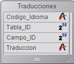

<!--REF #_command_.SET TABLE TITLES.Syntax-->**SET TABLE TITLES** {( *titulosTablas* ; *numTablas* {; *})}<!-- END REF-->
<!--REF #_command_.SET TABLE TITLES.Params-->
| Parámetro | Tipo |  | Descripción |
| --- | --- | --- | --- |
| titulosTablas | Text array | &#8594;  | Nombres de las tablas tal como deben aparecer |
| numTablas | Integer array | &#8594;  | Números de las tablas |
| * | Operador | &#8594;  | Utilizar los nombres personalizados en el editor de fórmulas |

<!-- END REF-->

*Este comando no es hilo seguro, no puede ser utilizado en código apropiativo.*


#### Descripción 

<!--REF #_command_.SET TABLE TITLES.Summary-->SET TABLE TITLES permite ocultar, renombrar y reordenar las tablas de su base cuando aparecen en las cajas de diálogo estándar de 4D en el entorno Aplicación(es decir, cuando el modo de inicio es **Aplicación**, o después de seleccionar **Probar aplicación** en el menú **Ejecutar**).<!-- END REF--> Por ejemplo, este comando puede modificar la visualización de tablas en el editor búsquedas en modo Aplicación.

Utilizando este comando, también puede renombrar instantáneamente las etiquetas de las tablas en sus formularios, si utilizó nombres dinámicos. Para mayor información sobre la inserción de etiquetas de tablas y de campos dinámicos en formularios, consulte la sección *Utilizar las referencias en los textos estáticos* en el manual de *Diseño* de 4D.

Los arrays *titulosTablas* y *numTablas* deben estar sincronizados. En el array *titulosTablas*, pase los nombres de las tablas como quiere que aparezcan. Si no quiere mostrar una tabla en particular, no incluya su nombre o nuevo título en el array. Las tablas aparecerán en el orden que especificó en este array. En cada elemento del array *numTablas*, pase el número de la tabla que corresponde al nombre, nuevo o antiguo, de la tabla, pasado en el mismo número de elemento en el array *titulosTablas*.

Por ejemplo, usted tiene una base compuesta por las tablas A, B, y C, creadas en este orden. Usted quiere que estas tablas aparezcan como X, Y, y Z. Además no quiere mostrar la tabla B. Por último, quiere mostrar Z y X, en este orden. Para hacer esto, pase en el parámetro *titulosTablas* un array de dos elementos, Z y X, y pase en el parámetro *numTablas* un array de dos elementos, 3 y 1.

El parámetro opcional *\** le permite indicar si los nombres personalizados (estructuras"virtuales" ) definidos utilizando este comando son utilizados o no en las fórmulas de 4D. Por defecto, cuando se omite este parámetro, las fórmulas ejecutadas en 4D no pueden utilizar estos nombres personalizados; es necesario utilizar los nombres verdaderos de las tablas. Debe pasar este parámetro si quiere controlar la información suministradas a los usuarios y asegurar la consistencia de interfaz donde se utilicen fórmulas o expresiones, es decir:

* si su aplicación da acceso al editor de fórmulas (por ejemplo por el editor de Informes rápidos),
* si su aplicación muestra referencias de expresión, como en los documentos 4D Write Pro.

**Nota:** cuando se pasa el parámetro *\**, los nombres definidos por este comando se usan en las fórmulas ejecutadas por 4D. **Tenga cuidado en este caso**, los nombres personalizados no deben contener caracteres "prohibidos" por el intérprete de lenguaje 4D, como -?\*%! Por ejemplo, el nombre "Rate\_in\_%" no se pudo utilizar en una fórmula (para más información, consulte la sección *Convenciones*).

**SET TABLE TITLES** NO cambia la estructura actual de su base. Está diseñado para afectar los usos posteriores de los editores estándar de 4D y formularios que utilizan nombres dinámicos cuando se utilizan en el entorno Aplicación. El alcance del comando **SET TABLE TITLES** es la sesión de trabajo. El beneficio en Cliente/Servidor es que varias estaciones 4D Client pueden “ver” simultáneamente su base de diferentes formas. Puede llamar **SET TABLE TITLES** tantas veces como lo considere necesario.

Utilice el comando **SET TABLE TITLES** para:

* Traducción dinámica de su base.
* Visualización de las tablas en el orden que quiera, independientemente del la definición actual de su base.
* Visualización de tablas que dependa de la identidad o de los privilegios de un usuario.

**ATENCIÓN:**

* **SET TABLE TITLES** NO anula el efecto de la propiedad invisible de una tabla. Cuando una tabla está definida como invisible a nivel de la estructura de su base, aunque se incluya en una llamada a **SET TABLE TITLES**, no aparecerá en modo Aplicación.
* Los plug-ins siempre acceden a la estructura "virtual" como se especifica por este comando.

Ejecutar **SET TABLE TITLES** sin parámetros reiniciará toda la estructura virtual de la base para la sesión (tabla personalizada y nombres de campos).

#### Ejemplo 1 

* Usted desarrolla una aplicación 4D que piensa vender internacionalmente. Por lo tanto, usted debe tener en cuenta las necesidades de traducción. Para los editores estándar de 4D que aparecen en modo Aplicación y sus formularios que utilizan nombres dinámicos, puede utilizar una tabla *\[Traducciones\]* y algunos métodos de proyecto para crear y utilizar las traducciones para cada idioma.
* En su base, cree la siguiente tabla:



* Luego, cree el método de proyecto TRADUCIR\_TABLAS\_Y\_CAMPOS. Este método analiza la estructura de su base en la tabla *\[Traducciones\]* y crea los registros correspondientes al idioma pasado como parámetro.

```4d
  // Método de proyecto TRADUCIR_TABLAS_Y_CAMPOS
  // TRADUCIR_TABLAS_Y_CAMPOS (Text)
  // TRADUCIR_TABLAS_Y_CAMPOS (LanguageCode)
 
 var $1 : Text //código del idioma
 var $vlTabla;$vlCampo : Integer
 var $Idioma : Text
 $Idioma:=$1
 
 For($vlTabla;1;Last table number) //Pasar por cada tabla
    If($vlTabla#(Table(->[Traducciones]))) //No traducir la tabla de traducciones
  //Verificar si existe una traducción de nombre de la tabla para el idioma especificado
       QUERY([Traducciones];[Traducciones]Codigo_Idioma=$Idioma;*) //idioma deseado
       QUERY([Traducciones];&;[Traducciones]Tabla_ID=$vlTabla;*) //Número de tabla
       QUERY([Traducciones];&;[Traducciones]Campo_ID=0) //número de campo = 0 significa que es un nombre de tabla
       If(Is table number valid($vlTabla)) //verificar que la tabla aún existe
          If(Records in selection([Traducciones])=0)
  //De lo contrario, crear el registro
             CREATE RECORD([Traducciones])
             [Traducciones]Codigo_Idioma:=$Idioma
             [Traducciones]Tabla_ID:=$vlTabla
             [Traducciones]Campo_ID:=0
  //El nombre de la tabla traducida deberá introducirse
             [Traducciones]Traduccion:=Table name($vlTabla)+" en "+$Idioma
             SAVE RECORD([Traducciones])
          End if
 
          For($vlCampo;1;Obtener número del último campo($vlTabla))
  //Verificar si exise una traducción para el nombre del campo en el idioma especificado
             QUERY([Traducciones];[Traducciones]Codigo_Idioma=$Idioma;*) //idioma deseado
             QUERY([Traducciones];&;[Traducciones]Tabla_ID=$vlTabla;*) //número de tabla
             QUERY([Traducciones];&;[Traducciones]Campo_ID=$vlCampo) //número de campo
             If(Is field number valid($vlTabla;$vlCampo))
                If(Records in selection([Traducciones])=0)
  //De lo contrario, crear el registro
                   CREATE RECORD([Traducciones])
                   [Traducciones]Codigo_Idioma:=$Idioma
                   [Traducciones]Tabla_ID:=$vlTabla
                   [Traducciones]Campo_ID:=$vlCampo
  //El nombre del campo traducido debe introducirse
                   [Traducciones]Traduccion:=Field name($vlTabla;$vlCampo)+"en "+$Idioma
                   SAVE RECORD([Traducciones])
                End if
             Else
                If(Records in selection([Traducciones])#0)
  // Si el campo no existe, eliminar la traducción
                   DELETE RECORD([Traducciones])
                End if
             End if
          End for
       Else
          If(Records in selection([Traducciones])#0)
  //Si la tabla no existe, eliminar la traducción
             DELETE RECORD([Traducciones])
          End if
       End if
    End if
 End for
```

* En este punto, si ejecuta la siguiente línea, puede crear tantos registros como necesite para la traducción al Español de sus tablas y campos.

```4d
 TRANSLATE TABLES AND FIELDS("Español")
```

* Una vez ejecutada esta llamada, puede introducir una traducción en el campo *\[Traducciones\]Nombre traducido* para cada uno de los nuevos registros.
* Por último, cada vez que quiera mostrar en español los editores estándar 4D o los formularios con etiquetas dinámicas, ejecute la siguiente línea:

```4d
 LOCALIZED TABLES AND FIELDS("Español")
```

con el método de proyecto TABLAS\_Y\_CAMPOS\_LOCALIZADOS:

```4d
  //Método objeto TABLAS_Y_CAMPOS_LOCALIZADOS
  // TABLAS_Y_CAMPOS_LOCALIZADOS (Text)
  // TABLAS_Y_CAMPOS_LOCALIZADOS (LanguageCode)
 
 var $1 : Text //Código del idioma
 var $vlTabla;$vlCampo : Integer
 var $Idioma : Text
 var $vlNumTabla;$vlNumCampo : Integer
 $Idioma:=$1
 
  //Actualización de los nombres de tablas
 ARRAY TEXT($asNombres;0) //Inicializar los arrays para SET TABLE TITLES y SET FIELD TITLES
 ARRAY INTEGER($aiNumeros;0)
 QUERY([Traducciones];[Traducciones]Codigo_Idioma=$Idioma;*)
 QUERY([Traducciones];&;[Traducciones]Campo_ID=0) //nombres de tablas
 SELECTION TO ARRAY([Traducciones]Traduccion;$asNombres;[Traducciones]Tabla_ID;$aiNumeros)
 SET TABLE TITLES($asNombres;$aiNumeros)
 
  //Actualización de los nombres de campos
 $vlNumTabla:=Last table number //Obtener el número de tablas en la base
 For($vlTabla;1;$vlNumTabla) //Pasar por cada tabla
    If(Is table number valid($vlTabla))
       QUERY([Traducciones];[Traducciones]Codigo_Idioma=$Idioma;*)
       QUERY([Traducciones];&;[Traducciones]Tabla_ID=$vlTabla;*)
       QUERY([Traducciones];&;[Traducciones]Campo_ID#0) //evite que el cero sea nombre de tabla
       SELECTION TO ARRAY([Traducciones]Traduccion;$asNombres;[Traducciones]Campo_ID;$aiNumeros)
       SET FIELD TITLES(Tabla($vlTabla)->;$asNombres;$aiNumeros)
    End if
 End for
```

  
* Note que las nuevas localizaciones pueden añadirse a la base sin modificar el código o recompilarlo.

#### Ejemplo 2 

Desea eliminar todos los nombres de tablas y campos personalizados definidos:

```4d
 SET TABLE TITLES //elimina todos los nombres personalizados
```

#### Ver también 

[Last table number](last-table-number.md)  
[GET TABLE TITLES](get-table-titles.md)  
[Parse formula](parse-formula.md)  
[SET FIELD TITLES](set-field-titles.md)  
[Table name](table-name.md)  