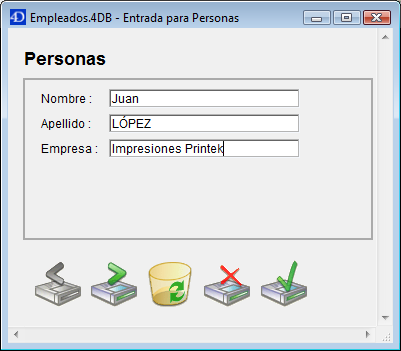
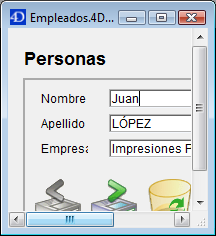

<!--REF #_command_.SET WINDOW RECT.Syntax-->**SET WINDOW RECT** ( *izquierda* ; *superior* ; *derecha* ; *inferior* {; *ventana*}{; *} )<!-- END REF-->
<!--REF #_command_.SET WINDOW RECT.Params-->
| Parámetro | Tipo |  | Descripción |
| --- | --- | --- | --- |
| izquierda | Integer | &#8594;  | Coordenada global izquierda del interior de la ventana |
| superior | Integer | &#8594;  | Coordenada global superior del interior de la ventana |
| derecha | Integer | &#8594;  | Coordenada global derecha del interior de la ventana |
| inferior | Integer | &#8594;  | Coordenada global inferior del interior de la ventana |
| ventana | Integer | &#8594;  | Número de referencia de la ventana o ventana del primer plano del proceso si se omite este parámetro |
| * | Operador | &#8594;  | Si se omite (por defecto) = cambiar ventana al fondo<br/>Si se pasa = no cambiar el nivel de la ventana |

<!-- END REF-->

#### Descripción 

<!--REF #_command_.SET WINDOW RECT.Summary-->El comando **SET WINDOW RECT** cambia las coordenadas globales de la ventana cuyo número de referencia se pasa en *ventana*.<!-- END REF--> Si la ventana no existe, el comando no hace nada. 

Si omite el parámetro *ventana*, SET WINDOW RECT se aplica a la ventana del primer plano del proceso actual.

Este comando puede redimensionar y mover la ventana, dependiendo de las nuevas coordenadas que se pasen.

Las coordenadas deben ser expresadas con relación a la esquina superior izquierda del área de contenido de la ventana de la aplicación (modo Windows MDI) o de la pantalla principal (mac OS y modo Windows MDI). Las coordenadas indican el rectángulo correspondiente al área de contenido de la ventana (excluyendo las barras de títulos y los bordes).

**Advertencia:** utilice este comando con precaución, podría mover una ventana más allá de los límites de la ventana principal (en Windows) o de la pantalla (en Macintosh). Para evitar esto, utilice comandos como [Screen width](screen-width.md) y [Screen height](screen-height.md) para verificar las nuevas coordenadas de la ventana.

Por defecto, la ejecución de este comando pasa al primer plano la ventana designada por el parámetro *ventana* (si se utiliza este parámetro). Puede desactivar este funcionamiento pasando *\** como último parámetro. En este caso, el comando no modifica el nivel original de la ventana (coordenada "z"). 

Este comando no afecta los objetos de formulario. Si la ventana contiene un formulario, los objetos del formulario no se mueven o redimensionan por el comando (sin importar sus propiedades). Sólo se modifica la ventana. Para modificar una ventana de formulario teniendo en cuenta sus propiedades de redimensionamiento y los objetos que contiene, debe utilizar el comando [RESIZE FORM WINDOW](resize-form-window.md).

#### Ejemplo 1 

Ver el ejemplo del comando [WINDOW LIST](window-list.md "WINDOW LIST").

#### Ejemplo 2 

Dada la siguiente ventana:



  
Después de la ejecución de la siguiente línea:

```4d
 SET WINDOW RECT(100;100;300;300)
```

La ventana aparece de esta forma:



#### Ver también 

[CONVERT COORDINATES](convert-coordinates.md)  
[DRAG WINDOW](drag-window.md)  
[GET WINDOW RECT](get-window-rect.md)  
[RESIZE FORM WINDOW](resize-form-window.md)  

#### Propiedades
|  |  |
| --- | --- |
| Número de comando | 444 |
| Hilo seguro | &check; |
| Prohibido en el servidor ||


