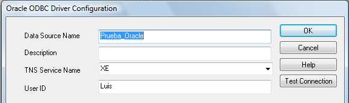

<!--REF #_command_.SQL End selection.Syntax-->**SQL End selection**  : Boolean<!-- END REF-->
<!--REF #_command_.SQL End selection.Params-->
| Parámetro | Tipo |  | Descripción |
| --- | --- | --- | --- |
| Resultado | Boolean | &#8592; | El resultado establece los límites alcanzados |

<!-- END REF-->

*Este comando no es hilo seguro, no puede ser utilizado en código apropiativo.*


#### Descripción 

<!--REF #_command_.SQL End selection.Summary-->El comando SQL End selection se utiliza para determinar si los límites del resultado obtenido se han alcanzado.<!-- END REF-->

#### Ejemplo 

El código a continuación se conecta a una fuente de datos externos (Oracle) utilizando los siguientes parámetros:



```4d
 var vNombre : Text
 
 SQL LOGIN("Prueba_Oracle";"Luis";"pwd")
 If(OK=1)
    SQL EXECUTE("SELECT ename FROM emp";vNombre)
    While(Not(SQL End selection))
       SQL LOAD RECORD
    End while
    SQL LOGOUT
 End if
```

Este código devolverá en la variable 4D *vNombre* los nombres (ename) almacenados en la tabla emp.
