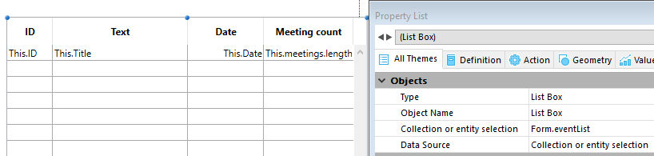

<!--REF #_command_.This.Syntax-->**This**  -> Resultado<!-- END REF-->
<!--REF #_command_.This.Params-->
| Parámetro | Tipo |  | Descripción |
| --- | --- | --- | --- |
| Resultado | Object | &larr; | El elemento actual |

<!-- END REF-->

#### Descripción 

<!--REF #_command_.This.Summary-->El comando **This**  devuelve una referencia al objeto procesado actualmente.<!-- END REF-->

El comando está diseñado para utilizarse en los siguientes contextos:

* un list box asociado a una colección o una selección de entidades, durante los eventos On Display Detail o On Data Change.  
En este contexto, el comando devuelve una referencia al elemento de colección o la entidad a la cual el list box accede para mostrar la línea actual.  
**Nota:** si utiliza una colección de valores escalares en un listbox, 4D crea un objeto para cada elemento con una sola propiedad **valor**. Por lo tanto, el valor del elemento está disponible a través de la expresión no asignable **This.value**.
* La ejecución de un objeto de fórmula creado por los comandos [Formula](formula.md) o [Formula from string](formula-from-string.md).  
En este contexto, el comando devuelve una referencia al objeto procesado actualmente por la fórmula.

En cualquier otro contexto, el comando devuelve **Null**.  
En contextos soportados, puede acceder a todas las propiedades de los elementos o todos los atributos de entidades vía **This.<*propertyPath*\>**. Por ejemplo, **This.name o This.employer.lastName* son rutas de propiedades de elementos o de entidades (atributos) validos.

#### Ejemplo 1 

Una colección de objetos, cada uno con esta estructura:

```undefined
{  
"ID": 1234
"name": "Xavier",  
"revenues": 47300,  
"employees": [  
             "Allan",  
             "Bob", 
             "Charlie"  
            ] 
},{  
"ID": 2563
"name": "Carla",  
"revenues": 55000,  
"isFemale": true
"employees": [  
             "Igor",  
             "Jane"  
            ] 
},...
 
```

En el list box, cada columna se refiere a una de las propiedades del objeto, ya sea directamente (This.name), indirectamente (This.employees.length), o mediante una expresión (*getPicture*) en la que se puede usar directamente. El list box se ve así:


El método proyecto *GetPicture* se ejecuta automáticamente durante el evento **On display detail**:

```4d
  //Método GetPicture
 var $0 : Picture
 If(This.isFemale)
    $0:=Form.genericFemaleImage
 Else
    $0:=Form.genericMaleImage
 End if
```

Una vez el formulario se ejecuta, puede ver el resultado:


#### Ejemplo 2 

Usted quiere mostrar las siguientes estructuras en un list box:


Cree un list box de tipo "Colección o entity selection" con la siguiente definición:



Tenga en cuenta que:

* *This.ID*, *This.Title* y *This.Date* directly se refieren directamente a los atributos correspondientes en la clase de datos ds.Event.
* *This.meetings* es un atributo relacional (basado en el nombre de relación Unos A Muchos) que devuelve una selección de entidades de la clase de datos ds.Meeting.
* **Form.eventList** es la selección de entidades que se asocia al list box. El código de inicialización se puede poner en el evento formulario On load:  
```4d  
 Case of  
    :(Form event code=On Load)  
       Form.eventList:=ds.Event.all() //devuelve una selección de entidades con todas las entidades  
 End case  
```

Una vez se ejecuta el formulario, el list box se llena automáticamente con la selección de entidades:


#### Ejemplo 3 

Desea utilizar un método proyecto como una fórmula encapsulada en un objeto:

```4d
 var $person : Object
 $person:=New object
 $person.firstName:="John"
 $person.lastName:="Smith"
 $person.greeting:=Formula(Greeting)
 $g:=$person.greeting("hello") // devuelve "hello John Smith"
 $g:=$person.greeting("hi") // devuelve "hi John Smith"
```

Con el método proyecto Greeting:

```4d
 var $0;$1 : Text
 $0:=$1+" "+This.firstName+" "+This.lastName
```

#### Ver también 

[Self](self.md)  
[Super](super.md)  