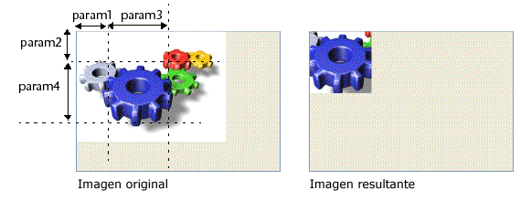

<!--REF #_command_.TRANSFORM PICTURE.Syntax-->**TRANSFORM PICTURE** ( *imagen* ; *operador* {; *param1* {; *param2* {; *param3* {; *param4*}}}} )<!-- END REF-->
<!--REF #_command_.TRANSFORM PICTURE.Params-->
| Parámetro | Tipo |  | Descripción |
| --- | --- | --- | --- |
| imagen | Picture | &#8594;  | Imagen fuente a transformar |
| &#8592; | Imagen resultante de la transformación |
| operador | Integer | &#8594;  | Tipo de transformación a efectuar |
| param1 | Real | &#8594;  | Parámetro de la transformación |
| param2 | Real | &#8594;  | Parámetro de la transformación |
| param3 | Real | &#8594;  | Parámetro de la transformación |
| param4 | Real | &#8594;  | Parámetro de la transformación |

<!-- END REF-->

#### Descripción 

<!--REF #_command_.TRANSFORM PICTURE.Summary-->El comando TRANSFORM PICTURE permite aplicar una transformación de tipo *operador* a la imagen pasada en el parámetro *imagen*.<!-- END REF-->

**Nota:** este comando extiende las funcionalidades ofrecidas por los operadores convencionales de transformación de imágenes (+/, etc., ver la sección [C\_BOOLEAN](c-boolean.md)). Estos operadores permanecen totalmente utilizables en 4D.  
  
La *imagen* fuente se modifica directamente después de la ejecución del comando. Tenga en cuenta que ciertas operaciones no son destructivas y pueden revertirse mediante la realización de la operación contraria o por medio de la operación "Reset". Por ejemplo, una imagen reducida a 1% retomará su tamaño original sin alteraciones si se agranda 100 veces. Las transformaciones no modifican el tipo original de la imagen: por ejemplo, una imagen vectorial permanecerá vectorial después de su transformación.

En *operador*, pase el número de la operación a efectuar y en *param1* a *param4*, el o los parámetro(s) necesarios para esta operación (el número de parámetros depende de la operación). En *operador* puede utilizar una de las constantes del tema “*Transformación de imágenes*”. Estos operadores y sus parámetros se describen en la siguiente tabla:

| **operador (valor)**     | **param1** | **param2** | **param3** | **param4** | **Valores** | **Cancelable** |
| ------------------------ | ---------- | ---------- | ---------- | ---------- | ----------- | -------------- |
| Reset (0)                | \-         | \-         | \-         | \-         | \-          | \-             |
| Scale (1)                | Ancho      | Alto       | \-         | \-         | Factores    | Sí             |
| Translate (2)            | Eje X      | Eje Y      | \-         | \-         | Pixeles     | Sí             |
| Flip horizontally (3)    | \-         | \-         | \-         | \-         | Sí          |                |
| Flip vertically (4)      | \-         | \-         | \-         | \-         | Sí          |                |
| Crop (100)               | X Orig.    | Y Orig.    | Ancho      | Alto       | Pixeles     | No             |
| Fade to grey scale (101) | \-         | \-         | \-         | \-         | No          |                |
| Transparency (102)       | RGB color  | \-         | \-         | \-         | Hexadécimal | No             |
  
  
* Reset: todas las operaciones matriciales efectuadas en la imagen (redimensionar, voltear, etc.) se deshacen.
* Scale: la imagen se redimensiona horizontalmente y verticalmente de acuerdo a los valores pasados en *param1* y *param2* respectivamente. Estos valores son factores: por ejemplo, para agrandar el ancho 50%, pase 1.5 en *param1* y para reducir la altura 50%, pase 0.5 en *param2*.
* Translate: la imagen se mueve *param1* píxeles horizontalmente y *param2* píxeles verticalmente. Pase un valor positivo para moverse a la derecha o hacia abajo y un valor negativo para moverse hacia la izquierda o hacia arriba.
* Flip horizontally y Flip vertically: el efecto espejo se aplica a la imagen original. Todo movimiento efectuado anteriormente no se tendrá en cuenta.
* Crop: la imagen se recorta a partir del punto de coordenadas *param1* y *param2* (expresado en píxeles). El ancho y el alto de la nueva imagen son determinados por los parámetros *param3* y *param4*. Esta transformación no puede anularse.
* Fade to grey scale: la imagen se convierte a escala de grises (ningún parámetro es necesario). Esta transformación no puede deshacerse.
* Transparency: una máscara de transparencia se aplica a la imagen basada en el color pasado en *param1*. Por ejemplo, si pasa 0x00FFFFFF (color blanco) en *param1*, todos los píxeles blancos en la imagen original serán transparentes en la imagen transformada. Esta operación se puede aplicar a imágenes de mapa de bits o de vectores. Por defecto, si el parámetro *param1* se omite, el color blanco (0x00FFFFFF) se establece como color objetivo. Esta función está especialmente diseñada para manejar la transparencia en imágenes convertidas desde el formato obsoleto PICT, pero se puede usar con imágenes de todo tipo. Esta transformación no se puede deshacer.

#### Ejemplo 1 

Quiere definir las partes blancas de una imagen como transparentes. Para ello, puede utilizar el siguiente código:

```4d
 TRANSFORM PICTURE(Pict1;Transparency;0x00FFFFFF) //0x00FFFFFF es blanco
```

Obtiene el siguiente resultado:


#### Ejemplo 2 

Este es un ejemplo de corte de una imagen (la imagen se muestra en el formulario con el formato “Truncado (no-centrado)”): 

```4d
 TRANSFORM PICTURE($vpEngranaje;Crop;50;50;100;100)
```



#### Ver también 

[COMBINE PICTURES](combine-pictures.md)  