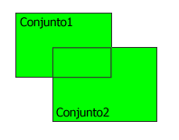

<!--REF #_command_.UNION.Syntax-->**UNION** ( *conjunto1* ; *conjunto2* ; *resultado* )<!-- END REF-->
<!--REF #_command_.UNION.Params-->
| Parámetro | Tipo |  | Descripción |
| --- | --- | --- | --- |
| conjunto1 | Text | &srarr; | Primer conjunto |
| conjunto2 | Text | &srarr; | Segundo conjunto |
| resultado | Text | &srarr; | Conjunto resultante |

<!-- END REF-->

#### Descripción 

<!--REF #_command_.UNION.Summary-->UNION crea un nuevo conjunto que contiene todos los registros de *conjunto1* y *conjunto2*.<!-- END REF--> La siguiente tabla muestra todos los posibles resultados de una operación de unión de conjuntos.

| **Conjunto1** | **Conjunto2** | **Conjunto resultante** |
| ------------- | ------------- | ----------------------- |
| Sí            | No            | Sí                      |
| Sí            | Sí            | Sí                      |
| No            | Sí            | Sí                      |
| No            | No            | No                      |

El resultado de una operación de unión se muestra a continuación. La parte de color es el conjunto resultante.



El conjunto *resultado* se crea por UNION. El conjunto *resultado* reemplaza todo conjunto existente que tenga el mismo nombre, incluyendo *conjunto1* y *conjunto2*. Los conjuntos *conjunto1* y *conjunto2* deben ser de la misma tabla. El conjunto *resultado* pertenece a la misma tabla que *conjunto1* y *conjunto2*. El registro actual de *resultado* es el registro actual de *conjunto1*.

**4D Server:** en modo cliente/Servidor, los conjuntos interprocesos y procesos se conservan en el equipo servidor, mientras que los conjuntos locales se mantiene en los equipos cliente. UNION requiere que los tres conjuntos estén en el mismo equipo. Por lo tanto, todos los conjuntos deben ser locales o ninguno de ellos debe ser local. Para mayor información consulte *4D Server and Sets* en el manual de referencia de 4D Server.

#### Ejemplo 

Este ejemplo añade registros al conjunto de mejores clientes. Los registros se muestran en la pantalla. Después de mostrar los registros en la pantalla, se carga un conjunto de los mejores clientes, y todos los registros seleccionados por el usuario (el conjunto sistema llamado “UserSet”) se añaden al conjunto. Finalmente, el nuevo conjunto se guarda en el disco:

```4d
 ALL RECORDS([Clientes]) // Selección de todos los registros
 DISPLAY SELECTION([Clientes]) // Mostrar todos los clientes en una lista
 LOAD SET("$Mejores";"$GuardarMejores") // Cargar el conjunto de los mejores clientes
 UNION("$Mejores";"UserSet";"$Mejores") // Adición de la selección al conjunto
 SAVE SET("$Mejores";"$GuardarMejores") // Guardar el conjunto de los mejores clientes
```

#### Ver también 

[DIFFERENCE](difference.md)  
[INTERSECTION](intersection.md)  