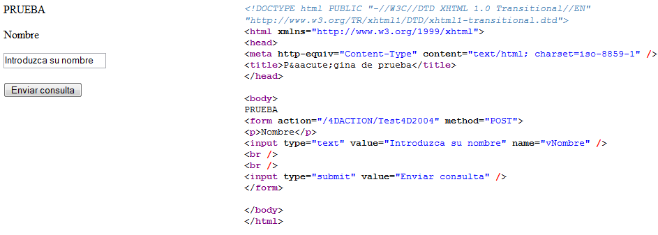

<!--REF #_command_.WEB GET HTTP BODY.Syntax-->**WEB GET HTTP BODY** ( *cuerpo* )<!-- END REF-->
<!--REF #_command_.WEB GET HTTP BODY.Params-->
| Parámetro | Tipo |  | Descripción |
| --- | --- | --- | --- |
| cuerpo | Blob, Text | &#8592; | Cuerpo (Body) de la petición HTTP |

<!-- END REF-->

#### Descripción 

<!--REF #_command_.WEB GET HTTP BODY.Summary-->El comando **WEB GET HTTP BODY** devuelve el cuerpo de la solicitud HTTP que esta siendo procesada.<!-- END REF--> El cuerpo HTTP se devuelve tal cual, sin proceso ni análisis. 

Este comando puede llamarse utilizando un método de base web (*Método de base On Web Authentication*, [QR SET DESTINATION](qr-set-destination.md)) o todo método web. 

Puede pasar en el parámetro *cuerpo*, una variable o un campo de tipo BLOB o Texto. El tipo Texto, por lo general será suficiente (el parámetro *cuerpo* puede recibir hasta 2GB de texto) 

Este comando permite por ejemplo efectuar las búsquedas en el cuerpo de las solicitudes. También permite a los usuarios avanzados configurar un servidor WebDAV dentro de una base 4D.

#### Ejemplo 

En este ejemplo, una solicitud simple se envía al servidor web de 4D y el contenido del campo HTTP cuerpo se visualiza en el depurador. Este es el formulario enviado al servidor web de 4D, así como también el código HTML correspondiente: 



Este es el método Test4D2004:

```4d
 var $peticion : Blob
 var $textoPeticion : Text
 
 WEB GET HTTP BODY($peticion)
 $textoSolicitud:=BLOB to text($peticion;UTF8 text without length)
 WEB SEND FILE("pagina.html")
```

**Nota:** este método se declara “Disponible vía las etiquetas HTML y los URLs 4D (4DACTION...)” en sus propiedades. 

Cuando el formulario se envia al servidor web, la variable $textoSolicitud recibe el texto del campo cuerpo de la petición HTTP.

#### Ver también 

[WEB GET BODY PART](web-get-body-part.md)  
[WEB GET HTTP HEADER](web-get-http-header.md)  

#### Propiedades
|  |  |
| --- | --- |
| Número de comando | 814 |
| Hilo seguro | &check; |
| Prohibido en el servidor ||


