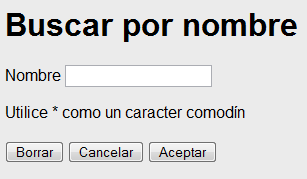

<!--REF #_command_.WEB SEND HTTP REDIRECT.Syntax-->**WEB SEND HTTP REDIRECT** ( *url* {; *} )<!-- END REF-->
<!--REF #_command_.WEB SEND HTTP REDIRECT.Params-->
| Parámetro | Tipo |  | Descripción |
| --- | --- | --- | --- |
| url | Text | &#8594;  | Nuevo URL |
| * | Operador | &#8594;  | Si se especifica = el URL no está traducido, Si se omite = el URL está traducido |

<!-- END REF-->

#### Descripción 

<!--REF #_command_.WEB SEND HTTP REDIRECT.Summary-->El comando **WEB SEND HTTP REDIRECT** permite transformar una URL en otra.<!-- END REF--> 

El parámetro *url* contiene el nuevo URL que permite redirigir la petición. Si este parámetro es un url a un archivo, debe contener la referencia a este archivo, por ejemplo: **WEB SEND HTTP REDIRECT** ("/MiPagina.HTM"). 

Este comando prevalece sobre los comandos de envío de datos ([WEB SEND FILE](web-send-file.md), [WEB SEND BLOB](web-send-blob.md), etc.) que puedan estar en el mismo método. 

Este comando también permite redirigir una petición a otro servidor web. 

4D codifica automáticamente los caracteres especiales del URL. Si pasa el carácter *\**, 4D no los traducirá.

Note que el estado de la petición enviada por este comando es **302: Moved Temporarily**. Si necesita una redirección permanente (status 301), puede fijar el campo HTTP *X-STATUS: 301* en el encabezado de la respuesta.

#### Ejemplo 

Puede utilizar este comando para efectuar, con la ayuda de páginas estáticas, búsquedas personalizadas en 4D. Imagine que coloca los siguientes elementos en una página HTML estática: 



**Nota:** la acción POST “/4dcgi/rech” se ha asociado al área de texto y a los botones **Aceptar** y **Cancelar**.

En el [QR SET DESTINATION](qr-set-destination.md), inserte el siguiente código:

```4d
 Case of
    :($1="/4dcgi/rech") //Cuando 4D recibe este URL
  //Si el botón Aceptar ha sido utilizado y el campo ‘nombre’ contiene un valor
       If((bOK="OK") & (nombre#""))
  //Cambie el URL para ejecutar el código de la búsqueda,
  //ubicado más adelante en el mismo método
          WEB SEND HTTP REDIRECT("/4dcgi/rech?"+name)
       Else
  //Si no volver a la página de inicio
          WEB SEND HTTP REDIRECT("/page1.htm")
       End if
       ...
    :($1="/4dcgi/rech?@") //Si el URL ha sido redirigido
       ... //Coloque el código de búsqueda aquí
 End case
```


#### Propiedades
|  |  |
| --- | --- |
| Número de comando | 659 |
| Hilo seguro | &check; |
| Prohibido en el servidor ||


